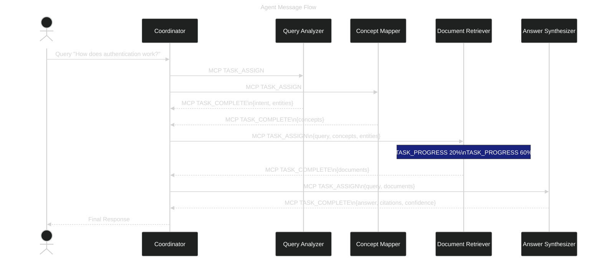

# RAGE Agent System

**Version**: 2.0  
**Last Updated**: December 3, 2025  
**Protocol**: MCP (Model Context Protocol)

---

## Table of Contents

1. [Overview](#overview)
2. [Agent Architecture](#agent-architecture)
3. [MCP Protocol Specification](#mcp-protocol-specification)
4. [Core Agents](#core-agents)
   - 4.1 [Query Analyzer Agent](#41-query-analyzer-agent)
   - 4.2 [Concept Mapper Agent](#42-concept-mapper-agent)
   - 4.3 [Document Retriever Agent](#43-document-retriever-agent)
   - 4.4 [Answer Synthesizer Agent](#44-answer-synthesizer-agent)
   - 4.5 [Network Agent (Layer 10)](#45-network-agent-layer-10)
   - 4.6 [Distribution Agent (Layer 10)](#46-distribution-agent-layer-10)
   - 4.7 [Federation Agent (Layer 10)](#47-federation-agent-layer-10)
5. [Agent Communication](#agent-communication)
6. [3D Visualization System](#3d-visualization-system)
7. [Agent Lifecycle](#agent-lifecycle)
8. [Performance & Scaling](#performance--scaling)

---

## 1. Overview

### 1.1 Agent Philosophy

RAGE implements a **neural agent system** where multiple specialized agents collaborate to process queries:

- **Autonomous**: Each agent operates independently
- **Specialized**: Single responsibility per agent
- **Coordinated**: MCP protocol for inter-agent communication
- **Observable**: Real-time activity monitoring and visualization
- **Adaptive**: Agents learn from past executions

### 1.2 Agent Types

| Agent | Responsibility | Input | Output |
|-------|---------------|-------|--------|
| **Query Analyzer** | Parse and understand user intent | Raw query | Intent, entities, concepts |
| **Concept Mapper** | Extract and map concepts | Text | Concept graph nodes |
| **Document Retriever** | Find relevant documents | Query + filters | Ranked documents |
| **Answer Synthesizer** | Generate final answer | Query + docs | Answer + citations |
| **Query Orchestrator** | Coordinate agent activities | User query | Complete response |

---

## 2. Agent Architecture

### 2.1 Base Agent Structure

```python
# src/agents/base.py

from abc import ABC, abstractmethod
from typing import Any, Dict, Optional
from uuid import UUID, uuid4
from datetime import datetime
from pydantic import BaseModel, Field

class AgentStatus(str, Enum):
    """Agent execution status"""
    IDLE = "idle"
    PROCESSING = "processing"
    COMPLETED = "completed"
    FAILED = "failed"

class AgentCapability(BaseModel):
    """What the agent can do"""
    name: str
    description: str
    input_schema: Dict[str, Any]
    output_schema: Dict[str, Any]

class AgentMetrics(BaseModel):
    """Agent performance metrics"""
    total_executions: int = 0
    successful_executions: int = 0
    failed_executions: int = 0
    avg_execution_time_ms: float = 0.0
    last_execution_time: Optional[datetime] = None

class TaskInput(BaseModel):
    """Input to agent task"""
    task_id: UUID = Field(default_factory=uuid4)
    execution_id: UUID
    data: Dict[str, Any]
    context: Dict[str, Any] = Field(default_factory=dict)

class TaskOutput(BaseModel):
    """Output from agent task"""
    task_id: UUID
    success: bool
    data: Optional[Dict[str, Any]] = None
    error: Optional[str] = None
    confidence: Optional[float] = None
    metadata: Dict[str, Any] = Field(default_factory=dict)
    execution_time_ms: int

class TaskProgress(BaseModel):
    """Progress update during task execution"""
    task_id: UUID
    progress_percent: int  # 0-100
    status_message: str
    metadata: Dict[str, Any] = Field(default_factory=dict)

class BaseAgent(ABC):
    """Base class for all RAGE agents"""
    
    def __init__(
        self,
        agent_id: str,
        name: str,
        description: str,
        coordinator: "AgentCoordinator"
    ):
        self.agent_id = agent_id
        self.name = name
        self.description = description
        self.coordinator = coordinator
        self.status = AgentStatus.IDLE
        self.metrics = AgentMetrics()
        self.capabilities: List[AgentCapability] = []
        
    @abstractmethod
    async def process_task(
        self,
        task_input: TaskInput,
        progress_callback: Optional[Callable[[TaskProgress], None]] = None
    ) -> TaskOutput:
        """
        Process a task and return results.
        
        Args:
            task_input: Input data and context
            progress_callback: Optional callback for progress updates
            
        Returns:
            TaskOutput with results or error
        """
        pass
    
    @abstractmethod
    def get_capabilities(self) -> List[AgentCapability]:
        """Return list of agent capabilities"""
        pass
    
    async def report_progress(
        self,
        task_id: UUID,
        progress: int,
        message: str,
        callback: Optional[Callable]
    ):
        """Report progress to coordinator"""
        if callback:
            progress_update = TaskProgress(
                task_id=task_id,
                progress_percent=progress,
                status_message=message
            )
            await callback(progress_update)
    
    def update_metrics(self, success: bool, execution_time_ms: int):
        """Update agent performance metrics"""
        self.metrics.total_executions += 1
        if success:
            self.metrics.successful_executions += 1
        else:
            self.metrics.failed_executions += 1
        
        # Calculate moving average
        total = self.metrics.total_executions
        current_avg = self.metrics.avg_execution_time_ms
        new_avg = ((current_avg * (total - 1)) + execution_time_ms) / total
        self.metrics.avg_execution_time_ms = new_avg
        self.metrics.last_execution_time = datetime.utcnow()
```

---

### 2.2 Agent Registry

```python
# src/agents/registry.py

from typing import Dict, Type
from .base import BaseAgent

class AgentRegistry:
    """Central registry for all agents"""
    
    def __init__(self):
        self._agents: Dict[str, BaseAgent] = {}
        self._agent_classes: Dict[str, Type[BaseAgent]] = {}
    
    def register_agent_class(self, agent_type: str, agent_class: Type[BaseAgent]):
        """Register an agent class"""
        self._agent_classes[agent_type] = agent_class
    
    def create_agent(
        self,
        agent_type: str,
        agent_id: str,
        coordinator: "AgentCoordinator",
        **kwargs
    ) -> BaseAgent:
        """Create and register agent instance"""
        if agent_type not in self._agent_classes:
            raise ValueError(f"Unknown agent type: {agent_type}")
        
        agent_class = self._agent_classes[agent_type]
        agent = agent_class(
            agent_id=agent_id,
            coordinator=coordinator,
            **kwargs
        )
        
        self._agents[agent_id] = agent
        return agent
    
    def get_agent(self, agent_id: str) -> Optional[BaseAgent]:
        """Get agent by ID"""
        return self._agents.get(agent_id)
    
    def list_agents(self) -> List[BaseAgent]:
        """List all registered agents"""
        return list(self._agents.values())
    
    def get_agents_by_capability(self, capability: str) -> List[BaseAgent]:
        """Find agents with specific capability"""
        return [
            agent for agent in self._agents.values()
            if any(cap.name == capability for cap in agent.get_capabilities())
        ]

# Global registry instance
agent_registry = AgentRegistry()
```

---

## 3. MCP Protocol Specification

### 3.1 Message Types

```python
# src/agents/mcp/protocol.py

from enum import Enum
from typing import Any, Dict, Optional
from pydantic import BaseModel, Field
from uuid import UUID
from datetime import datetime

class MCPMessageType(str, Enum):
    """MCP message types"""
    # Task management
    TASK_ASSIGN = "task.assign"
    TASK_ACCEPT = "task.accept"
    TASK_REJECT = "task.reject"
    TASK_PROGRESS = "task.progress"
    TASK_COMPLETE = "task.complete"
    TASK_FAIL = "task.fail"
    
    # Agent management
    AGENT_REGISTER = "agent.register"
    AGENT_UNREGISTER = "agent.unregister"
    AGENT_HEARTBEAT = "agent.heartbeat"
    AGENT_STATUS = "agent.status"
    
    # Coordination
    QUERY_START = "query.start"
    QUERY_COMPLETE = "query.complete"
    AGENT_REQUEST = "agent.request"
    AGENT_RESPONSE = "agent.response"

class MCPMessage(BaseModel):
    """Base MCP message"""
    message_id: UUID = Field(default_factory=uuid4)
    message_type: MCPMessageType
    sender_id: str  # Agent ID
    recipient_id: Optional[str] = None  # None for broadcast
    timestamp: datetime = Field(default_factory=datetime.utcnow)
    payload: Dict[str, Any]
    correlation_id: Optional[UUID] = None  # For request-response

class TaskAssignMessage(MCPMessage):
    """Assign task to agent"""
    message_type: MCPMessageType = MCPMessageType.TASK_ASSIGN
    
    class Payload(BaseModel):
        task_id: UUID
        execution_id: UUID
        task_type: str
        input_data: Dict[str, Any]
        priority: int = 0
        timeout_ms: Optional[int] = None
    
    payload: Payload

class TaskProgressMessage(MCPMessage):
    """Task progress update"""
    message_type: MCPMessageType = MCPMessageType.TASK_PROGRESS
    
    class Payload(BaseModel):
        task_id: UUID
        progress_percent: int
        status_message: str
        metadata: Dict[str, Any] = Field(default_factory=dict)
    
    payload: Payload

class TaskCompleteMessage(MCPMessage):
    """Task completion"""
    message_type: MCPMessageType = MCPMessageType.TASK_COMPLETE
    
    class Payload(BaseModel):
        task_id: UUID
        success: bool
        output_data: Optional[Dict[str, Any]] = None
        error: Optional[str] = None
        confidence: Optional[float] = None
        execution_time_ms: int
        metadata: Dict[str, Any] = Field(default_factory=dict)
    
    payload: Payload

class AgentHeartbeatMessage(MCPMessage):
    """Agent heartbeat"""
    message_type: MCPMessageType = MCPMessageType.AGENT_HEARTBEAT
    
    class Payload(BaseModel):
        agent_id: str
        status: str
        active_tasks: int
        metrics: Dict[str, Any]
    
    payload: Payload
```

---

### 3.2 Message Bus

```python
# src/agents/mcp/bus.py

import asyncio
from typing import Callable, Dict, List
from collections import defaultdict

class MessageBus:
    """Asynchronous message bus for MCP protocol"""
    
    def __init__(self):
        self._subscribers: Dict[MCPMessageType, List[Callable]] = defaultdict(list)
        self._message_queue = asyncio.Queue()
        self._running = False
    
    def subscribe(
        self,
        message_type: MCPMessageType,
        handler: Callable[[MCPMessage], None]
    ):
        """Subscribe to message type"""
        self._subscribers[message_type].append(handler)
    
    def unsubscribe(
        self,
        message_type: MCPMessageType,
        handler: Callable
    ):
        """Unsubscribe from message type"""
        if handler in self._subscribers[message_type]:
            self._subscribers[message_type].remove(handler)
    
    async def publish(self, message: MCPMessage):
        """Publish message to bus"""
        await self._message_queue.put(message)
    
    async def start(self):
        """Start message processing"""
        self._running = True
        while self._running:
            try:
                message = await asyncio.wait_for(
                    self._message_queue.get(),
                    timeout=1.0
                )
                await self._dispatch_message(message)
            except asyncio.TimeoutError:
                continue
    
    async def stop(self):
        """Stop message processing"""
        self._running = False
    
    async def _dispatch_message(self, message: MCPMessage):
        """Dispatch message to subscribers"""
        handlers = self._subscribers.get(message.message_type, [])
        
        # Call all handlers concurrently
        await asyncio.gather(
            *[handler(message) for handler in handlers],
            return_exceptions=True
        )

# Global message bus
message_bus = MessageBus()
```

---

### 3.3 Agent Coordinator

```python
# src/agents/coordinator.py

from typing import Dict, List, Optional
from uuid import UUID, uuid4
import asyncio

class QueryExecution(BaseModel):
    """Track query execution state"""
    execution_id: UUID
    query: str
    user_id: UUID
    status: str  # pending, processing, completed, failed
    assigned_tasks: List[UUID] = Field(default_factory=list)
    completed_tasks: List[UUID] = Field(default_factory=list)
    results: Dict[str, Any] = Field(default_factory=dict)
    started_at: datetime
    completed_at: Optional[datetime] = None

class AgentCoordinator:
    """Coordinates agent activities using MCP protocol"""
    
    def __init__(self, message_bus: MessageBus, registry: AgentRegistry):
        self.message_bus = message_bus
        self.registry = registry
        self.executions: Dict[UUID, QueryExecution] = {}
        
        # Subscribe to MCP messages
        self._setup_subscriptions()
    
    def _setup_subscriptions(self):
        """Subscribe to relevant MCP messages"""
        self.message_bus.subscribe(
            MCPMessageType.TASK_COMPLETE,
            self._handle_task_complete
        )
        self.message_bus.subscribe(
            MCPMessageType.TASK_FAIL,
            self._handle_task_fail
        )
        self.message_bus.subscribe(
            MCPMessageType.TASK_PROGRESS,
            self._handle_task_progress
        )
    
    async def execute_query(
        self,
        query: str,
        user_id: UUID,
        filters: Optional[Dict] = None,
        options: Optional[Dict] = None
    ) -> QueryExecution:
        """
        Execute a query by coordinating multiple agents.
        
        Workflow:
        1. Create execution context
        2. Assign tasks to agents
        3. Collect and aggregate results
        4. Return final answer
        """
        execution_id = uuid4()
        execution = QueryExecution(
            execution_id=execution_id,
            query=query,
            user_id=user_id,
            status="processing",
            started_at=datetime.utcnow()
        )
        self.executions[execution_id] = execution
        
        try:
            # Phase 1: Query Analysis
            analysis_result = await self._run_agent_task(
                execution_id=execution_id,
                agent_type="query_analyzer",
                input_data={"query": query}
            )
            
            # Phase 2: Concept Mapping
            concepts_result = await self._run_agent_task(
                execution_id=execution_id,
                agent_type="concept_mapper",
                input_data={
                    "query": query,
                    "entities": analysis_result.get("entities", [])
                }
            )
            
            # Phase 3: Document Retrieval (can run in parallel with concept mapping)
            retrieval_result = await self._run_agent_task(
                execution_id=execution_id,
                agent_type="document_retriever",
                input_data={
                    "query": query,
                    "concepts": concepts_result.get("concepts", []),
                    "filters": filters or {}
                }
            )
            
            # Phase 4: Answer Synthesis
            synthesis_result = await self._run_agent_task(
                execution_id=execution_id,
                agent_type="answer_synthesizer",
                input_data={
                    "query": query,
                    "documents": retrieval_result.get("documents", []),
                    "concepts": concepts_result.get("concepts", []),
                    "options": options or {}
                }
            )
            
            # Aggregate results
            execution.results = {
                "analysis": analysis_result,
                "concepts": concepts_result,
                "retrieval": retrieval_result,
                "synthesis": synthesis_result
            }
            execution.status = "completed"
            execution.completed_at = datetime.utcnow()
            
            return execution
            
        except Exception as e:
            execution.status = "failed"
            execution.results["error"] = str(e)
            execution.completed_at = datetime.utcnow()
            raise
    
    async def _run_agent_task(
        self,
        execution_id: UUID,
        agent_type: str,
        input_data: Dict[str, Any]
    ) -> Dict[str, Any]:
        """Run a task on an agent"""
        # Find available agent
        agents = self.registry.get_agents_by_capability(agent_type)
        if not agents:
            raise ValueError(f"No agent available for: {agent_type}")
        
        # Select agent (simple: first available)
        agent = agents[0]
        
        # Create task
        task_id = uuid4()
        task_input = TaskInput(
            task_id=task_id,
            execution_id=execution_id,
            data=input_data
        )
        
        # Send task assignment via MCP
        assign_message = TaskAssignMessage(
            sender_id="coordinator",
            recipient_id=agent.agent_id,
            payload=TaskAssignMessage.Payload(
                task_id=task_id,
                execution_id=execution_id,
                task_type=agent_type,
                input_data=input_data
            )
        )
        await self.message_bus.publish(assign_message)
        
        # Wait for task completion
        result = await self._wait_for_task_completion(task_id)
        return result
    
    async def _wait_for_task_completion(
        self,
        task_id: UUID,
        timeout_ms: int = 30000
    ) -> Dict[str, Any]:
        """Wait for task to complete"""
        # Implementation would use asyncio.Event or similar
        # to wait for TASK_COMPLETE message
        pass
    
    async def _handle_task_complete(self, message: TaskCompleteMessage):
        """Handle task completion"""
        task_id = message.payload.task_id
        # Notify waiting coroutine
        # Update execution state
        pass
    
    async def _handle_task_fail(self, message: MCPMessage):
        """Handle task failure"""
        pass
    
    async def _handle_task_progress(self, message: TaskProgressMessage):
        """Handle task progress update"""
        # Broadcast to WebSocket clients
        pass
```

---

## 4. Core Agents

### 4.1 Query Analyzer Agent

```python
# src/agents/query_analyzer.py

class QueryAnalyzerAgent(BaseAgent):
    """
    Analyzes user queries to extract intent, entities, and concepts.
    
    Capabilities:
    - Intent classification (question, command, search)
    - Named entity recognition
    - Query expansion
    - Language detection
    """
    
    def __init__(self, agent_id: str, coordinator: AgentCoordinator):
        super().__init__(
            agent_id=agent_id,
            name="Query Analyzer",
            description="Analyzes and understands user queries",
            coordinator=coordinator
        )
        self.llm_client = get_llm_client()
    
    async def process_task(
        self,
        task_input: TaskInput,
        progress_callback: Optional[Callable] = None
    ) -> TaskOutput:
        start_time = time.time()
        
        try:
            query = task_input.data["query"]
            
            # Report progress
            await self.report_progress(
                task_input.task_id,
                25,
                "Analyzing query intent...",
                progress_callback
            )
            
            # Use LLM to analyze query
            analysis_prompt = f"""
            Analyze the following user query and extract:
            1. Intent (question, command, search)
            2. Named entities (people, places, technologies, organizations)
            3. Key concepts
            4. Language
            
            Query: {query}
            
            Respond in JSON format.
            """
            
            llm_response = await self.llm_client.generate(
                prompt=analysis_prompt,
                temperature=0.1,
                response_format={"type": "json_object"}
            )
            
            analysis = json.loads(llm_response)
            
            await self.report_progress(
                task_input.task_id,
                100,
                "Analysis complete",
                progress_callback
            )
            
            execution_time = int((time.time() - start_time) * 1000)
            self.update_metrics(True, execution_time)
            
            return TaskOutput(
                task_id=task_input.task_id,
                success=True,
                data=analysis,
                confidence=0.9,
                execution_time_ms=execution_time
            )
            
        except Exception as e:
            execution_time = int((time.time() - start_time) * 1000)
            self.update_metrics(False, execution_time)
            
            return TaskOutput(
                task_id=task_input.task_id,
                success=False,
                error=str(e),
                execution_time_ms=execution_time
            )
    
    def get_capabilities(self) -> List[AgentCapability]:
        return [
            AgentCapability(
                name="query_analyzer",
                description="Analyze user queries",
                input_schema={"query": "string"},
                output_schema={
                    "intent": "string",
                    "entities": "array",
                    "concepts": "array",
                    "language": "string"
                }
            )
        ]
```

---

### 4.2 Concept Mapper Agent

```python
# src/agents/concept_mapper.py

class ConceptMapperAgent(BaseAgent):
    """
    Maps entities and topics to knowledge graph concepts.
    
    Capabilities:
    - Concept extraction from text
    - Concept linking to knowledge graph
    - Relationship inference
    - Concept importance scoring
    """
    
    def __init__(self, agent_id: str, coordinator: AgentCoordinator):
        super().__init__(
            agent_id=agent_id,
            name="Concept Mapper",
            description="Maps content to knowledge graph concepts",
            coordinator=coordinator
        )
        self.neo4j_client = get_neo4j_client()
        self.llm_client = get_llm_client()
    
    async def process_task(
        self,
        task_input: TaskInput,
        progress_callback: Optional[Callable] = None
    ) -> TaskOutput:
        start_time = time.time()
        
        try:
            query = task_input.data["query"]
            entities = task_input.data.get("entities", [])
            
            await self.report_progress(
                task_input.task_id,
                30,
                "Extracting concepts...",
                progress_callback
            )
            
            # Extract concepts using LLM
            concept_extraction_prompt = f"""
            Extract key concepts from this query that would help find relevant documentation:
            
            Query: {query}
            Entities: {entities}
            
            Return a JSON list of concepts with their types (technology, methodology, feature, etc.)
            """
            
            llm_response = await self.llm_client.generate(
                prompt=concept_extraction_prompt,
                temperature=0.2
            )
            
            extracted_concepts = json.loads(llm_response)
            
            await self.report_progress(
                task_input.task_id,
                60,
                "Mapping to knowledge graph...",
                progress_callback
            )
            
            # Map to existing concepts in Neo4j
            mapped_concepts = []
            for concept in extracted_concepts:
                # Find or create concept node
                cypher = """
                MERGE (c:Concept {name: $name})
                ON CREATE SET 
                    c.id = randomUUID(),
                    c.type = $type,
                    c.created_at = datetime()
                ON MATCH SET
                    c.frequency = c.frequency + 1
                RETURN c
                """
                
                result = await self.neo4j_client.execute_query(
                    cypher,
                    name=concept["name"],
                    type=concept.get("type", "general")
                )
                
                mapped_concepts.append(result[0]["c"])
            
            await self.report_progress(
                task_input.task_id,
                100,
                "Concept mapping complete",
                progress_callback
            )
            
            execution_time = int((time.time() - start_time) * 1000)
            self.update_metrics(True, execution_time)
            
            return TaskOutput(
                task_id=task_input.task_id,
                success=True,
                data={"concepts": mapped_concepts},
                confidence=0.85,
                execution_time_ms=execution_time
            )
            
        except Exception as e:
            execution_time = int((time.time() - start_time) * 1000)
            self.update_metrics(False, execution_time)
            
            return TaskOutput(
                task_id=task_input.task_id,
                success=False,
                error=str(e),
                execution_time_ms=execution_time
            )
    
    def get_capabilities(self) -> List[AgentCapability]:
        return [
            AgentCapability(
                name="concept_mapper",
                description="Map content to knowledge graph concepts",
                input_schema={
                    "query": "string",
                    "entities": "array"
                },
                output_schema={
                    "concepts": "array"
                }
            )
        ]
```

---

### 4.3 Document Retriever Agent

```python
# src/agents/document_retriever.py

class DocumentRetrieverAgent(BaseAgent):
    """
    Retrieves relevant documents using hybrid search.
    
    Capabilities:
    - Vector similarity search
    - Keyword search (BM25)
    - Graph traversal search
    - Hybrid fusion (RRF)
    """
    
    def __init__(self, agent_id: str, coordinator: AgentCoordinator):
        super().__init__(
            agent_id=agent_id,
            name="Document Retriever",
            description="Retrieves relevant documents",
            coordinator=coordinator
        )
        self.neo4j_client = get_neo4j_client()
        self.pg_client = get_postgres_client()
        self.embedding_client = get_embedding_client()
    
    async def process_task(
        self,
        task_input: TaskInput,
        progress_callback: Optional[Callable] = None
    ) -> TaskOutput:
        start_time = time.time()
        
        try:
            query = task_input.data["query"]
            concepts = task_input.data.get("concepts", [])
            filters = task_input.data.get("filters", {})
            max_results = filters.get("max_results", 10)
            
            # Three parallel searches
            await self.report_progress(
                task_input.task_id,
                20,
                "Running hybrid search...",
                progress_callback
            )
            
            # 1. Vector search
            vector_results = await self._vector_search(query, max_results)
            
            # 2. Keyword search
            keyword_results = await self._keyword_search(query, max_results)
            
            # 3. Graph traversal
            graph_results = await self._graph_search(concepts, max_results)
            
            await self.report_progress(
                task_input.task_id,
                60,
                "Fusing results...",
                progress_callback
            )
            
            # Hybrid fusion using Reciprocal Rank Fusion
            fused_results = self._reciprocal_rank_fusion([
                vector_results,
                keyword_results,
                graph_results
            ])
            
            # Apply filters
            filtered_results = self._apply_filters(fused_results, filters)
            
            await self.report_progress(
                task_input.task_id,
                100,
                f"Retrieved {len(filtered_results)} documents",
                progress_callback
            )
            
            execution_time = int((time.time() - start_time) * 1000)
            self.update_metrics(True, execution_time)
            
            return TaskOutput(
                task_id=task_input.task_id,
                success=True,
                data={"documents": filtered_results[:max_results]},
                confidence=0.88,
                execution_time_ms=execution_time,
                metadata={
                    "vector_count": len(vector_results),
                    "keyword_count": len(keyword_results),
                    "graph_count": len(graph_results)
                }
            )
            
        except Exception as e:
            execution_time = int((time.time() - start_time) * 1000)
            self.update_metrics(False, execution_time)
            
            return TaskOutput(
                task_id=task_input.task_id,
                success=False,
                error=str(e),
                execution_time_ms=execution_time
            )
    
    async def _vector_search(self, query: str, limit: int) -> List[Dict]:
        """Vector similarity search"""
        # Generate query embedding
        embedding = await self.embedding_client.embed(query)
        
        # Neo4j vector search
        cypher = """
        CALL db.index.vector.queryNodes(
            'chunk_embeddings',
            $limit,
            $embedding
        )
        YIELD node, score
        MATCH (node:Chunk)-[:CONTAINS]-(doc:Document)
        RETURN doc.id as doc_id, doc.title, node.content, score
        ORDER BY score DESC
        """
        
        results = await self.neo4j_client.execute_query(
            cypher,
            limit=limit,
            embedding=embedding
        )
        
        return results
    
    async def _keyword_search(self, query: str, limit: int) -> List[Dict]:
        """Full-text keyword search using PostgreSQL"""
        sql = """
        SELECT 
            id as doc_id,
            title,
            description as content,
            ts_rank(search_vector, plainto_tsquery('english', %s)) as score
        FROM documents
        WHERE search_vector @@ plainto_tsquery('english', %s)
          AND deleted_at IS NULL
        ORDER BY score DESC
        LIMIT %s
        """
        
        results = await self.pg_client.fetch(sql, query, query, limit)
        return results
    
    async def _graph_search(self, concepts: List[str], limit: int) -> List[Dict]:
        """Graph traversal search"""
        if not concepts:
            return []
        
        cypher = """
        MATCH (c:Concept)
        WHERE c.name IN $concepts
        MATCH (c)<-[m:MENTIONS]-(doc:Document)
        WITH doc, sum(m.importance) as relevance
        ORDER BY relevance DESC
        LIMIT $limit
        RETURN doc.id as doc_id, doc.title, relevance as score
        """
        
        results = await self.neo4j_client.execute_query(
            cypher,
            concepts=concepts,
            limit=limit
        )
        
        return results
    
    def _reciprocal_rank_fusion(
        self,
        result_lists: List[List[Dict]],
        k: int = 60
    ) -> List[Dict]:
        """
        Reciprocal Rank Fusion algorithm.
        
        RRF(d) = Σ 1 / (k + rank(d))
        """
        scores = {}
        
        for results in result_lists:
            for rank, doc in enumerate(results, start=1):
                doc_id = doc["doc_id"]
                score = 1.0 / (k + rank)
                
                if doc_id not in scores:
                    scores[doc_id] = {
                        "doc_id": doc_id,
                        "title": doc.get("title"),
                        "score": 0.0
                    }
                
                scores[doc_id]["score"] += score
        
        # Sort by fused score
        fused = sorted(
            scores.values(),
            key=lambda x: x["score"],
            reverse=True
        )
        
        return fused
    
    def _apply_filters(
        self,
        results: List[Dict],
        filters: Dict
    ) -> List[Dict]:
        """Apply additional filters"""
        # Filter by document IDs
        if "document_ids" in filters:
            allowed_ids = set(filters["document_ids"])
            results = [r for r in results if r["doc_id"] in allowed_ids]
        
        # Filter by teams
        if "teams" in filters:
            # Would query database for team access
            pass
        
        return results
    
    def get_capabilities(self) -> List[AgentCapability]:
        return [
            AgentCapability(
                name="document_retriever",
                description="Retrieve relevant documents",
                input_schema={
                    "query": "string",
                    "concepts": "array",
                    "filters": "object"
                },
                output_schema={
                    "documents": "array"
                }
            )
        ]
```

---

### 4.4 Answer Synthesizer Agent

```python
# src/agents/answer_synthesizer.py

class AnswerSynthesizerAgent(BaseAgent):
    """
    Generates final answer from retrieved documents.
    
    Capabilities:
    - Answer generation with citations
    - Confidence scoring
    - Follow-up question generation
    - Multi-provider LLM routing
    """
    
    def __init__(self, agent_id: str, coordinator: AgentCoordinator):
        super().__init__(
            agent_id=agent_id,
            name="Answer Synthesizer",
            description="Generates answers from documents",
            coordinator=coordinator
        )
        self.llm_router = get_llm_router()
    
    async def process_task(
        self,
        task_input: TaskInput,
        progress_callback: Optional[Callable] = None
    ) -> TaskOutput:
        start_time = time.time()
        
        try:
            query = task_input.data["query"]
            documents = task_input.data["documents"]
            options = task_input.data.get("options", {})
            
            await self.report_progress(
                task_input.task_id,
                25,
                "Preparing context...",
                progress_callback
            )
            
            # Prepare context from documents
            context = self._prepare_context(documents)
            
            await self.report_progress(
                task_input.task_id,
                50,
                "Generating answer...",
                progress_callback
            )
            
            # Build prompt
            prompt = f"""
            Based on the following context, answer the user's question.
            Include specific citations from the context.
            If you cannot answer from the context, say so clearly.
            
            Context:
            {context}
            
            Question: {query}
            
            Provide your answer in JSON format:
            {{
                "answer": "...",
                "citations": [{{doc_id", "excerpt"}}],
                "confidence": 0.0-1.0,
                "follow_up_questions": [...]
            }}
            """
            
            # Route to optimal LLM
            llm_response = await self.llm_router.generate(
                prompt=prompt,
                provider=options.get("llm_provider", "auto"),
                model=options.get("llm_model"),
                temperature=options.get("temperature", 0.7),
                response_format={"type": "json_object"}
            )
            
            result = json.loads(llm_response.content)
            
            await self.report_progress(
                task_input.task_id,
                100,
                "Answer generated",
                progress_callback
            )
            
            execution_time = int((time.time() - start_time) * 1000)
            self.update_metrics(True, execution_time)
            
            return TaskOutput(
                task_id=task_input.task_id,
                success=True,
                data=result,
                confidence=result.get("confidence", 0.8),
                execution_time_ms=execution_time,
                metadata={
                    "llm_provider": llm_response.provider,
                    "llm_model": llm_response.model,
                    "tokens_input": llm_response.usage.input_tokens,
                    "tokens_output": llm_response.usage.output_tokens,
                    "cost_usd": llm_response.cost
                }
            )
            
        except Exception as e:
            execution_time = int((time.time() - start_time) * 1000)
            self.update_metrics(False, execution_time)
            
            return TaskOutput(
                task_id=task_input.task_id,
                success=False,
                error=str(e),
                execution_time_ms=execution_time
            )
    
    def _prepare_context(self, documents: List[Dict]) -> str:
        """Prepare context from documents"""
        context_parts = []
        
        for i, doc in enumerate(documents[:5], 1):  # Top 5 documents
            context_parts.append(
                f"[Document {i}: {doc['title']}]\n"
                f"{doc.get('content', doc.get('description', ''))}\n"
            )
        
        return "\n\n".join(context_parts)
    
    def get_capabilities(self) -> List[AgentCapability]:
        return [
            AgentCapability(
                name="answer_synthesizer",
                description="Generate answers from documents",
                input_schema={
                    "query": "string",
                    "documents": "array",
                    "options": "object"
                },
                output_schema={
                    "answer": "string",
                    "citations": "array",
                    "confidence": "number",
                    "follow_up_questions": "array"
                }
            )
        ]
```

### 4.5 Network Agent (Layer 10)

**Status**: Design Phase (v0.2.0)  
**Documentation**: See `/docs/NETWORK_LAYER.md`

The Network Agent manages P2P connectivity, peer discovery, and network health monitoring.

```python
# src/agents/network_agent.py

from typing import List, Dict, Optional
from uuid import UUID
import asyncio

class NetworkAgent(BaseAgent):
    """Agent for P2P network management"""
    
    def __init__(self, coordinator: "AgentCoordinator"):
        super().__init__(
            agent_id="network_agent",
            name="Network Agent",
            description="Manages P2P connectivity, peer discovery, and network monitoring",
            coordinator=coordinator
        )
        self.libp2p_node: Optional[Libp2pNode] = None
        self.peer_registry: Dict[str, PeerInfo] = {}
        
    async def initialize(self):
        """Initialize libp2p node"""
        self.libp2p_node = await Libp2pNode.create(
            listen_addresses=[
                "/ip4/0.0.0.0/tcp/4001",
                "/ip6/::/tcp/4001"
            ]
        )
        
        # Start discovery protocols
        await self.libp2p_node.start_mdns()
        await self.libp2p_node.bootstrap_dht([
            # Bootstrap peers from config
        ])
        
    async def process_task(
        self,
        task_input: TaskInput,
        progress_callback: Optional[Callable] = None
    ) -> TaskOutput:
        """
        Process network tasks:
        - peer_discovery: Find new peers
        - peer_connect: Connect to specific peer
        - peer_health: Check peer health
        - bandwidth_stats: Get bandwidth metrics
        """
        task_type = task_input.data.get("task_type")
        
        if task_type == "peer_discovery":
            return await self._discover_peers(task_input)
        elif task_type == "peer_connect":
            return await self._connect_peer(task_input)
        elif task_type == "peer_health":
            return await self._check_health(task_input)
        elif task_type == "bandwidth_stats":
            return await self._get_bandwidth_stats(task_input)
        else:
            return TaskOutput(
                task_id=task_input.task_id,
                success=False,
                error=f"Unknown task type: {task_type}",
                execution_time_ms=0
            )
    
    async def _discover_peers(self, task_input: TaskInput) -> TaskOutput:
        """Discover peers via mDNS and DHT"""
        start = datetime.now()
        
        # mDNS discovery (local network)
        mdns_peers = await self.libp2p_node.discover_mdns()
        
        # DHT discovery (global)
        dht_peers = await self.libp2p_node.discover_dht(
            max_peers=task_input.data.get("max_peers", 20)
        )
        
        all_peers = mdns_peers + dht_peers
        
        # Update peer registry
        for peer in all_peers:
            self.peer_registry[peer.peer_id] = peer
        
        duration = (datetime.now() - start).total_seconds() * 1000
        
        return TaskOutput(
            task_id=task_input.task_id,
            success=True,
            data={
                "mdns_peers": len(mdns_peers),
                "dht_peers": len(dht_peers),
                "total_peers": len(all_peers),
                "peers": [p.to_dict() for p in all_peers]
            },
            execution_time_ms=int(duration)
        )
    
    async def _connect_peer(self, task_input: TaskInput) -> TaskOutput:
        """Connect to a specific peer"""
        peer_id = task_input.data.get("peer_id")
        addresses = task_input.data.get("addresses", [])
        
        start = datetime.now()
        
        try:
            await self.libp2p_node.connect(peer_id, addresses)
            
            duration = (datetime.now() - start).total_seconds() * 1000
            
            return TaskOutput(
                task_id=task_input.task_id,
                success=True,
                data={
                    "peer_id": peer_id,
                    "connected": True,
                    "latency_ms": int(duration)
                },
                execution_time_ms=int(duration)
            )
        except Exception as e:
            duration = (datetime.now() - start).total_seconds() * 1000
            return TaskOutput(
                task_id=task_input.task_id,
                success=False,
                error=f"Connection failed: {str(e)}",
                execution_time_ms=int(duration)
            )
    
    def get_capabilities(self) -> List[AgentCapability]:
        return [
            AgentCapability(
                name="peer_discovery",
                description="Discover P2P peers via mDNS and DHT",
                input_schema={
                    "type": "object",
                    "properties": {
                        "max_peers": {"type": "integer", "default": 20}
                    }
                },
                output_schema={
                    "type": "object",
                    "properties": {
                        "peers": {"type": "array"},
                        "total_peers": {"type": "integer"}
                    }
                }
            ),
            AgentCapability(
                name="peer_connect",
                description="Connect to a specific peer",
                input_schema={
                    "type": "object",
                    "required": ["peer_id"],
                    "properties": {
                        "peer_id": {"type": "string"},
                        "addresses": {"type": "array"}
                    }
                },
                output_schema={
                    "type": "object",
                    "properties": {
                        "connected": {"type": "boolean"},
                        "latency_ms": {"type": "integer"}
                    }
                }
            )
        ]
```

### 4.6 Distribution Agent (Layer 10)

**Status**: Design Phase (v0.2.0)  
**Documentation**: See `/docs/NETWORK_LAYER.md`

The Distribution Agent handles content replication, chunk routing, and CRDT synchronization across the P2P network.

```python
# src/agents/distribution_agent.py

from typing import List, Dict, Optional
from uuid import UUID
import hashlib

class DistributionAgent(BaseAgent):
    """Agent for content distribution and replication"""
    
    def __init__(self, coordinator: "AgentCoordinator"):
        super().__init__(
            agent_id="distribution_agent",
            name="Distribution Agent",
            description="Manages content replication, chunk routing, and CRDT sync",
            coordinator=coordinator
        )
        self.replication_factor = 3
        self.chunk_size = 256 * 1024  # 256 KB
        
    async def process_task(
        self,
        task_input: TaskInput,
        progress_callback: Optional[Callable] = None
    ) -> TaskOutput:
        """
        Process distribution tasks:
        - replicate_content: Replicate content to peers
        - sync_crdt: Synchronize CRDT state
        - check_replication: Verify replication status
        - route_chunk: Route chunk request to peer
        """
        task_type = task_input.data.get("task_type")
        
        if task_type == "replicate_content":
            return await self._replicate_content(task_input, progress_callback)
        elif task_type == "sync_crdt":
            return await self._sync_crdt(task_input)
        elif task_type == "check_replication":
            return await self._check_replication(task_input)
        elif task_type == "route_chunk":
            return await self._route_chunk(task_input)
        else:
            return TaskOutput(
                task_id=task_input.task_id,
                success=False,
                error=f"Unknown task type: {task_type}",
                execution_time_ms=0
            )
    
    async def _replicate_content(
        self,
        task_input: TaskInput,
        progress_callback: Optional[Callable]
    ) -> TaskOutput:
        """Replicate content to target peers"""
        start = datetime.now()
        
        content_id = task_input.data.get("content_id")
        content = task_input.data.get("content")
        target_factor = task_input.data.get("replication_factor", self.replication_factor)
        
        # Split content into chunks
        chunks = self._chunk_content(content, self.chunk_size)
        
        # Compute content-addressed IDs (BLAKE3)
        chunk_ids = [self._compute_cid(chunk) for chunk in chunks]
        
        # Select target peers based on geographic diversity
        target_peers = await self._select_replication_peers(
            chunk_ids=chunk_ids,
            factor=target_factor
        )
        
        replicated_chunks = []
        failed_chunks = []
        
        for idx, (chunk_id, chunk) in enumerate(zip(chunk_ids, chunks)):
            if progress_callback:
                progress = int((idx / len(chunks)) * 100)
                await progress_callback(TaskProgress(
                    task_id=task_input.task_id,
                    progress_percent=progress,
                    status_message=f"Replicating chunk {idx+1}/{len(chunks)}"
                ))
            
            # Replicate to target peers
            peers_for_chunk = target_peers[idx % len(target_peers)]
            
            try:
                await self._replicate_chunk_to_peers(
                    chunk_id=chunk_id,
                    chunk=chunk,
                    peers=peers_for_chunk
                )
                replicated_chunks.append(chunk_id)
            except Exception as e:
                failed_chunks.append({"chunk_id": chunk_id, "error": str(e)})
        
        # Update replication status in database
        await self._update_replication_status(
            content_id=content_id,
            chunk_ids=chunk_ids,
            target_peers=target_peers
        )
        
        duration = (datetime.now() - start).total_seconds() * 1000
        
        return TaskOutput(
            task_id=task_input.task_id,
            success=len(failed_chunks) == 0,
            data={
                "content_id": content_id,
                "total_chunks": len(chunks),
                "replicated_chunks": len(replicated_chunks),
                "failed_chunks": len(failed_chunks),
                "replication_factor": target_factor,
                "chunk_ids": chunk_ids
            },
            execution_time_ms=int(duration)
        )
    
    def _chunk_content(self, content: bytes, chunk_size: int) -> List[bytes]:
        """Split content into fixed-size chunks"""
        return [
            content[i:i+chunk_size]
            for i in range(0, len(content), chunk_size)
        ]
    
    def _compute_cid(self, chunk: bytes) -> str:
        """Compute content-addressed ID using BLAKE3"""
        import blake3
        return blake3.blake3(chunk).hexdigest()
    
    async def _select_replication_peers(
        self,
        chunk_ids: List[str],
        factor: int
    ) -> List[List[str]]:
        """Select peers for replication with geographic diversity"""
        # Get all available peers from network agent
        network_agent = self.coordinator.get_agent("network_agent")
        peer_result = await network_agent.process_task(TaskInput(
            execution_id=uuid4(),
            data={"task_type": "peer_discovery"}
        ))
        
        peers = peer_result.data.get("peers", [])
        
        # Group peers by region
        regions = {}
        for peer in peers:
            region = peer.get("region", "unknown")
            if region not in regions:
                regions[region] = []
            regions[region].append(peer["peer_id"])
        
        # Select peers with geographic diversity
        target_peers = []
        for chunk_id in chunk_ids:
            # Deterministic peer selection based on chunk_id
            chunk_hash = int(hashlib.sha256(chunk_id.encode()).hexdigest()[:8], 16)
            
            selected = []
            for region in sorted(regions.keys()):
                region_peers = regions[region]
                peer_idx = chunk_hash % len(region_peers)
                selected.append(region_peers[peer_idx])
                
                if len(selected) >= factor:
                    break
            
            target_peers.append(selected)
        
        return target_peers
    
    def get_capabilities(self) -> List[AgentCapability]:
        return [
            AgentCapability(
                name="replicate_content",
                description="Replicate content to P2P network",
                input_schema={
                    "type": "object",
                    "required": ["content_id", "content"],
                    "properties": {
                        "content_id": {"type": "string"},
                        "content": {"type": "string", "format": "byte"},
                        "replication_factor": {"type": "integer", "default": 3}
                    }
                },
                output_schema={
                    "type": "object",
                    "properties": {
                        "total_chunks": {"type": "integer"},
                        "replicated_chunks": {"type": "integer"},
                        "chunk_ids": {"type": "array"}
                    }
                }
            )
        ]
```

### 4.7 Federation Agent (Layer 10)

**Status**: Design Phase (v0.2.0)  
**Documentation**: See `/docs/FEDERATION_GUIDE.md`, `/docs/SECURITY_ACL.md`

The Federation Agent manages cross-organization queries, trust verification, and federated user mapping.

```python
# src/agents/federation_agent.py

from typing import List, Dict, Optional
from uuid import UUID
import httpx

class FederationAgent(BaseAgent):
    """Agent for cross-organization federation"""
    
    def __init__(self, coordinator: "AgentCoordinator"):
        super().__init__(
            agent_id="federation_agent",
            name="Federation Agent",
            description="Manages cross-org queries, trust verification, federated ACLs",
            coordinator=coordinator
        )
        self.http_client = httpx.AsyncClient(timeout=30.0)
        
    async def process_task(
        self,
        task_input: TaskInput,
        progress_callback: Optional[Callable] = None
    ) -> TaskOutput:
        """
        Process federation tasks:
        - federated_query: Execute query across trusted orgs
        - verify_trust: Verify trust relationship
        - map_user: Map external user to local identity
        - validate_acl: Validate federated ACL
        """
        task_type = task_input.data.get("task_type")
        
        if task_type == "federated_query":
            return await self._federated_query(task_input, progress_callback)
        elif task_type == "verify_trust":
            return await self._verify_trust(task_input)
        elif task_type == "map_user":
            return await self._map_user(task_input)
        elif task_type == "validate_acl":
            return await self._validate_acl(task_input)
        else:
            return TaskOutput(
                task_id=task_input.task_id,
                success=False,
                error=f"Unknown task type: {task_type}",
                execution_time_ms=0
            )
    
    async def _federated_query(
        self,
        task_input: TaskInput,
        progress_callback: Optional[Callable]
    ) -> TaskOutput:
        """Execute query across federated organizations"""
        start = datetime.now()
        
        query = task_input.data.get("query")
        user_id = task_input.data.get("user_id")
        
        # Get all active trust relationships
        trusts = await self._get_active_trusts()
        
        if not trusts:
            # No federated orgs, run local query only
            return TaskOutput(
                task_id=task_input.task_id,
                success=True,
                data={"federated_results": [], "local_only": True},
                execution_time_ms=0
            )
        
        # Execute query on each trusted org in parallel
        tasks = []
        for trust in trusts:
            tasks.append(self._query_remote_org(
                trust=trust,
                query=query,
                user_id=user_id
            ))
        
        # Wait for all federated queries
        results = await asyncio.gather(*tasks, return_exceptions=True)
        
        federated_results = []
        errors = []
        
        for idx, result in enumerate(results):
            trust = trusts[idx]
            
            if isinstance(result, Exception):
                errors.append({
                    "org": trust["remote_org_id"],
                    "error": str(result)
                })
            else:
                federated_results.extend(result.get("results", []))
        
        # Log federation audit
        await self._log_federation_audit(
            event_type="query_executed",
            user_id=user_id,
            query=query,
            results_count=len(federated_results),
            errors=errors
        )
        
        duration = (datetime.now() - start).total_seconds() * 1000
        
        return TaskOutput(
            task_id=task_input.task_id,
            success=len(errors) == 0,
            data={
                "federated_results": federated_results,
                "total_orgs": len(trusts),
                "successful_orgs": len(trusts) - len(errors),
                "failed_orgs": len(errors),
                "errors": errors
            },
            execution_time_ms=int(duration)
        )
    
    async def _query_remote_org(
        self,
        trust: Dict,
        query: str,
        user_id: UUID
    ) -> Dict:
        """Query a remote RAGE instance"""
        # Load certificate for mTLS
        cert_path = f"/etc/rage/certs/{trust['id']}.pem"
        
        # Build federated query request
        payload = {
            "query": query,
            "user": {
                "org_id": trust["local_org_id"],
                "user_id": str(user_id),
                "email": "user@local.org"  # From user table
            }
        }
        
        # Execute remote query with mTLS
        response = await self.http_client.post(
            f"{trust['remote_rage_url']}/api/v1/federation/query",
            json=payload,
            cert=cert_path,
            verify=True  # Verify remote certificate
        )
        
        response.raise_for_status()
        
        return response.json()
    
    async def _verify_trust(self, task_input: TaskInput) -> TaskOutput:
        """Verify trust relationship is valid and active"""
        start = datetime.now()
        
        remote_org_id = task_input.data.get("remote_org_id")
        
        # Query trust registry
        trust = await db.fetchone("""
            SELECT id, status, certificate_valid_until, last_verified_at
            FROM federation_trusts
            WHERE remote_org_id = $1
        """, remote_org_id)
        
        if not trust:
            return TaskOutput(
                task_id=task_input.task_id,
                success=False,
                error=f"No trust relationship with {remote_org_id}",
                execution_time_ms=0
            )
        
        # Check trust status
        is_valid = (
            trust["status"] == "active" and
            trust["certificate_valid_until"] > datetime.now()
        )
        
        duration = (datetime.now() - start).total_seconds() * 1000
        
        return TaskOutput(
            task_id=task_input.task_id,
            success=is_valid,
            data={
                "trust_id": trust["id"],
                "status": trust["status"],
                "valid": is_valid,
                "expires_at": trust["certificate_valid_until"].isoformat()
            },
            execution_time_ms=int(duration)
        )
    
    def get_capabilities(self) -> List[AgentCapability]:
        return [
            AgentCapability(
                name="federated_query",
                description="Execute query across federated organizations",
                input_schema={
                    "type": "object",
                    "required": ["query", "user_id"],
                    "properties": {
                        "query": {"type": "string"},
                        "user_id": {"type": "string", "format": "uuid"}
                    }
                },
                output_schema={
                    "type": "object",
                    "properties": {
                        "federated_results": {"type": "array"},
                        "total_orgs": {"type": "integer"},
                        "successful_orgs": {"type": "integer"}
                    }
                }
            ),
            AgentCapability(
                name="verify_trust",
                description="Verify trust relationship with remote org",
                input_schema={
                    "type": "object",
                    "required": ["remote_org_id"],
                    "properties": {
                        "remote_org_id": {"type": "string"}
                    }
                },
                output_schema={
                    "type": "object",
                    "properties": {
                        "valid": {"type": "boolean"},
                        "status": {"type": "string"}
                    }
                }
            )
        ]
```

---

## 5. Agent Communication

### 5.1 Message Flow Example



---

## 6. 3D Visualization System

### 6.1 Agent Activity Visualization

```typescript
// frontend/src/components/AgentVisualization.tsx

/**
 * 3D visualization of agent activity using Three.js
 * 
 * Visual Elements:
 * - Agents: Spheres positioned in 3D space
 * - Tasks: Particles moving between agents
 * - Messages: Lines connecting agents
 * - Activity: Pulsing intensity based on load
 */

interface Agent3D {
  id: string;
  name: string;
  position: THREE.Vector3;
  mesh: THREE.Mesh;
  status: 'idle' | 'processing' | 'completed';
  activeTask: number;
}

interface Task3D {
  id: string;
  from: string;  // Agent ID
  to: string;    // Agent ID
  progress: number;  // 0-100
  particle: THREE.Mesh;
}

class AgentVisualization {
  private scene: THREE.Scene;
  private camera: THREE.PerspectiveCamera;
  private renderer: THREE.WebGLRenderer;
  private agents: Map<string, Agent3D> = new Map();
  private tasks: Map<string, Task3D> = new Map();
  
  constructor(container: HTMLElement) {
    this.scene = new THREE.Scene();
    this.camera = new THREE.PerspectiveCamera(
      75,
      container.clientWidth / container.clientHeight,
      0.1,
      1000
    );
    this.renderer = new THREE.WebGLRenderer({ antialias: true });
    
    this.setup();
  }
  
  private setup() {
    // Position camera
    this.camera.position.z = 10;
    
    // Add lights
    const ambientLight = new THREE.AmbientLight(0x404040);
    this.scene.add(ambientLight);
    
    const pointLight = new THREE.PointLight(0xffffff, 1, 100);
    pointLight.position.set(10, 10, 10);
    this.scene.add(pointLight);
    
    // Add grid
    const gridHelper = new THREE.GridHelper(20, 20);
    this.scene.add(gridHelper);
  }
  
  public addAgent(agent: {id: string, name: string, type: string}) {
    // Position agents in a circle
    const angle = (this.agents.size / 5) * Math.PI * 2;
    const radius = 5;
    
    const geometry = new THREE.SphereGeometry(0.5, 32, 32);
    const material = new THREE.MeshPhongMaterial({
      color: this.getAgentColor(agent.type),
      emissive: 0x072534,
      shininess: 100
    });
    
    const mesh = new THREE.Mesh(geometry, material);
    mesh.position.set(
      Math.cos(angle) * radius,
      0,
      Math.sin(angle) * radius
    );
    
    this.scene.add(mesh);
    
    // Add label
    const label = this.createTextSprite(agent.name);
    label.position.set(
      mesh.position.x,
      mesh.position.y + 1,
      mesh.position.z
    );
    this.scene.add(label);
    
    this.agents.set(agent.id, {
      id: agent.id,
      name: agent.name,
      position: mesh.position.clone(),
      mesh: mesh,
      status: 'idle',
      activeTask: 0
    });
  }
  
  public startTask(task: {id: string, from: string, to: string}) {
    const fromAgent = this.agents.get(task.from);
    const toAgent = this.agents.get(task.to);
    
    if (!fromAgent || !toAgent) return;
    
    // Create task particle
    const geometry = new THREE.SphereGeometry(0.1, 16, 16);
    const material = new THREE.MeshBasicMaterial({ color: 0x00ff00 });
    const particle = new THREE.Mesh(geometry, material);
    
    particle.position.copy(fromAgent.position);
    this.scene.add(particle);
    
    this.tasks.set(task.id, {
      id: task.id,
      from: task.from,
      to: task.to,
      progress: 0,
      particle: particle
    });
    
    // Update agent status
    fromAgent.status = 'processing';
    this.updateAgentAppearance(fromAgent);
  }
  
  public updateTaskProgress(taskId: string, progress: number) {
    const task = this.tasks.get(taskId);
    if (!task) return;
    
    task.progress = progress;
    
    // Animate particle
    const fromAgent = this.agents.get(task.from);
    const toAgent = this.agents.get(task.to);
    
    if (fromAgent && toAgent) {
      const t = progress / 100;
      task.particle.position.lerpVectors(
        fromAgent.position,
        toAgent.position,
        t
      );
    }
  }
  
  public completeTask(taskId: string) {
    const task = this.tasks.get(taskId);
    if (!task) return;
    
    // Remove particle
    this.scene.remove(task.particle);
    this.tasks.delete(taskId);
    
    // Update agent status
    const toAgent = this.agents.get(task.to);
    if (toAgent) {
      toAgent.status = 'completed';
      this.updateAgentAppearance(toAgent);
      
      // Reset to idle after delay
      setTimeout(() => {
        toAgent.status = 'idle';
        this.updateAgentAppearance(toAgent);
      }, 2000);
    }
  }
  
  private updateAgentAppearance(agent: Agent3D) {
    const material = agent.mesh.material as THREE.MeshPhongMaterial;
    
    switch (agent.status) {
      case 'idle':
        material.emissive.setHex(0x072534);
        break;
      case 'processing':
        material.emissive.setHex(0xffaa00);
        break;
      case 'completed':
        material.emissive.setHex(0x00ff00);
        break;
    }
  }
  
  private getAgentColor(type: string): number {
    const colors = {
      query_analyzer: 0x3498db,
      concept_mapper: 0x9b59b6,
      document_retriever: 0xe74c3c,
      answer_synthesizer: 0x2ecc71,
      coordinator: 0xf39c12
    };
    return colors[type] || 0x95a5a6;
  }
  
  private createTextSprite(text: string): THREE.Sprite {
    const canvas = document.createElement('canvas');
    const context = canvas.getContext('2d')!;
    context.font = 'Bold 24px Arial';
    context.fillStyle = 'white';
    context.fillText(text, 0, 24);
    
    const texture = new THREE.Texture(canvas);
    texture.needsUpdate = true;
    
    const material = new THREE.SpriteMaterial({ map: texture });
    const sprite = new THREE.Sprite(material);
    sprite.scale.set(2, 1, 1);
    
    return sprite;
  }
  
  public animate() {
    requestAnimationFrame(() => this.animate());
    
    // Rotate camera slowly
    this.camera.position.x = Math.cos(Date.now() * 0.0001) * 10;
    this.camera.position.z = Math.sin(Date.now() * 0.0001) * 10;
    this.camera.lookAt(this.scene.position);
    
    // Pulse agents
    this.agents.forEach(agent => {
      if (agent.status === 'processing') {
        const pulse = Math.sin(Date.now() * 0.005) * 0.1 + 1;
        agent.mesh.scale.set(pulse, pulse, pulse);
      } else {
        agent.mesh.scale.set(1, 1, 1);
      }
    });
    
    this.renderer.render(this.scene, this.camera);
  }
}
```

---

## 7. Agent Lifecycle

### 7.1 Registration & Discovery

```python
# Agent registration on startup
async def register_agents():
    """Register all available agents"""
    coordinator = AgentCoordinator(message_bus, agent_registry)
    
    # Register agent classes
    agent_registry.register_agent_class("query_analyzer", QueryAnalyzerAgent)
    agent_registry.register_agent_class("concept_mapper", ConceptMapperAgent)
    agent_registry.register_agent_class("document_retriever", DocumentRetrieverAgent)
    agent_registry.register_agent_class("answer_synthesizer", AnswerSynthesizerAgent)
    
    # Create agent instances
    agents = [
        agent_registry.create_agent("query_analyzer", "qa-001", coordinator),
        agent_registry.create_agent("concept_mapper", "cm-001", coordinator),
        agent_registry.create_agent("document_retriever", "dr-001", coordinator),
        agent_registry.create_agent("answer_synthesizer", "as-001", coordinator),
    ]
    
    # Send registration messages
    for agent in agents:
        register_msg = MCPMessage(
            message_type=MCPMessageType.AGENT_REGISTER,
            sender_id=agent.agent_id,
            payload={
                "agent_id": agent.agent_id,
                "name": agent.name,
                "capabilities": [c.dict() for c in agent.get_capabilities()]
            }
        )
        await message_bus.publish(register_msg)
```

---

### 7.2 Health Monitoring

```python
# Periodic heartbeat
async def agent_heartbeat_loop(agent: BaseAgent):
    """Send periodic heartbeat"""
    while True:
        heartbeat_msg = AgentHeartbeatMessage(
            sender_id=agent.agent_id,
            payload=AgentHeartbeatMessage.Payload(
                agent_id=agent.agent_id,
                status=agent.status.value,
                active_tasks=len(agent.active_tasks),
                metrics=agent.metrics.dict()
            )
        )
        
        await message_bus.publish(heartbeat_msg)
        await asyncio.sleep(30)  # Every 30 seconds
```

---

## 8. Performance & Scaling

### 8.1 Agent Scaling Strategy

```yaml
# Horizontal scaling configuration
agents:
  query_analyzer:
    min_instances: 2
    max_instances: 10
    scale_up_threshold: 80%  # CPU usage
    scale_down_threshold: 20%
    
  document_retriever:
    min_instances: 3
    max_instances: 20
    scale_up_threshold: 70%
    scale_down_threshold: 30%
    
  answer_synthesizer:
    min_instances: 2
    max_instances: 15
    scale_up_threshold: 75%
```

---

### 8.2 Performance Metrics

```python
# Agent performance tracking
class AgentMetrics(BaseModel):
    # Throughput
    total_executions: int
    executions_per_minute: float
    
    # Latency
    avg_execution_time_ms: float
    p50_execution_time_ms: float
    p95_execution_time_ms: float
    p99_execution_time_ms: float
    
    # Success rate
    success_rate: float
    error_rate: float
    
    # Resource usage
    avg_cpu_percent: float
    avg_memory_mb: float
```

---

## Summary

The RAGE Agent System provides:

- **Modular Agents**: Specialized agents with single responsibilities
- **MCP Protocol**: Standardized agent communication
- **Asynchronous**: Non-blocking, concurrent execution
- **Observable**: Real-time 3D visualization of agent activity
- **Scalable**: Horizontal scaling of agent instances
- **Resilient**: Error handling and retry mechanisms
- **Performant**: Parallel execution, caching, optimization

**Key Features**:
1. Neural agent architecture with MCP protocol
2. 4 core agents (Analyzer, Mapper, Retriever, Synthesizer)
3. Message bus for async communication
4. 3D visualization with Three.js
5. Comprehensive metrics and monitoring
6. Horizontal scaling support

**Next Steps**:
1. Implement agent orchestration dashboard
2. Add agent learning from past executions
3. Implement agent redundancy and failover
4. Create agent performance benchmarks
