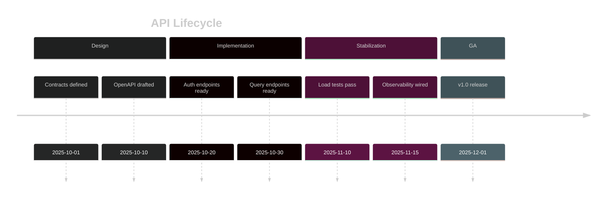
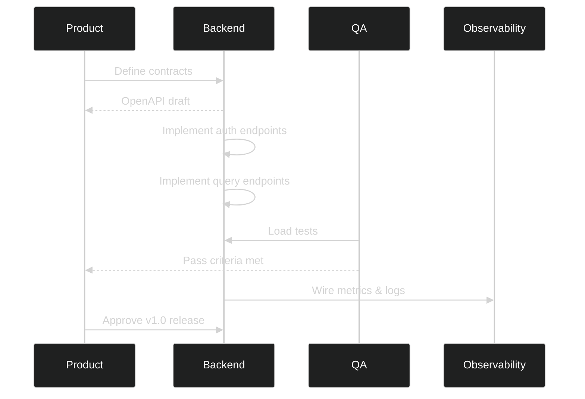
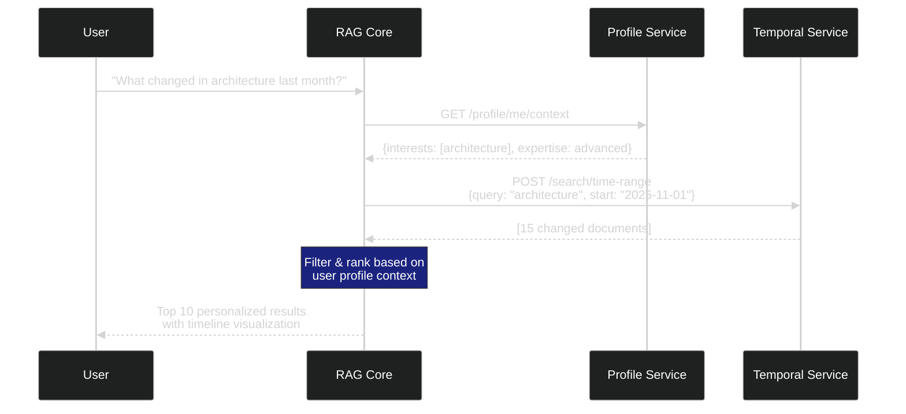

# RAGE API Specification

**Version**: 2.0.0  
**Last Updated**: December 3, 2025  
**Base URL**: `https://api.rage.example.com/api/v1`  
**Protocol**: HTTPS only

---

## Table of Contents

1. [Overview](#overview)
2. [Authentication](#authentication)
3. [Core API Endpoints](#core-api-endpoints)
4. [Query API Endpoints](#query-api-endpoints)
5. [Admin API Endpoints](#admin-api-endpoints)
6. [WebSocket API](#websocket-api)
7. [Network & Federation API (Layer 10)](#network--federation-api-layer-10)
8. [Error Handling](#error-handling)
9. [Rate Limiting](#rate-limiting)
10. [OpenAPI Schema](#openapi-schema)

---

## 1. Overview

### 1.1 API Design Principles

- **RESTful**: Resource-based URLs, HTTP verbs
- **JSON**: All requests and responses use JSON
- **Versioned**: API version in URL (`/api/v1/`)
- **Consistent**: Standard error format across all endpoints
- **Paginated**: List endpoints support cursor-based pagination
- **Filterable**: Rich filtering and sorting capabilities
- **Documented**: OpenAPI 3.1 specification

### 1.2 Common Headers

**Request Headers**:
```http
Authorization: Bearer <jwt_token>
Content-Type: application/json
Accept: application/json
X-Request-ID: <uuid>  # Optional, for request tracing
```

**Response Headers**:
```http
Content-Type: application/json
X-Request-ID: <uuid>
X-RateLimit-Limit: 100
X-RateLimit-Remaining: 95
X-RateLimit-Reset: 1700000000
```

### 1.3 HTTP Status Codes

| Code | Meaning | Usage |
|------|---------|-------|
| `200` | OK | Successful GET, PUT, PATCH |
| `201` | Created | Successful POST |
| `204` | No Content | Successful DELETE |
| `400` | Bad Request | Invalid input |
| `401` | Unauthorized | Missing/invalid token |
| `403` | Forbidden | Insufficient permissions |
| `404` | Not Found | Resource doesn't exist |
| `409` | Conflict | Resource already exists |
| `422` | Unprocessable Entity | Validation error |
| `429` | Too Many Requests | Rate limit exceeded |
| `500` | Internal Server Error | Server error |
| `503` | Service Unavailable | Temporary unavailable |

---

## 2. Authentication

### 2.1 Login

**Endpoint**: `POST /auth/login`

**Description**: Authenticate user and receive JWT tokens.

**Request**:
```json
{
  "email": "user@example.com",
  "password": "SecurePassword123!",
  "mfa_code": "123456"  // Optional, if MFA enabled
}
```

**Response** (`200 OK`):
```json
{
  "access_token": "eyJhbGciOiJIUzI1NiIs...",
  "refresh_token": "eyJhbGciOiJIUzI1NiIs...",
  "token_type": "Bearer",
  "expires_in": 3600,
  "user": {
    "id": "usr_1a2b3c4d",
    "email": "user@example.com",
    "name": "John Doe",
    "role": "user",
    "avatar_url": "https://...",
    "preferences": {
      "theme": "dark",
      "language": "en"
    }
  }
}
```

**Errors**:
- `401`: Invalid credentials
- `403`: Account locked (too many failed attempts)
- `422`: MFA code required but not provided

---

### 2.2 Refresh Token

**Endpoint**: `POST /auth/refresh`

**Description**: Exchange refresh token for new access token.

**Request**:
```json
{
  "refresh_token": "eyJhbGciOiJIUzI1NiIs..."
}
```

**Response** (`200 OK`):
```json
{
  "access_token": "eyJhbGciOiJIUzI1NiIs...",
  "expires_in": 3600
}
```

---

### 2.3 Logout

**Endpoint**: `POST /auth/logout`

**Description**: Invalidate current session.

**Headers**: `Authorization: Bearer <access_token>`

**Response** (`204 No Content`)

---

### 2.4 Register

**Endpoint**: `POST /auth/register`

**Description**: Create new user account.

**Request**:
```json
{
  "email": "newuser@example.com",
  "password": "SecurePassword123!",
  "name": "Jane Smith",
  "organization": "Acme Corp"  // Optional
}
```

**Response** (`201 Created`):
```json
{
  "id": "usr_2b3c4d5e",
  "email": "newuser@example.com",
  "name": "Jane Smith",
  "verification_sent": true,
  "message": "Please check your email to verify your account"
}
```

**Errors**:
- `409`: Email already registered
- `422`: Password doesn't meet requirements

---

## 3. Core API Endpoints

### 3.1 Health Check

**Endpoint**: `GET /health`

**Description**: System health status (no auth required).

**Response** (`200 OK`):
```json
{
  "status": "healthy",
  "version": "1.0.0",
  "timestamp": "2025-11-24T10:30:00Z",
  "services": {
    "api": "healthy",
    "database": "healthy",
    "neo4j": "healthy",
    "cache": "healthy",
    "llm": "healthy"
  },
  "metrics": {
    "uptime_seconds": 86400,
    "total_requests": 1500000,
    "avg_response_time_ms": 45
  }
}
```

---

### 3.2 Get Current User

**Endpoint**: `GET /users/me`

**Description**: Get authenticated user's profile.

**Headers**: `Authorization: Bearer <access_token>`

**Response** (`200 OK`):
```json
{
  "id": "usr_1a2b3c4d",
  "email": "user@example.com",
  "name": "John Doe",
  "role": "user",
  "avatar_url": "https://...",
  "organization": {
    "id": "org_9z8y7x6w",
    "name": "Acme Corp"
  },
  "teams": [
    {
      "id": "team_5v4w3x2y",
      "name": "Engineering",
      "role": "member"
    }
  ],
  "preferences": {
    "theme": "dark",
    "language": "en",
    "notifications": {
      "email": true,
      "push": false
    }
  },
  "usage": {
    "queries_this_month": 150,
    "documents_uploaded": 25,
    "storage_used_mb": 1024
  },
  "created_at": "2025-01-15T08:00:00Z",
  "last_login": "2025-11-24T09:00:00Z"
}
```

---

### 3.3 Update User Profile

**Endpoint**: `PATCH /users/me`

**Description**: Update authenticated user's profile.

**Request**:
```json
{
  "name": "John Smith",
  "avatar_url": "https://...",
  "preferences": {
    "theme": "light",
    "language": "es"
  }
}
```

**Response** (`200 OK`): Returns updated user object.

---

### 3.4 List Teams

**Endpoint**: `GET /teams`

**Description**: List user's teams.

**Query Parameters**:
- `page` (integer): Page number (default: 1)
- `limit` (integer): Items per page (default: 20, max: 100)
- `sort` (string): Sort field (default: "name")
- `order` (string): Sort order ("asc" or "desc")

**Response** (`200 OK`):
```json
{
  "data": [
    {
      "id": "team_5v4w3x2y",
      "name": "Engineering",
      "description": "Engineering team",
      "avatar_url": "https://...",
      "member_count": 15,
      "role": "member",
      "created_at": "2025-01-01T00:00:00Z"
    }
  ],
  "pagination": {
    "page": 1,
    "limit": 20,
    "total": 3,
    "total_pages": 1,
    "has_next": false,
    "has_prev": false
  }
}
```

---

## 4. Query API Endpoints

### 4.1 Submit Query

**Endpoint**: `POST /query`

**Description**: Submit a question to the RAG system.

**Request**:
```json
{
  "query": "How does authentication work in RAGE?",
  "filters": {
    "document_ids": ["doc_abc123"],  // Optional
    "teams": ["team_xyz789"],        // Optional
    "date_range": {                  // Optional
      "start": "2025-01-01",
      "end": "2025-12-31"
    }
  },
  "options": {
    "max_results": 10,
    "llm_provider": "auto",  // auto, ollama, openai, anthropic
    "llm_model": "llama3",   // Model name
    "temperature": 0.7,
    "include_citations": true,
    "stream": false
  }
}
```

**Response** (`200 OK`):
```json
{
  "execution_id": "exec_9f8e7d6c",
  "query": "How does authentication work in RAGE?",
  "answer": "RAGE uses JWT-based authentication with access and refresh tokens. Users authenticate via the /auth/login endpoint...",
  "confidence": 0.92,
  "citations": [
    {
      "document_id": "doc_abc123",
      "title": "Authentication Guide",
      "chunk_id": "chunk_456",
      "content": "JWT tokens are issued upon successful login...",
      "relevance": 0.95,
      "url": "/documents/doc_abc123#chunk_456"
    },
    {
      "document_id": "doc_def456",
      "title": "Security Best Practices",
      "chunk_id": "chunk_789",
      "content": "Access tokens expire after 1 hour...",
      "relevance": 0.88,
      "url": "/documents/doc_def456#chunk_789"
    }
  ],
  "follow_up_questions": [
    "How do I implement JWT authentication in my app?",
    "What are the security best practices for tokens?",
    "Can I use OAuth2 with RAGE?"
  ],
  "metadata": {
    "processing_time_ms": 1250,
    "llm_provider": "ollama",
    "llm_model": "llama3",
    "tokens_used": {
      "input": 450,
      "output": 120
    },
    "cost_usd": 0.0,
    "agents_involved": [
      "query_analyzer",
      "concept_mapper",
      "document_retriever",
      "answer_synthesizer"
    ]
  },
  "created_at": "2025-11-24T10:30:00Z"
}
```

**Errors**:
- `400`: Invalid query format
- `422`: Query too long (max 2000 chars)
- `429`: Rate limit exceeded

---

### 4.2 Stream Query

**Endpoint**: `POST /query/stream`

**Description**: Submit query with streaming response (Server-Sent Events).

**Request**: Same as `/query` but with `"stream": true` in options.

**Response** (`200 OK`, `Content-Type: text/event-stream`):

```
event: start
data: {"execution_id": "exec_9f8e7d6c", "status": "processing"}

event: progress
data: {"agent": "query_analyzer", "progress": 25, "message": "Analyzing query..."}

event: progress
data: {"agent": "document_retriever", "progress": 50, "message": "Retrieving documents..."}

event: chunk
data: {"content": "RAGE uses JWT-based ", "index": 0}

event: chunk
data: {"content": "authentication with ", "index": 1}

event: chunk
data: {"content": "access and refresh tokens.", "index": 2}

event: citation
data: {"document_id": "doc_abc123", "title": "Auth Guide", "relevance": 0.95}

event: complete
data: {
  "answer": "RAGE uses JWT-based authentication with access and refresh tokens...",
  "confidence": 0.92,
  "citations": [...],
  "metadata": {...}
}

event: end
data: {"status": "success"}
```

---

### 4.3 Get Query History

**Endpoint**: `GET /query/history`

**Description**: Retrieve user's query history.

**Query Parameters**:
- `page` (integer): Page number
- `limit` (integer): Items per page
- `start_date` (string): ISO date
- `end_date` (string): ISO date

**Response** (`200 OK`):
```json
{
  "data": [
    {
      "execution_id": "exec_9f8e7d6c",
      "query": "How does authentication work?",
      "answer_preview": "RAGE uses JWT-based authentication...",
      "confidence": 0.92,
      "created_at": "2025-11-24T10:30:00Z",
      "processing_time_ms": 1250
    }
  ],
  "pagination": {
    "page": 1,
    "limit": 20,
    "total": 150,
    "total_pages": 8
  }
}
```

---

### 4.4 Get Query Details

**Endpoint**: `GET /query/{execution_id}`

**Description**: Get detailed results of a previous query.

**Response** (`200 OK`): Returns full query response object (same as POST /query).

---

### 4.5 Search Documents

**Endpoint**: `GET /search/documents`

**Description**: Search across documents (hybrid search).

**Query Parameters**:
- `q` (string): Search query
- `filters` (object): JSON-encoded filters
- `page`, `limit`: Pagination
- `sort`: Sorting field (relevance, date, title)

**Response** (`200 OK`):
```json
{
  "data": [
    {
      "id": "doc_abc123",
      "title": "Authentication Guide",
      "description": "Complete guide to RAGE authentication",
      "content_preview": "JWT tokens are issued upon successful login...",
      "relevance_score": 0.95,
      "metadata": {
        "author": "John Doe",
        "created_at": "2025-01-15T08:00:00Z",
        "updated_at": "2025-11-20T10:00:00Z",
        "word_count": 2500,
        "tags": ["authentication", "security", "jwt"]
      },
      "access": {
        "can_view": true,
        "can_edit": false,
        "can_delete": false
      }
    }
  ],
  "facets": {
    "tags": {
      "authentication": 15,
      "security": 12,
      "api": 8
    },
    "authors": {
      "John Doe": 10,
      "Jane Smith": 5
    }
  },
  "pagination": {
    "page": 1,
    "limit": 20,
    "total": 42
  }
}
```

---

## 5. Admin API Endpoints

### 5.1 Upload Document

**Endpoint**: `POST /documents`

**Description**: Upload a new document for ingestion.

**Headers**: 
- `Content-Type: multipart/form-data`
- `Authorization: Bearer <access_token>`

**Request**:
```
Content-Disposition: form-data; name="file"; filename="guide.pdf"
Content-Type: application/pdf

<binary data>

--boundary
Content-Disposition: form-data; name="metadata"

{
  "title": "Authentication Guide",
  "description": "Complete guide to RAGE authentication",
  "tags": ["authentication", "security"],
  "team_id": "team_xyz789",
  "is_public": false
}
```

**Response** (`201 Created`):
```json
{
  "id": "doc_abc123",
  "title": "Authentication Guide",
  "filename": "guide.pdf",
  "size_bytes": 1048576,
  "content_hash": "sha256:abc123...",
  "status": "processing",
  "processing_job_id": "job_def456",
  "created_at": "2025-11-24T10:30:00Z",
  "estimated_completion": "2025-11-24T10:35:00Z"
}
```

**Supported Formats**:
- PDF (`.pdf`)
- Word (`.docx`, `.doc`)
- Markdown (`.md`)
- HTML (`.html`)
- Text (`.txt`)
- PowerPoint (`.pptx`)

**Limits**:
- Max file size: 50 MB
- Max files per request: 10

---

### 5.2 Get Document

**Endpoint**: `GET /documents/{document_id}`

**Description**: Get document details and metadata.

**Response** (`200 OK`):
```json
{
  "id": "doc_abc123",
  "title": "Authentication Guide",
  "description": "Complete guide to RAGE authentication",
  "filename": "guide.pdf",
  "size_bytes": 1048576,
  "content_hash": "sha256:abc123...",
  "status": "completed",
  "metadata": {
    "author": "John Doe",
    "page_count": 25,
    "word_count": 5000,
    "language": "en",
    "tags": ["authentication", "security"]
  },
  "processing": {
    "started_at": "2025-11-24T10:30:00Z",
    "completed_at": "2025-11-24T10:33:00Z",
    "duration_ms": 180000,
    "chunks_created": 45,
    "concepts_extracted": 12,
    "entities_extracted": 8
  },
  "access": {
    "owner_id": "usr_1a2b3c4d",
    "team_id": "team_xyz789",
    "is_public": false,
    "permissions": {
      "can_view": true,
      "can_edit": true,
      "can_delete": true,
      "can_share": true
    }
  },
  "statistics": {
    "view_count": 150,
    "query_count": 45,
    "citation_count": 12,
    "last_accessed": "2025-11-24T09:00:00Z"
  },
  "created_at": "2025-11-24T10:30:00Z",
  "updated_at": "2025-11-24T10:33:00Z"
}
```

---

### 5.3 Update Document

**Endpoint**: `PATCH /documents/{document_id}`

**Description**: Update document metadata.

**Request**:
```json
{
  "title": "Updated Title",
  "description": "Updated description",
  "tags": ["new-tag"],
  "is_public": true
}
```

**Response** (`200 OK`): Returns updated document object.

---

### 5.4 Delete Document

**Endpoint**: `DELETE /documents/{document_id}`

**Description**: Delete document and all associated data.

**Query Parameters**:
- `hard_delete` (boolean): Permanently delete (default: false, soft delete)

**Response** (`204 No Content`)

---

### 5.5 Reprocess Document

**Endpoint**: `POST /documents/{document_id}/reprocess`

**Description**: Trigger reprocessing of document (e.g., after config changes).

**Response** (`202 Accepted`):
```json
{
  "processing_job_id": "job_ghi789",
  "status": "queued",
  "estimated_completion": "2025-11-24T10:35:00Z"
}
```

---

### 5.6 List Documents

**Endpoint**: `GET /documents`

**Description**: List all accessible documents.

**Query Parameters**:
- `page`, `limit`: Pagination
- `sort`: Field to sort by (title, created_at, relevance)
- `order`: Sort order (asc, desc)
- `filter[status]`: Filter by status (all, processing, completed, failed)
- `filter[team_id]`: Filter by team
- `filter[tags]`: Comma-separated tags
- `search`: Search query

**Response** (`200 OK`):
```json
{
  "data": [
    {
      "id": "doc_abc123",
      "title": "Authentication Guide",
      "description": "Complete guide...",
      "status": "completed",
      "metadata": {...},
      "created_at": "2025-11-24T10:30:00Z"
    }
  ],
  "pagination": {
    "page": 1,
    "limit": 20,
    "total": 150,
    "total_pages": 8
  }
}
```

---

### 5.7 Get Analytics

**Endpoint**: `GET /analytics`

**Description**: System-wide analytics and usage statistics.

**Query Parameters**:
- `start_date` (string): ISO date
- `end_date` (string): ISO date
- `granularity` (string): hour, day, week, month

**Response** (`200 OK`):
```json
{
  "period": {
    "start": "2025-11-01T00:00:00Z",
    "end": "2025-11-24T23:59:59Z",
    "granularity": "day"
  },
  "queries": {
    "total": 15000,
    "avg_per_day": 625,
    "avg_response_time_ms": 1250,
    "avg_confidence": 0.87,
    "timeline": [
      {
        "date": "2025-11-01",
        "count": 550,
        "avg_response_time_ms": 1200
      }
    ]
  },
  "documents": {
    "total": 250,
    "total_size_mb": 5120,
    "by_status": {
      "completed": 240,
      "processing": 8,
      "failed": 2
    },
    "by_type": {
      "pdf": 150,
      "docx": 60,
      "md": 40
    }
  },
  "llm_usage": {
    "total_tokens": 5000000,
    "total_cost_usd": 125.50,
    "by_provider": {
      "ollama": {
        "tokens": 3000000,
        "cost_usd": 0.0
      },
      "openai": {
        "tokens": 1500000,
        "cost_usd": 75.0
      },
      "anthropic": {
        "tokens": 500000,
        "cost_usd": 50.5
      }
    }
  },
  "users": {
    "total": 50,
    "active_this_month": 35,
    "new_this_month": 5
  }
}
```

---

### 5.8 Manage Users (Admin Only)

**Endpoint**: `GET /admin/users`

**Description**: List all users (admin only).

**Response** (`200 OK`):
```json
{
  "data": [
    {
      "id": "usr_1a2b3c4d",
      "email": "user@example.com",
      "name": "John Doe",
      "role": "user",
      "status": "active",
      "organization": "Acme Corp",
      "usage": {
        "queries_this_month": 150,
        "storage_used_mb": 1024
      },
      "created_at": "2025-01-15T08:00:00Z",
      "last_login": "2025-11-24T09:00:00Z"
    }
  ],
  "pagination": {...}
}
```

---

**Endpoint**: `PATCH /admin/users/{user_id}`

**Description**: Update user (admin only).

**Request**:
```json
{
  "role": "admin",
  "status": "suspended"
}
```

---

### 5.9 System Configuration

**Endpoint**: `GET /admin/config`

**Description**: Get system configuration (admin only).

**Response** (`200 OK`):
```json
{
  "llm": {
    "default_provider": "ollama",
    "providers": {
      "ollama": {
        "enabled": true,
        "url": "http://ollama:11434",
        "models": ["llama3", "mistral"]
      },
      "openai": {
        "enabled": true,
        "api_key_configured": true,
        "models": ["gpt-4", "gpt-3.5-turbo"]
      }
    }
  },
  "ingestion": {
    "max_file_size_mb": 50,
    "chunk_size": 512,
    "chunk_overlap": 50,
    "supported_formats": ["pdf", "docx", "md", "html"]
  },
  "search": {
    "max_results": 100,
    "min_confidence": 0.5,
    "hybrid_fusion_weight": 0.6
  },
  "limits": {
    "rate_limit_per_minute": 100,
    "max_queries_per_day": 1000,
    "max_storage_per_user_gb": 10
  }
}
```

**Endpoint**: `PATCH /admin/config`

**Description**: Update system configuration (admin only).

---

## 6. WebSocket API

### 6.1 Connection

**Endpoint**: `wss://api.rage.example.com/ws`

**Description**: Real-time updates via WebSocket.

**Authentication**: Send JWT token in first message:
```json
{
  "type": "auth",
  "token": "eyJhbGciOiJIUzI1NiIs..."
}
```

**Response**:
```json
{
  "type": "auth_success",
  "session_id": "sess_abc123"
}
```

---

### 6.2 Subscribe to Events

**Message**:
```json
{
  "type": "subscribe",
  "events": ["query.progress", "document.processing", "system.alerts"]
}
```

**Response**:
```json
{
  "type": "subscribed",
  "events": ["query.progress", "document.processing", "system.alerts"]
}
```

---

### 6.3 Event Types

**Query Progress**:
```json
{
  "type": "query.progress",
  "execution_id": "exec_9f8e7d6c",
  "agent": "document_retriever",
  "progress": 50,
  "message": "Retrieving documents...",
  "timestamp": "2025-11-24T10:30:00Z"
}
```

**Document Processing**:
```json
{
  "type": "document.processing",
  "document_id": "doc_abc123",
  "status": "completed",
  "chunks_created": 45,
  "timestamp": "2025-11-24T10:33:00Z"
}
```

**System Alerts**:
```json
{
  "type": "system.alert",
  "severity": "warning",
  "message": "High LLM usage detected",
  "timestamp": "2025-11-24T10:30:00Z"
}
```

---

## 7. Error Handling

### 7.1 Error Response Format

All errors follow a consistent format:

```json
{
  "error": {
    "code": "VALIDATION_ERROR",
    "message": "Invalid query format",
    "details": {
      "field": "query",
      "reason": "Query cannot be empty"
    },
    "request_id": "req_xyz789",
    "timestamp": "2025-11-24T10:30:00Z"
  }
}
```

### 7.2 Error Codes

| Code | HTTP Status | Description |
|------|-------------|-------------|
| `INVALID_REQUEST` | 400 | Malformed request |
| `VALIDATION_ERROR` | 422 | Validation failed |
| `UNAUTHORIZED` | 401 | Authentication required |
| `FORBIDDEN` | 403 | Insufficient permissions |
| `NOT_FOUND` | 404 | Resource not found |
| `CONFLICT` | 409 | Resource already exists |
| `RATE_LIMIT_EXCEEDED` | 429 | Too many requests |
| `INTERNAL_ERROR` | 500 | Server error |
| `SERVICE_UNAVAILABLE` | 503 | Temporary unavailable |
| `LLM_ERROR` | 500 | LLM provider error |
| `DATABASE_ERROR` | 500 | Database error |

---

## 8. Rate Limiting

### 8.1 Limits

| Endpoint | Limit | Window |
|----------|-------|--------|
| `/auth/login` | 5 requests | 15 minutes |
| `/auth/register` | 3 requests | 1 hour |
| `/query` | 100 requests | 1 minute |
| `/query/stream` | 20 requests | 1 minute |

### API Lifecycle Timeline (Beta + Fallback)

Beta chart (if supported):



> Viewer Notes
> - This is a Mermaid `timeline` (beta feature). If your viewer does not support beta charts, use the fallback sequence diagram below.

Fallback (sequence overview):



> Viewer Notes
> - This section uses a Mermaid `timeline` (beta) to illustrate the API lifecycle, followed by a standard `sequenceDiagram` fallback.
> - If the beta chart does not render in your viewer, rely on the fallback to understand the flow.
| `/documents` (upload) | 10 requests | 1 hour |
| All other endpoints | 100 requests | 1 minute |

### 8.2 Rate Limit Headers

Every response includes:
```http
X-RateLimit-Limit: 100
X-RateLimit-Remaining: 95
X-RateLimit-Reset: 1700000000
```

### 8.3 Rate Limit Exceeded Response

```json
{
  "error": {
    "code": "RATE_LIMIT_EXCEEDED",
    "message": "Too many requests",
    "details": {
      "limit": 100,
      "window_seconds": 60,
      "retry_after": 45
    }
  }
}
```

**Headers**:
```http
Retry-After: 45
X-RateLimit-Limit: 100
X-RateLimit-Remaining: 0
X-RateLimit-Reset: 1700000045
```

---

## 7. Network & Federation API (Layer 10)

**Status**: Design Phase (v0.2.0)  
**Documentation**: See `/docs/NETWORK_LAYER.md`, `/docs/FEDERATION_GUIDE.md`  
**Contracts**: `/contracts/network-layer.yaml`, `/contracts/cdn-service.yaml`

### 7.1 P2P Network Endpoints

#### Get Peer List

**Endpoint**: `GET /network/peers`

**Description**: List all known P2P peers in the network.

**Query Parameters**:
- `status` (optional): Filter by status (`online`, `offline`, `unreachable`)
- `region` (optional): Filter by region (`us-west-1`, `eu-central-1`, etc.)
- `limit` (optional, default: 50): Maximum peers to return
- `cursor` (optional): Pagination cursor

**Response** (`200 OK`):
```json
{
  "peers": [
    {
      "peer_id": "12D3KooWA8EXV3KjBxEU5EnsPfneLx84vMWAtTBQBeyooN82KSuS",
      "node_name": "rage-us-west-1-prod",
      "organization_id": "550e8400-e29b-41d4-a716-446655440000",
      "status": "online",
      "region": "us-west-1",
      "capabilities": ["storage", "search", "federation"],
      "listen_addresses": [
        "/ip4/203.0.113.1/tcp/4001",
        "/ip6/2001:db8::1/tcp/4001"
      ],
      "uptime_seconds": 864000,
      "total_bytes_sent": 1073741824,
      "total_bytes_received": 536870912,
      "last_seen_at": "2025-12-03T10:30:00Z"
    }
  ],
  "pagination": {
    "total": 127,
    "limit": 50,
    "next_cursor": "eyJsYXN0X2lkIjoid..."
  }
}
```

#### Register New Peer

**Endpoint**: `POST /network/register`

**Description**: Register this node in the P2P network.

**Request**:
```json
{
  "peer_id": "12D3KooWA8EXV3KjBxEU5EnsPfneLx84vMWAtTBQBeyooN82KSuS",
  "node_name": "rage-eu-west-1-prod",
  "organization_id": "550e8400-e29b-41d4-a716-446655440000",
  "listen_addresses": [
    "/ip4/0.0.0.0/tcp/4001",
    "/ip6/::/tcp/4001"
  ],
  "announce_addresses": [
    "/ip4/198.51.100.42/tcp/4001"
  ],
  "capabilities": ["storage", "search"],
  "region": "eu-west-1",
  "datacenter": "aws-eu-west-1a",
  "certificate_pem": "-----BEGIN CERTIFICATE-----\n..."
}
```

**Response** (`201 Created`):
```json
{
  "id": "660e8400-e29b-41d4-a716-446655440001",
  "peer_id": "12D3KooWA8EXV3KjBxEU5EnsPfneLx84vMWAtTBQBeyooN82KSuS",
  "status": "online",
  "registered_at": "2025-12-03T10:35:00Z"
}
```

#### Connect to Peer

**Endpoint**: `POST /network/connect`

**Description**: Establish connection to a specific peer.

**Request**:
```json
{
  "peer_id": "12D3KooWA8EXV3KjBxEU5EnsPfneLx84vMWAtTBQBeyooN82KSuS",
  "addresses": [
    "/ip4/203.0.113.1/tcp/4001"
  ]
}
```

**Response** (`200 OK`):
```json
{
  "connected": true,
  "peer_id": "12D3KooWA8EXV3KjBxEU5EnsPfneLx84vMWAtTBQBeyooN82KSuS",
  "latency_ms": 45,
  "protocol_version": "rage/1.0.0"
}
```

#### Bootstrap DHT

**Endpoint**: `POST /network/bootstrap`

**Description**: Bootstrap the Kademlia DHT with initial peers.

**Request**:
```json
{
  "bootstrap_peers": [
    {
      "peer_id": "12D3KooWA8EXV3KjBxEU5EnsPfneLx84vMWAtTBQBeyooN82KSuS",
      "addresses": ["/ip4/203.0.113.1/tcp/4001"]
    }
  ]
}
```

**Response** (`200 OK`):
```json
{
  "bootstrapped": true,
  "connected_peers": 5,
  "routing_table_size": 128
}
```

#### Get Bandwidth Stats

**Endpoint**: `GET /network/stats/bandwidth`

**Description**: Get network bandwidth statistics.

**Query Parameters**:
- `period` (optional, default: `1h`): Time period (`1h`, `24h`, `7d`, `30d`)

**Response** (`200 OK`):
```json
{
  "period": "24h",
  "total_bytes_sent": 10737418240,
  "total_bytes_received": 5368709120,
  "bandwidth_mbps": {
    "sent": 125.3,
    "received": 62.6
  },
  "top_peers": [
    {
      "peer_id": "12D3KooW...",
      "bytes_sent": 1073741824,
      "bytes_received": 536870912
    }
  ]
}
```

### 7.2 Federation Endpoints

#### Execute Federated Query

**Endpoint**: `POST /federation/query`

**Description**: Execute a query across this RAGE instance and all trusted federated partners.

**Request**:
```json
{
  "query": "What are the latest machine learning papers?",
  "user": {
    "org_id": "partner-corp",
    "user_id": "alice@partner.com",
    "email": "alice@partner.com"
  },
  "filters": {
    "sources": ["confluence", "github"],
    "date_range": {
      "start": "2025-01-01",
      "end": "2025-12-31"
    }
  }
}
```

**Response** (`200 OK`):
```json
{
  "execution_id": "exec_abc123",
  "results": [
    {
      "document_id": "doc_456",
      "title": "Transformer Architecture Deep Dive",
      "snippet": "The transformer architecture revolutionized...",
      "score": 0.95,
      "source": "confluence",
      "org_id": "local-org",
      "acl": {
        "visibility": "org",
        "users": ["alice@partner.com"]
      }
    }
  ],
  "metadata": {
    "total_results": 42,
    "local_results": 15,
    "federated_results": 27,
    "queried_orgs": ["local-org", "partner-corp", "vendor-inc"],
    "execution_time_ms": 345
  }
}
```

#### List Trust Relationships

**Endpoint**: `GET /federation/trust`

**Description**: List all federation trust relationships.

**Query Parameters**:
- `status` (optional): Filter by status (`pending`, `active`, `suspended`, `revoked`)

**Response** (`200 OK`):
```json
{
  "trusts": [
    {
      "id": "550e8400-e29b-41d4-a716-446655440000",
      "local_org_id": "11111111-1111-1111-1111-111111111111",
      "remote_org_id": "partner-corp",
      "remote_rage_url": "https://rage.partner.com",
      "status": "active",
      "trust_model": "explicit",
      "capabilities": ["query", "share_users"],
      "certificate_fingerprint": "sha256:a3b2c1d4...",
      "certificate_valid_until": "2026-12-03T00:00:00Z",
      "trusted_since": "2025-01-15T10:00:00Z",
      "last_connected_at": "2025-12-03T09:45:00Z"
    }
  ]
}
```

#### Create Trust Relationship

**Endpoint**: `POST /federation/trust`

**Description**: Establish a new trust relationship with a remote RAGE instance.

**Request**:
```json
{
  "remote_org_id": "partner-corp",
  "remote_rage_url": "https://rage.partner.com",
  "certificate_pem": "-----BEGIN CERTIFICATE-----\n...",
  "capabilities": ["query", "replicate"],
  "sharing_policy_id": "770e8400-e29b-41d4-a716-446655440002",
  "trust_notes": "Partner organization for ML research collaboration"
}
```

**Response** (`201 Created`):
```json
{
  "id": "550e8400-e29b-41d4-a716-446655440000",
  "status": "pending",
  "requires_approval": true,
  "created_at": "2025-12-03T10:40:00Z"
}
```

#### Update Trust Status

**Endpoint**: `PATCH /federation/trust/{trust_id}`

**Description**: Update trust relationship status (activate, suspend, revoke).

**Request**:
```json
{
  "status": "active",
  "trust_notes": "Approved by security team"
}
```

**Response** (`200 OK`):
```json
{
  "id": "550e8400-e29b-41d4-a716-446655440000",
  "status": "active",
  "trusted_since": "2025-12-03T10:45:00Z",
  "updated_at": "2025-12-03T10:45:00Z"
}
```

#### Revoke Trust

**Endpoint**: `DELETE /federation/trust/{trust_id}`

**Description**: Permanently revoke trust relationship.

**Response** (`204 No Content`)

### 7.3 CDN Management Endpoints

#### List CDN Providers

**Endpoint**: `GET /cdn/providers`

**Description**: List configured CDN providers.

**Response** (`200 OK`):
```json
{
  "providers": [
    {
      "id": "880e8400-e29b-41d4-a716-446655440003",
      "name": "Cloudflare Americas",
      "provider_type": "cloudflare",
      "provider_category": "commercial",
      "enabled": true,
      "priority": 100,
      "routing_rules": {
        "regions": ["americas"],
        "countries": ["US", "CA", "MX"]
      },
      "status": "active",
      "cache_hit_rate": 0.87,
      "total_bandwidth_bytes": 53687091200,
      "last_health_check_at": "2025-12-03T10:30:00Z"
    }
  ]
}
```

#### Purge CDN Cache

**Endpoint**: `POST /cdn/cache/purge`

**Description**: Invalidate CDN cache for specific keys, prefixes, or tags.

**Request**:
```json
{
  "provider_id": "880e8400-e29b-41d4-a716-446655440003",
  "invalidation_type": "prefixes",
  "prefixes": [
    "/api/v1/documents/doc_123",
    "/api/v1/search"
  ]
}
```

**Response** (`202 Accepted`):
```json
{
  "invalidation_id": "990e8400-e29b-41d4-a716-446655440004",
  "status": "pending",
  "estimated_completion_seconds": 30,
  "requested_at": "2025-12-03T10:50:00Z"
}
```

#### Get CDN Analytics

**Endpoint**: `GET /cdn/analytics`

**Description**: Get CDN performance analytics.

**Query Parameters**:
- `period` (optional, default: `24h`): Time period
- `provider_id` (optional): Filter by provider

**Response** (`200 OK`):
```json
{
  "period": "24h",
  "total_requests": 1000000,
  "cache_hits": 870000,
  "cache_misses": 130000,
  "cache_hit_rate": 0.87,
  "bandwidth_saved_gb": 450.5,
  "top_cached_paths": [
    {
      "path": "/api/v1/documents",
      "requests": 250000,
      "cache_hit_rate": 0.92
    }
  ],
  "by_provider": [
    {
      "provider_id": "880e8400-e29b-41d4-a716-446655440003",
      "name": "Cloudflare Americas",
      "requests": 600000,
      "cache_hit_rate": 0.89
    }
  ]
}
```

### 7.4 Content Replication Endpoints

#### Get Replication Status

**Endpoint**: `GET /network/sync/status`

**Description**: Get content replication status.

**Query Parameters**:
- `chunk_id` (optional): Filter by chunk ID
- `document_id` (optional): Filter by document ID
- `status` (optional): Filter by status

**Response** (`200 OK`):
```json
{
  "replications": [
    {
      "id": "aa0e8400-e29b-41d4-a716-446655440005",
      "chunk_id": "bafybeigdyrzt5sfp7udm7hu76uh7y26nf3efuylqabf3oclgtqy55fbzdi",
      "document_id": "doc_789",
      "target_replication_factor": 3,
      "current_replication_factor": 3,
      "status": "complete",
      "replica_nodes": [
        {
          "peer_id": "12D3KooW...",
          "node_name": "rage-us-west-1",
          "region": "us-west-1",
          "replicated_at": "2025-12-03T10:00:00Z",
          "verified_at": "2025-12-03T10:05:00Z"
        }
      ],
      "total_size_bytes": 262144
    }
  ]
}
```

#### Trigger Replication

**Endpoint**: `POST /network/sync/replicate`

**Description**: Trigger replication of specific content.

**Request**:
```json
{
  "document_id": "doc_789",
  "replication_factor": 5,
  "target_regions": ["us-west-1", "eu-central-1", "ap-southeast-1"]
}
```

**Response** (`202 Accepted`):
```json
{
  "replication_id": "bb0e8400-e29b-41d4-a716-446655440006",
  "status": "in_progress",
  "estimated_completion_seconds": 120
}
```

### 7.5 WebSocket - Network Events

**Endpoint**: `WS /network/ws/sync`

**Description**: Real-time network events and replication status updates.

**Connection**:
```javascript
const ws = new WebSocket('wss://api.rage.example.com/api/v1/network/ws/sync');
ws.send(JSON.stringify({
  type: 'subscribe',
  events: ['peer_connected', 'peer_disconnected', 'replication_complete']
}));
```

**Event Messages**:
```json
{
  "event": "peer_connected",
  "timestamp": "2025-12-03T11:00:00Z",
  "data": {
    "peer_id": "12D3KooW...",
    "node_name": "rage-ap-southeast-1",
    "region": "ap-southeast-1"
  }
}

{
  "event": "replication_complete",
  "timestamp": "2025-12-03T11:02:00Z",
  "data": {
    "chunk_id": "bafybei...",
    "document_id": "doc_789",
    "replication_factor": 3
  }
}
```

---

## 9. OpenAPI Schema

### 9.1 Full OpenAPI 3.1 Specification

```yaml
openapi: 3.1.0
info:
  title: RAGE API
  version: 1.0.0
  description: |
    RAGE (Retrieval-Augmented Generation Engine) API provides endpoints for
    intelligent document search and question answering powered by LLMs and
    knowledge graphs.
  contact:
    name: RAGE Support
    email: support@rage.example.com
    url: https://rage.example.com/support
  license:
    name: MIT
    url: https://opensource.org/licenses/MIT

servers:
  - url: https://api.rage.example.com/api/v1
    description: Production server
  - url: https://staging.rage.example.com/api/v1
    description: Staging server
  - url: http://localhost:8000/api/v1
    description: Local development server

security:
  - BearerAuth: []

components:
  securitySchemes:
    BearerAuth:
      type: http
      scheme: bearer
      bearerFormat: JWT
      description: JWT token obtained from /auth/login

  schemas:
    Error:
      type: object
      required:
        - error
      properties:
        error:
          type: object
          required:
            - code
            - message
          properties:
            code:
              type: string
              example: VALIDATION_ERROR
            message:
              type: string
              example: Invalid query format
            details:
              type: object
              additionalProperties: true
            request_id:
              type: string
              format: uuid
            timestamp:
              type: string
              format: date-time

    User:
      type: object
      required:
        - id
        - email
        - name
        - role
      properties:
        id:
          type: string
          example: usr_1a2b3c4d
        email:
          type: string
          format: email
          example: user@example.com
        name:
          type: string
          example: John Doe
        role:
          type: string
          enum: [admin, user, viewer]
          example: user
        avatar_url:
          type: string
          format: uri
          nullable: true
        organization:
          type: object
          properties:
            id:
              type: string
            name:
              type: string
        preferences:
          type: object
          additionalProperties: true
        created_at:
          type: string
          format: date-time
        last_login:
          type: string
          format: date-time

    Document:
      type: object
      required:
        - id
        - title
        - status
      properties:
        id:
          type: string
          example: doc_abc123
        title:
          type: string
          example: Authentication Guide
        description:
          type: string
          nullable: true
        filename:
          type: string
          example: guide.pdf
        size_bytes:
          type: integer
          example: 1048576
        content_hash:
          type: string
          example: sha256:abc123...
        status:
          type: string
          enum: [processing, completed, failed]
          example: completed
        metadata:
          type: object
          additionalProperties: true
        created_at:
          type: string
          format: date-time
        updated_at:
          type: string
          format: date-time

    QueryRequest:
      type: object
      required:
        - query
      properties:
        query:
          type: string
          maxLength: 2000
          example: How does authentication work?
        filters:
          type: object
          properties:
            document_ids:
              type: array
              items:
                type: string
            teams:
              type: array
              items:
                type: string
            date_range:
              type: object
              properties:
                start:
                  type: string
                  format: date
                end:
                  type: string
                  format: date
        options:
          type: object
          properties:
            max_results:
              type: integer
              minimum: 1
              maximum: 100
              default: 10
            llm_provider:
              type: string
              enum: [auto, ollama, openai, anthropic, groq]
              default: auto
            llm_model:
              type: string
              example: llama3
            temperature:
              type: number
              minimum: 0
              maximum: 2
              default: 0.7
            include_citations:
              type: boolean
              default: true
            stream:
              type: boolean
              default: false

    QueryResponse:
      type: object
      required:
        - execution_id
        - query
        - answer
        - confidence
      properties:
        execution_id:
          type: string
          example: exec_9f8e7d6c
        query:
          type: string
          example: How does authentication work?
        answer:
          type: string
          example: RAGE uses JWT-based authentication...
        confidence:
          type: number
          minimum: 0
          maximum: 1
          example: 0.92
        citations:
          type: array
          items:
            type: object
            properties:
              document_id:
                type: string
              title:
                type: string
              chunk_id:
                type: string
              content:
                type: string
              relevance:
                type: number
              url:
                type: string
        follow_up_questions:
          type: array
          items:
            type: string
        metadata:
          type: object
          properties:
            processing_time_ms:
              type: integer
            llm_provider:
              type: string
            llm_model:
              type: string
            tokens_used:
              type: object
              properties:
                input:
                  type: integer
                output:
                  type: integer
            cost_usd:
              type: number
        created_at:
          type: string
          format: date-time

    Pagination:
      type: object
      required:
        - page
        - limit
        - total
        - total_pages
      properties:
        page:
          type: integer
          example: 1
        limit:
          type: integer
          example: 20
        total:
          type: integer
          example: 150
        total_pages:
          type: integer
          example: 8
        has_next:
          type: boolean
        has_prev:
          type: boolean

paths:
  /health:
    get:
      summary: Health Check
      description: Get system health status
      tags:
        - Core
      security: []
      responses:
        '200':
          description: System is healthy
          content:
            application/json:
              schema:
                type: object
                properties:
                  status:
                    type: string
                    example: healthy
                  version:
                    type: string
                  services:
                    type: object

  /auth/login:
    post:
      summary: Login
      description: Authenticate user and receive JWT tokens
      tags:
        - Authentication
      security: []
      requestBody:
        required: true
        content:
          application/json:
            schema:
              type: object
              required:
                - email
                - password
              properties:
                email:
                  type: string
                  format: email
                password:
                  type: string
                  format: password
                mfa_code:
                  type: string
                  nullable: true
      responses:
        '200':
          description: Login successful
          content:
            application/json:
              schema:
                type: object
                properties:
                  access_token:
                    type: string
                  refresh_token:
                    type: string
                  token_type:
                    type: string
                  expires_in:
                    type: integer
                  user:
                    $ref: '#/components/schemas/User'
        '401':
          description: Invalid credentials
          content:
            application/json:
              schema:
                $ref: '#/components/schemas/Error'

  /query:
    post:
      summary: Submit Query
      description: Submit a question to the RAG system
      tags:
        - Query
      requestBody:
        required: true
        content:
          application/json:
            schema:
              $ref: '#/components/schemas/QueryRequest'
      responses:
        '200':
          description: Query processed successfully
          content:
            application/json:
              schema:
                $ref: '#/components/schemas/QueryResponse'
        '400':
          description: Invalid request
          content:
            application/json:
              schema:
                $ref: '#/components/schemas/Error'
        '429':
          description: Rate limit exceeded
          content:
            application/json:
              schema:
                $ref: '#/components/schemas/Error'

  /documents:
    get:
      summary: List Documents
      description: Get list of all accessible documents
      tags:
        - Documents
      parameters:
        - name: page
          in: query
          schema:
            type: integer
            default: 1
        - name: limit
          in: query
          schema:
            type: integer
            default: 20
            maximum: 100
        - name: sort
          in: query
          schema:
            type: string
            enum: [title, created_at, updated_at]
            default: created_at
        - name: order
          in: query
          schema:
            type: string
            enum: [asc, desc]
            default: desc
      responses:
        '200':
          description: List of documents
          content:
            application/json:
              schema:
                type: object
                properties:
                  data:
                    type: array
                    items:
                      $ref: '#/components/schemas/Document'
                  pagination:
                    $ref: '#/components/schemas/Pagination'

    post:
      summary: Upload Document
      description: Upload a new document for ingestion
      tags:
        - Documents
      requestBody:
        required: true
        content:
          multipart/form-data:
            schema:
              type: object
              required:
                - file
              properties:
                file:
                  type: string
                  format: binary
                metadata:
                  type: object
                  properties:
                    title:
                      type: string
                    description:
                      type: string
                    tags:
                      type: array
                      items:
                        type: string
                    team_id:
                      type: string
                    is_public:
                      type: boolean
      responses:
        '201':
          description: Document uploaded successfully
          content:
            application/json:
              schema:
                $ref: '#/components/schemas/Document'

  /documents/{document_id}:
    parameters:
      - name: document_id
        in: path
        required: true
        schema:
          type: string
    get:
      summary: Get Document
      description: Get document details
      tags:
        - Documents
      responses:
        '200':
          description: Document details
          content:
            application/json:
              schema:
                $ref: '#/components/schemas/Document'
        '404':
          description: Document not found
          content:
            application/json:
              schema:
                $ref: '#/components/schemas/Error'
    
    patch:
      summary: Update Document
      description: Update document metadata
      tags:
        - Documents
      requestBody:
        content:
          application/json:
            schema:
              type: object
              properties:
                title:
                  type: string
                description:
                  type: string
                tags:
                  type: array
                  items:
                    type: string
      responses:
        '200':
          description: Document updated
          content:
            application/json:
              schema:
                $ref: '#/components/schemas/Document'
    
    delete:
      summary: Delete Document
      description: Delete document
      tags:
        - Documents
      parameters:
        - name: hard_delete
          in: query
          schema:
            type: boolean
            default: false
      responses:
        '204':
          description: Document deleted

tags:
  - name: Core
    description: Core system endpoints
  - name: Authentication
    description: Authentication and authorization
  - name: Query
    description: Query and search operations
  - name: Documents
    description: Document management
  - name: Admin
    description: Administrative operations
  - name: Workflows
    description: Scheduled workflow automation
  - name: Profiles
    description: User profiles and personalization
  - name: Temporal
    description: Document versioning and time travel
```

---

## 10. Advanced Services APIs (NEW)

### 10.1 Workflow Service API

**Base URL**: `http://localhost:8006/api/v1`  
**Contract**: See `/contracts/workflow-service.yaml` for complete OpenAPI 3.1 specification

**Key Endpoints**:

- `GET /workflows` - List all workflows
- `POST /workflows` - Create new workflow
- `GET /workflows/{id}` - Get workflow details
- `PUT /workflows/{id}` - Update workflow
- `DELETE /workflows/{id}` - Delete workflow
- `POST /workflows/{id}/execute` - Manually execute workflow
- `POST /workflows/{id}/enable` - Enable scheduled execution
- `POST /workflows/{id}/disable` - Disable scheduled execution
- `GET /executions` - Get execution history
- `GET /templates` - List workflow templates

**Example - Create Cron Workflow**:
```http
POST /api/v1/workflows
Authorization: Bearer <jwt_token>
Content-Type: application/json

{
  "name": "Daily Knowledge Digest",
  "description": "Send summary of most accessed docs to Slack every morning",
  "trigger": {
    "type": "cron",
    "cron_expression": "0 9 * * 1-5",
    "timezone": "America/Los_Angeles"
  },
  "steps": [
    {
      "name": "query_popular_docs",
      "type": "query_agent",
      "config": {
        "query": "Most accessed documents from yesterday",
        "limit": 10
      }
    },
    {
      "name": "generate_summary",
      "type": "llm_generation",
      "config": {
        "prompt_template": "Summarize these documents: {{steps.query_popular_docs.output}}",
        "model": "gpt-4"
      }
    },
    {
      "name": "send_to_slack",
      "type": "slack_message",
      "config": {
        "channel": "#knowledge-digest",
        "message": "{{steps.generate_summary.output}}"
      }
    }
  ],
  "enabled": true
}
```

**Response** (`201 Created`):
```json
{
  "id": "wf_abc123",
  "name": "Daily Knowledge Digest",
  "status": "active",
  "next_execution": "2025-12-04T09:00:00Z",
  "created_at": "2025-12-03T10:30:00Z"
}
```

### 10.2 Profile Service API

**Base URL**: `http://localhost:8007/api/v1`  
**Contract**: See `/contracts/profile-service.yaml` for complete OpenAPI 3.1 specification

**Key Endpoints**:

- `GET /profile/me` - Get current user profile
- `PUT /profile/me` - Update user profile
- `GET /profile/me/preferences` - Get user preferences
- `PATCH /profile/me/preferences` - Update preferences
- `GET /profile/me/behavioral` - Get behavioral data
- `GET /profile/me/context` - Get personalization context for queries
- `GET /profile/me/insights` - Get AI-generated insights
- `GET /profile/me/timeline` - Get profile evolution timeline
- `POST /learning/interaction` - Record user interaction
- `POST /learning/feedback` - Record user feedback

**Example - Get Personalization Context**:
```http
GET /api/v1/profile/me/context
Authorization: Bearer <jwt_token>
```

**Response** (`200 OK`):
```json
{
  "user_id": "usr_123",
  "interests": {
    "topics": [
      {"name": "architecture", "score": 0.92},
      {"name": "api_design", "score": 0.85},
      {"name": "security", "score": 0.78}
    ],
    "sources": [
      {"name": "confluence", "score": 0.88},
      {"name": "github", "score": 0.76}
    ]
  },
  "expertise_level": "advanced",
  "preferred_agents": ["technical_doc_agent", "code_assistant"],
  "preferred_models": ["gpt-4", "claude-sonnet-3.5"],
  "search_preferences": {
    "boost_sources": ["ARCHITECTURE.md", "API_SPEC.md"],
    "filter_outdated": true,
    "min_confidence": 0.7
  },
  "ui_preferences": {
    "theme": "dark",
    "results_per_page": 20,
    "show_citations": true
  }
}
```

**Example - Record Interaction**:
```http
POST /api/v1/learning/interaction
Authorization: Bearer <jwt_token>
Content-Type: application/json

{
  "query_id": "qry_xyz789",
  "query_text": "How does authentication work?",
  "clicked_sources": [
    {"document_id": "doc_123", "position": 1, "dwell_time_seconds": 45},
    {"document_id": "doc_456", "position": 3, "dwell_time_seconds": 120}
  ],
  "feedback": "positive",
  "session_id": "sess_abc"
}
```

### 10.3 Temporal Service API

**Base URL**: `http://localhost:8008/api/v1`  
**Contract**: See `/contracts/temporal-service.yaml` for complete OpenAPI 3.1 specification

**Key Endpoints**:

- `GET /documents/{document_id}/versions` - List document versions
- `GET /documents/{document_id}/versions/{version_number}` - Get specific version
- `GET /documents/{document_id}/versions/latest` - Get latest version
- `GET /documents/{document_id}/at-time?timestamp=...` - Get document at specific time
- `GET /documents/{document_id}/timeline` - Get document timeline
- `GET /documents/{document_id}/diff?from_version=...&to_version=...` - Compare versions
- `POST /documents/{document_id}/rollback` - Rollback to previous version
- `POST /search/temporal` - Search documents as they existed at specific time
- `POST /search/time-range` - Search documents modified in time range
- `GET /timeline/global` - Get global timeline (admin)
- `GET /stats/versioning` - Get versioning statistics

**Example - Time Travel Query**:
```http
GET /api/v1/documents/doc_arch_001/at-time?timestamp=2025-02-15T10:00:00Z
Authorization: Bearer <jwt_token>
```

**Response** (`200 OK`):
```json
{
  "id": "ver_123",
  "document_id": "doc_arch_001",
  "version_number": 12,
  "content": "# RAGE Architecture (February 2025 snapshot)\n\nThis is how the architecture looked in February...",
  "metadata": {
    "title": "RAGE Architecture",
    "source": "confluence",
    "author": "john.doe"
  },
  "created_at": "2025-02-15T08:30:00Z",
  "modified_at": "2025-02-15T08:30:00Z",
  "change_type": "updated",
  "change_author": "john.doe",
  "change_summary": "Added section on agent orchestration"
}
```

**Example - Temporal Search**:
```http
POST /api/v1/search/temporal
Authorization: Bearer <jwt_token>
Content-Type: application/json

{
  "query": "authentication implementation",
  "timestamp": "2025-01-01T00:00:00Z",
  "filters": {
    "source": ["confluence", "github"]
  },
  "limit": 10
}
```

**Response** (`200 OK`):
```json
{
  "results": [
    {
      "document_id": "doc_auth_001",
      "version_number": 5,
      "score": 0.94,
      "content": "Authentication in RAGE uses JWT tokens...",
      "metadata": {...},
      "timestamp": "2024-12-28T15:30:00Z",
      "is_current": false
    }
  ],
  "total": 8,
  "query_info": {
    "query": "authentication implementation",
    "timestamp": "2025-01-01T00:00:00Z",
    "execution_time_ms": 245
  }
}
```

**Example - Compare Versions (Diff)**:
```http
GET /api/v1/documents/doc_arch_001/diff?from_version=10&to_version=15&format=structured
Authorization: Bearer <jwt_token>
```

**Response** (`200 OK`):
```json
{
  "format": "structured",
  "added_lines": [
    "## New Feature: Workflow Automation",
    "The workflow service enables scheduled task execution...",
    "See /contracts/workflow-service.yaml for details."
  ],
  "removed_lines": [
    "## Deprecated: Manual Task Execution",
    "Tasks must be triggered manually via API..."
  ],
  "changed_sections": [
    {
      "section": "Architecture Layers",
      "old_content": "3 core services",
      "new_content": "6 microservices including workflows, profiles, temporal"
    }
  ],
  "statistics": {
    "lines_added": 45,
    "lines_removed": 12,
    "lines_changed": 8,
    "similarity_score": 0.87
  }
}
```

### 10.4 Service Integration

These services are designed to work together:

**Example - Personalized Temporal Query**:


**Example - Scheduled Report Workflow**:
```yaml
# Weekly Architecture Changes Report (Workflow)
name: Weekly Architecture Report
trigger:
  type: cron
  cron_expression: "0 17 * * 5"  # Every Friday 5 PM
  timezone: UTC
  
steps:
  - name: get_changes
    type: temporal_query
    config:
      endpoint: /search/time-range
      params:
        query: "architecture OR design OR system"
        start_time: "{{ now - 7 days }}"
        end_time: "{{ now }}"
        
  - name: analyze_changes
    type: llm_generation
    config:
      prompt: "Summarize these architecture changes: {{ steps.get_changes.output }}"
      model: gpt-4
      
  - name: send_report
    type: slack_message
    config:
      channel: "#architecture-updates"
      message: |
        📊 Weekly Architecture Report
        {{ steps.analyze_changes.output }}
```

---

## Summary

This API specification provides:

- **Complete REST API**: All endpoints for authentication, queries, documents, and administration
- **WebSocket Support**: Real-time updates via WebSocket
- **OpenAPI 3.1 Schema**: Machine-readable specification for code generation
- **Consistent Error Handling**: Standard error format across all endpoints
- **Rate Limiting**: Protect against abuse
- **Pagination**: Efficient handling of large datasets
- **Rich Filtering**: Powerful search and filter capabilities
- **Security**: JWT authentication, RBAC, and ACL

**Next Steps**:
1. Generate client SDKs from OpenAPI schema (Python, TypeScript, Go)
2. Set up API documentation portal (Swagger UI / Redoc)
3. Implement API versioning strategy
4. Create Postman/Insomnia collections for testing
