# RAGE System Architecture

**Version**: 2.0  
**Last Updated**: December 3, 2025  
**Status**: Design Phase (Layer 10 Added)

---

## Table of Contents

1. [Overview](#overview)
2. [System Design Principles](#system-design-principles)
3. [Architecture Layers](#architecture-layers)
4. [Component Interactions](#component-interactions)
5. [Data Flow](#data-flow)
6. [Scalability & Performance](#scalability--performance)
7. [Security Architecture](#security-architecture)
8. [Monitoring Architecture](#monitoring-architecture)

---

## 1. Overview

### 1.1 Architecture Philosophy

RAGE follows a **microservices-inspired monolith** architecture with clear separation of concerns:

- **Modular Components**: Each subsystem is independently deployable
- **Message-Driven**: Agents communicate via MCP (Model Context Protocol)
- **Event-Driven**: Real-time updates via WebSocket and pub/sub
- **Database-per-Concern**: PostgreSQL (metadata), Neo4j (graph), Valkey (cache)
- **Container-First**: Every component runs in isolated containers with Netdata monitoring

### 1.2 Key Architectural Decisions

| Decision | Rationale |
|----------|-----------|
| **Podman Primary, Docker Fallback** | Rootless containers, better security, daemonless architecture |
| **Mantine UI Primary** | Rich component library, TypeScript support, accessibility |
| **Multi-LLM Support** | Avoid vendor lock-in, cost optimization, fallback resilience |
| **Neo4j for Knowledge Graph** | Native graph operations, Cypher query language, vector support |
| **Valkey over Redis** | Drop-in replacement, open-source commitment |
| **Netdata per Container** | Real-time metrics, low overhead, beautiful UI |
| **MCP Protocol** | Standardized agent communication, extensibility |
| **libp2p for P2P** | Production-ready, NAT traversal, used by IPFS/Filecoin/Ethereum 2.0 |
| **Hybrid CDN** | Multi-provider (Cloudflare/Fastly/AWS) + self-hosted for flexibility |
| **Explicit Trust Lists** | Maximum security for federated instances, zero-trust by default |
| **CRDTs for Sync** | Conflict-free replication, eventual consistency across distributed nodes |

---

## 2. System Design Principles

### 2.1 SOLID Principles Applied

1. **Single Responsibility**: Each agent has one well-defined purpose
2. **Open/Closed**: New LLM providers can be added without modifying existing code
3. **Liskov Substitution**: All agents implement the same `NeuralAgent` interface
4. **Interface Segregation**: Agents only depend on protocols they use
5. **Dependency Inversion**: Components depend on abstractions (protocols), not implementations

### 2.2 Design Patterns

- **Strategy Pattern**: LLM provider selection
- **Observer Pattern**: Agent activity monitoring
- **Factory Pattern**: Agent instantiation
- **Repository Pattern**: Data access abstraction
- **Command Pattern**: Task assignments in MCP
- **Chain of Responsibility**: Document processing pipeline

---

## 3. Architecture Layers

### 3.1 Layer Diagram

```mermaid
%%{init: {'theme':'dark', 'flowchart': {'nodeSpacing': 30, 'rankSpacing': 40, 'curve': 'basis'}}}%%
flowchart TB
    %% Title: Complete Architecture Layers
    subgraph Presentation["Presentation Layer"]
        Frontend["Frontend (React + Mantine UI + TypeScript)"]
        FrontendItems["• Chat Interface<br/>• Document Management<br/>• Graph Visualization (Three.js + D3)<br/>• Admin Dashboard<br/>• User Settings"]
        Frontend --> FrontendItems
    end
    
    subgraph Gateway["Gateway Layer"]
        GW["Nginx / Traefik"]
        GWItems["• SSL/TLS Termination<br/>• Load Balancing<br/>• Rate Limiting<br/>• Request Routing<br/>• DDoS Protection"]
        GW --> GWItems
    end
    
    subgraph Application["Application Layer"]
        FastAPI["FastAPI Application"]
        CoreAPI["Core API<br/>• Auth<br/>• Users<br/>• Teams<br/>• Health"]
        QueryAPI["Query API<br/>• Search<br/>• Chat<br/>• RAG<br/>• Citations"]
        AdminAPI["Admin API<br/>• Config<br/>• Ingestion<br/>• Analytics<br/>• Monitoring"]
        Middleware["Middleware:<br/>• JWT Authentication<br/>• CORS Headers<br/>• Request Logging<br/>• Error Handling<br/>• Rate Limiting"]
        FastAPI --> CoreAPI
        FastAPI --> QueryAPI
        FastAPI --> AdminAPI
        FastAPI --> Middleware
    end
    
    subgraph Orchestration["Orchestration Layer"]
        Orch["Query Orchestrator (MCP Coordinator)"]
        OrchItems["• Agent Registry & Discovery<br/>• Task Assignment & Scheduling<br/>• Progress Tracking<br/>• Result Aggregation<br/>• Error Recovery & Retry<br/>• Resource Management"]
        Orch --> OrchItems
        
        CM["Concept Mapper<br/>• NER<br/>• Concept Mapping<br/>• Relations"]
        DR["Document Retriever<br/>• Vector<br/>• Keyword<br/>• Graph<br/>• Hybrid"]
        AS["Answer Synthesizer<br/>• LLM Gen<br/>• Citations<br/>• Scoring<br/>• Validate"]
        QA["Query Analyzer<br/>• Intent<br/>• Expansion<br/>• Language Detect"]
        
        Orch -.-> CM
        Orch -.-> DR
        Orch -.-> AS
        Orch -.-> QA
    end
    
    subgraph Business["Business Logic Layer"]
        Search["Search Engine"]
        VS["Vector Search<br/>(Semantic)"]
        KS["Keyword Search<br/>(BM25)"]
        GT["Graph Traversal<br/>(Concepts)"]
        HF["Hybrid Fusion<br/>(RRF)"]
        Search --> VS
        Search --> KS
        Search --> GT
        VS --> HF
        KS --> HF
        GT --> HF
    end
    
    Presentation -->|HTTPS/WSS| Gateway
    Gateway -->|HTTP/WS| Application
    Application -->|MCP Protocol| Orchestration
    Orchestration --> Business
    
    classDef layer fill:#0d47a1,stroke:#64b5f6,stroke-width:2px,color:#fff;
    class Presentation,Gateway,Application,Orchestration,Business layer;
    
    linkStyle default stroke:#64b5f6,stroke-width:2px;
```

```mermaid
%%{init: {'theme':'dark', 'flowchart': {'nodeSpacing': 30, 'rankSpacing': 40, 'curve': 'basis'}}}%%
flowchart TD
    %% Title: Data, LLM, and Monitoring Layers
    
    PROC["📥 Processing Layer"]
    P1["Ingestion Pipeline<br/>Parse • Chunk • Embed<br/>Extract • Build Graph"]
    P2["LLM Router<br/>Auto-select • Load Balance<br/>Fallback • Cost Track"]
    
    PROC --> P1
    PROC --> P2

    DATA["💾 Data Layer"]
    D1["PostgreSQL 16<br/>Users • Teams • Docs<br/>Queries • ACL • Audit"]
    D2["Neo4j 5.15<br/>Concepts • Entities<br/>Relations • Vectors"]
    D3["Valkey 7<br/>Sessions • Cache<br/>Pub/Sub • Locks"]
    
    DATA --> D1
    DATA --> D2
    DATA --> D3

    LLM["🤖 LLM Providers"]
    L1["🏠 Local: Ollama, llama.cpp<br/>Free • Privacy • Control"]
    L2["☁️ Cloud: OpenAI, Anthropic<br/>AWS, Azure, Groq, Custom<br/>Performance • Latest Models"]
    
    LLM --> L1
    LLM --> L2

    MON["📊 Monitoring Stack"]
    M1["Netdata → Prometheus<br/>Metrics Collection"]
    M2["Grafana Dashboards<br/>Visualization"]
    M3["Jaeger + Loki<br/>Traces + Logs"]
    
    MON --> M1
    MON --> M2
    MON --> M3

    P1 --> DATA
    P2 --> LLM
    
    classDef headerStyle fill:#263238,stroke:#64b5f6,stroke-width:3px,color:#fff,font-weight:bold;
    classDef procStyle fill:#0d47a1,stroke:#64b5f6,stroke-width:2px,color:#fff;
    classDef dataStyle fill:#6a1b9a,stroke:#ce93d8,stroke-width:2px,color:#fff;
    classDef llmStyle fill:#bf360c,stroke:#ff8a65,stroke-width:2px,color:#fff;
    classDef monStyle fill:#1b5e20,stroke:#81c784,stroke-width:2px,color:#fff;
    
    class PROC,DATA,LLM,MON headerStyle;
    class P1,P2 procStyle;
    class D1,D2,D3 dataStyle;
    class L1,L2 llmStyle;
    class M1,M2,M3 monStyle;
    
    linkStyle default stroke:#64b5f6,stroke-width:2px;
```




### 3.2 Layer 10: Distributed Network Layer (NEW)

**Status**: Design Phase (v0.2.0)  
**Documentation**: See `/docs/NETWORK_LAYER.md`, `/docs/FEDERATION_GUIDE.md`, `/docs/DISTRIBUTED_DEPLOYMENT.md`

Layer 10 adds distributed capabilities to RAGE, transforming it from a single-instance platform into a distributed knowledge network.

#### 3.2.1 Distributed Network Architecture


#### 3.2.2 P2P Network Topology


#### 3.2.3 Federated Query Flow

```mermaid
sequenceDiagram
    participant User
    participant Node_A as RAGE Node A<br/>(Local)
    participant ACL_A as ACL Engine A
    participant Node_B as RAGE Node B<br/>(Remote/Federated)
    participant ACL_B as ACL Engine B
    
    User->>Node_A: Query: "How to handle refunds?"
    
    Node_A->>ACL_A: Check user permissions
    ACL_A-->>Node_A: User authorized for federated queries
    
    Node_A->>Node_A: Search local index
    Note over Node_A: Local results: 5 documents
    
    Node_A->>Node_B: POST /api/v1/federation/query<br/>{ query, user_context, filters }
    
    Node_B->>ACL_B: Map external user → local identity
    ACL_B->>ACL_B: Check trust relationship
    ACL_B->>ACL_B: Validate federated access
    ACL_B-->>Node_B: Allowed with restrictions
    
    Node_B->>Node_B: Search local index (ACL-filtered)
    Note over Node_B: Remote results: 3 documents
    
    Node_B-->>Node_A: Return filtered results
    
    Node_A->>Node_A: Merge local + remote results
    Node_A->>Node_A: Re-rank combined results
    Node_A-->>User: Combined results: 8 documents
    
    Node_A->>Node_A: Log federated query to audit trail
```



#### 3.2.4 CDN Cache Flow


#### 3.2.5 Content Replication Strategy


#### 3.2.6 Trust Relationship Model


#### 3.2.7 Layer 10 Components Summary

| Component | Technology | Purpose |
|-----------|------------|---------|
| **P2P Protocol** | libp2p (Rust) | Peer-to-peer networking, NAT traversal |
| **Discovery** | Central servers + Kademlia DHT + mDNS | Node discovery and bootstrap |
| **Messaging** | Gossipsub | Pub/sub for ACL updates, sync events |
| **Content Routing** | Kad-DHT | Find providers for content chunks |
| **CDN (Commercial)** | Cloudflare, Fastly, AWS CloudFront | Global content delivery |
| **CDN (Self-Hosted)** | Varnish, Nginx | Private/VPN content delivery |
| **Trust Management** | PostgreSQL + X.509 certificates | Explicit trust lists, federated auth |
| **Replication** | CRDTs (Automerge) | Conflict-free data synchronization |
| **Identity Mapping** | PostgreSQL + SAML (future) | External user → local identity |
| **Encryption** | Noise Protocol, TLS 1.3 | End-to-end P2P encryption |

#### 3.2.8 Network Metrics & Monitoring

Key metrics exposed by Layer 10:

- `rage_network_peers_total` - Number of connected peers
- `rage_network_latency_seconds` - P2P message round-trip time
- `rage_cdn_cache_hit_ratio` - CDN cache effectiveness
- `rage_replication_lag_seconds` - Data sync delay between nodes
- `rage_federation_queries_total` - Cross-org query volume
- `rage_federation_acl_denials_total` - Access control denials

See `/docs/MONITORING.md` for complete metrics and Grafana dashboards.

---

## 4. Component Interactions

### 4.1 Query Processing Flow (Mermaid Sequence Diagram)


> Viewer Notes
> - Diagrams in this document use standard Mermaid (`graph`, `flowchart`, `sequenceDiagram`) for broad compatibility.
> - Where applicable in other docs, beta charts include labeled fallbacks. This file avoids beta features to ensure consistent rendering.

### 4.2 Query Processing Flow (3D Architecture View)

```mermaid
%%{init: {'theme':'dark', 'flowchart': {'nodeSpacing': 30, 'rankSpacing': 40, 'curve': 'basis'}}}%%
graph TB
    %% Title: 3D Architecture Layers
    subgraph "Layer 1: Presentation"
        User[👤 User]
        UI[🖥️ Frontend UI<br/>React + Mantine]
    end
    
    subgraph "Layer 2: Gateway"
        Gateway[🚪 API Gateway<br/>Nginx/Traefik<br/>SSL + Load Balancer]
    end
    
    subgraph "Layer 3: Application"
        API[⚡ FastAPI<br/>Query Router<br/>Auth + Validation]
        Cache{💾 Valkey Cache<br/>Exact + Semantic}
    end
    
    subgraph "Layer 4: Orchestration"
        Orch[🎯 Query Orchestrator<br/>MCP Coordinator]
    end
    
    subgraph "Layer 5: Agent Network"
        direction LR
        CM[🧠 Concept<br/>Mapper<br/>NER + Relations]
        DR[📚 Document<br/>Retriever<br/>Hybrid Search]
        AS[✍️ Answer<br/>Synthesizer<br/>LLM Generation]
        QA[🔍 Query<br/>Analyzer<br/>Intent Detection]
    end
    
    subgraph "Layer 6: Data Storage"
        direction LR
        Neo4j[(🕸️ Neo4j<br/>Knowledge Graph<br/>Vectors + Relations)]
        PG[(🗄️ PostgreSQL<br/>Structured Data<br/>Metadata)]
    end
    
    subgraph "Layer 7: LLM Providers"
        direction LR
        Ollama[🦙 Ollama<br/>Local Models]
        OpenAI[🤖 OpenAI<br/>GPT-4]
        Claude[🎭 Anthropic<br/>Claude]
        Custom[⚙️ Custom<br/>Endpoints]
    end
    
    User -->|Submit Query| UI
    UI -->|HTTPS| Gateway
    Gateway -->|Route| API
    API -->|Check| Cache
    Cache -.->|Hit| API
    Cache -->|Miss| Orch
    
    Orch -->|MCP Tasks| CM
    Orch -->|MCP Tasks| DR
    Orch -->|MCP Tasks| AS
    Orch -->|MCP Tasks| QA
    
    CM <-->|Cypher| Neo4j
    DR <-->|Cypher + SQL| Neo4j
    DR <-->|SQL| PG
    AS -->|Generate| Ollama
    AS -->|Generate| OpenAI
    AS -->|Generate| Claude
    AS -->|Generate| Custom
    
    CM -->|Results| Orch
    DR -->|Results| Orch
    AS -->|Results| Orch
    QA -->|Results| Orch
    
    Orch -->|Aggregate| API
    API -->|Cache| Cache
    API -->|Response| UI
    UI -->|Display| User
    
    style User fill:#1a237e,stroke:#7986cb,stroke-width:3px,color:#fff
    style UI fill:#1565c0,stroke:#64b5f6,stroke-width:2px,color:#fff
    style Gateway fill:#0277bd,stroke:#4fc3f7,stroke-width:2px,color:#fff
    style API fill:#01579b,stroke:#4dd0e1,stroke-width:2px,color:#fff
    style Cache fill:#006064,stroke:#4db6ac,stroke-width:2px,color:#fff
    style Orch fill:#004d40,stroke:#26a69a,stroke-width:3px,color:#fff
    style CM fill:#1b5e20,stroke:#66bb6a,stroke-width:2px,color:#fff
    style DR fill:#33691e,stroke:#9ccc65,stroke-width:2px,color:#fff
    style AS fill:#827717,stroke:#dce775,stroke-width:2px,color:#fff
    style QA fill:#f57f17,stroke:#ffb74d,stroke-width:2px,color:#fff
    style Neo4j fill:#4a148c,stroke:#ba68c8,stroke-width:2px,color:#fff
    style PG fill:#6a1b9a,stroke:#ce93d8,stroke-width:2px,color:#fff
    style Ollama fill:#bf360c,stroke:#ff8a65,stroke-width:2px,color:#fff
    style OpenAI fill:#d84315,stroke:#ff7043,stroke-width:2px,color:#fff
    style Claude fill:#c62828,stroke:#ef5350,stroke-width:2px,color:#fff
    style Custom fill:#880e4f,stroke:#f06292,stroke-width:2px,color:#fff
    
    linkStyle default stroke:#64b5f6,stroke-width:2px;
```



### 4.2 Document Ingestion Flow (Mermaid Flowchart)


### 4.3 Agent Communication (MCP Protocol)


### 4.4 3D Agent Neural Network Visualization

```mermaid
%%{init: {'theme':'dark', 'flowchart': {'nodeSpacing': 30, 'rankSpacing': 40, 'curve': 'basis'}}}%%
flowchart TD
    %% Title: Agent Neural Network - Query to Answer Flow
    
    Q[🎤 User Query<br/>'How does RAGE work?']
    PROCESS["🔍 Query Processing Layer"]
    Q --> PROCESS
    
    QE[Query Embedding<br/>768-dim vector]
    QI[Intent Classifier<br/>Technical Documentation]
    PROCESS --> QE & QI
    
    CONCEPTS["💡 Concept Mapping Layer"]
    QE & QI --> CONCEPTS
    
    C1[RAG]
    C2[Architecture]
    C3[API]
    C4[Database]
    C5[Agents]
    CONCEPTS --> C1 & C2 & C3 & C4 & C5
    
    RETRIEVAL["📄 Document Retrieval Layer"]
    C1 & C2 & C3 & C4 & C5 --> RETRIEVAL
    
    D1[ARCHITECTURE.md • 0.95]
    D2[API_SPEC.md • 0.87]
    D3[AGENTS.md • 0.82]
    D4[DATABASE.md • 0.75]
    D5[README.md • 0.70]
    RETRIEVAL --> D1 & D2 & D3 & D4 & D5
    
    CONTEXT["📦 Context Assembly Layer"]
    D1 & D2 & D3 & D4 & D5 --> CONTEXT
    
    CTX1[Architecture Overview]
    CTX2[Agent System]
    CTX3[Data Flow]
    CTX4[API Endpoints]
    CONTEXT --> CTX1 & CTX2 & CTX3 & CTX4
    
    GENERATION["🤖 Answer Generation Layer"]
    CTX1 & CTX2 & CTX3 & CTX4 --> GENERATION
    
    LLM[LLM Generator<br/>GPT-4 / Claude / Llama]
    GENERATION --> LLM
    
    OUTPUT["📝 Output Layer"]
    LLM --> OUTPUT
    
    ANS[Generated Answer<br/>with Citations]
    CONF[Confidence: 0.92]
    OUTPUT --> ANS & CONF
    
    ANS -.->|Cache| Q
    
    style Q fill:#1a237e,stroke:#7986cb,stroke-width:3px,color:#fff
    
    style PROCESS fill:#263238,stroke:#64b5f6,stroke-width:3px,color:#fff,font-weight:bold
    style QE fill:#0d47a1,stroke:#64b5f6,stroke-width:2px,color:#fff
    style QI fill:#01579b,stroke:#4fc3f7,stroke-width:2px,color:#fff
    
    style CONCEPTS fill:#263238,stroke:#ffd54f,stroke-width:3px,color:#fff,font-weight:bold
    style C1 fill:#f57f17,stroke:#ffd54f,stroke-width:2px,color:#000
    style C2 fill:#f57f17,stroke:#ffd54f,stroke-width:2px,color:#000
    style C3 fill:#f57f17,stroke:#ffd54f,stroke-width:2px,color:#000
    style C4 fill:#f57f17,stroke:#ffd54f,stroke-width:2px,color:#000
    style C5 fill:#f57f17,stroke:#ffd54f,stroke-width:2px,color:#000
    
    style RETRIEVAL fill:#263238,stroke:#81c784,stroke-width:3px,color:#fff,font-weight:bold
    style D1 fill:#1b5e20,stroke:#81c784,stroke-width:2px,color:#fff
    style D2 fill:#1b5e20,stroke:#81c784,stroke-width:2px,color:#fff
    style D3 fill:#1b5e20,stroke:#81c784,stroke-width:2px,color:#fff
    style D4 fill:#1b5e20,stroke:#81c784,stroke-width:2px,color:#fff
    style D5 fill:#1b5e20,stroke:#81c784,stroke-width:2px,color:#fff
    
    style CONTEXT fill:#263238,stroke:#ff8a65,stroke-width:3px,color:#fff,font-weight:bold
    style CTX1 fill:#bf360c,stroke:#ff8a65,stroke-width:2px,color:#fff
    style CTX2 fill:#bf360c,stroke:#ff8a65,stroke-width:2px,color:#fff
    style CTX3 fill:#bf360c,stroke:#ff8a65,stroke-width:2px,color:#fff
    style CTX4 fill:#bf360c,stroke:#ff8a65,stroke-width:2px,color:#fff
    
    style GENERATION fill:#263238,stroke:#ce93d8,stroke-width:3px,color:#fff,font-weight:bold
    style LLM fill:#6a1b9a,stroke:#ce93d8,stroke-width:3px,color:#fff
    
    style OUTPUT fill:#263238,stroke:#a5d6a7,stroke-width:3px,color:#fff,font-weight:bold
    style ANS fill:#2e7d32,stroke:#a5d6a7,stroke-width:3px,color:#fff
    style CONF fill:#2e7d32,stroke:#a5d6a7,stroke-width:2px,color:#fff
    
    linkStyle default stroke:#64b5f6,stroke-width:2px;
```



### 4.5 Container Architecture (Detailed Topology)

```mermaid
%%{init: {'theme':'dark', 'flowchart': {'nodeSpacing': 15, 'rankSpacing': 40, 'curve': 'basis'}, 'themeVariables': {'fontSize': '14px'}}}%%
flowchart LR
    %% Title: Container Architecture - Simplified View
    
    Users[👥 Users & Admins]
    
    LB[🚪 Gateway<br/>⚖️ Load Balancer<br/>Nginx/Traefik<br/>:80, :443]
    
    API["⚡ Core Services<br/>API Servers (x3)<br/>rage-api-1/2/3<br/>:8000-8002"]
    
    AG["🧠 Agent Services<br/>Concept Mapper<br/>Document Retriever<br/>Answer Synthesizer<br/>Query Analyzer<br/>:8100-8103"]
    
    NEW["✨ Advanced Services<br/>Workflow Service<br/>Profile Service<br/>Temporal Service<br/>:8006-8008"]
    
    INT["🔗 Integrations<br/>Confluence • Jira<br/>Slack Bot<br/>:8200-8202"]
    
    DB["💾 Data Layer<br/>PostgreSQL :5432<br/>Neo4j :7474/7687<br/>Valkey :6379<br/>MinIO :9000"]
    
    LLMS["🤖 LLM Layer<br/>LLM Router :8300<br/>Ollama :11434<br/>→ Cloud Providers"]
    
    MON["📊 Monitoring<br/>Netdata :19999<br/>Prometheus :9090<br/>Grafana :3000<br/>Jaeger :16686<br/>Loki :3100"]
    
    NOTIFY["📧 Notifications<br/>Email • Slack<br/>PagerDuty"]
    
    Users -->|HTTPS| LB
    LB -->|Round Robin| API
    API -->|MCP| AG
    API -->|HTTP| NEW
    API -->|HTTP| INT
    AG -->|Cypher/SQL| DB
    NEW -->|SQL/HTTP| DB
    INT -->|S3/SQL/Redis| DB
    AG -->|HTTP| LLMS
    NEW -->|HTTP| LLMS
    API -->|Metrics/Traces/Logs| MON
    AG -->|Metrics/Traces/Logs| MON
    NEW -->|Metrics/Traces/Logs| MON
    DB -->|Metrics/Logs| MON
    MON -.->|Alerts| NOTIFY
    
    style Users fill:#1a237e,stroke:#7986cb,stroke-width:3px,color:#fff
    style LB fill:#0277bd,stroke:#4fc3f7,stroke-width:3px,color:#fff
    style API fill:#0d47a1,stroke:#64b5f6,stroke-width:3px,color:#fff
    style AG fill:#1b5e20,stroke:#81c784,stroke-width:3px,color:#fff
    style NEW fill:#f57f17,stroke:#ffd54f,stroke-width:3px,color:#000
    style INT fill:#e65100,stroke:#ffb74d,stroke-width:3px,color:#fff
    style DB fill:#6a1b9a,stroke:#ce93d8,stroke-width:3px,color:#fff
    style LLMS fill:#bf360c,stroke:#ff8a65,stroke-width:3px,color:#fff
    style MON fill:#01579b,stroke:#4fc3f7,stroke-width:3px,color:#fff
    style NOTIFY fill:#b71c1c,stroke:#ef5350,stroke-width:2px,color:#fff
    
    linkStyle default stroke:#64b5f6,stroke-width:2px;
```



### 4.6 Advanced Services (NEW)

#### 4.6.1 Workflow Service (Port 8006)

The **Workflow Service** provides scheduled task automation and event-driven workflows for RAGE.

**Key Capabilities**:
- **Cron-based Scheduling**: Run workflows on time-based schedules (daily, weekly, monthly)
- **Event Triggers**: Execute workflows based on system events (document ingested, query completed, ACL changed)
- **Multi-step Execution**: Chain multiple agents/actions in sequence with variable passing
- **Templates**: Pre-built workflows for common patterns (daily digest, weekly reports, auto-archival)


**Example Use Cases**:
- **Daily Knowledge Digest**: Every morning, query most-accessed documents from yesterday and send summary to Slack
- **Weekly Documentation Audit**: Check for outdated docs every Friday, generate report
- **Auto-Archival**: Move documents older than 2 years to cold storage monthly
- **Real-time Sync**: When Confluence page is updated, trigger re-ingestion workflow

**API Contract**: `/contracts/workflow-service.yaml`

#### 4.6.2 Profile Service (Port 8007)

The **Profile Service** learns user behavior and preferences to personalize every interaction.

**Key Capabilities**:
- **Behavioral Learning**: Automatically track which sources/topics users engage with
- **Preference Management**: Explicit preferences (favorite agents, LLM models, UI themes)
- **Context Injection**: Inject user profile into every query for personalized results
- **Insights & Recommendations**: Surface relevant documents based on user patterns

```mermaid
%%{init: {'theme':'dark', 'flowchart': {'nodeSpacing': 30, 'rankSpacing': 40, 'curve': 'basis'}}}%%
flowchart TD
    USER[👤 User Interaction]
    
    TRACK[📊 Tracking Layer]
    USER --> TRACK
    
    TRACK --> T1[Query History]
    TRACK --> T2[Source Clicks]
    TRACK --> T3[Session Duration]
    TRACK --> T4[Feedback +/-]
    
    T1 & T2 & T3 & T4 --> LEARN[🧠 Learning Engine]
    
    LEARN --> P1[Topic Interests<br/>Architecture: 85%]
    LEARN --> P2[Preferred Sources<br/>Confluence: 70%]
    LEARN --> P3[Expertise Level<br/>Advanced]
    LEARN --> P4[Best Response Time<br/>Morning]
    
    P1 & P2 & P3 & P4 --> PROFILE[(User Profile<br/>JSONB Storage)]
    
    PROFILE --> CTX[Context Injector]
    
    CTX --> QUERY[🔍 Enhanced Query]
    
    style USER fill:#1a237e,stroke:#7986cb,stroke-width:3px,color:#fff
    style TRACK fill:#0d47a1,stroke:#64b5f6,stroke-width:2px,color:#fff
    style T1 fill:#01579b,stroke:#4fc3f7,stroke-width:2px,color:#fff
    style T2 fill:#01579b,stroke:#4fc3f7,stroke-width:2px,color:#fff
    style T3 fill:#01579b,stroke:#4fc3f7,stroke-width:2px,color:#fff
    style T4 fill:#01579b,stroke:#4fc3f7,stroke-width:2px,color:#fff
    style LEARN fill:#f57f17,stroke:#ffd54f,stroke-width:3px,color:#000
    style P1 fill:#1b5e20,stroke:#81c784,stroke-width:2px,color:#fff
    style P2 fill:#1b5e20,stroke:#81c784,stroke-width:2px,color:#fff
    style P3 fill:#1b5e20,stroke:#81c784,stroke-width:2px,color:#fff
    style P4 fill:#1b5e20,stroke:#81c784,stroke-width:2px,color:#fff
    style PROFILE fill:#6a1b9a,stroke:#ce93d8,stroke-width:3px,color:#fff
    style CTX fill:#bf360c,stroke:#ff8a65,stroke-width:2px,color:#fff
    style QUERY fill:#2e7d32,stroke:#a5d6a7,stroke-width:3px,color:#fff
    
    linkStyle default stroke:#64b5f6,stroke-width:2px;
```



**Personalization Features**:
- **Smart Routing**: Route queries to agents/models user prefers
- **Relevance Boosting**: Boost documents from sources user trusts
- **Proactive Suggestions**: "Based on your recent searches, you might be interested in..."
- **Adaptive UI**: Customize UI based on usage patterns (power user vs beginner)

**API Contract**: `/contracts/profile-service.yaml`

#### 4.6.3 Temporal Service (Port 8008)

The **Temporal Service** enables "time travel" queries and complete version history for all documents.

**Key Capabilities**:
- **Automatic Versioning**: Every document update creates a new version with diff
- **Time-based Queries**: "Show me this document as it existed last month"
- **Timeline Visualization**: See complete evolution of documents over time
- **Rollback Support**: Restore previous versions with full audit trail


**Use Cases**:
- **Compliance & Audit**: "What did the security policy say on Jan 1, 2025?"
- **Debugging**: "When did this API documentation change?"
- **Research**: "How has our architecture evolved over the past year?"
- **Recovery**: "The latest version has errors, rollback to last week's version"

**API Contract**: `/contracts/temporal-service.yaml`

#### 4.6.4 Services Integration Flow


---

## 5. Data Flow

### 5.1 End-to-End Data Flow with Monitoring

```mermaid
%%{init: {'theme':'dark', 'flowchart': {'nodeSpacing': 30, 'rankSpacing': 40, 'curve': 'basis'}}}%%
flowchart TD
    %% Title: End-to-End Data Flow with Monitoring
    subgraph "Ingestion Flow"
        direction TB
        UP[📤 Upload<br/>Document]
        PARSE[📖 Parse<br/>Content]
        CHUNK[✂️ Chunk<br/>Text]
        EMBED[🧮 Generate<br/>Embeddings]
        STORE[(💾 Store<br/>Data)]
        UP --> PARSE --> CHUNK --> EMBED --> STORE
    end
    
    subgraph "Query Flow"
        direction TB
        QRY[🎤 User<br/>Query]
        CACHE{💾 Check<br/>Cache}
        SEARCH[🔍 Hybrid<br/>Search]
        GEN[🤖 Generate<br/>Answer]
        RESP[📝 Return<br/>Response]
        QRY --> CACHE
        CACHE -->|Hit| RESP
        CACHE -->|Miss| SEARCH
        SEARCH --> GEN
        GEN --> RESP
    end
    
    subgraph "Storage Layer"
        direction TB
        PG[(🗄️ PostgreSQL<br/>Metadata)]
        NEO[(🕸️ Neo4j<br/>Vectors + Graph)]
        VAL[(💾 Valkey<br/>Cache)]
    end
    
    subgraph "Monitoring Flow"
        direction TB
        METRICS[📊 Metrics<br/>Collection]
        LOGS[📝 Log<br/>Aggregation]
        TRACES[🔍 Distributed<br/>Tracing]
        ALERTS[🚨 Alert<br/>Manager]
        METRICS --> ALERTS
        LOGS --> ALERTS
        TRACES --> ALERTS
    end
    
    STORE --> PG
    STORE --> NEO
    SEARCH --> NEO
    SEARCH --> PG
    GEN --> VAL
    
    UP -.->|Metrics| METRICS
    PARSE -.->|Metrics| METRICS
    CHUNK -.->|Metrics| METRICS
    EMBED -.->|Metrics| METRICS
    
    QRY -.->|Trace ID| TRACES
    CACHE -.->|Trace| TRACES
    SEARCH -.->|Trace| TRACES
    GEN -.->|Trace| TRACES
    
    PG -.->|Logs| LOGS
    NEO -.->|Logs| LOGS
    VAL -.->|Logs| LOGS
    
    style UP fill:#0d47a1,stroke:#64b5f6,stroke-width:2px,color:#fff
    style PARSE fill:#01579b,stroke:#4fc3f7,stroke-width:2px,color:#fff
    style CHUNK fill:#0277bd,stroke:#4dd0e1,stroke-width:2px,color:#fff
    style EMBED fill:#0288d1,stroke:#4fc3f7,stroke-width:2px,color:#fff
    style STORE fill:#039be5,stroke:#81d4fa,stroke-width:2px,color:#fff
    
    style QRY fill:#1b5e20,stroke:#81c784,stroke-width:2px,color:#fff
    style CACHE fill:#2e7d32,stroke:#a5d6a7,stroke-width:2px,color:#fff
    style SEARCH fill:#388e3c,stroke:#66bb6a,stroke-width:2px,color:#fff
    style GEN fill:#43a047,stroke:#9ccc65,stroke-width:2px,color:#fff
    style RESP fill:#2e7d32,stroke:#a5d6a7,stroke-width:3px,color:#fff
    
    style PG fill:#6a1b9a,stroke:#ce93d8,stroke-width:2px,color:#fff
    style NEO fill:#7b1fa2,stroke:#ba68c8,stroke-width:2px,color:#fff
    style VAL fill:#8e24aa,stroke:#ab47bc,stroke-width:2px,color:#fff
    
    style METRICS fill:#e65100,stroke:#ffb74d,stroke-width:2px,color:#fff
    style LOGS fill:#ef6c00,stroke:#ffa726,stroke-width:2px,color:#fff
    style TRACES fill:#f57c00,stroke:#ff9800,stroke-width:2px,color:#fff
    style ALERTS fill:#ff6f00,stroke:#ffab40,stroke-width:2px,color:#fff
```



### 5.2 Query Data Flow (Detailed)

```mermaid
%%{init: {'theme':'dark', 'flowchart': {'nodeSpacing': 30, 'rankSpacing': 40, 'curve': 'basis'}}}%%
flowchart TD
    %% Title: Query Data Flow - User Query to Response
    Q["🎤 User Query<br/>'How does authentication work in RAGE?'"]
    
    QR["1️⃣ Query Reception<br/>• Validate input<br/>• Check rate limits<br/>• Generate execution ID"]
    
    CACHE{"2️⃣ Cache Lookup (Valkey)<br/>• Hash query<br/>• Check recent answers"}
    
    CACHED["✅ Return Cached Answer"]
    
    CE["3️⃣ Concept Extraction<br/>Concept Mapper Agent<br/>• LLM analyzes query<br/>• Extracts: authentication, RAGE, security<br/>• Neo4j concept lookup"]
    
    DR["4️⃣ Document Retrieval<br/>Document Retriever Agent<br/><br/>A. Vector Search (Neo4j)<br/>  • Generate embedding<br/>  • Similarity search → 10 docs<br/><br/>B. Keyword Search (PostgreSQL FTS)<br/>  • BM25 ranking → 10 docs<br/><br/>C. Graph Traversal (Neo4j)<br/>  • Start from concepts<br/>  • Follow MENTIONS → 10 docs<br/><br/>D. Hybrid Fusion (RRF)<br/>  • Combine & dedupe → Top 10"]
    
    AS["5️⃣ Answer Synthesis<br/>Answer Synthesizer Agent<br/>• Prepare context<br/>• Build LLM prompt<br/>• Route to optimal LLM<br/>• Generate answer + citations<br/>• Validate quality<br/>• Calculate confidence"]
    
    AGG["6️⃣ Result Aggregation<br/>• Combine agent outputs<br/>• Format response<br/>• Generate follow-ups<br/>• Create citation links"]
    
    LEARN["7️⃣ Learning & Storage<br/>• Create Query node (Neo4j)<br/>• Link to Concepts (ASKED_ABOUT)<br/>• Link to Documents (ANSWERED_BY)<br/>• Update importance scores<br/>• Cache in Valkey<br/>• Log to PostgreSQL"]
    
    RESP["8️⃣ Response to User<br/>{<br/>  answer: 'RAGE uses JWT-based...',<br/>  citations: [...],<br/>  confidence: 0.92,<br/>  follow_up: [...]<br/>}"]
    
    Q --> QR
    QR --> CACHE
    CACHE -->|HIT| CACHED
    CACHE -->|MISS| CE
    CE -->|"Concepts: [auth, security, JWT]"| DR
    DR -->|"Documents: [doc1...doc10]"| AS
    AS -->|"Answer + Citations + Confidence"| AGG
    AGG --> LEARN
    LEARN --> RESP
    
    classDef reception fill:#0d47a1,stroke:#64b5f6,stroke-width:2px,color:#fff;
    classDef cache fill:#f57f17,stroke:#ffd54f,stroke-width:2px,color:#000;
    classDef agent fill:#1b5e20,stroke:#81c784,stroke-width:2px,color:#fff;
    classDef result fill:#bf360c,stroke:#ff8a65,stroke-width:2px,color:#fff;
    
    class Q,QR reception;
    class CACHE,CACHED cache;
    class CE,DR,AS agent;
    class AGG,LEARN,RESP result;
    
    linkStyle default stroke:#64b5f6,stroke-width:2px;
```



### 5.3 Document Ingestion Data Flow

```mermaid
%%{init: {'theme':'dark', 'flowchart': {'nodeSpacing': 30, 'rankSpacing': 40, 'curve': 'basis'}}}%%
flowchart TD
    %% Title: Document Ingestion Pipeline - PDF to Knowledge Graph
    UPL["📤 PDF Upload<br/>'RAGE_Architecture.pdf'"]
    
    VAL["1️⃣ Upload & Validation<br/>• Virus scan<br/>• File type check<br/>• Size check (max 50MB)<br/>• SHA-256 hash"]
    
    DEDUP{"2️⃣ Deduplication Check<br/>(PostgreSQL)<br/>• Query by hash"}
    
    EXISTS["✅ Return Existing doc_id"]
    
    STORE["3️⃣ Storage (MinIO/S3)<br/>• Store raw file<br/>• Key: documents/2025/11/abc123.pdf<br/>• Generate signed URL (7 days)"]
    
    QUEUE["4️⃣ Queue Task (Valkey)<br/>• Add to ingestion queue<br/>• Priority: normal<br/>• Retry: 3x"]
    
    PROC["5️⃣ Document Processing<br/>• Download from MinIO<br/>• Parse PDF (pypdf2)<br/>• Extract text, metadata, images<br/>• Result: 25 pages, 15K words"]
    
    CHUNK["6️⃣ Text Chunking<br/>• Strategy: Sliding window<br/>• Size: 512 tokens<br/>• Overlap: 50 tokens<br/>• Result: 45 chunks"]
    
    EMBED["7️⃣ Embedding Generation<br/>(Ollama)<br/>• Model: nomic-embed-text<br/>• Batch: 10<br/>• Dimension: 768<br/>• Result: 45 vectors<br/>• Cache in Valkey"]
    
    DBSTORE["8️⃣ Database Storage<br/><br/>PostgreSQL:<br/>• INSERT documents<br/>• INSERT 45 chunks<br/><br/>Neo4j:<br/>• CREATE Document node<br/>• Add vector index"]
    
    CONCEPT["9️⃣ Concept Extraction<br/>(Concept Mapper Agent)<br/>• Concepts: RAG, Architecture, API<br/>• Entities: Neo4j, FastAPI, Ollama<br/>• Extract relationships"]
    
    GRAPH["🔟 Knowledge Graph<br/>(Neo4j)<br/><br/>• Create Concept nodes<br/>• Link Document to Concepts<br/>• Set relationship properties<br/>• Add Technology nodes<br/>• Build USES_TECHNOLOGY links"]
    
    POST["1️⃣1️⃣ Post-Processing<br/>• Update statistics<br/>• Recalculate PageRank<br/>• Update indexes<br/>• Notify user (WebSocket)<br/>• Clear caches"]
    
    DONE["1️⃣2️⃣ Completion<br/><br/>status: success<br/>document_id: abc123<br/>chunks: 45<br/>concepts: 12<br/>entities: 8<br/>processing_time: 12.5s"]
    
    UPL --> VAL
    VAL -->|"Hash: abc123..."| DEDUP
    DEDUP -->|Exists| EXISTS
    DEDUP -->|New| STORE
    STORE --> QUEUE
    QUEUE --> PROC
    PROC -->|"Extracted text"| CHUNK
    CHUNK -->|"45 chunks"| EMBED
    EMBED -->|"45 vectors"| DBSTORE
    DBSTORE --> CONCEPT
    CONCEPT --> GRAPH
    GRAPH --> POST
    POST --> DONE
    
    %% Class Definitions (added for Mermaid rendering correctness)
    classDef upload fill:#0d47a1,stroke:#64b5f6,stroke-width:2px,color:#fff;
    classDef process fill:#0277bd,stroke:#4fc3f7,stroke-width:2px,color:#fff;
    classDef storage fill:#6a1b9a,stroke:#ce93d8,stroke-width:2px,color:#fff;
    classDef graphNode fill:#7b1fa2,stroke:#ba68c8,stroke-width:2px,color:#fff;
    classDef complete fill:#2e7d32,stroke:#a5d6a7,stroke-width:2px,color:#fff;
    
    %% Class Assignments
    class UPL,VAL upload;
    class DEDUP,EXISTS upload;
    class STORE,QUEUE,PROC,CHUNK,EMBED process;
    class DBSTORE storage;
    class CONCEPT,GRAPH graphNode;
    class POST,DONE complete;
    
    linkStyle default stroke:#64b5f6,stroke-width:2px;
```

---

## 6. Scalability & Performance

### 6.1 Horizontal Scaling

```mermaid
%%{init: {'theme':'dark', 'flowchart': {'nodeSpacing': 30, 'rankSpacing': 40, 'curve': 'basis'}}}%%
flowchart TD
    %% Title: Horizontal Scaling Architecture
    LB["⚖️ Load Balancer (Nginx)<br/>• Round-robin<br/>• Health checks<br/>• SSL termination"]
    
    API1["⚡ API Server 1<br/>(Podman)"]
    API2["⚡ API Server 2<br/>(Podman)"]
    API3["⚡ API Server N<br/>(Podman)"]
    
    SHARED["💾 Shared Services<br/>• PostgreSQL<br/>• Neo4j<br/>• Valkey"]
    
    LB --> API1
    LB --> API2
    LB --> API3
    
    API1 --> SHARED
    API2 --> SHARED
    API3 --> SHARED
    
    classDef lb fill:#0277bd,stroke:#4fc3f7,stroke-width:3px,color:#fff;
    classDef api fill:#0d47a1,stroke:#64b5f6,stroke-width:2px,color:#fff;
    classDef shared fill:#6a1b9a,stroke:#ce93d8,stroke-width:2px,color:#fff;
    
    class LB lb;
    class API1,API2,API3 api;
    class SHARED shared;
    
    linkStyle default stroke:#64b5f6,stroke-width:2px;
```

**Scaling Strategy**:
- **API Servers**: Stateless, scale horizontally behind load balancer
- **Agents**: Run as separate processes, scale independently
- **Databases**: 
  - PostgreSQL: Read replicas for queries
  - Neo4j: Clustering for high availability
  - Valkey: Sentinel for automatic failover

### 6.2 Performance Optimizations

| Component | Optimization | Impact |
|-----------|-------------|--------|
| **Vector Search** | HNSW index in Neo4j | 10x faster queries |
| **Keyword Search** | GIN index on tsvector | 5x faster full-text |
| **Cache** | Valkey with LRU eviction | 50% fewer DB queries |
| **Embeddings** | Batch processing | 3x faster ingestion |
| **LLM** | Response caching | 80% cost reduction |
| **API** | Connection pooling | Handle 10x requests |
| **Frontend** | Code splitting | 50% faster load |

### 6.3 Resource Requirements

**Minimum (Development)**:
```yaml
CPU: 8 cores
RAM: 16 GB
Disk: 100 GB SSD
Network: 100 Mbps

Containers:
  - PostgreSQL: 2 GB RAM
  - Workflow Service: 512 MB RAM
  - Profile Service: 512 MB RAM
  - Temporal Service: 512 MB RAM
  - Neo4j: 4 GB RAM
  - Valkey: 1 GB RAM
  - API: 2 GB RAM
  - Agents: 2 GB RAM each
  - Ollama: 4 GB RAM (8 GB with GPU)
```

**Production (Single Server)**:
```yaml
CPU: 16 cores
RAM: 64 GB
Disk: 1 TB NVMe SSD
Network: 1 Gbps
GPU: Optional (8GB+ VRAM for local LLMs)

Containers:
  - PostgreSQL: 8 GB RAM
  - Neo4j: 16 GB RAM
  - Valkey: 4 GB RAM
  - API (x3): 4 GB RAM each
  - Agents: 4 GB RAM each
  - Ollama: 16 GB RAM (with GPU)
```

**High Availability (Multi-Server)**:
```yaml
3x Application Servers (each):
  - CPU: 16 cores
  - RAM: 32 GB
  - Disk: 500 GB SSD

1x Database Server:
  - CPU: 32 cores
  - RAM: 128 GB
  - Disk: 2 TB NVMe SSD RAID

1x Cache Server:
  - CPU: 8 cores
  - RAM: 64 GB
  - Disk: 500 GB SSD
```

---

## 7. Security Architecture

### 7.1 Security Layers

```mermaid
%%{init: {'theme':'dark', 'flowchart': {'nodeSpacing': 30, 'rankSpacing': 40, 'curve': 'basis'}}}%%
flowchart TD
    %% Title: Security Architecture - 8 Defense Layers
    TITLE["🔒 Security Architecture"]
    
    L1["1️⃣ Network Security<br/>• Firewall (ports 80, 443 only)<br/>• DDoS protection<br/>• Rate limiting (100 req/min)<br/>• GeoIP blocking"]
    
    L2["2️⃣ Transport Security<br/>• TLS 1.3 mandatory<br/>• Let's Encrypt certs<br/>• HSTS headers<br/>• Perfect forward secrecy"]
    
    L3["3️⃣ Authentication<br/>• JWT tokens (access + refresh)<br/>• Argon2 password hashing<br/>• MFA support (TOTP)<br/>• Session management<br/>• OAuth2/OIDC (future)"]
    
    L4["4️⃣ Authorization<br/>• RBAC (Role-Based Access)<br/>• Document-level ACL<br/>• Team permissions<br/>• Fine-grained controls"]
    
    L5["5️⃣ Data Security<br/>• AES-256 encryption at rest<br/>• Database encryption<br/>• Secure key management<br/>• PII masking"]
    
    L6["6️⃣ Container Security<br/>• Non-root containers (Podman)<br/>• Read-only filesystems<br/>• Resource limits<br/>• Security scanning<br/>• Minimal base images"]
    
    L7["7️⃣ Application Security<br/>• Input validation (Pydantic)<br/>• ORM (SQL injection prevention)<br/>• XSS protection<br/>• CSRF tokens<br/>• Security headers"]
    
    L8["8️⃣ Audit & Compliance<br/>• Complete audit trail<br/>• 90-day log retention<br/>• Compliance reporting<br/>• Anomaly detection"]
    
    TITLE --> L1
    L1 --> L2
    L2 --> L3
    L3 --> L4
    L4 --> L5
    L5 --> L6
    L6 --> L7
    L7 --> L8
    
    classDef title fill:#1a237e,stroke:#7986cb,stroke-width:3px,color:#fff;
    classDef layer fill:#4a148c,stroke:#ce93d8,stroke-width:2px,color:#fff;
    
    class TITLE title;
    class L1,L2,L3,L4,L5,L6,L7,L8 layer;
    
    linkStyle default stroke:#64b5f6,stroke-width:2px;
```

### 7.2 Authentication Flow

```mermaid
%%{init: {'theme':'dark', 'flowchart': {'nodeSpacing': 30, 'rankSpacing': 40, 'curve': 'basis'}}}%%
flowchart TD
    %% Title: User Authentication Flow - Login to JWT Token
    REQ["📨 POST /login<br/>{<br/>  email,<br/>  password<br/>}"]
    
    VAL["✅ Validate Input<br/>(Pydantic)"]
    
    QRY["🔍 Query User<br/>(PostgreSQL)"]
    
    PWD["🔐 Verify Password<br/>(Argon2 hash)"]
    
    JWT["🎫 Generate JWT Tokens<br/>• Access token (1h)<br/>• Refresh token (7d)"]
    
    SESS["💾 Store Session<br/>(Valkey)<br/>TTL: 7 days"]
    
    RESP["✅ Return Tokens<br/>{<br/>  access_token,<br/>  refresh_token,<br/>  expires_in: 3600<br/>}"]
    
    FAIL["❌ Authentication Failed\n401 Unauthorized"]
    
    REQ --> VAL
    VAL --> QRY
    QRY --> PWD
    PWD -->|Valid| JWT
    PWD -->|Invalid| FAIL
    JWT --> SESS
    SESS --> RESP
    
    classDef request fill:#0d47a1,stroke:#64b5f6,stroke-width:2px,color:#fff;
    classDef process fill:#4a148c,stroke:#ce93d8,stroke-width:2px,color:#fff;
    classDef success fill:#1b5e20,stroke:#81c784,stroke-width:2px,color:#fff;
    classDef error fill:#b71c1c,stroke:#ef5350,stroke-width:2px,color:#fff;
    
    class REQ request;
    class VAL,QRY,PWD,JWT,SESS process;
    class RESP success;
    class FAIL error;
    linkStyle default stroke:#64b5f6,stroke-width:2px;
```

### 7.3 Authorization (ACL)

**Document Access Control**:

```cypher
// Check if user can access document
MATCH (u:User {id: $user_id})
MATCH (d:Document {id: $doc_id})

// Direct user permission
OPTIONAL MATCH (u)-[r1:CAN_ACCESS]->(d)

// Team permission
OPTIONAL MATCH (u)-[:MEMBER_OF]->(t:Team)-[r2:CAN_ACCESS]->(d)

// Organization permission
OPTIONAL MATCH (u)-[:BELONGS_TO]->(org:Organization)-[r3:CAN_ACCESS]->(d)

// Public document
OPTIONAL MATCH (d) WHERE d.is_public = true

RETURN COALESCE(
  r1.permission,
  r2.permission,
  r3.permission,
  CASE WHEN d.is_public THEN 'read' ELSE null END
) as permission
```

---

## 8. Monitoring Architecture

### 8.1 Comprehensive Monitoring Stack with Netdata

```mermaid
%%{init: {'theme':'dark', 'flowchart': {'nodeSpacing': 30, 'rankSpacing': 40, 'curve': 'basis'}}}%%
flowchart TD
    %% Title: Comprehensive Monitoring Stack
    
    subgraph CONTAINERS["🐳 All RAGE Containers"]
        direction TB
        C1["⚡ API Servers (3x)<br/>● Netdata Agent"]
        C2["🧠 Agent Services (4x)<br/>● Netdata Agent"]
        C3["💾 Databases (3x)<br/>PostgreSQL • Neo4j • Valkey<br/>● Netdata Agent"]
        C4["🦙 LLM Services<br/>Ollama • Router<br/>● Netdata Agent"]
    end
    
    CONTAINERS -->|Stream Metrics| COLLECT
    CONTAINERS -.->|Send Traces| TRACE
    CONTAINERS -.->|Send Logs| LOGS
    
    subgraph COLLECT["📊 Metrics Collection"]
        direction TB
        NET["Netdata Parent :19999<br/>Aggregates all agents<br/>Real-time dashboards<br/>24h history"]
        PROM["Prometheus :9090<br/>Long-term storage: 90d<br/>PromQL queries<br/>Alert rules"]
        NET -->|Export| PROM
    end
    
    subgraph TRACE["🔍 Distributed Tracing"]
        JAEGER["Jaeger :16686<br/>Request flow visualization<br/>Latency analysis<br/>Dependency mapping"]
    end
    
    subgraph LOGS["📝 Log Aggregation"]
        LOKI["Loki :3100<br/>Log aggregation<br/>LogQL queries<br/>30-day retention"]
    end
    
    COLLECT -->|Query| VIZ
    TRACE -->|Query| VIZ
    LOGS -->|Query| VIZ
    
    subgraph VIZ["📈 Visualization"]
        GRAF["Grafana :3000<br/><br/>Dashboards:<br/>System • API • Database<br/>Agents • LLM Costs<br/>Cache Hits • Latency"]
    end
    
    PROM -->|Fire Alerts| ALERT
    NET -->|Fire Alerts| ALERT
    
    subgraph ALERT["🚨 Alerting"]
        direction TB
        AM["Alert Manager<br/>Route • Dedupe • Silence"]
        AM -->|Notify| N1["📧 Email"]
        AM -->|Notify| N2["💬 Slack"]
        AM -->|Notify| N3["📟 PagerDuty"]
    end
    
    style C1 fill:#0d47a1,stroke:#64b5f6,stroke-width:2px,color:#fff
    style C2 fill:#1b5e20,stroke:#81c784,stroke-width:2px,color:#fff
    style C3 fill:#6a1b9a,stroke:#ce93d8,stroke-width:2px,color:#fff
    style C4 fill:#bf360c,stroke:#ff8a65,stroke-width:2px,color:#fff
    
    style NET fill:#1a237e,stroke:#7986cb,stroke-width:3px,color:#fff
    style PROM fill:#e65100,stroke:#ffb74d,stroke-width:3px,color:#fff
    style JAEGER fill:#00838f,stroke:#4dd0e1,stroke-width:3px,color:#fff
    style LOKI fill:#00695c,stroke:#4db6ac,stroke-width:3px,color:#fff
    style GRAF fill:#f57c00,stroke:#ffa726,stroke-width:4px,color:#fff
    style AM fill:#b71c1c,stroke:#ef5350,stroke-width:3px,color:#fff
    style N1 fill:#01579b,stroke:#4fc3f7,stroke-width:2px,color:#fff
    style N2 fill:#0277bd,stroke:#4dd0e1,stroke-width:2px,color:#fff
    style N3 fill:#c62828,stroke:#ef5350,stroke-width:2px,color:#fff
    
    linkStyle default stroke:#64b5f6,stroke-width:2px;
```

### 8.2 Netdata Per-Container Metrics

```mermaid
%%{init: {'theme':'dark', 'flowchart': {'nodeSpacing': 30, 'rankSpacing': 40, 'curve': 'basis'}}}%%
graph LR
    %% Title: Netdata Per-Container Metrics
    subgraph "rage-api-1 Container"
        direction TB
        API_PROC[⚙️ Process Metrics<br/>• CPU usage<br/>• Memory RSS<br/>• Thread count<br/>• File descriptors]
        
        API_APP[📊 Application Metrics<br/>• Request rate: req/sec<br/>• Response time: p50/p95/p99<br/>• Error rate: 4xx/5xx<br/>• Active connections<br/>• WebSocket sessions]
        
        API_SYS[💻 System Metrics<br/>• CPU: user/system/idle<br/>• Memory: used/cached/buffers<br/>• Disk I/O: read/write IOPS<br/>• Network: packets/bandwidth]
        
        API_CUSTOM[🎯 Custom Business Metrics<br/>• Queries/minute<br/>• Cache hit rate<br/>• LLM token usage<br/>• Average confidence score<br/>• Agent task queue length]
    end
    
    API_PROC --> NETDATA_AGENT[📊 Netdata Agent<br/>Inside Container]
    API_APP --> NETDATA_AGENT
    API_SYS --> NETDATA_AGENT
    API_CUSTOM --> NETDATA_AGENT
    
    NETDATA_AGENT -->|Stream to Parent| NETDATA_PARENT[📊 Netdata Parent<br/>Central Instance]
    
    style API_PROC fill:#0d47a1,stroke:#64b5f6,stroke-width:2px,color:#fff
    style API_APP fill:#01579b,stroke:#4fc3f7,stroke-width:2px,color:#fff
    style API_SYS fill:#0277bd,stroke:#4dd0e1,stroke-width:2px,color:#fff
    style API_CUSTOM fill:#0288d1,stroke:#4fc3f7,stroke-width:2px,color:#fff
    style NETDATA_AGENT fill:#1a237e,stroke:#7986cb,stroke-width:3px,color:#fff
    style NETDATA_PARENT fill:#4a148c,stroke:#ce93d8,stroke-width:3px,color:#fff
    linkStyle default stroke:#64b5f6,stroke-width:2px;
```

### 8.2 Key Metrics Tracked

**System Metrics** (per container):
- CPU usage (user, system, idle)
- Memory usage (used, cached, buffers)
- Disk I/O (read/write IOPS, throughput)
- Network (packets, bandwidth, errors)
- Container health (restarts, status)

**Application Metrics**:
```yaml
API:
  - Request rate (req/sec)
  - Response time (p50, p95, p99)
  - Error rate (4xx, 5xx)
  - Active connections
  - WebSocket connections

Agents:
  - Task queue length
  - Task processing time
  - Success/failure rate
  - Agent utilization

Database:
  - Query latency
  - Connection pool usage
  - Cache hit ratio
  - Slow queries

LLM:
  - Token usage (input/output)
  - Cost per query
  - Provider latency
  - Fallback rate
```

### 8.3 Alerting Rules

```yaml
# prometheus/alerts.yml

groups:
  - name: RAGE_Critical
    interval: 30s
    rules:
      - alert: APIDown
        expr: up{job="rage-api"} == 0
        for: 1m
        labels:
          severity: critical
        annotations:
          summary: "API server is down"
          
      - alert: HighErrorRate
        expr: rate(http_requests_total{status=~"5.."}[5m]) > 0.05
        for: 5m
        labels:
          severity: critical
        annotations:
          summary: "High error rate: {{ $value }}"
          
      - alert: DatabaseConnectionPoolExhausted
        expr: pg_stat_activity_count >= pg_settings_max_connections * 0.9
        for: 2m
        labels:
          severity: warning
        annotations:
          summary: "Database connection pool near limit"
          
      - alert: HighMemoryUsage
        expr: container_memory_usage_bytes / container_spec_memory_limit_bytes > 0.9
        for: 5m
        labels:
          severity: warning
        annotations:
          summary: "Container {{ $labels.container }} high memory"
          
      - alert: LLMCostThreshold
        expr: sum(increase(llm_cost_usd[1d])) > 100
        labels:
          severity: warning
        annotations:
          summary: "Daily LLM cost exceeded $100"
```

---

## Summary

This architecture document provides a comprehensive view of the RAGE system:

- **Modular Design**: Clear separation of concerns across layers
- **Scalable**: Horizontal scaling of stateless components
- **Observable**: Netdata agents in every container + Prometheus + Grafana
- **Secure**: Multiple security layers from network to application
- **Flexible**: Multi-LLM support with intelligent routing
- **Resilient**: Fallback mechanisms and error recovery
- **Podman-First**: Rootless containers with Docker fallback
- **Production-Ready**: Monitoring, logging, tracing, and alerting

**Next Documents to Review**:
1. [API Specification](API.md) - Detailed API endpoints
2. [Agent System](AGENTS.md) - Neural agent specifications
3. [Database Schema](DATABASE.md) - Complete data models
4. [Deployment Guide](DEPLOYMENT.md) - Production deployment


