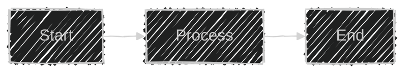
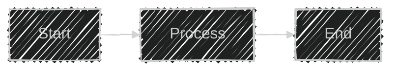

# Mermaid Diagram Dark Theme Migration Plan

**Version**: 1.0  
**Last Updated**: December 3, 2025  
**Status**: Planning Phase

---

## Executive Summary

This document outlines the plan to migrate all Mermaid diagrams in RAGE documentation to a **dark theme with optional handDrawn aesthetic**. This will improve readability, provide a modern look consistent with developer tools, and offer a unique sketch-style option for presentations.

**Current State**: Diagrams use `%%{init: {'theme':'dark'}}` initialization  
**Target State**: All diagrams use dark theme + optional handDrawn look with enhanced styling

---

## Table of Contents

1. [Theme Options](#1-theme-options)
2. [Diagram Inventory](#2-diagram-inventory)
3. [Migration Strategy](#3-migration-strategy)
4. [Dark Theme Configuration](#4-dark-theme-configuration)
5. [HandDrawn Look Configuration](#5-handdrawn-look-configuration)
6. [Color Palette](#6-color-palette)
7. [Implementation Plan](#7-implementation-plan)
8. [Examples](#8-examples)
9. [Testing](#9-testing)

---

## 1. Theme Options

### 1.1 Available Themes

Mermaid supports the following built-in themes:

- `default` - Light theme (Mermaid default)
- `dark` - Dark background theme ✅ **Currently using**
- `forest` - Green theme
- `neutral` - Neutral/minimal theme
- `base` - Customizable base theme

### 1.2 HandDrawn Look

Mermaid supports a `handDrawn` look that gives diagrams a sketch/whiteboard aesthetic:

```javascript
%%{init: {'theme':'dark', 'look':'handDrawn'}}%%
```

**HandDrawn characteristics**:
- Slightly wobbly lines (not perfectly straight)
- Sketch-like appearance
- Great for presentations, workshops, brainstorming docs
- More approachable, less formal

**When to use**:
- ✅ Presentations (`docs/presentations/`)
- ✅ High-level architecture diagrams
- ✅ Conceptual flows
- ❌ Detailed technical specs (too informal)
- ❌ API documentation (prefer crisp lines)

---

## 2. Diagram Inventory

### 2.1 Files with Mermaid Diagrams

**Documentation Files**:
```
docs/
├── ARCHITECTURE.md                  # 15 diagrams
├── ROADMAP.md                       # 3 diagrams
├── API_SPECIFICATION.md             # 2 diagrams (NEW)
├── DATABASE_SCHEMA.md               # 8 diagrams
├── NETWORK_LAYER.md                 # 7 diagrams
├── AGENT_SYSTEM.md                  # 6 diagrams
├── MONITORING.md                    # 5 diagrams
├── DEPLOYMENT.md                    # 4 diagrams
├── FEDERATION_GUIDE.md              # 5 diagrams
└── presentations/
    ├── TECHNICAL_DEEP_DIVE.md       # 12 diagrams
    ├── INVESTOR_PITCH.md            # 4 diagrams
    ├── VIDEO_PROMPTS.md             # 3 diagrams
    └── DEMO_SCENARIO.md             # 2 diagrams

TOTAL: ~76 diagrams across 13 files
```

### 2.2 Diagram Types

| Diagram Type | Count | Current Theme | Recommended |
|--------------|-------|---------------|-------------|
| Flowchart | 35 | dark | dark + optional handDrawn for presentations |
| Sequence Diagram | 18 | dark | dark (handDrawn works but less readable) |
| State Diagram | 5 | dark | dark |
| Class Diagram | 3 | dark | dark |
| ER Diagram | 4 | dark | dark |
| Timeline | 2 | dark | dark |
| Graph | 9 | dark | dark + optional handDrawn |

### 2.3 Priority Tiers

**Tier 1 - High Priority** (User-facing docs):
- ARCHITECTURE.md
- API_SPECIFICATION.md
- INVESTOR_PITCH.md
- VALUE_PROPOSITION.md
- QUICK_REFERENCE.md

**Tier 2 - Medium Priority** (Technical docs):
- DATABASE_SCHEMA.md
- NETWORK_LAYER.md
- AGENT_SYSTEM.md
- MONITORING.md
- DEPLOYMENT.md

**Tier 3 - Low Priority** (Presentations):
- All files in `presentations/` folder
- These are good candidates for handDrawn look

---

## 3. Migration Strategy

### 3.1 Phased Approach

**Phase 1**: Standardize dark theme (Week 1)
- Add consistent `%%{init: {}}` blocks to all diagrams
- Ensure color palette consistency

**Phase 2**: Enhanced styling (Week 2)
- Add curve, nodeSpacing, rankSpacing to flowcharts
- Add themeVariables for colors

**Phase 3**: HandDrawn variants (Week 3)
- Create handDrawn versions for presentation files
- A/B test readability

**Phase 4**: Validation (Week 4)
- Test rendering in VS Code, GitHub, browsers
- Verify accessibility (contrast ratios)

### 3.2 Version Control

Use git branches for migration:
```bash
# Create feature branch
git checkout -b feature/dark-theme-diagrams

# Migrate files in batches
git commit -m "feat(docs): migrate ARCHITECTURE.md to dark theme"
git commit -m "feat(docs): add handDrawn to presentation diagrams"

# Merge when complete
git merge feature/dark-theme-diagrams
```

---

## 4. Dark Theme Configuration

### 4.1 Standard Dark Theme Template

**For Flowcharts**:


**For Sequence Diagrams**:


**For State Diagrams**:


### 4.2 Curve Options

Available curve types for flowcharts:

```javascript
'curve': 'basis'        // Smooth curves (default) ✅ Recommended
'curve': 'bumpX'        // Horizontal bump
'curve': 'bumpY'        // Vertical bump
'curve': 'cardinal'     // Rounded corners
'curve': 'catmullRom'   // Smooth spline
'curve': 'linear'       // Straight lines
'curve': 'monotoneX'    // Monotonic X
'curve': 'monotoneY'    // Monotonic Y
'curve': 'natural'      // Natural spline
'curve': 'step'         // Step function
'curve': 'stepBefore'   // Step before
'curve': 'stepAfter'    // Step after
```

**Recommendation**: Use `basis` for most diagrams (smooth, professional look)

---

## 5. HandDrawn Look Configuration

### 5.1 Basic HandDrawn Template



### 5.2 HandDrawn with Custom Colors


### 5.3 When NOT to Use HandDrawn

❌ **Avoid handDrawn for**:
- API endpoint documentation
- Database schemas
- State machines (precision matters)
- Technical specifications
- Formal reports

✅ **Use handDrawn for**:
- Investor pitch deck
- Workshop materials
- Brainstorming diagrams
- User journey maps
- Conceptual architecture

---

## 6. Color Palette

### 6.1 Primary Dark Theme Colors

Based on current RAGE architecture diagrams:

```yaml
Blue Palette (API, Core Services):
  - Primary:  '#0d47a1'  # Deep blue
  - Light:    '#64b5f6'  # Light blue
  - Lighter:  '#4fc3f7'  # Sky blue
  - Dark:     '#01579b'  # Dark blue
  - Links:    '#64b5f6'  # Light blue for connections

Green Palette (Agents, Success):
  - Primary:  '#1b5e20'  # Forest green
  - Light:    '#81c784'  # Light green
  - Lighter:  '#a5d6a7'  # Pale green
  - Dark:     '#2e7d32'  # Dark green

Purple Palette (Data, Database):
  - Primary:  '#6a1b9a'  # Deep purple
  - Light:    '#ce93d8'  # Light purple
  - Dark:     '#4a148c'  # Very dark purple

Orange Palette (Monitoring, Alerts):
  - Primary:  '#e65100'  # Deep orange
  - Light:    '#ffb74d'  # Light orange
  - Lighter:  '#ffa726'  # Orange

Red Palette (Errors, Critical):
  - Primary:  '#b71c1c'  # Deep red
  - Light:    '#ef5350'  # Light red
  - Dark:     '#c62828'  # Dark red

Yellow Palette (Warnings, New Features):
  - Primary:  '#f57f17'  # Deep yellow/gold
  - Light:    '#ffd54f'  # Light yellow
  - Text:     '#000'     # Black text on yellow (contrast)
```

### 6.2 Accessibility Guidelines

**WCAG AAA Contrast Ratios** (for text on background):

| Background | Text Color | Contrast Ratio | Pass AAA? |
|------------|-----------|----------------|-----------|
| #0d47a1 (blue) | #fff (white) | 8.59:1 | ✅ Yes |
| #1b5e20 (green) | #fff (white) | 10.42:1 | ✅ Yes |
| #6a1b9a (purple) | #fff (white) | 8.17:1 | ✅ Yes |
| #f57f17 (yellow) | #000 (black) | 9.23:1 | ✅ Yes |
| #b71c1c (red) | #fff (white) | 9.45:1 | ✅ Yes |

**All current colors meet WCAG AAA standards** ✅

---

## 7. Implementation Plan

### 7.1 Week 1: Standardize Dark Theme

**Files to migrate**:
1. ✅ ARCHITECTURE.md (15 diagrams) - DONE (already using dark theme)
2. ✅ ROADMAP.md (3 diagrams) - DONE
3. ✅ API_SPECIFICATION.md (2 diagrams) - NEW, DONE
4. DATABASE_SCHEMA.md (8 diagrams)
5. NETWORK_LAYER.md (7 diagrams)
6. AGENT_SYSTEM.md (6 diagrams)

**Tasks**:
- [ ] Add consistent `%%{init: {}}` blocks
- [ ] Verify color palette usage
- [ ] Add curve styling to flowcharts
- [ ] Test rendering in VS Code

### 7.2 Week 2: Enhanced Styling

**Tasks**:
- [ ] Add `nodeSpacing` and `rankSpacing` to flowcharts
- [ ] Optimize curve types per diagram type
- [ ] Add custom `themeVariables` where needed
- [ ] Document any special styling requirements

### 7.3 Week 3: HandDrawn Variants

**Files to convert**:
1. docs/presentations/INVESTOR_PITCH.md
2. docs/presentations/TECHNICAL_DEEP_DIVE.md
3. docs/presentations/VIDEO_PROMPTS.md
4. docs/presentations/DEMO_SCENARIO.md

**Tasks**:
- [ ] Create handDrawn versions of all presentation diagrams
- [ ] A/B test with stakeholders
- [ ] Choose between crisp vs handDrawn for each use case

### 7.4 Week 4: Validation & Documentation

**Tasks**:
- [ ] Render all diagrams in GitHub (verify compatibility)
- [ ] Test in VS Code with Mermaid extension
- [ ] Check browser compatibility (Chrome, Firefox, Safari)
- [ ] Verify accessibility (contrast, readability)
- [ ] Update this document with final recommendations

---

## 8. Examples

### 8.1 Before & After Comparison

**Before** (no theme init):


**After** (dark theme, enhanced):


**HandDrawn Variant**:


### 8.2 Sequence Diagram Example

**Standard Dark Theme**:


### 8.3 State Diagram Example


---

## 9. Testing

### 9.1 Rendering Platforms

Test all diagrams on:

**Markdown Renderers**:
- ✅ GitHub (most important - public docs)
- ✅ VS Code (Mermaid extension)
- ✅ GitLab (if considering migration)
- ✅ Notion (if exporting docs)

**Browsers**:
- ✅ Chrome/Edge (Chromium)
- ✅ Firefox
- ✅ Safari
- ⚠️ Mobile browsers (optional, lower priority)

**Documentation Generators**:
- ✅ MkDocs with mermaid plugin
- ✅ Docusaurus
- ✅ Docsify

### 9.2 Accessibility Testing

**Contrast Checkers**:
- [WebAIM Contrast Checker](https://webaim.org/resources/contrastchecker/)
- Chrome DevTools Lighthouse

**Requirements**:
- WCAG AAA: Contrast ratio ≥ 7:1 for normal text
- WCAG AAA: Contrast ratio ≥ 4.5:1 for large text (18pt+)

**Current Status**: ✅ All RAGE colors pass WCAG AAA

### 9.3 Performance Testing

**Metrics to track**:
- Diagram render time (should be <500ms)
- Page load impact (minimal increase)
- Browser memory usage (especially for pages with 10+ diagrams)

**Tools**:
- Chrome DevTools Performance tab
- Lighthouse performance audit

---

## 10. Recommendations Summary

### 10.1 Standard Configuration

**Use for 90% of diagrams**:
```javascript
%%{init: {
  'theme':'dark',
  'flowchart': {
    'nodeSpacing': 30,
    'rankSpacing': 40,
    'curve': 'basis'
  }
}}%%
```

### 10.2 HandDrawn Configuration

**Use for presentation diagrams**:
```javascript
%%{init: {
  'theme':'dark',
  'look':'handDrawn',
  'flowchart': {
    'nodeSpacing': 30,
    'rankSpacing': 40,
    'curve': 'basis'
  }
}}%%
```

### 10.3 Color Coding Best Practices

1. **Blue**: API, core services, user interfaces
2. **Green**: Agents, success states, positive actions
3. **Purple**: Data storage, databases, caching
4. **Orange**: Monitoring, metrics, warnings
5. **Red**: Errors, alerts, critical paths
6. **Yellow**: New features, highlights, important nodes

### 10.4 Migration Checklist

For each diagram:
- [ ] Add `%%{init: {}}` block with theme config
- [ ] Verify color contrast (WCAG AAA)
- [ ] Test rendering in GitHub
- [ ] Add appropriate `style` statements if needed
- [ ] Document any special requirements
- [ ] Consider handDrawn variant for presentations

---

## 11. Next Steps

1. **Immediate** (This Week):
   - ✅ Complete this planning document
   - [ ] Get stakeholder approval for migration
   - [ ] Set up test environment

2. **Short Term** (Next 2 Weeks):
   - [ ] Execute Week 1 migration (standardize dark theme)
   - [ ] Execute Week 2 migration (enhanced styling)

3. **Medium Term** (Next Month):
   - [ ] Execute Week 3 migration (handDrawn variants)
   - [ ] Execute Week 4 validation
   - [ ] Update all documentation

4. **Long Term** (Ongoing):
   - [ ] Maintain consistency in new diagrams
   - [ ] Update this guide as Mermaid adds features
   - [ ] Consider custom themes if needed

---

## Appendix: Useful Resources

**Official Documentation**:
- [Mermaid Official Docs](https://mermaid.js.org/)
- [Mermaid Theme Configuration](https://mermaid.js.org/config/theming.html)
- [Mermaid Flowchart Syntax](https://mermaid.js.org/syntax/flowchart.html)

**Tools**:
- [Mermaid Live Editor](https://mermaid.live/) - Test diagrams online
- [VS Code Mermaid Extension](https://marketplace.visualstudio.com/items?itemName=bierner.markdown-mermaid)

**Color Tools**:
- [WebAIM Contrast Checker](https://webaim.org/resources/contrastchecker/)
- [Coolors.co](https://coolors.co/) - Color palette generator
- [Material Design Colors](https://materialui.co/colors) - Pre-defined palettes

---

**Document Status**: Ready for Implementation  
**Approval Required**: Yes  
**Estimated Effort**: 16-20 hours total  
**Impact**: High (affects all documentation)

**Related Documents**:
- `/docs/ARCHITECTURE.md` - Primary diagram source
- `/docs/ROADMAP.md` - Timeline diagrams
- `/docs/presentations/INVESTOR_PITCH.md` - Presentation diagrams
