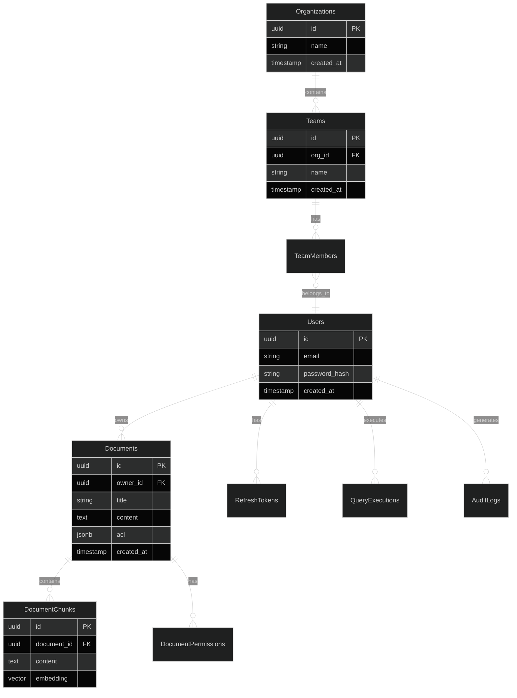

# RAGE Database Schema

**Version**: 2.0  
**Last Updated**: December 3, 2025  

---

## Table of Contents

1. [Overview](#overview)
2. [PostgreSQL Schema](#postgresql-schema)
   - 2.1 [Users & Authentication](#21-users--authentication)
   - 2.2 [Organizations & Teams](#22-organizations--teams)
   - 2.3 [Documents & Sources](#23-documents--sources)
   - 2.4 [Ingestion Pipeline](#24-ingestion-pipeline)
   - 2.5 [Queries & Search](#25-queries--search)
   - 2.6 [System Settings](#26-system-settings)
   - 2.7 [Distributed Network Tables (Layer 10)](#27-distributed-network-tables-layer-10)
3. [Neo4j Graph Schema](#neo4j-graph-schema)
4. [Valkey/Redis Data Structures](#valkeyredis-data-structures)
5. [Data Relationships](#data-relationships)
6. [Indexes & Performance](#indexes--performance)
7. [Migrations](#migrations)

---

## 1. Overview

### 1.1 Database Architecture

RAGE uses a **polyglot persistence** approach with three complementary databases:

| Database | Purpose | Data Types |
|----------|---------|------------|
| **PostgreSQL 16** | Structured metadata, users, audit logs | Relational data, JSONB, full-text search |
| **Neo4j 5.15** | Knowledge graph, concepts, relationships | Graph data, vectors, entities |
| **Valkey 7** | Cache, sessions, pub/sub, queues | Key-value, lists, sets, sorted sets |

### 1.2 Data Flow

```
User Data → PostgreSQL (metadata) + Neo4j (graph)
Documents → PostgreSQL (metadata) + Neo4j (content + vectors)
Queries → PostgreSQL (logs) + Neo4j (concepts) + Valkey (cache)
Sessions → Valkey (temporary)
```

---

## 2. PostgreSQL Schema

### 2.1 Users & Authentication

```sql
-- Users table
CREATE TABLE users (
    id UUID PRIMARY KEY DEFAULT gen_random_uuid(),
    email VARCHAR(255) UNIQUE NOT NULL,
    password_hash VARCHAR(255) NOT NULL,  -- Argon2
    name VARCHAR(255) NOT NULL,
    avatar_url TEXT,
    role VARCHAR(50) NOT NULL DEFAULT 'user',  -- admin, user, viewer
    status VARCHAR(50) NOT NULL DEFAULT 'active',  -- active, suspended, deleted
    email_verified BOOLEAN DEFAULT FALSE,
    mfa_enabled BOOLEAN DEFAULT FALSE,
    mfa_secret VARCHAR(255),
    preferences JSONB DEFAULT '{}',
    metadata JSONB DEFAULT '{}',
    created_at TIMESTAMPTZ NOT NULL DEFAULT NOW(),
    updated_at TIMESTAMPTZ NOT NULL DEFAULT NOW(),
    last_login TIMESTAMPTZ,
    deleted_at TIMESTAMPTZ,
    
    CONSTRAINT valid_role CHECK (role IN ('admin', 'user', 'viewer')),
    CONSTRAINT valid_status CHECK (status IN ('active', 'suspended', 'deleted'))
);

-- Indexes
CREATE INDEX idx_users_email ON users(email) WHERE deleted_at IS NULL;
CREATE INDEX idx_users_role ON users(role);
CREATE INDEX idx_users_status ON users(status);
CREATE INDEX idx_users_created_at ON users(created_at);

-- Updated timestamp trigger
CREATE OR REPLACE FUNCTION update_updated_at_column()
RETURNS TRIGGER AS $$
BEGIN
    NEW.updated_at = NOW();
    RETURN NEW;
END;
$$ language 'plpgsql';

CREATE TRIGGER update_users_updated_at BEFORE UPDATE ON users
    FOR EACH ROW EXECUTE FUNCTION update_updated_at_column();
```

---

```sql
-- Refresh tokens
CREATE TABLE refresh_tokens (
    id UUID PRIMARY KEY DEFAULT gen_random_uuid(),
    user_id UUID NOT NULL REFERENCES users(id) ON DELETE CASCADE,
    token_hash VARCHAR(255) NOT NULL UNIQUE,
    expires_at TIMESTAMPTZ NOT NULL,
    revoked BOOLEAN DEFAULT FALSE,
    revoked_at TIMESTAMPTZ,
    ip_address INET,
    user_agent TEXT,
    created_at TIMESTAMPTZ NOT NULL DEFAULT NOW(),
    
    CONSTRAINT token_not_expired CHECK (expires_at > created_at)
);

CREATE INDEX idx_refresh_tokens_user_id ON refresh_tokens(user_id);
CREATE INDEX idx_refresh_tokens_token_hash ON refresh_tokens(token_hash) WHERE NOT revoked;
CREATE INDEX idx_refresh_tokens_expires_at ON refresh_tokens(expires_at);
```

---

### 2.2 Organizations & Teams

```sql
-- Organizations
CREATE TABLE organizations (
    id UUID PRIMARY KEY DEFAULT gen_random_uuid(),
    name VARCHAR(255) NOT NULL,
    slug VARCHAR(255) UNIQUE NOT NULL,
    description TEXT,
    avatar_url TEXT,
    settings JSONB DEFAULT '{}',
    created_at TIMESTAMPTZ NOT NULL DEFAULT NOW(),
    updated_at TIMESTAMPTZ NOT NULL DEFAULT NOW(),
    deleted_at TIMESTAMPTZ
);

CREATE INDEX idx_organizations_slug ON organizations(slug) WHERE deleted_at IS NULL;
CREATE TRIGGER update_organizations_updated_at BEFORE UPDATE ON organizations
    FOR EACH ROW EXECUTE FUNCTION update_updated_at_column();
```

---

```sql
-- Teams
CREATE TABLE teams (
    id UUID PRIMARY KEY DEFAULT gen_random_uuid(),
    organization_id UUID NOT NULL REFERENCES organizations(id) ON DELETE CASCADE,
    name VARCHAR(255) NOT NULL,
    slug VARCHAR(255) NOT NULL,
    description TEXT,
    avatar_url TEXT,
    settings JSONB DEFAULT '{}',
    created_at TIMESTAMPTZ NOT NULL DEFAULT NOW(),
    updated_at TIMESTAMPTZ NOT NULL DEFAULT NOW(),
    deleted_at TIMESTAMPTZ,
    
    UNIQUE(organization_id, slug)
);

CREATE INDEX idx_teams_organization_id ON teams(organization_id);
CREATE INDEX idx_teams_slug ON teams(slug);
CREATE TRIGGER update_teams_updated_at BEFORE UPDATE ON teams
    FOR EACH ROW EXECUTE FUNCTION update_updated_at_column();
```

---

```sql
-- Team members
CREATE TABLE team_members (
    id UUID PRIMARY KEY DEFAULT gen_random_uuid(),
    team_id UUID NOT NULL REFERENCES teams(id) ON DELETE CASCADE,
    user_id UUID NOT NULL REFERENCES users(id) ON DELETE CASCADE,
    role VARCHAR(50) NOT NULL DEFAULT 'member',  -- owner, admin, member, viewer
    joined_at TIMESTAMPTZ NOT NULL DEFAULT NOW(),
    
    UNIQUE(team_id, user_id),
    CONSTRAINT valid_team_role CHECK (role IN ('owner', 'admin', 'member', 'viewer'))
);

CREATE INDEX idx_team_members_team_id ON team_members(team_id);
CREATE INDEX idx_team_members_user_id ON team_members(user_id);
```

---

### 2.3 Documents

```sql
-- Documents
CREATE TABLE documents (
    id UUID PRIMARY KEY DEFAULT gen_random_uuid(),
    title VARCHAR(500) NOT NULL,
    description TEXT,
    filename VARCHAR(500) NOT NULL,
    file_path TEXT NOT NULL,  -- MinIO/S3 path
    content_hash VARCHAR(64) NOT NULL,  -- SHA-256
    size_bytes BIGINT NOT NULL,
    mime_type VARCHAR(100) NOT NULL,
    language VARCHAR(10),
    
    -- Ownership
    owner_id UUID NOT NULL REFERENCES users(id),
    organization_id UUID REFERENCES organizations(id),
    team_id UUID REFERENCES teams(id),
    
    -- Access control
    is_public BOOLEAN DEFAULT FALSE,
    
    -- Processing status
    status VARCHAR(50) NOT NULL DEFAULT 'pending',  -- pending, processing, completed, failed
    processing_started_at TIMESTAMPTZ,
    processing_completed_at TIMESTAMPTZ,
    processing_error TEXT,
    
    -- Metadata
    metadata JSONB DEFAULT '{}',
    tags TEXT[] DEFAULT '{}',
    
    -- Statistics
    word_count INTEGER,
    page_count INTEGER,
    chunk_count INTEGER DEFAULT 0,
    concept_count INTEGER DEFAULT 0,
    view_count INTEGER DEFAULT 0,
    query_count INTEGER DEFAULT 0,
    citation_count INTEGER DEFAULT 0,
    
    -- Timestamps
    created_at TIMESTAMPTZ NOT NULL DEFAULT NOW(),
    updated_at TIMESTAMPTZ NOT NULL DEFAULT NOW(),
    deleted_at TIMESTAMPTZ,
    
    CONSTRAINT valid_status CHECK (status IN ('pending', 'processing', 'completed', 'failed')),
    CONSTRAINT positive_size CHECK (size_bytes > 0)
);

-- Indexes
CREATE INDEX idx_documents_owner_id ON documents(owner_id);
CREATE INDEX idx_documents_team_id ON documents(team_id);
CREATE INDEX idx_documents_status ON documents(status);
CREATE INDEX idx_documents_content_hash ON documents(content_hash);
CREATE INDEX idx_documents_created_at ON documents(created_at DESC);
CREATE INDEX idx_documents_tags ON documents USING GIN(tags);
CREATE INDEX idx_documents_metadata ON documents USING GIN(metadata);

-- Full-text search
ALTER TABLE documents ADD COLUMN search_vector tsvector;

CREATE INDEX idx_documents_search_vector ON documents USING GIN(search_vector);

CREATE OR REPLACE FUNCTION documents_search_vector_update()
RETURNS TRIGGER AS $$
BEGIN
    NEW.search_vector := 
        setweight(to_tsvector('english', COALESCE(NEW.title, '')), 'A') ||
        setweight(to_tsvector('english', COALESCE(NEW.description, '')), 'B') ||
        setweight(to_tsvector('english', COALESCE(array_to_string(NEW.tags, ' '), '')), 'C');
    RETURN NEW;
END;
$$ LANGUAGE plpgsql;

CREATE TRIGGER documents_search_vector_trigger 
    BEFORE INSERT OR UPDATE ON documents
    FOR EACH ROW EXECUTE FUNCTION documents_search_vector_update();

CREATE TRIGGER update_documents_updated_at BEFORE UPDATE ON documents
    FOR EACH ROW EXECUTE FUNCTION update_updated_at_column();
```

---

```sql
-- Document chunks (for RAG)
CREATE TABLE document_chunks (
    id UUID PRIMARY KEY DEFAULT gen_random_uuid(),
    document_id UUID NOT NULL REFERENCES documents(id) ON DELETE CASCADE,
    chunk_index INTEGER NOT NULL,
    content TEXT NOT NULL,
    content_hash VARCHAR(64) NOT NULL,
    token_count INTEGER NOT NULL,
    
    -- Position in document
    start_page INTEGER,
    end_page INTEGER,
    start_char INTEGER,
    end_char INTEGER,
    
    -- Metadata
    metadata JSONB DEFAULT '{}',
    
    -- Embedding (stored in Neo4j, this is just reference)
    has_embedding BOOLEAN DEFAULT FALSE,
    
    created_at TIMESTAMPTZ NOT NULL DEFAULT NOW(),
    
    UNIQUE(document_id, chunk_index),
    CONSTRAINT positive_token_count CHECK (token_count > 0)
);

CREATE INDEX idx_document_chunks_document_id ON document_chunks(document_id);
CREATE INDEX idx_document_chunks_chunk_index ON document_chunks(chunk_index);
CREATE INDEX idx_document_chunks_content_hash ON document_chunks(content_hash);
```

---

### 2.4 Queries & Executions

```sql
-- Query executions
CREATE TABLE query_executions (
    id UUID PRIMARY KEY DEFAULT gen_random_uuid(),
    user_id UUID NOT NULL REFERENCES users(id),
    
    -- Query details
    query_text TEXT NOT NULL,
    query_hash VARCHAR(64) NOT NULL,
    
    -- Filters
    filters JSONB DEFAULT '{}',
    
    -- LLM configuration
    llm_provider VARCHAR(50) NOT NULL,
    llm_model VARCHAR(100) NOT NULL,
    llm_temperature DECIMAL(3,2),
    
    -- Results
    answer TEXT,
    confidence DECIMAL(4,3),
    citations JSONB DEFAULT '[]',
    follow_up_questions JSONB DEFAULT '[]',
    
    -- Execution metadata
    status VARCHAR(50) NOT NULL DEFAULT 'pending',  -- pending, processing, completed, failed
    error_message TEXT,
    processing_time_ms INTEGER,
    
    -- Token usage
    tokens_input INTEGER,
    tokens_output INTEGER,
    cost_usd DECIMAL(10,6),
    
    -- Agent involvement
    agents_used JSONB DEFAULT '[]',
    
    -- Timestamps
    created_at TIMESTAMPTZ NOT NULL DEFAULT NOW(),
    completed_at TIMESTAMPTZ,
    
    CONSTRAINT valid_status CHECK (status IN ('pending', 'processing', 'completed', 'failed')),
    CONSTRAINT valid_confidence CHECK (confidence IS NULL OR (confidence >= 0 AND confidence <= 1))
);

-- Indexes
CREATE INDEX idx_query_executions_user_id ON query_executions(user_id);
CREATE INDEX idx_query_executions_query_hash ON query_executions(query_hash);
CREATE INDEX idx_query_executions_created_at ON query_executions(created_at DESC);
CREATE INDEX idx_query_executions_status ON query_executions(status);
CREATE INDEX idx_query_executions_llm_provider ON query_executions(llm_provider);
```

---

### 2.5 Access Control Lists (ACL)

```sql
-- Document permissions
CREATE TABLE document_permissions (
    id UUID PRIMARY KEY DEFAULT gen_random_uuid(),
    document_id UUID NOT NULL REFERENCES documents(id) ON DELETE CASCADE,
    
    -- Grant to user or team
    user_id UUID REFERENCES users(id) ON DELETE CASCADE,
    team_id UUID REFERENCES teams(id) ON DELETE CASCADE,
    
    -- Permission level
    permission VARCHAR(50) NOT NULL,  -- read, write, admin
    
    granted_by UUID NOT NULL REFERENCES users(id),
    granted_at TIMESTAMPTZ NOT NULL DEFAULT NOW(),
    expires_at TIMESTAMPTZ,
    
    CONSTRAINT one_grantee CHECK (
        (user_id IS NOT NULL AND team_id IS NULL) OR
        (user_id IS NULL AND team_id IS NOT NULL)
    ),
    CONSTRAINT valid_permission CHECK (permission IN ('read', 'write', 'admin'))
);

CREATE INDEX idx_document_permissions_document_id ON document_permissions(document_id);
CREATE INDEX idx_document_permissions_user_id ON document_permissions(user_id);
CREATE INDEX idx_document_permissions_team_id ON document_permissions(team_id);
CREATE INDEX idx_document_permissions_expires_at ON document_permissions(expires_at);
```

---

### 2.6 Audit Logs

```sql
-- Audit trail
CREATE TABLE audit_logs (
    id UUID PRIMARY KEY DEFAULT gen_random_uuid(),
    user_id UUID REFERENCES users(id) ON DELETE SET NULL,
    
    -- Action details
    action VARCHAR(100) NOT NULL,  -- e.g., "document.upload", "user.login"
    resource_type VARCHAR(50) NOT NULL,
    resource_id UUID,
    
    -- Context
    ip_address INET,
    user_agent TEXT,
    
    -- Changes
    old_values JSONB,
    new_values JSONB,
    
    -- Metadata
    metadata JSONB DEFAULT '{}',
    
    created_at TIMESTAMPTZ NOT NULL DEFAULT NOW()
);

-- Partitioning by month for performance
CREATE TABLE audit_logs_2025_11 PARTITION OF audit_logs
    FOR VALUES FROM ('2025-11-01') TO ('2025-12-01');

CREATE INDEX idx_audit_logs_user_id ON audit_logs(user_id);
CREATE INDEX idx_audit_logs_created_at ON audit_logs(created_at DESC);
CREATE INDEX idx_audit_logs_action ON audit_logs(action);
CREATE INDEX idx_audit_logs_resource ON audit_logs(resource_type, resource_id);
```

---

### 2.7 System Configuration

```sql
-- System settings
CREATE TABLE system_settings (
    key VARCHAR(255) PRIMARY KEY,
    value JSONB NOT NULL,
    description TEXT,
    is_secret BOOLEAN DEFAULT FALSE,
    updated_by UUID REFERENCES users(id),
    updated_at TIMESTAMPTZ NOT NULL DEFAULT NOW()
);

-- Default settings
INSERT INTO system_settings (key, value, description) VALUES
    ('llm.default_provider', '"ollama"', 'Default LLM provider'),
    ('llm.default_model', '"llama3"', 'Default LLM model'),
    ('ingestion.chunk_size', '512', 'Document chunk size in tokens'),
    ('ingestion.chunk_overlap', '50', 'Overlap between chunks'),
    ('search.max_results', '100', 'Maximum search results'),
    ('rate_limit.queries_per_minute', '100', 'Rate limit for queries');
```

### 2.7 Distributed Network Tables (Layer 10)

**Status**: Design Phase (v0.2.0)  
**Documentation**: See `/docs/NETWORK_LAYER.md`, `/docs/FEDERATION_GUIDE.md`

#### Network Nodes Registry

```sql
-- P2P network nodes
CREATE TABLE network_nodes (
    id UUID PRIMARY KEY DEFAULT gen_random_uuid(),
    
    -- Identity
    peer_id VARCHAR(255) NOT NULL UNIQUE,  -- libp2p peer ID (base58)
    organization_id UUID REFERENCES organizations(id),
    node_name VARCHAR(255) NOT NULL,
    
    -- Network addresses
    listen_addresses JSONB NOT NULL DEFAULT '[]'::JSONB,
    -- Example: ["/ip4/10.0.1.5/tcp/4001", "/ip6/::/tcp/4001"]
    
    announce_addresses JSONB NOT NULL DEFAULT '[]'::JSONB,
    -- Public addresses for NAT traversal
    
    -- Capabilities
    capabilities JSONB NOT NULL DEFAULT '[]'::JSONB,
    -- Example: ["storage", "search", "federation", "cdn"]
    
    -- Location
    region VARCHAR(100),  -- us-west-1, eu-central-1, etc.
    datacenter VARCHAR(255),
    
    -- Certificate (for federation)
    certificate_pem TEXT,
    certificate_fingerprint VARCHAR(128),
    certificate_expires_at TIMESTAMPTZ,
    
    -- Status
    status VARCHAR(50) NOT NULL DEFAULT 'offline',
    -- Values: online, offline, unreachable, maintenance
    
    node_role VARCHAR(50) NOT NULL DEFAULT 'peer',
    -- Values: peer, hub, edge, discovery
    
    -- Metadata
    metadata JSONB DEFAULT '{}'::JSONB,
    -- Custom key-value pairs
    
    -- Metrics
    last_seen_at TIMESTAMPTZ,
    uptime_seconds BIGINT DEFAULT 0,
    total_bytes_sent BIGINT DEFAULT 0,
    total_bytes_received BIGINT DEFAULT 0,
    
    -- Timestamps
    registered_at TIMESTAMPTZ NOT NULL DEFAULT NOW(),
    updated_at TIMESTAMPTZ NOT NULL DEFAULT NOW(),
    
    CONSTRAINT check_status CHECK (status IN ('online', 'offline', 'unreachable', 'maintenance')),
    CONSTRAINT check_role CHECK (node_role IN ('peer', 'hub', 'edge', 'discovery'))
);

CREATE INDEX idx_network_nodes_peer_id ON network_nodes(peer_id);
CREATE INDEX idx_network_nodes_organization ON network_nodes(organization_id);
CREATE INDEX idx_network_nodes_status ON network_nodes(status);
CREATE INDEX idx_network_nodes_region ON network_nodes(region);
CREATE INDEX idx_network_nodes_last_seen ON network_nodes(last_seen_at DESC);
```

#### Federation Trust Registry

```sql
-- Trust relationships between RAGE instances
CREATE TABLE federation_trusts (
    id UUID PRIMARY KEY DEFAULT gen_random_uuid(),
    
    -- Identity
    local_org_id UUID NOT NULL REFERENCES organizations(id),
    remote_org_id VARCHAR(255) NOT NULL,  -- External org identifier
    remote_node_id UUID REFERENCES network_nodes(id),
    remote_rage_url TEXT NOT NULL,
    
    -- Certificate-based trust
    certificate_pem TEXT NOT NULL,
    certificate_fingerprint VARCHAR(128) NOT NULL,
    certificate_valid_until TIMESTAMPTZ NOT NULL,
    
    -- Capabilities allowed for this trust
    capabilities JSONB NOT NULL DEFAULT '[]'::JSONB,
    -- Example: ["query", "replicate", "share_users"]
    
    -- Data sharing policy
    sharing_policy_id UUID REFERENCES data_sharing_policies(id),
    
    -- Trust metadata
    trust_model VARCHAR(50) NOT NULL DEFAULT 'explicit',
    -- Values: explicit, pki, web_of_trust
    
    status VARCHAR(50) NOT NULL DEFAULT 'pending',
    -- Values: pending, active, suspended, revoked
    
    -- Audit trail
    trusted_since TIMESTAMPTZ,
    trusted_by UUID REFERENCES users(id),
    trust_notes TEXT,
    
    -- Connection tracking
    last_verified_at TIMESTAMPTZ,
    last_connected_at TIMESTAMPTZ,
    connection_failures INT DEFAULT 0,
    
    -- Timestamps
    created_at TIMESTAMPTZ NOT NULL DEFAULT NOW(),
    updated_at TIMESTAMPTZ NOT NULL DEFAULT NOW(),
    
    UNIQUE(local_org_id, remote_org_id),
    CONSTRAINT check_trust_status CHECK (status IN ('pending', 'active', 'suspended', 'revoked'))
);

CREATE INDEX idx_federation_trusts_local_org ON federation_trusts(local_org_id);
CREATE INDEX idx_federation_trusts_remote_org ON federation_trusts(remote_org_id);
CREATE INDEX idx_federation_trusts_status ON federation_trusts(status);
CREATE INDEX idx_federation_trusts_verified ON federation_trusts(last_verified_at DESC);

-- Data sharing policies for federation
CREATE TABLE data_sharing_policies (
    id UUID PRIMARY KEY DEFAULT gen_random_uuid(),
    
    name VARCHAR(255) NOT NULL,
    description TEXT,
    organization_id UUID REFERENCES organizations(id),
    
    -- Inclusion/exclusion rules
    rules JSONB NOT NULL,
    /* Example:
    {
      "include": [
        {"source": "confluence", "space": "PUBLIC"},
        {"tags": ["public", "partner-shared"]}
      ],
      "exclude": [
        {"tags": ["confidential", "internal-only"]},
        {"metadata.classification": "secret"}
      ]
    }
    */
    
    -- Approval workflow
    requires_approval BOOLEAN NOT NULL DEFAULT true,
    auto_share BOOLEAN NOT NULL DEFAULT false,
    
    -- Redaction rules (for sensitive data)
    redaction_rules JSONB,
    /* Example:
    [
      {"pattern": "\\b\\d{3}-\\d{2}-\\d{4}\\b", "replacement": "[SSN REDACTED]"},
      {"field": "salary", "action": "remove"}
    ]
    */
    
    -- Metadata
    created_by UUID REFERENCES users(id),
    created_at TIMESTAMPTZ NOT NULL DEFAULT NOW(),
    updated_at TIMESTAMPTZ NOT NULL DEFAULT NOW()
);

CREATE INDEX idx_data_sharing_policies_org ON data_sharing_policies(organization_id);
```

#### Replication Status

```sql
-- Content replication tracking
CREATE TABLE replication_status (
    id UUID PRIMARY KEY DEFAULT gen_random_uuid(),
    
    -- Content identification
    chunk_id VARCHAR(255) NOT NULL,  -- Content-addressed hash (IPFS CID)
    document_id UUID REFERENCES documents(id),
    
    -- Replication policy
    target_replication_factor INT NOT NULL DEFAULT 3,
    current_replication_factor INT NOT NULL DEFAULT 0,
    
    -- Replica locations
    replica_nodes JSONB NOT NULL DEFAULT '[]'::JSONB,
    /* Example:
    [
      {
        "peer_id": "12D3KooWA8...",
        "node_name": "rage-us-west-1",
        "region": "us-west-1",
        "replicated_at": "2025-12-03T10:00:00Z",
        "verified_at": "2025-12-03T10:05:00Z"
      }
    ]
    */
    
    -- Status
    replication_status VARCHAR(50) NOT NULL DEFAULT 'pending',
    -- Values: pending, in_progress, complete, under_replicated, over_replicated
    
    -- Metrics
    total_size_bytes BIGINT NOT NULL,
    replication_started_at TIMESTAMPTZ,
    replication_completed_at TIMESTAMPTZ,
    
    -- Timestamps
    created_at TIMESTAMPTZ NOT NULL DEFAULT NOW(),
    updated_at TIMESTAMPTZ NOT NULL DEFAULT NOW(),
    
    CONSTRAINT check_replication_status CHECK (replication_status IN 
        ('pending', 'in_progress', 'complete', 'under_replicated', 'over_replicated'))
);

CREATE INDEX idx_replication_status_chunk ON replication_status(chunk_id);
CREATE INDEX idx_replication_status_document ON replication_status(document_id);
CREATE INDEX idx_replication_status_status ON replication_status(replication_status);
CREATE INDEX idx_replication_status_factor ON replication_status(current_replication_factor);
```

#### CDN Cache Management

```sql
-- CDN provider configuration
CREATE TABLE cdn_providers (
    id UUID PRIMARY KEY DEFAULT gen_random_uuid(),
    
    name VARCHAR(255) NOT NULL,
    provider_type VARCHAR(50) NOT NULL,
    -- Values: cloudflare, fastly, cloudfront, azure_cdn, varnish, nginx
    
    provider_category VARCHAR(50) NOT NULL,
    -- Values: commercial, self-hosted
    
    -- Configuration
    config JSONB NOT NULL,
    /* Provider-specific config stored as JSON */
    
    -- Routing
    enabled BOOLEAN NOT NULL DEFAULT true,
    priority INT NOT NULL DEFAULT 100,
    
    routing_rules JSONB,
    /* Example:
    {
      "regions": ["americas", "europe"],
      "countries": ["US", "CA", "MX"],
      "ip_ranges": ["10.0.0.0/8"]
    }
    */
    
    -- Metrics
    total_requests BIGINT DEFAULT 0,
    cache_hits BIGINT DEFAULT 0,
    cache_misses BIGINT DEFAULT 0,
    total_bandwidth_bytes BIGINT DEFAULT 0,
    
    -- Status
    status VARCHAR(50) NOT NULL DEFAULT 'active',
    -- Values: active, inactive, degraded, down
    
    last_health_check_at TIMESTAMPTZ,
    
    -- Timestamps
    created_at TIMESTAMPTZ NOT NULL DEFAULT NOW(),
    updated_at TIMESTAMPTZ NOT NULL DEFAULT NOW(),
    
    CONSTRAINT check_cdn_provider_type CHECK (provider_type IN 
        ('cloudflare', 'fastly', 'cloudfront', 'azure_cdn', 'varnish', 'nginx')),
    CONSTRAINT check_cdn_category CHECK (provider_category IN ('commercial', 'self-hosted')),
    CONSTRAINT check_cdn_status CHECK (status IN ('active', 'inactive', 'degraded', 'down'))
);

CREATE INDEX idx_cdn_providers_enabled ON cdn_providers(enabled);
CREATE INDEX idx_cdn_providers_priority ON cdn_providers(priority);

-- CDN cache invalidation tracking
CREATE TABLE cdn_cache_invalidations (
    id UUID PRIMARY KEY DEFAULT gen_random_uuid(),
    
    provider_id UUID REFERENCES cdn_providers(id),
    
    -- Invalidation request
    invalidation_type VARCHAR(50) NOT NULL,
    -- Values: keys, prefixes, tags, all
    
    keys JSONB,
    -- Specific cache keys to purge
    
    prefixes JSONB,
    -- URL prefixes to purge
    
    tags JSONB,
    -- Cache tags to purge
    
    -- Status
    status VARCHAR(50) NOT NULL DEFAULT 'pending',
    -- Values: pending, in_progress, completed, failed
    
    error_message TEXT,
    
    -- Timestamps
    requested_at TIMESTAMPTZ NOT NULL DEFAULT NOW(),
    started_at TIMESTAMPTZ,
    completed_at TIMESTAMPTZ,
    
    -- Audit
    requested_by UUID REFERENCES users(id),
    
    CONSTRAINT check_invalidation_type CHECK (invalidation_type IN 
        ('keys', 'prefixes', 'tags', 'all')),
    CONSTRAINT check_invalidation_status CHECK (status IN 
        ('pending', 'in_progress', 'completed', 'failed'))
);

CREATE INDEX idx_cdn_invalidations_provider ON cdn_cache_invalidations(provider_id);
CREATE INDEX idx_cdn_invalidations_status ON cdn_cache_invalidations(status);
CREATE INDEX idx_cdn_invalidations_requested ON cdn_cache_invalidations(requested_at DESC);
```

#### Federated User Mapping

```sql
-- External user identity mapping
CREATE TABLE federated_user_mappings (
    id UUID PRIMARY KEY DEFAULT gen_random_uuid(),
    
    -- External identity (from federated org)
    external_org_id VARCHAR(255) NOT NULL,
    external_user_id VARCHAR(255) NOT NULL,
    external_email VARCHAR(255) NOT NULL,
    external_username VARCHAR(255),
    
    -- Local identity (shadow user or mapped user)
    local_user_id UUID REFERENCES users(id),
    
    -- Mapping metadata
    mapping_type VARCHAR(50) NOT NULL,
    -- Values: automatic, manual, saml, oauth, certificate
    
    verified BOOLEAN NOT NULL DEFAULT false,
    verified_at TIMESTAMPTZ,
    verified_by UUID REFERENCES users(id),
    
    -- Capabilities for federated user
    capabilities JSONB NOT NULL DEFAULT '[]'::JSONB,
    -- Example: ["federated_query", "read_public"]
    
    -- Expiration
    expires_at TIMESTAMPTZ,
    
    -- Timestamps
    created_at TIMESTAMPTZ NOT NULL DEFAULT NOW(),
    updated_at TIMESTAMPTZ NOT NULL DEFAULT NOW(),
    
    UNIQUE(external_org_id, external_user_id),
    CONSTRAINT check_mapping_type CHECK (mapping_type IN 
        ('automatic', 'manual', 'saml', 'oauth', 'certificate'))
);

CREATE INDEX idx_federated_mappings_external_org ON federated_user_mappings(external_org_id);
CREATE INDEX idx_federated_mappings_external_user ON federated_user_mappings(external_user_id);
CREATE INDEX idx_federated_mappings_local_user ON federated_user_mappings(local_user_id);
CREATE INDEX idx_federated_mappings_verified ON federated_user_mappings(verified);
```

#### Federation Audit Logs

```sql
-- Federated activity audit trail
CREATE TABLE federation_audit_logs (
    id UUID PRIMARY KEY DEFAULT gen_random_uuid(),
    
    event_type VARCHAR(100) NOT NULL,
    -- trust_established, trust_revoked, query_executed, data_shared, acl_denial, etc.
    
    local_org_id UUID REFERENCES organizations(id),
    remote_org_id VARCHAR(255),
    
    user_id UUID REFERENCES users(id),
    external_user_id VARCHAR(255),
    
    resource_type VARCHAR(100),
    resource_id VARCHAR(255),
    
    event_data JSONB,
    -- Event-specific details
    
    result VARCHAR(50) NOT NULL,
    -- Values: success, denied, error
    
    denial_reason VARCHAR(255),
    error_message TEXT,
    
    -- Request metadata
    ip_address INET,
    user_agent TEXT,
    
    timestamp TIMESTAMPTZ NOT NULL DEFAULT NOW(),
    
    -- Immutable audit trail (hash chain)
    previous_log_hash VARCHAR(128),
    log_hash VARCHAR(128) NOT NULL,
    
    CONSTRAINT check_federation_result CHECK (result IN ('success', 'denied', 'error'))
);

CREATE INDEX idx_federation_audit_type ON federation_audit_logs(event_type);
CREATE INDEX idx_federation_audit_local_org ON federation_audit_logs(local_org_id);
CREATE INDEX idx_federation_audit_remote_org ON federation_audit_logs(remote_org_id);
CREATE INDEX idx_federation_audit_timestamp ON federation_audit_logs(timestamp DESC);
CREATE INDEX idx_federation_audit_result ON federation_audit_logs(result);

-- Partition by month for performance
CREATE TABLE federation_audit_logs_2025_12 PARTITION OF federation_audit_logs
    FOR VALUES FROM ('2025-12-01') TO ('2026-01-01');
```

---

## 3. Neo4j Graph Schema

### 3.1 Node Labels

```cypher
// User nodes (synced from PostgreSQL)
(:User {
  id: String,          // UUID from PostgreSQL
  email: String,
  name: String,
  created_at: DateTime
})

// Document nodes
(:Document {
  id: String,          // UUID from PostgreSQL
  title: String,
  description: String,
  content_hash: String,
  word_count: Integer,
  chunk_count: Integer,
  created_at: DateTime,
  
  // Vector embedding (document-level)
  embedding: List<Float>  // 768-dimensional
})

// Document chunks with embeddings
(:Chunk {
  id: String,          // UUID
  document_id: String,
  chunk_index: Integer,
  content: String,
  token_count: Integer,
  
  // Vector embedding
  embedding: List<Float>  // 768-dimensional
})

// Concepts extracted from documents
(:Concept {
  id: String,
  name: String,        // Canonical name
  aliases: List<String>,
  type: String,        // topic, skill, technology, methodology
  description: String,
  importance: Float,   // PageRank score
  frequency: Integer,  // How often mentioned
  created_at: DateTime,
  updated_at: DateTime
})

// Named entities
(:Entity {
  id: String,
  name: String,
  type: String,        // person, organization, technology, location
  description: String,
  metadata: Map
})

// Query executions (for learning)
(:Query {
  id: String,          // UUID from PostgreSQL
  text: String,
  user_id: String,
  confidence: Float,
  created_at: DateTime
})

// Teams
(:Team {
  id: String,
  name: String,
  organization_id: String
})

// Organizations
(:Organization {
  id: String,
  name: String
})
```

---

### 3.2 Relationships

```cypher
// Document relationships
(:Document)-[:CONTAINS]->(:Chunk)
(:Document)-[:MENTIONS {frequency: Integer, importance: Float}]->(:Concept)
(:Document)-[:REFERENCES {context: String}]->(:Entity)
(:Document)-[:OWNED_BY]->(:User)
(:Document)-[:BELONGS_TO]->(:Team)

// Concept relationships
(:Concept)-[:RELATED_TO {strength: Float, type: String}]->(:Concept)
(:Concept)-[:IS_A]->(:Concept)  // Hierarchy
(:Concept)-[:PART_OF]->(:Concept)
(:Concept)-[:DEPENDS_ON]->(:Concept)

// Entity relationships
(:Entity)-[:WORKS_AT]->(:Entity)
(:Entity)-[:CREATED]->(:Entity)
(:Entity)-[:USES]->(:Concept)

// Query relationships
(:Query)-[:ASKED_ABOUT]->(:Concept)
(:Query)-[:ANSWERED_BY]->(:Document)
(:Query)-[:CITED]->(:Chunk)
(:Query)-[:SUBMITTED_BY]->(:User)

// User relationships
(:User)-[:MEMBER_OF {role: String}]->(:Team)
(:User)-[:BELONGS_TO]->(:Organization)

// Access control (duplicated from PostgreSQL for graph queries)
(:User)-[:CAN_ACCESS {permission: String}]->(:Document)
(:Team)-[:CAN_ACCESS {permission: String}]->(:Document)
```

---

### 3.3 Vector Indexes

```cypher
// Create vector index for document embeddings
CREATE VECTOR INDEX document_embeddings IF NOT EXISTS
FOR (d:Document)
ON d.embedding
OPTIONS {
  indexConfig: {
    `vector.dimensions`: 768,
    `vector.similarity_function`: 'cosine'
  }
};

// Create vector index for chunk embeddings
CREATE VECTOR INDEX chunk_embeddings IF NOT EXISTS
FOR (c:Chunk)
ON c.embedding
OPTIONS {
  indexConfig: {
    `vector.dimensions`: 768,
    `vector.similarity_function`: 'cosine'
  }
};
```

---

### 3.4 Property Indexes

```cypher
// Unique constraints
CREATE CONSTRAINT user_id_unique IF NOT EXISTS
FOR (u:User) REQUIRE u.id IS UNIQUE;

CREATE CONSTRAINT document_id_unique IF NOT EXISTS
FOR (d:Document) REQUIRE d.id IS UNIQUE;

CREATE CONSTRAINT chunk_id_unique IF NOT EXISTS
FOR (c:Chunk) REQUIRE c.id IS UNIQUE;

CREATE CONSTRAINT concept_name_unique IF NOT EXISTS
FOR (c:Concept) REQUIRE c.name IS UNIQUE;

// Indexes for lookups
CREATE INDEX concept_type_idx IF NOT EXISTS
FOR (c:Concept) ON (c.type);

CREATE INDEX concept_importance_idx IF NOT EXISTS
FOR (c:Concept) ON (c.importance);

CREATE INDEX entity_type_idx IF NOT EXISTS
FOR (e:Entity) ON (e.type);

CREATE INDEX document_created_at_idx IF NOT EXISTS
FOR (d:Document) ON (d.created_at);

// Full-text search indexes
CREATE FULLTEXT INDEX concept_search IF NOT EXISTS
FOR (c:Concept) ON EACH [c.name, c.description, c.aliases];

CREATE FULLTEXT INDEX entity_search IF NOT EXISTS
FOR (e:Entity) ON EACH [e.name, e.description];

CREATE FULLTEXT INDEX chunk_content_search IF NOT EXISTS
FOR (c:Chunk) ON EACH [c.content];
```

---

### 3.5 Example Queries

**Vector Similarity Search**:
```cypher
// Find similar chunks by vector
CALL db.index.vector.queryNodes(
  'chunk_embeddings',
  10,  // topK
  $query_embedding
)
YIELD node, score
MATCH (node:Chunk)-[:CONTAINS]-(doc:Document)
RETURN doc.title, node.content, score
ORDER BY score DESC;
```

**Concept-Based Retrieval**:
```cypher
// Find documents related to concepts
MATCH (c:Concept)
WHERE c.name IN $concept_names
MATCH (c)<-[m:MENTIONS]-(d:Document)
WITH d, sum(m.importance) as relevance
ORDER BY relevance DESC
LIMIT 10
RETURN d.id, d.title, relevance;
```

**Knowledge Graph Traversal**:
```cypher
// Explore concept relationships
MATCH path = (start:Concept {name: $concept_name})
  -[:RELATED_TO|IS_A|PART_OF*1..3]-
  (related:Concept)
RETURN path
ORDER BY length(path)
LIMIT 20;
```

**Access Control Check**:
```cypher
// Check if user can access document
MATCH (u:User {id: $user_id})
MATCH (d:Document {id: $document_id})

// Direct user permission
OPTIONAL MATCH (u)-[r1:CAN_ACCESS]->(d)

// Team permission
OPTIONAL MATCH (u)-[:MEMBER_OF]->(t:Team)-[r2:CAN_ACCESS]->(d)

// Document owner
OPTIONAL MATCH (d)-[:OWNED_BY]->(u)

// Public document
WITH d, u,
     COALESCE(r1.permission, r2.permission, 
              CASE WHEN d.is_public THEN 'read' ELSE null END) as permission
RETURN permission IS NOT NULL as can_access, permission;
```

---

## 4. Valkey/Redis Data Structures

### 4.1 Sessions

```
# Session data (hash)
Key: session:{session_id}
TTL: 7 days
Fields:
  user_id: UUID
  email: string
  name: string
  role: string
  created_at: timestamp
  last_activity: timestamp
  ip_address: string
  user_agent: string

# User's active sessions (set)
Key: user_sessions:{user_id}
Members: session_id1, session_id2, ...
```

---

### 4.2 Cache

```
# Query result cache (string, JSON)
Key: query_cache:{query_hash}
TTL: 1 hour
Value: JSON-encoded query result

# Document metadata cache (hash)
Key: document:{document_id}
TTL: 5 minutes
Fields: title, description, status, owner_id, ...

# LLM response cache
Key: llm_cache:{provider}:{model}:{prompt_hash}
TTL: 24 hours
Value: JSON-encoded LLM response
```

---

### 4.3 Rate Limiting

```
# Rate limit counter (string)
Key: rate_limit:{user_id}:{endpoint}:{window}
TTL: window duration (e.g., 60 seconds)
Value: request count

# Example
Key: rate_limit:usr_123:query:2025-11-24T10:30
Value: 15
TTL: 60 seconds
```

---

### 4.4 Task Queues

```
# Ingestion queue (list)
Key: queue:ingestion
Operations: LPUSH (enqueue), BRPOP (dequeue)
Value: JSON task descriptor
  {
    "task_id": "uuid",
    "document_id": "uuid",
    "priority": "high|normal|low",
    "created_at": "timestamp"
  }

# Processing status (hash)
Key: task:{task_id}
Fields:
  status: pending|processing|completed|failed
  progress: 0-100
  message: status message
  started_at: timestamp
  completed_at: timestamp
  error: error message (if failed)
```

---

### 4.5 Pub/Sub Channels

```
# Real-time notifications
Channel: notifications:{user_id}
Message: JSON event
  {
    "type": "document.processed",
    "document_id": "uuid",
    "status": "completed"
  }

# Query progress updates
Channel: query_progress:{execution_id}
Message: JSON progress update
  {
    "agent": "document_retriever",
    "progress": 50,
    "message": "Retrieving documents..."
  }

# System alerts
Channel: system_alerts
Message: JSON alert
  {
    "severity": "warning|error|critical",
    "message": "High memory usage",
    "timestamp": "2025-11-24T10:30:00Z"
  }
```

---

### 4.6 Leaderboards & Analytics

```
# Most queried concepts (sorted set)
Key: leaderboard:concepts:queries
Score: query count
Member: concept_id

# Most cited documents (sorted set)
Key: leaderboard:documents:citations
Score: citation count
Member: document_id

# User query statistics (sorted set)
Key: leaderboard:users:queries:{period}
Score: query count
Member: user_id
```

---

## 5. Data Relationships

### 5.1 Entity Relationship Diagram (PostgreSQL)



---

### 5.2 Graph Relationships (Neo4j)

```
(User)-[:MEMBER_OF]->(Team)-[:BELONGS_TO]->(Organization)
(User)-[:OWNS]->(Document)-[:CONTAINS]->(Chunk)
(Document)-[:MENTIONS]->(Concept)-[:RELATED_TO]->(Concept)
(Document)-[:REFERENCES]->(Entity)-[:WORKS_AT]->(Entity)
(Query)-[:ASKED_ABOUT]->(Concept)
(Query)-[:ANSWERED_BY]->(Document)
(Query)-[:CITED]->(Chunk)
```

---

## 6. Indexes & Performance

### 6.1 PostgreSQL Index Strategy

```sql
-- B-tree indexes for equality and range queries
CREATE INDEX idx_documents_created_at ON documents(created_at DESC);
CREATE INDEX idx_users_email ON users(email);

-- GIN indexes for arrays and JSONB
CREATE INDEX idx_documents_tags ON documents USING GIN(tags);
CREATE INDEX idx_documents_metadata ON documents USING GIN(metadata);

-- GiST index for full-text search
CREATE INDEX idx_documents_search_vector ON documents USING GIN(search_vector);

-- Partial indexes for common filters
CREATE INDEX idx_active_users ON users(email) WHERE deleted_at IS NULL;
CREATE INDEX idx_completed_documents ON documents(id) WHERE status = 'completed';

-- Covering indexes for common queries
CREATE INDEX idx_documents_list_covering ON documents(created_at DESC)
  INCLUDE (id, title, status, owner_id);
```

---

### 6.2 Neo4j Index Strategy

```cypher
// Vector indexes for similarity search
CREATE VECTOR INDEX document_embeddings FOR (d:Document) ON d.embedding;
CREATE VECTOR INDEX chunk_embeddings FOR (c:Chunk) ON c.embedding;

// Full-text search indexes
CREATE FULLTEXT INDEX concept_search FOR (c:Concept) ON EACH [c.name, c.description];

// Property indexes for lookups
CREATE INDEX concept_importance_idx FOR (c:Concept) ON (c.importance);
CREATE INDEX document_created_at_idx FOR (d:Document) ON (d.created_at);

// Composite indexes for common queries
CREATE INDEX document_status_created FOR (d:Document) ON (d.status, d.created_at);
```

---

### 6.3 Query Performance Optimization

**PostgreSQL**:
```sql
-- Use EXPLAIN ANALYZE for query planning
EXPLAIN ANALYZE
SELECT * FROM documents
WHERE status = 'completed'
  AND search_vector @@ plainto_tsquery('english', 'authentication')
ORDER BY created_at DESC
LIMIT 10;

-- Materialized views for expensive aggregations
CREATE MATERIALIZED VIEW document_statistics AS
SELECT 
  d.id,
  d.title,
  COUNT(DISTINCT c.id) as chunk_count,
  COUNT(DISTINCT qe.id) as query_count,
  AVG(qe.confidence) as avg_confidence
FROM documents d
LEFT JOIN document_chunks c ON d.id = c.document_id
LEFT JOIN query_executions qe ON qe.citations::jsonb @> jsonb_build_array(jsonb_build_object('document_id', d.id))
WHERE d.deleted_at IS NULL
GROUP BY d.id, d.title;

CREATE UNIQUE INDEX ON document_statistics(id);
```

**Neo4j**:
```cypher
// Use PROFILE to analyze query performance
PROFILE
MATCH (c:Concept)<-[:MENTIONS]-(d:Document)
WHERE c.name IN $concepts
RETURN d.title, count(*) as mentions
ORDER BY mentions DESC
LIMIT 10;

// Pre-compute PageRank for concept importance
CALL gds.pageRank.write({
  nodeProjection: 'Concept',
  relationshipProjection: 'RELATED_TO',
  writeProperty: 'importance'
});
```

---

## 7. Migrations

### 7.1 PostgreSQL Migrations (Alembic)

```python
# alembic/versions/001_initial_schema.py
"""Initial schema

Revision ID: 001
Create Date: 2025-11-24 10:00:00
"""

from alembic import op
import sqlalchemy as sa
from sqlalchemy.dialects import postgresql

revision = '001'
down_revision = None
branch_labels = None
depends_on = None

def upgrade():
    # Users table
    op.create_table(
        'users',
        sa.Column('id', postgresql.UUID(as_uuid=True), primary_key=True),
        sa.Column('email', sa.String(255), nullable=False, unique=True),
        sa.Column('password_hash', sa.String(255), nullable=False),
        sa.Column('name', sa.String(255), nullable=False),
        sa.Column('role', sa.String(50), nullable=False, server_default='user'),
        sa.Column('created_at', sa.TIMESTAMP(timezone=True), server_default=sa.func.now()),
        sa.Column('updated_at', sa.TIMESTAMP(timezone=True), server_default=sa.func.now()),
    )
    
    op.create_index('idx_users_email', 'users', ['email'])
    
    # ... more tables

def downgrade():
    op.drop_table('users')
```

---

### 7.2 Neo4j Migrations

```cypher
// migrations/001_initial_schema.cypher

// Create constraints
CREATE CONSTRAINT user_id_unique IF NOT EXISTS
FOR (u:User) REQUIRE u.id IS UNIQUE;

CREATE CONSTRAINT document_id_unique IF NOT EXISTS
FOR (d:Document) REQUIRE d.id IS UNIQUE;

// Create indexes
CREATE INDEX concept_type_idx IF NOT EXISTS
FOR (c:Concept) ON (c.type);

// Create vector indexes
CREATE VECTOR INDEX document_embeddings IF NOT EXISTS
FOR (d:Document) ON d.embedding
OPTIONS {
  indexConfig: {
    `vector.dimensions`: 768,
    `vector.similarity_function`: 'cosine'
  }
};
```

---

## Summary

This database schema provides:

- **PostgreSQL**: Structured metadata, users, teams, documents, queries, audit logs
- **Neo4j**: Knowledge graph with concepts, entities, relationships, and vector embeddings
- **Valkey**: Session management, caching, task queues, pub/sub
- **Optimized Indexes**: B-tree, GIN, GiST (PostgreSQL), Vector, Full-text (Neo4j)
- **Access Control**: Row-level security and graph-based permissions
- **Audit Trail**: Complete change history
- **Performance**: Materialized views, covering indexes, query optimization

**Key Design Decisions**:
1. **Polyglot Persistence**: Right database for right data type
2. **Dual Storage**: Metadata in PostgreSQL, graph in Neo4j
3. **Vector Search**: Native vector indexes in Neo4j
4. **Caching Strategy**: Multi-level caching with Valkey
5. **Soft Deletes**: `deleted_at` timestamp for recovery
6. **Audit Everything**: Complete audit trail for compliance
