# RAGE Deployment Guide

**Version**: 2.0  
**Last Updated**: December 3, 2025  
**Container Runtime**: Podman (primary), Docker (fallback)

---

## Table of Contents

1. [Overview](#overview)
2. [Prerequisites](#prerequisites)
3. [Development Deployment](#development-deployment)
4. [Production Deployment](#production-deployment)
5. [Container Configuration](#container-configuration)
6. [Monitoring Setup](#monitoring-setup)
7. [Backup & Recovery](#backup--recovery)
8. [Troubleshooting](#troubleshooting)

---

## 1. Overview

### 1.1 Deployment Architecture

RAGE is deployed as a collection of containers orchestrated with Podman Compose (or Docker Compose as fallback):

```mermaid
%%{init: {'theme':'dark', 'flowchart': {'nodeSpacing': 30, 'rankSpacing': 40, 'curve': 'basis'}}}%%
graph TB
    %% Title: RAGE Container Architecture - Podman Pod
    subgraph Host["Host Machine - Pod: rage-stack"]
        subgraph App["Application Tier"]
            FE["🌐 Frontend<br/>(Nginx)"]
            BE["⚡ Backend<br/>(FastAPI)"]
            AG["🤖 Agents<br/>(Python)"]
        end
        
        subgraph Data["Data Tier"]
            PG["🗄️ PostgreSQL<br/>16"]
            NEO["🕸️ Neo4j<br/>5.15"]
            VAL["💾 Valkey<br/>7"]
        end
        
        subgraph Services["Service Tier"]
            OLL["🦙 Ollama<br/>(LLM)"]
            NET["📊 Netdata<br/>(Monitor)"]
            MIN["📦 MinIO<br/>(Storage)"]
        end
    end
    
    classDef app fill:#0d47a1,stroke:#64b5f6,stroke-width:2px;
    classDef data fill:#6a1b9a,stroke:#ce93d8,stroke-width:2px;
    classDef service fill:#1b5e20,stroke:#81c784,stroke-width:2px;
    
    class FE,BE,AG app;
    class PG,NEO,VAL data;
    class OLL,NET,MIN service;
    linkStyle default stroke:#64b5f6,stroke-width:2px;
```



### 1.2 Deployment Options

| Option            | Use Case                      | Complexity | Cost   |
| ----------------- | ----------------------------- | ---------- | ------ |
| **Single Server** | Development, small teams      | Low        | Low    |
| **Multi-Server**  | Production, high availability | Medium     | Medium |
| **Kubernetes**    | Large scale, enterprise       | High       | High   |

---

## 2. Prerequisites

### 2.1 Hardware Requirements

**Minimum (Development)**:

```yaml
CPU: 8 cores
RAM: 16 GB
Disk: 100 GB SSD
Network: 100 Mbps
```

**Recommended (Production)**:

```yaml
CPU: 16+ cores
RAM: 64 GB
Disk: 1 TB NVMe SSD
Network: 1 Gbps
GPU: Optional (8GB+ VRAM for local LLMs)
```

### 2.2 Software Requirements

**Required**:

```bash
# Podman (primary)
podman --version  # >= 4.0

# OR Docker (fallback)
docker --version  # >= 24.0

# Podman Compose (if using Podman)
podman-compose --version  # >= 1.0

# Git
git --version  # >= 2.30

# Python (for tools)
python3 --version  # >= 3.11
```

**Optional**:

```bash
# Make (for automation)
make --version

# jq (for JSON processing)
jq --version
```

### 2.3 Install Podman (Recommended)

**macOS**:

```bash
brew install podman podman-compose

# Initialize Podman machine
podman machine init --cpus 8 --memory 16384 --disk-size 100
podman machine start
```

**Linux (Ubuntu/Debian)**:

```bash
sudo apt-get update
sudo apt-get install -y podman podman-compose

# Enable rootless mode
sudo loginctl enable-linger $USER
```

**Linux (RHEL/Fedora)**:

```bash
sudo dnf install -y podman podman-compose
```

### 2.4 Install Docker (Fallback)

**macOS**:

```bash
brew install --cask docker
```

**Linux**:

```bash
curl -fsSL https://get.docker.com -o get-docker.sh
sudo sh get-docker.sh
sudo usermod -aG docker $USER
```

---

## 3. Development Deployment

### 3.1 Quick Start

```bash
# Clone repository
git clone https://github.com/your-org/rage.git
cd rage

# Copy environment template
cp .env.example .env

# Edit configuration
nano .env

# Start all services (Podman)
podman-compose up -d

# OR with Docker
docker-compose up -d

# Check status
podman-compose ps

# View logs
podman-compose logs -f

# Access the application
open http://localhost:3000
```

### 3.2 Environment Configuration

```bash
# .env file
# ==========

# Application
APP_ENV=development
APP_DEBUG=true
APP_SECRET_KEY=change-this-in-production

# Database - PostgreSQL
POSTGRES_HOST=postgres
POSTGRES_PORT=5432
POSTGRES_DB=rage
POSTGRES_USER=rage
POSTGRES_PASSWORD=change-this-password

# Database - Neo4j
NEO4J_HOST=neo4j
NEO4J_PORT=7687
NEO4J_USER=neo4j
NEO4J_PASSWORD=change-this-password
NEO4J_AUTH=neo4j/change-this-password

# Cache - Valkey
VALKEY_HOST=valkey
VALKEY_PORT=6379
VALKEY_PASSWORD=change-this-password

# Storage - MinIO
MINIO_ROOT_USER=minioadmin
MINIO_ROOT_PASSWORD=change-this-password
MINIO_ENDPOINT=minio:9000
MINIO_BUCKET=rage-documents

# LLM - Ollama
OLLAMA_HOST=http://ollama:11434
OLLAMA_DEFAULT_MODEL=llama3

# LLM - OpenAI (optional)
OPENAI_API_KEY=sk-...
OPENAI_ORG_ID=org-...

# LLM - Anthropic (optional)
ANTHROPIC_API_KEY=sk-ant-...

# Frontend
NEXT_PUBLIC_API_URL=http://localhost:8000
NEXT_PUBLIC_WS_URL=ws://localhost:8000

# Monitoring
NETDATA_CLAIM_TOKEN=your-claim-token
NETDATA_CLAIM_ROOMS=your-room-id

# Security
JWT_SECRET=change-this-secret-key
JWT_ALGORITHM=HS256
JWT_ACCESS_TOKEN_EXPIRE_MINUTES=60
JWT_REFRESH_TOKEN_EXPIRE_DAYS=7

# CORS
CORS_ORIGINS=http://localhost:3000,http://localhost:8000

# Rate Limiting
RATE_LIMIT_ENABLED=true
RATE_LIMIT_PER_MINUTE=100
```

### 3.3 Podman Compose File

```yaml
# podman-compose.yml
version: '3.8'

services:
  # PostgreSQL Database
  postgres:
    image: docker.io/library/postgres:16-alpine
    container_name: rage-postgres
    environment:
      POSTGRES_DB: ${POSTGRES_DB}
      POSTGRES_USER: ${POSTGRES_USER}
      POSTGRES_PASSWORD: ${POSTGRES_PASSWORD}
      POSTGRES_INITDB_ARGS: "-E UTF8 --locale=en_US.UTF-8"
    volumes:
      - postgres_data:/var/lib/postgresql/data
      - ./init/postgres:/docker-entrypoint-initdb.d
    ports:
      - "5432:5432"
    healthcheck:
      test: ["CMD-SHELL", "pg_isready -U ${POSTGRES_USER}"]
      interval: 10s
      timeout: 5s
      retries: 5
    restart: unless-stopped

  # Neo4j Graph Database
  neo4j:
    image: docker.io/library/neo4j:5.15-community
    container_name: rage-neo4j
    environment:
      NEO4J_AUTH: ${NEO4J_AUTH}
      NEO4J_PLUGINS: '["apoc","graph-data-science"]'
      NEO4J_apoc_export_file_enabled: "true"
      NEO4J_apoc_import_file_enabled: "true"
      NEO4J_dbms_security_procedures_unrestricted: "apoc.*,gds.*"
      NEO4J_dbms_memory_heap_initial_size: "2G"
      NEO4J_dbms_memory_heap_max_size: "4G"
      NEO4J_dbms_memory_pagecache_size: "2G"
    volumes:
      - neo4j_data:/data
      - neo4j_logs:/logs
      - neo4j_plugins:/plugins
    ports:
      - "7474:7474"  # HTTP
      - "7687:7687"  # Bolt
    healthcheck:
      test: ["CMD-SHELL", "wget -O- http://localhost:7474 || exit 1"]
      interval: 10s
      timeout: 5s
      retries: 5
    restart: unless-stopped

  # Valkey Cache
  valkey:
    image: docker.io/valkey/valkey:7-alpine
    container_name: rage-valkey
    command: >
      valkey-server
      --requirepass ${VALKEY_PASSWORD}
      --maxmemory 2gb
      --maxmemory-policy allkeys-lru
      --appendonly yes
    volumes:
      - valkey_data:/data
    ports:
      - "6379:6379"
    healthcheck:
      test: ["CMD", "valkey-cli", "--raw", "incr", "ping"]
      interval: 10s
      timeout: 5s
      retries: 5
    restart: unless-stopped

  # MinIO Object Storage
  minio:
    image: docker.io/minio/minio:latest
    container_name: rage-minio
    command: server /data --console-address ":9001"
    environment:
      MINIO_ROOT_USER: ${MINIO_ROOT_USER}
      MINIO_ROOT_PASSWORD: ${MINIO_ROOT_PASSWORD}
    volumes:
      - minio_data:/data
    ports:
      - "9000:9000"  # API
      - "9001:9001"  # Console
    healthcheck:
      test: ["CMD", "curl", "-f", "http://localhost:9000/minio/health/live"]
      interval: 10s
      timeout: 5s
      retries: 5
    restart: unless-stopped

  # Ollama LLM
  ollama:
    image: docker.io/ollama/ollama:latest
    container_name: rage-ollama
    volumes:
      - ollama_data:/root/.ollama
    ports:
      - "11434:11434"
    # Uncomment for GPU support
    # deploy:
    #   resources:
    #     reservations:
    #       devices:
    #         - driver: nvidia
    #           count: 1
    #           capabilities: [gpu]
    healthcheck:
      test: ["CMD", "curl", "-f", "http://localhost:11434/api/version"]
      interval: 30s
      timeout: 10s
      retries: 3
    restart: unless-stopped

  # Backend API
  api:
    build:
      context: ./backend
      dockerfile: Dockerfile
    container_name: rage-api
    environment:
      - APP_ENV=${APP_ENV}
      - POSTGRES_HOST=postgres
      - NEO4J_HOST=neo4j
      - VALKEY_HOST=valkey
      - OLLAMA_HOST=http://ollama:11434
      - MINIO_ENDPOINT=minio:9000
    volumes:
      - ./backend:/app
      - ./logs:/app/logs
    ports:
      - "8000:8000"
    depends_on:
      postgres:
        condition: service_healthy
      neo4j:
        condition: service_healthy
      valkey:
        condition: service_healthy
      ollama:
        condition: service_healthy
    healthcheck:
      test: ["CMD", "curl", "-f", "http://localhost:8000/health"]
      interval: 10s
      timeout: 5s
      retries: 5
    restart: unless-stopped

  # Agent Workers
  agents:
    build:
      context: ./backend
      dockerfile: Dockerfile.agents
    container_name: rage-agents
    environment:
      - APP_ENV=${APP_ENV}
      - POSTGRES_HOST=postgres
      - NEO4J_HOST=neo4j
      - VALKEY_HOST=valkey
      - OLLAMA_HOST=http://ollama:11434
    volumes:
      - ./backend:/app
      - ./logs:/app/logs
    depends_on:
      - api
      - postgres
      - neo4j
      - valkey
    deploy:
      replicas: 3
    restart: unless-stopped

  # Frontend
  frontend:
    build:
      context: ./frontend
      dockerfile: Dockerfile
    container_name: rage-frontend
    environment:
      - NEXT_PUBLIC_API_URL=http://api:8000
      - NEXT_PUBLIC_WS_URL=ws://api:8000
    ports:
      - "3000:3000"
    depends_on:
      - api
    restart: unless-stopped

  # Nginx Reverse Proxy
  nginx:
    image: docker.io/library/nginx:alpine
    container_name: rage-nginx
    volumes:
      - ./nginx/nginx.conf:/etc/nginx/nginx.conf:ro
      - ./nginx/ssl:/etc/nginx/ssl:ro
    ports:
      - "80:80"
      - "443:443"
    depends_on:
      - frontend
      - api
    healthcheck:
      test: ["CMD", "wget", "-q", "--spider", "http://localhost/health"]
      interval: 10s
      timeout: 5s
      retries: 5
    restart: unless-stopped

  # Netdata Monitoring
  netdata:
    image: docker.io/netdata/netdata:latest
    container_name: rage-netdata
    hostname: rage-monitoring
    environment:
      - NETDATA_CLAIM_TOKEN=${NETDATA_CLAIM_TOKEN}
      - NETDATA_CLAIM_ROOMS=${NETDATA_CLAIM_ROOMS}
      - NETDATA_CLAIM_URL=https://app.netdata.cloud
    volumes:
      - netdata_config:/etc/netdata
      - netdata_lib:/var/lib/netdata
      - netdata_cache:/var/cache/netdata
      - /etc/passwd:/host/etc/passwd:ro
      - /etc/group:/host/etc/group:ro
      - /proc:/host/proc:ro
      - /sys:/host/sys:ro
      - /var/run/docker.sock:/var/run/docker.sock:ro
    cap_add:
      - SYS_PTRACE
    security_opt:
      - apparmor:unconfined
    ports:
      - "19999:19999"
    restart: unless-stopped

volumes:
  postgres_data:
  neo4j_data:
  neo4j_logs:
  neo4j_plugins:
  valkey_data:
  minio_data:
  ollama_data:
  netdata_config:
  netdata_lib:
  netdata_cache:

networks:
  default:
    name: rage-network
```

### 3.4 Initialize Development Environment

```bash
# Start infrastructure
podman-compose up -d postgres neo4j valkey minio ollama

# Wait for databases to be ready
./scripts/wait-for-services.sh

# Run database migrations
podman-compose exec api alembic upgrade head

# Initialize Neo4j schema
podman-compose exec api python -m scripts.init_neo4j

# Pull Ollama models
podman-compose exec ollama ollama pull llama3
podman-compose exec ollama ollama pull nomic-embed-text

# Create MinIO bucket
./scripts/init-minio.sh

# Start application services
podman-compose up -d api agents frontend nginx

# Create admin user
podman-compose exec api python -m scripts.create_admin_user
```

---

## 4. Production Deployment

### 4.1 Production Checklist

```markdown
## Pre-Deployment Checklist

### Security
- [ ] Change all default passwords
- [ ] Generate strong JWT secret
- [ ] Configure SSL/TLS certificates
- [ ] Enable firewall rules
- [ ] Set up VPN/private network
- [ ] Configure security groups
- [ ] Enable audit logging
- [ ] Set up intrusion detection

### Database
- [ ] Configure automated backups
- [ ] Set up replication (if HA)
- [ ] Tune database parameters
- [ ] Create read replicas
- [ ] Configure connection pooling
- [ ] Set up monitoring

### Application
- [ ] Set APP_ENV=production
- [ ] Disable debug mode
- [ ] Configure rate limiting
- [ ] Set up CDN (optional)
- [ ] Configure email service
- [ ] Set up error tracking (Sentry)
- [ ] Configure log aggregation

### Infrastructure
- [ ] Provision adequate resources
- [ ] Set up load balancer
- [ ] Configure auto-scaling (if needed)
- [ ] Set up monitoring/alerting
- [ ] Configure backup storage
- [ ] Test disaster recovery
- [ ] Document runbooks

### Monitoring
- [ ] Set up Netdata
- [ ] Configure Prometheus
- [ ] Set up Grafana dashboards
- [ ] Configure alerting rules
- [ ] Set up log aggregation
- [ ] Test alert notifications
```

### 4.2 Production Environment Variables

```bash
# .env.production

# Application
APP_ENV=production
APP_DEBUG=false
APP_SECRET_KEY=<generate-strong-random-key-64-chars>

# Security
JWT_SECRET=<generate-strong-random-key-64-chars>
ALLOWED_HOSTS=rage.example.com,api.rage.example.com
CORS_ORIGINS=https://rage.example.com

# Database - PostgreSQL
POSTGRES_HOST=postgres.internal.example.com
POSTGRES_PORT=5432
POSTGRES_DB=rage_production
POSTGRES_USER=rage_app
POSTGRES_PASSWORD=<strong-password>
DATABASE_POOL_SIZE=20
DATABASE_MAX_OVERFLOW=40

# Database - Neo4j
NEO4J_HOST=neo4j.internal.example.com
NEO4J_PORT=7687
NEO4J_USER=neo4j
NEO4J_PASSWORD=<strong-password>
NEO4J_AUTH=neo4j/<strong-password>

# Cache - Valkey
VALKEY_HOST=valkey.internal.example.com
VALKEY_PORT=6379
VALKEY_PASSWORD=<strong-password>
VALKEY_DB=0
VALKEY_SOCKET_TIMEOUT=5

# Storage - MinIO/S3
MINIO_ENDPOINT=s3.amazonaws.com
MINIO_ACCESS_KEY=<aws-access-key>
MINIO_SECRET_KEY=<aws-secret-key>
MINIO_BUCKET=rage-production-documents
MINIO_REGION=us-east-1
MINIO_USE_SSL=true

# LLM Configuration
OLLAMA_HOST=http://ollama.internal.example.com:11434
OPENAI_API_KEY=<api-key>
ANTHROPIC_API_KEY=<api-key>

# Email
SMTP_HOST=smtp.sendgrid.net
SMTP_PORT=587
SMTP_USER=apikey
SMTP_PASSWORD=<sendgrid-api-key>
EMAIL_FROM=noreply@rage.example.com

# Error Tracking
SENTRY_DSN=https://...@sentry.io/...

# Monitoring
NETDATA_CLAIM_TOKEN=<netdata-token>
PROMETHEUS_ENABLED=true
GRAFANA_ADMIN_PASSWORD=<strong-password>

# Rate Limiting
RATE_LIMIT_ENABLED=true
RATE_LIMIT_PER_MINUTE=100
RATE_LIMIT_BURST=200

# SSL/TLS
SSL_CERT_PATH=/etc/ssl/certs/rage.example.com.crt
SSL_KEY_PATH=/etc/ssl/private/rage.example.com.key

# Backup
BACKUP_ENABLED=true
BACKUP_SCHEDULE="0 2 * * *"  # Daily at 2 AM
BACKUP_RETENTION_DAYS=30
BACKUP_S3_BUCKET=rage-production-backups
```

### 4.3 Production Deployment Script

```bash
#!/bin/bash
# deploy-production.sh

set -e

echo "🚀 RAGE Production Deployment"
echo "=============================="

# Configuration
DEPLOY_ENV="production"
BACKUP_DIR="/var/backups/rage"
LOG_FILE="/var/log/rage/deploy-$(date +%Y%m%d-%H%M%S).log"

# Colors
RED='\033[0;31m'
GREEN='\033[0;32m'
YELLOW='\033[1;33m'
NC='\033[0m' # No Color

# Functions
log() {
    echo -e "${GREEN}[$(date +'%Y-%m-%d %H:%M:%S')]${NC} $1" | tee -a "$LOG_FILE"
}

error() {
    echo -e "${RED}[ERROR]${NC} $1" | tee -a "$LOG_FILE"
    exit 1
}

warn() {
    echo -e "${YELLOW}[WARNING]${NC} $1" | tee -a "$LOG_FILE"
}

# Pre-deployment checks
log "Running pre-deployment checks..."

# Check if running as root or with sudo
if [[ $EUID -ne 0 ]] && ! groups | grep -q docker && ! groups | grep -q podman; then
   error "This script must be run with appropriate permissions"
fi

# Check required tools
for cmd in podman podman-compose git; do
    if ! command -v $cmd &> /dev/null; then
        error "$cmd is not installed"
    fi
done

# Check environment file
if [ ! -f ".env.${DEPLOY_ENV}" ]; then
    error "Environment file .env.${DEPLOY_ENV} not found"
fi

# Create backup before deployment
log "Creating backup..."
mkdir -p "$BACKUP_DIR"
./scripts/backup.sh "$BACKUP_DIR/pre-deploy-$(date +%Y%m%d-%H%M%S)"

# Pull latest code
log "Pulling latest code..."
git pull origin main || error "Failed to pull latest code"

# Build new images
log "Building Docker images..."
podman-compose -f podman-compose.yml -f podman-compose.prod.yml build || error "Failed to build images"

# Stop current containers gracefully
log "Stopping current containers..."
podman-compose -f podman-compose.yml -f podman-compose.prod.yml down --timeout 30

# Run database migrations
log "Running database migrations..."
podman-compose -f podman-compose.yml -f podman-compose.prod.yml run --rm api alembic upgrade head || error "Migration failed"

# Start new containers
log "Starting new containers..."
podman-compose -f podman-compose.yml -f podman-compose.prod.yml up -d || error "Failed to start containers"

# Wait for services to be healthy
log "Waiting for services to be healthy..."
./scripts/wait-for-services.sh 300 || error "Services failed to become healthy"

# Run smoke tests
log "Running smoke tests..."
./scripts/smoke-test.sh || error "Smoke tests failed"

# Update monitoring
log "Updating monitoring configuration..."
./scripts/update-monitoring.sh

log "✅ Deployment completed successfully!"
log "📊 Check monitoring: https://netdata.rage.example.com"
log "🌐 Application URL: https://rage.example.com"
```

### 4.4 Zero-Downtime Deployment

```bash
#!/bin/bash
# deploy-zero-downtime.sh

# Blue-Green Deployment Strategy

CURRENT_ENV=$(podman-compose ps -q api | head -1)
if [ -z "$CURRENT_ENV" ]; then
    NEW_ENV="blue"
    OLD_ENV="green"
else
    # Toggle environment
    if grep -q "blue" <<< "$CURRENT_ENV"; then
        NEW_ENV="green"
        OLD_ENV="blue"
    else
        NEW_ENV="blue"
        OLD_ENV="green"
    fi
fi

echo "Deploying to $NEW_ENV environment..."

# Deploy new environment
podman-compose -f podman-compose.$NEW_ENV.yml up -d

# Wait for health checks
./scripts/wait-for-services.sh

# Run smoke tests on new environment
./scripts/smoke-test.sh "http://localhost:8001"  # New env port

# Switch nginx upstream to new environment
sed -i "s/upstream.*$OLD_ENV/upstream $NEW_ENV/" /etc/nginx/conf.d/rage.conf
nginx -s reload

# Wait for connections to drain from old environment
sleep 30

# Shutdown old environment
podman-compose -f podman-compose.$OLD_ENV.yml down

echo "✅ Zero-downtime deployment completed!"
```

---

## 5. Container Configuration

### 5.1 Backend Dockerfile

```dockerfile
# backend/Dockerfile
FROM python:3.11-slim

# Set environment variables
ENV PYTHONUNBUFFERED=1 \
    PYTHONDONTWRITEBYTECODE=1 \
    PIP_NO_CACHE_DIR=1 \
    PIP_DISABLE_PIP_VERSION_CHECK=1

# Install system dependencies
RUN apt-get update && apt-get install -y \
    gcc \
    g++ \
    libpq-dev \
    curl \
    && rm -rf /var/lib/apt/lists/*

# Create app directory
WORKDIR /app

# Install Python dependencies
COPY requirements.txt requirements-prod.txt ./
RUN pip install --no-cache-dir -r requirements-prod.txt

# Copy application code
COPY . .

# Create non-root user
RUN useradd -m -u 1000 appuser && \
    chown -R appuser:appuser /app
USER appuser

# Expose port
EXPOSE 8000

# Health check
HEALTHCHECK --interval=30s --timeout=10s --start-period=40s --retries=3 \
    CMD curl -f http://localhost:8000/health || exit 1

# Run application
CMD ["uvicorn", "main:app", "--host", "0.0.0.0", "--port", "8000", "--workers", "4"]
```

### 5.2 Frontend Dockerfile

```dockerfile
# frontend/Dockerfile
FROM node:20-alpine AS builder

WORKDIR /app

# Install dependencies
COPY package*.json ./
RUN npm ci --only=production

# Copy source
COPY . .

# Build application
RUN npm run build

# Production image
FROM node:20-alpine

WORKDIR /app

# Copy built application
COPY --from=builder /app/.next ./.next
COPY --from=builder /app/public ./public
COPY --from=builder /app/package*.json ./
COPY --from=builder /app/node_modules ./node_modules

# Create non-root user
RUN addgroup -g 1000 appgroup && \
    adduser -D -u 1000 -G appgroup appuser && \
    chown -R appuser:appgroup /app
USER appuser

EXPOSE 3000

HEALTHCHECK --interval=30s --timeout=10s --start-period=40s --retries=3 \
    CMD wget -q --spider http://localhost:3000/api/health || exit 1

CMD ["npm", "start"]
```

### 5.3 Nginx Configuration

```nginx
# nginx/nginx.conf

user nginx;
worker_processes auto;
error_log /var/log/nginx/error.log warn;
pid /var/run/nginx.pid;

events {
    worker_connections 4096;
    use epoll;
}

http {
    include /etc/nginx/mime.types;
    default_type application/octet-stream;

    log_format main '$remote_addr - $remote_user [$time_local] "$request" '
                    '$status $body_bytes_sent "$http_referer" '
                    '"$http_user_agent" "$http_x_forwarded_for"';

    access_log /var/log/nginx/access.log main;

    sendfile on;
    tcp_nopush on;
    tcp_nodelay on;
    keepalive_timeout 65;
    types_hash_max_size 2048;
    client_max_body_size 50M;

    # Gzip compression
    gzip on;
    gzip_vary on;
    gzip_min_length 1024;
    gzip_types text/plain text/css text/xml text/javascript 
               application/x-javascript application/xml+rss 
               application/json application/javascript;

    # Rate limiting
    limit_req_zone $binary_remote_addr zone=api_limit:10m rate=100r/m;
    limit_req_zone $binary_remote_addr zone=upload_limit:10m rate=10r/m;

    # Upstream backends
    upstream backend_api {
        least_conn;
        server api:8000 max_fails=3 fail_timeout=30s;
        keepalive 32;
    }

    upstream frontend_app {
        server frontend:3000;
        keepalive 32;
    }

    # HTTP redirect to HTTPS
    server {
        listen 80;
        server_name rage.example.com;
        return 301 https://$server_name$request_uri;
    }

    # HTTPS server
    server {
        listen 443 ssl http2;
        server_name rage.example.com;

        # SSL configuration
        ssl_certificate /etc/nginx/ssl/rage.example.com.crt;
        ssl_certificate_key /etc/nginx/ssl/rage.example.com.key;
        ssl_protocols TLSv1.2 TLSv1.3;
        ssl_ciphers HIGH:!aNULL:!MD5;
        ssl_prefer_server_ciphers on;
        ssl_session_cache shared:SSL:10m;
        ssl_session_timeout 10m;

        # Security headers
        add_header Strict-Transport-Security "max-age=31536000; includeSubDomains" always;
        add_header X-Frame-Options "SAMEORIGIN" always;
        add_header X-Content-Type-Options "nosniff" always;
        add_header X-XSS-Protection "1; mode=block" always;
        add_header Referrer-Policy "no-referrer-when-downgrade" always;

        # Frontend
        location / {
            proxy_pass http://frontend_app;
            proxy_http_version 1.1;
            proxy_set_header Upgrade $http_upgrade;
            proxy_set_header Connection 'upgrade';
            proxy_set_header Host $host;
            proxy_set_header X-Real-IP $remote_addr;
            proxy_set_header X-Forwarded-For $proxy_add_x_forwarded_for;
            proxy_set_header X-Forwarded-Proto $scheme;
            proxy_cache_bypass $http_upgrade;
        }

        # API endpoints
        location /api/ {
            limit_req zone=api_limit burst=20 nodelay;

            proxy_pass http://backend_api/;
            proxy_http_version 1.1;
            proxy_set_header Host $host;
            proxy_set_header X-Real-IP $remote_addr;
            proxy_set_header X-Forwarded-For $proxy_add_x_forwarded_for;
            proxy_set_header X-Forwarded-Proto $scheme;

            # Timeouts
            proxy_connect_timeout 60s;
            proxy_send_timeout 60s;
            proxy_read_timeout 60s;
        }

        # WebSocket
        location /ws/ {
            proxy_pass http://backend_api/ws/;
            proxy_http_version 1.1;
            proxy_set_header Upgrade $http_upgrade;
            proxy_set_header Connection "upgrade";
            proxy_set_header Host $host;
            proxy_set_header X-Real-IP $remote_addr;
            proxy_set_header X-Forwarded-For $proxy_add_x_forwarded_for;

            # WebSocket timeouts
            proxy_connect_timeout 7d;
            proxy_send_timeout 7d;
            proxy_read_timeout 7d;
        }

        # File uploads
        location /api/documents/upload {
            limit_req zone=upload_limit burst=5 nodelay;

            client_max_body_size 50M;
            proxy_pass http://backend_api/documents/upload;
            proxy_request_buffering off;
        }

        # Health check
        location /health {
            access_log off;
            return 200 "healthy\n";
            add_header Content-Type text/plain;
        }
    }
}
```

---

## 6. Monitoring Setup

### 6.1 Netdata Configuration

```yaml
# netdata/netdata.conf

[global]
    hostname = rage-production
    run as user = netdata
    web files owner = root
    web files group = root
    update every = 1
    memory mode = dbengine
    page cache size = 32
    dbengine multihost disk space = 256

[web]
    web files owner = root
    web files group = root
    bind to = *
    allow connections from = localhost 10.* 192.168.*
    allow dashboard from = *
    allow badges from = *
    allow streaming from = *
    allow netdata.conf from = localhost fd* 10.* 192.168.*

[plugins]
    cgroups = yes
    tc = no
    enable running new plugins = yes
    check for new plugins every = 60
    python.d = yes
    charts.d = yes
    go.d = yes
    node.d = yes

[health]
    enabled = yes
    in memory max health log entries = 1000
    health log history = 432000
    script to execute on alarm = /usr/libexec/netdata/plugins.d/alarm-notify.sh
```

### 6.2 Alert Configuration

```yaml
# netdata/health.d/rage.conf

# API Response Time Alert
alarm: api_response_time
    on: web_log.response_time
  calc: $avg
 units: ms
 every: 10s
  warn: $this > 500
  crit: $this > 2000
  info: API response time is too high
    to: sysadmin

# Database Connection Pool Alert
alarm: postgres_connection_pool
    on: postgres.connections
  calc: $used
 units: connections
 every: 10s
  warn: $this > (80 * $max / 100)
  crit: $this > (95 * $max / 100)
  info: PostgreSQL connection pool usage is high
    to: dba

# Memory Usage Alert
alarm: container_memory_high
    on: cgroup.mem_usage
  calc: $used * 100 / $limit
 units: %
 every: 10s
  warn: $this > 80
  crit: $this > 95
  info: Container memory usage is high
    to: sysadmin

# Disk Space Alert
alarm: disk_space_usage
    on: disk.space
  calc: $used * 100 / ($avail + $used)
 units: %
 every: 1m
  warn: $this > 80
  crit: $this > 90
  info: Disk space is running low
    to: sysadmin

# LLM Cost Alert
alarm: llm_daily_cost
    on: rage.llm_cost
  calc: $sum
 units: USD
 every: 1h
  warn: $this > 100
  crit: $this > 500
  info: Daily LLM cost exceeded threshold
    to: admin
```

---

## 7. Backup & Recovery

### 7.1 Backup Script

```bash
#!/bin/bash
# scripts/backup.sh

set -e

BACKUP_DIR="${1:-/var/backups/rage}"
TIMESTAMP=$(date +%Y%m%d-%H%M%S)
BACKUP_PATH="$BACKUP_DIR/$TIMESTAMP"

echo "Starting backup to $BACKUP_PATH..."

mkdir -p "$BACKUP_PATH"

# Backup PostgreSQL
echo "Backing up PostgreSQL..."
podman-compose exec -T postgres pg_dump -U rage rage | gzip > "$BACKUP_PATH/postgres.sql.gz"

# Backup Neo4j
echo "Backing up Neo4j..."
podman-compose exec -T neo4j neo4j-admin database dump --to-path=/tmp/dump neo4j
podman cp rage-neo4j:/tmp/dump/neo4j.dump "$BACKUP_PATH/neo4j.dump"

# Backup MinIO/Documents
echo "Backing up documents..."
podman-compose exec -T minio mc mirror /data "$BACKUP_PATH/minio"

# Backup configuration
echo "Backing up configuration..."
cp .env.production "$BACKUP_PATH/.env"
cp -r nginx "$BACKUP_PATH/"

# Create archive
echo "Creating archive..."
cd "$BACKUP_DIR"
tar czf "$TIMESTAMP.tar.gz" "$TIMESTAMP"
rm -rf "$TIMESTAMP"

# Upload to S3 (optional)
if [ -n "$AWS_S3_BACKUP_BUCKET" ]; then
    echo "Uploading to S3..."
    aws s3 cp "$TIMESTAMP.tar.gz" "s3://$AWS_S3_BACKUP_BUCKET/rage-backups/"
fi

# Cleanup old backups (keep last 30 days)
find "$BACKUP_DIR" -name "*.tar.gz" -mtime +30 -delete

echo "✅ Backup completed: $TIMESTAMP.tar.gz"
```

### 7.2 Restore Script

```bash
#!/bin/bash
# scripts/restore.sh

set -e

BACKUP_FILE="$1"

if [ -z "$BACKUP_FILE" ]; then
    echo "Usage: $0 <backup-file.tar.gz>"
    exit 1
fi

echo "⚠️  WARNING: This will overwrite all current data!"
read -p "Continue? (yes/no): " confirm

if [ "$confirm" != "yes" ]; then
    echo "Restore cancelled"
    exit 0
fi

# Extract backup
BACKUP_DIR=$(mktemp -d)
tar xzf "$BACKUP_FILE" -C "$BACKUP_DIR"
RESTORE_PATH="$BACKUP_DIR/$(ls $BACKUP_DIR)"

# Stop services
echo "Stopping services..."
podman-compose down

# Restore PostgreSQL
echo "Restoring PostgreSQL..."
podman-compose up -d postgres
sleep 10
gunzip < "$RESTORE_PATH/postgres.sql.gz" | podman-compose exec -T postgres psql -U rage rage

# Restore Neo4j
echo "Restoring Neo4j..."
podman cp "$RESTORE_PATH/neo4j.dump" rage-neo4j:/tmp/
podman-compose exec neo4j neo4j-admin database load --from-path=/tmp neo4j

# Restore MinIO
echo "Restoring documents..."
podman-compose up -d minio
sleep 10
podman-compose exec -T minio mc mirror "$RESTORE_PATH/minio" /data

# Restart all services
echo "Starting all services..."
podman-compose up -d

# Cleanup
rm -rf "$BACKUP_DIR"

echo "✅ Restore completed successfully!"
```

---

## 8. Distributed Deployment (Layer 10)

**Status**: Design Phase (v0.2.0)  
**Complete Guide**: See [DISTRIBUTED_DEPLOYMENT.md](./DISTRIBUTED_DEPLOYMENT.md)

### 8.1 Deployment Topologies

RAGE supports three distributed deployment topologies:

#### Single-Organization Multi-Region


#### Hub-and-Spoke with Edge Nodes
```yaml
Topology: Central Hub + Regional Spokes + Edge Nodes
Use Case: Enterprise with headquarters + regional offices + remote sites

Components:
  - Hub (HQ datacenter): Full RAGE stack with all data
  - Spokes (Regional offices): Cached replica with local search
  - Edge (Remote sites): Minimal proxy with CDN cache

Replication: Hub → Spokes (full), Spokes → Edge (on-demand)
```

#### Federated Multi-Organization
```yaml
Topology: Independent organizations with explicit trust
Use Case: Partner ecosystems, research collaborations

Components:
  - Each org runs independent RAGE instance
  - Trust relationships established via X.509 certificates
  - Cross-org queries with ACL enforcement
  - Data sharing policies per trust relationship

Security: Zero-trust by default, explicit allow-lists
```

### 8.2 Quick Start: P2P Deployment

```bash
# 1. Generate libp2p identity
podman run --rm rage/network-agent:latest \
  --generate-identity > /etc/rage/network/peer-identity.json

# 2. Configure P2P networking
cat >> .env <<EOF
# Network Layer Configuration
RAGE_NETWORK_ENABLED=true
RAGE_PEER_ID=$(jq -r '.peer_id' /etc/rage/network/peer-identity.json)
RAGE_LISTEN_ADDRESSES=/ip4/0.0.0.0/tcp/4001,/ip6/::/tcp/4001
RAGE_ANNOUNCE_ADDRESSES=/ip4/YOUR_PUBLIC_IP/tcp/4001
RAGE_BOOTSTRAP_PEERS=/ip4/bootstrap.rage.example.com/tcp/4001/p2p/12D3KooW...
RAGE_REGION=us-west-1
RAGE_NODE_ROLE=peer
EOF

# 3. Deploy with network layer
podman-compose -f compose.distributed.yaml up -d

# 4. Verify P2P connectivity
curl http://localhost:8000/api/v1/network/peers
```

### 8.3 CDN Configuration

```yaml
# config/cdn-providers.yaml
providers:
  - name: Cloudflare Americas
    type: cloudflare
    enabled: true
    priority: 100
    routing:
      regions: [americas]
      countries: [US, CA, MX, BR]
    config:
      api_token: ${CLOUDFLARE_API_TOKEN}
      zone_id: ${CLOUDFLARE_ZONE_ID}
      
  - name: Fastly Europe
    type: fastly
    enabled: true
    priority: 100
    routing:
      regions: [europe]
      countries: [GB, DE, FR, IT, ES]
    config:
      api_key: ${FASTLY_API_KEY}
      service_id: ${FASTLY_SERVICE_ID}
      
  - name: Self-Hosted Varnish
    type: varnish
    enabled: true
    priority: 50
    routing:
      ip_ranges: [10.0.0.0/8, 172.16.0.0/12]
    config:
      endpoints: [http://varnish-1:6081, http://varnish-2:6081]
```

### 8.4 Federation Trust Setup

```bash
# 1. Generate certificate for this organization
openssl req -x509 -newkey rsa:4096 -keyout org-key.pem \
  -out org-cert.pem -days 365 -nodes \
  -subj "/CN=rage.myorg.com/O=MyOrg"

# 2. Exchange certificates with trusted partner
# Send org-cert.pem to partner, receive partner-cert.pem

# 3. Establish trust relationship via API
curl -X POST http://localhost:8000/api/v1/federation/trust \
  -H "Authorization: Bearer $TOKEN" \
  -H "Content-Type: application/json" \
  -d '{
    "remote_org_id": "partner-corp",
    "remote_rage_url": "https://rage.partner.com",
    "certificate_pem": "'$(cat partner-cert.pem)'",
    "capabilities": ["query", "replicate"],
    "trust_model": "explicit"
  }'

# 4. Partner approves trust (they run same command for your org)

# 5. Test federated query
curl -X POST http://localhost:8000/api/v1/federation/query \
  -H "Authorization: Bearer $TOKEN" \
  -d '{"query": "shared knowledge base search"}'
```

### 8.5 Monitoring Distributed Network

See [MONITORING.md](./MONITORING.md) Section 9 for:
- P2P mesh network graphs
- CDN cache hit rate dashboards
- Replication lag heatmaps
- Federation query volume metrics
- Network bandwidth utilization

**Complete deployment guide**: [DISTRIBUTED_DEPLOYMENT.md](./DISTRIBUTED_DEPLOYMENT.md)

---

## 9. Troubleshooting

### 9.1 Common Issues

**Issue: Container won't start**

```bash
# Check logs
podman-compose logs <service-name>

# Check container status
podman ps -a

# Inspect container
podman inspect <container-id>

# Check resource usage
podman stats
```

**Issue: Database connection errors**

```bash
# Test PostgreSQL connection
podman-compose exec postgres psql -U rage -c "SELECT version();"

# Test Neo4j connection
podman-compose exec neo4j cypher-shell -u neo4j -p password "RETURN 1;"

# Check Valkey
podman-compose exec valkey valkey-cli ping
```

**Issue: Out of memory**

```bash
# Check memory usage
podman stats

# Increase container memory limits in podman-compose.yml
services:
  api:
    deploy:
      resources:
        limits:
          memory: 4G
```

**Issue: Slow queries**

```bash
# Check PostgreSQL slow queries
podman-compose exec postgres psql -U rage -c "
  SELECT query, calls, total_time, mean_time 
  FROM pg_stat_statements 
  ORDER BY mean_time DESC 
  LIMIT 10;
"

# Check Neo4j query performance
# Enable query logging in neo4j.conf
dbms.logs.query.enabled=true
dbms.logs.query.threshold=1s
```

### 8.2 Health Check Commands

```bash
#!/bin/bash
# scripts/health-check.sh

echo "🏥 RAGE Health Check"
echo "===================="

# Check PostgreSQL
echo -n "PostgreSQL: "
if podman-compose exec -T postgres pg_isready -U rage &>/dev/null; then
    echo "✅ Healthy"
else
    echo "❌ Unhealthy"
fi

# Check Neo4j
echo -n "Neo4j: "
if curl -sf http://localhost:7474 &>/dev/null; then
    echo "✅ Healthy"
else
    echo "❌ Unhealthy"
fi

# Check Valkey
echo -n "Valkey: "
if podman-compose exec -T valkey valkey-cli ping &>/dev/null; then
    echo "✅ Healthy"
else
    echo "❌ Unhealthy"
fi

# Check API
echo -n "API: "
if curl -sf http://localhost:8000/health &>/dev/null; then
    echo "✅ Healthy"
else
    echo "❌ Unhealthy"
fi

# Check Frontend
echo -n "Frontend: "
if curl -sf http://localhost:3000 &>/dev/null; then
    echo "✅ Healthy"
else
    echo "❌ Unhealthy"
fi
```

---

## Summary

This deployment guide covers:

- **Development Setup**: Quick start with Podman/Docker Compose
- **Production Deployment**: Comprehensive production configuration
- **Container Configuration**: Optimized Dockerfiles and compose files
- **Monitoring**: Netdata setup with alerting
- **Backup & Recovery**: Automated backup and restore procedures
- **Troubleshooting**: Common issues and solutions

**Key Points**:

1. Podman is the primary container runtime (rootless, daemonless)
2. Docker is fully supported as fallback
3. Netdata provides per-container monitoring
4. Zero-downtime deployment with blue-green strategy
5. Automated backups with S3 integration
6. Comprehensive health checks and alerting

**Next Steps**:

- Set up CI/CD pipeline
- Configure auto-scaling
- Implement disaster recovery procedures
- Create operational runbooks
