# RAGE Development Guide

**Version**: 1.0  
**Last Updated**: November 25, 2025  
**Audience**: Developers, Contributors

---

## Table of Contents

1. [Development Philosophy](#development-philosophy)
2. [AI-Assisted Vibe Coding](#ai-assisted-vibe-coding)
3. [Contract-First Development](#contract-first-development)
4. [Vertical Slicing](#vertical-slicing)
5. [UI Framework Abstraction](#ui-framework-abstraction)
6. [Theme Management](#theme-management)
7. [Testing Strategy](#testing-strategy)
8. [AI-Rebuildable Architecture](#ai-rebuildable-architecture)
9. [Code Quality Standards](#code-quality-standards)
10. [Git Workflow](#git-workflow)

---

## Development Philosophy

RAGE follows modern development practices optimized for **AI-assisted rapid delivery**:

### Core Principles

```yaml
1. Contract-First:
   - Define OpenAPI contracts before implementation
   - Use Prism mocks for parallel development
   - Validate all APIs against contracts
   
2. Vertical Slicing:
   - Complete features end-to-end (UI → API → DB)
   - Small, deployable increments
   - No long-lived feature branches
   
3. AI-Augmented Development:
   - Use AI for boilerplate, tests, docs
   - Human review all AI-generated code
   - Leverage AI for code refactoring
   
4. Progressive Enhancement:
   - Start with MVP functionality
   - Add complexity incrementally
   - Feature flags for experimental features
   
5. Documentation-Driven:
   - Docs written before code
   - AI can rebuild project from docs alone
   - Living documentation (auto-updated)
```

### Technology Stack Summary

```yaml
Backend:
  Language: Python 3.11+
  Framework: FastAPI
  ORM: SQLAlchemy 2.0
  Validation: Pydantic 2.x
  Async: asyncio + asyncpg
  Task Queue: Celery 5.x
  Testing: pytest + pytest-asyncio
  
Frontend:
  Language: TypeScript 5.x
  Framework: React 18
  Build Tool: Vite
  UI Library: Mantine (primary), shadcn/ui (secondary)
  State: React Query + Zustand
  Testing: Vitest + React Testing Library
  
Databases:
  Primary: PostgreSQL 15/16
  Graph: Neo4j 5.15
  Vector: Qdrant 1.7.4
  Cache: Valkey 7 (Redis fork)
  
Infrastructure:
  Containers: Podman (primary), Docker (fallback)
  Orchestration: Podman Compose / Docker Compose
  Monitoring: Netdata + Prometheus + Grafana
  Logging: Loki
  Tracing: Jaeger
```

---

## AI-Assisted Vibe Coding

### What is "Vibe Coding"?

**Vibe Coding** = Natural language-driven development where you describe the "vibe" (intent, behavior, feel) and AI generates implementation.

**Example**:
```
Human: "Create a RAG query endpoint that takes a user question, searches hybrid (vector + semantic + BM25), filters by ACL, and returns top 10 results with citations. Should handle errors gracefully and log all access attempts."

AI: [Generates complete implementation with error handling, logging, ACL checks, tests]
```

### AI Development Workflow


### AI Prompting Best Practices

**❌ Bad Prompt**:
```
"Create a search function"
```

**✅ Good Prompt**:
```
Create a hybrid search function in /backend/search_engine/api/search.py:

Requirements:
- Accept SearchRequest Pydantic model (query, filters, top_k)
- Perform vector search (Qdrant), semantic search (Neo4j), BM25 (PostgreSQL)
- Combine results with configurable weights (vector: 0.6, semantic: 0.3, bm25: 0.1)
- Filter by ACL (batch permission check via ACL service)
- Re-rank using cross-encoder model
- Return SearchResponse with citations, scores, metadata
- Log all queries to audit trail
- Handle errors gracefully (timeout, connection failures)
- Include comprehensive docstrings
- Add pytest unit tests

Contract: /contracts/search-engine.yaml#/paths/~1search~1hybrid/post

Style: Follow existing code patterns in codebase
```

### Code Review Checklist for AI-Generated Code

```yaml
Security:
  - ✅ No hardcoded secrets
  - ✅ Proper input validation
  - ✅ SQL injection prevention (parameterized queries)
  - ✅ ACL checks present
  
Performance:
  - ✅ Async/await used correctly
  - ✅ No N+1 query problems
  - ✅ Appropriate indexes used
  - ✅ Caching where beneficial
  
Quality:
  - ✅ Follows type hints
  - ✅ Comprehensive docstrings
  - ✅ Error handling present
  - ✅ Tests included
  
Architecture:
  - ✅ Follows contract spec
  - ✅ Separation of concerns
  - ✅ No tight coupling
  - ✅ Testable design
```

---

## Contract-First Development

### Why Contract-First?

```
Traditional (Code-First):
  Backend Developer → Implements API → Docs as afterthought
  Frontend Developer → Waits for backend → API changes break frontend
  
Contract-First:
  Team → Agrees on OpenAPI contract
  Backend Developer → Implements to contract + validates
  Frontend Developer → Builds against Prism mock (parallel work)
  Integration → Works first try (contract compliance)
```

### Workflow Example: Add "Query History" Feature

#### Step 1: Define Contract

```yaml
# /contracts/rag-core.yaml
paths:
  /api/v1/queries/history:
    get:
      summary: Get user's query history
      operationId: getQueryHistory
      tags: [queries]
      security:
        - bearerAuth: []
      parameters:
        - name: page
          in: query
          schema:
            type: integer
            minimum: 1
            default: 1
        - name: page_size
          in: query
          schema:
            type: integer
            minimum: 1
            maximum: 100
            default: 20
        - name: include_deleted
          in: query
          schema:
            type: boolean
            default: false
      responses:
        '200':
          description: Query history retrieved
          content:
            application/json:
              schema:
                $ref: '#/components/schemas/QueryHistoryResponse'
        '401':
          $ref: '#/components/responses/Unauthorized'

components:
  schemas:
    QueryHistoryResponse:
      type: object
      required: [items, page, page_size, total]
      properties:
        items:
          type: array
          items:
            $ref: '#/components/schemas/QueryHistoryItem'
        page:
          type: integer
        page_size:
          type: integer
        total:
          type: integer
    
    QueryHistoryItem:
      type: object
      required: [query_id, query_text, created_at]
      properties:
        query_id:
          type: string
          format: uuid
        query_text:
          type: string
        answer_text:
          type: string
        created_at:
          type: string
          format: date-time
        cached:
          type: boolean
        citations_count:
          type: integer
```

#### Step 2: Start Prism Mock Server

```bash
# Terminal 1: Start mock server
$ prism mock contracts/rag-core.yaml --port 4010

[Prism] ✔ Mock server running at http://127.0.0.1:4010
```

#### Step 3: Frontend Development (Parallel)

```typescript
// frontend/user/src/api/queries.ts
import { useQuery } from '@tanstack/react-query';

interface QueryHistoryItem {
  query_id: string;
  query_text: string;
  answer_text?: string;
  created_at: string;
  cached: boolean;
  citations_count: number;
}

interface QueryHistoryResponse {
  items: QueryHistoryItem[];
  page: number;
  page_size: number;
  total: number;
}

export function useQueryHistory(page: number = 1) {
  return useQuery<QueryHistoryResponse>({
    queryKey: ['queryHistory', page],
    queryFn: async () => {
      const response = await fetch(
        `${API_BASE_URL}/api/v1/queries/history?page=${page}`,
        {
          headers: {
            Authorization: `Bearer ${getAccessToken()}`,
          },
        }
      );
      
      if (!response.ok) {
        throw new Error('Failed to fetch query history');
      }
      
      return response.json();
    },
  });
}
```

#### Step 4: Backend Implementation

```python
# backend/rag_core/api/queries.py
from fastapi import APIRouter, Depends, Query
from sqlalchemy.ext.asyncio import AsyncSession
from ..database import get_db
from ..schemas import QueryHistoryResponse, QueryHistoryItem
from ..auth import get_current_user

router = APIRouter(prefix="/api/v1/queries", tags=["queries"])

@router.get("/history", response_model=QueryHistoryResponse)
async def get_query_history(
    page: int = Query(1, ge=1),
    page_size: int = Query(20, ge=1, le=100),
    include_deleted: bool = Query(False),
    current_user = Depends(get_current_user),
    db: AsyncSession = Depends(get_db)
):
    """Get user's query history with pagination."""
    
    offset = (page - 1) * page_size
    
    # Build query
    query = db.query(models.Query).filter(
        models.Query.user_id == current_user.id
    )
    
    if not include_deleted:
        query = query.filter(models.Query.deleted_at.is_(None))
    
    # Get total count
    total = await query.count()
    
    # Get paginated results
    results = await query.order_by(
        models.Query.created_at.desc()
    ).offset(offset).limit(page_size).all()
    
    items = [
        QueryHistoryItem(
            query_id=q.id,
            query_text=q.query_text,
            answer_text=q.answer_text,
            created_at=q.created_at,
            cached=q.cached,
            citations_count=len(q.citations) if q.citations else 0
        )
        for q in results
    ]
    
    return QueryHistoryResponse(
        items=items,
        page=page,
        page_size=page_size,
        total=total
    )
```

#### Step 5: Validate Against Contract

```bash
# Install Dredd (contract testing)
$ npm install -g dredd

# Run contract tests
$ dredd contracts/rag-core.yaml http://localhost:8000

✔ GET /api/v1/queries/history (200) - PASS
✔ GET /api/v1/queries/history?page=2 (200) - PASS
✔ GET /api/v1/queries/history (401) - PASS (unauthorized)

3 passing, 0 failing
```

---

## Vertical Slicing

### What is a Vertical Slice?

A **vertical slice** is a complete feature that cuts through all layers:

```mermaid
%%{init: {'theme':'dark', 'flowchart': {'nodeSpacing': 30, 'rankSpacing': 40, 'curve': 'basis'}}}%%
flowchart TB
  %% Title: Vertical Slice Layers
  subgraph VerticalSlice[Vertical Slice]
    UI[UI Layer<br/>React Component<br/>(User sees it)]
    API[API Layer<br/>FastAPI Endpoint<br/>(Backend logic)]
    BL[Business Logic<br/>Service Layer<br/>(Core functionality)]
    DB[Data Layer<br/>Database Models<br/>(Persistence)]
    UI --> API --> BL --> DB
  end
  linkStyle default stroke:#64b5f6,stroke-width:2px;
```

> Viewer Notes
> - This document uses standard Mermaid flowcharts to illustrate development patterns (no beta features).
> - For files with beta charts, fallbacks are included directly beneath each beta block.

### Vertical Slice Example: "Favorite Query" Feature

**Files Created** (all in one PR):

```
frontend/user/src/
  components/QueryHistory/FavoriteButton.tsx     # UI component
  api/favorites.ts                               # API client
  hooks/useFavorites.ts                          # React hook
  
backend/rag_core/
  api/favorites.py                               # FastAPI endpoint
  services/favorites.py                          # Business logic
  models/favorite.py                             # SQLAlchemy model
  
alembic/versions/
  2025_11_25_add_favorites_table.py              # Migration
  
tests/
  backend/test_favorites.py                      # Backend tests
  frontend/components/FavoriteButton.test.tsx    # Frontend tests
```

**Timeline**:
- **Human-Only**: 3-5 days
- **AI-Assisted**: 4-8 hours

### Slice Size Guidelines

```yaml
Small Slice (1-2 days):
  - Simple CRUD operation
  - Single database table
  - No complex business logic
  - Example: "Add favorite query"
  
Medium Slice (3-5 days):
  - Multiple related operations
  - 2-3 database tables
  - Moderate business logic
  - Example: "Query analytics dashboard"
  
Large Slice (1-2 weeks):
  - Complex feature
  - Multiple services involved
  - Significant business logic
  - Example: "Agent orchestration system"
  
Too Large (> 2 weeks):
  - ❌ Break down into smaller slices
  - ❌ Risk of merge conflicts
  - ❌ Hard to review
```

---

## UI Framework Abstraction

RAGE supports **multiple UI frameworks** through an abstraction layer.

### Component Interface Contract

```typescript
// /frontend/shared/contracts/components.ts

/**
 * Button Component Interface
 * 
 * All UI framework adapters must implement this interface
 */
export interface ButtonProps {
  children: React.ReactNode;
  variant?: 'primary' | 'secondary' | 'outline' | 'ghost';
  size?: 'sm' | 'md' | 'lg';
  disabled?: boolean;
  loading?: boolean;
  leftIcon?: React.ReactNode;
  rightIcon?: React.ReactNode;
  onClick?: () => void;
  type?: 'button' | 'submit' | 'reset';
}

export interface Button {
  (props: ButtonProps): JSX.Element;
}
```

### Mantine Adapter

```typescript
// /frontend/shared/adapters/mantine/Button.tsx
import { Button as MantineButton } from '@mantine/core';
import type { ButtonProps } from '../../contracts/components';

export const Button: React.FC<ButtonProps> = ({
  children,
  variant = 'primary',
  size = 'md',
  disabled,
  loading,
  leftIcon,
  rightIcon,
  onClick,
  type = 'button',
}) => {
  // Map our variant to Mantine variant
  const mantineVariant = {
    primary: 'filled',
    secondary: 'light',
    outline: 'outline',
    ghost: 'subtle',
  }[variant];

  return (
    <MantineButton
      variant={mantineVariant}
      size={size}
      disabled={disabled}
      loading={loading}
      leftSection={leftIcon}
      rightSection={rightIcon}
      onClick={onClick}
      type={type}
    >
      {children}
    </MantineButton>
  );
};
```

### shadcn/ui Adapter

```typescript
// /frontend/shared/adapters/shadcn/Button.tsx
import { Button as ShadcnButton } from '@/components/ui/button';
import { Loader2 } from 'lucide-react';
import type { ButtonProps } from '../../contracts/components';

export const Button: React.FC<ButtonProps> = ({
  children,
  variant = 'primary',
  size = 'md',
  disabled,
  loading,
  leftIcon,
  rightIcon,
  onClick,
  type = 'button',
}) => {
  // Map our variant to shadcn variant
  const shadcnVariant = {
    primary: 'default',
    secondary: 'secondary',
    outline: 'outline',
    ghost: 'ghost',
  }[variant];

  return (
    <ShadcnButton
      variant={shadcnVariant}
      size={size}
      disabled={disabled || loading}
      onClick={onClick}
      type={type}
    >
      {loading && <Loader2 className="mr-2 h-4 w-4 animate-spin" />}
      {!loading && leftIcon}
      {children}
      {rightIcon}
    </ShadcnButton>
  );
};
```

### Runtime Framework Selection

```typescript
// /frontend/shared/components/index.ts
const UI_FRAMEWORK = import.meta.env.VITE_UI_FRAMEWORK || 'mantine';

export const {
  Button,
  Input,
  Select,
  Modal,
  // ... other components
} = await import(`./adapters/${UI_FRAMEWORK}`);
```

---

## Theme Management

### Centralized Theme System

```typescript
// /frontend/shared/theme/index.ts
export interface ThemeConfig {
  colors: {
    primary: string;
    secondary: string;
    success: string;
    warning: string;
    error: string;
    text: {
      primary: string;
      secondary: string;
      disabled: string;
    };
    background: {
      default: string;
      paper: string;
      elevated: string;
    };
  };
  spacing: {
    xs: string;
    sm: string;
    md: string;
    lg: string;
    xl: string;
  };
  typography: {
    fontFamily: string;
    fontSize: {
      xs: string;
      sm: string;
      md: string;
      lg: string;
      xl: string;
    };
  };
  mode: 'light' | 'dark';
}

export const lightTheme: ThemeConfig = {
  colors: {
    primary: '#1976d2',
    secondary: '#dc004e',
    success: '#4caf50',
    warning: '#ff9800',
    error: '#f44336',
    text: {
      primary: '#000000de',
      secondary: '#00000099',
      disabled: '#00000061',
    },
    background: {
      default: '#ffffff',
      paper: '#f5f5f5',
      elevated: '#ffffff',
    },
  },
  spacing: {
    xs: '4px',
    sm: '8px',
    md: '16px',
    lg: '24px',
    xl: '32px',
  },
  typography: {
    fontFamily: "'Inter', sans-serif",
    fontSize: {
      xs: '12px',
      sm: '14px',
      md: '16px',
      lg: '18px',
      xl: '20px',
    },
  },
  mode: 'light',
};

export const darkTheme: ThemeConfig = {
  ...lightTheme,
  colors: {
    ...lightTheme.colors,
    text: {
      primary: '#ffffffde',
      secondary: '#ffffff99',
      disabled: '#ffffff61',
    },
    background: {
      default: '#121212',
      paper: '#1e1e1e',
      elevated: '#2c2c2c',
    },
  },
  mode: 'dark',
};
```

### Theme Provider

```typescript
// /frontend/shared/theme/ThemeProvider.tsx
import { createContext, useContext, useState, useEffect } from 'react';

const ThemeContext = createContext<{
  theme: ThemeConfig;
  toggleTheme: () => void;
}>({
  theme: lightTheme,
  toggleTheme: () => {},
});

export const ThemeProvider: React.FC<{ children: React.ReactNode }> = ({ children }) => {
  const [mode, setMode] = useState<'light' | 'dark'>(() => {
    // Check system preference
    const stored = localStorage.getItem('theme');
    if (stored) return stored as 'light' | 'dark';
    
    return window.matchMedia('(prefers-color-scheme: dark)').matches
      ? 'dark'
      : 'light';
  });

  const theme = mode === 'dark' ? darkTheme : lightTheme;

  const toggleTheme = () => {
    const newMode = mode === 'light' ? 'dark' : 'light';
    setMode(newMode);
    localStorage.setItem('theme', newMode);
  };

  useEffect(() => {
    // Listen for system theme changes
    const mediaQuery = window.matchMedia('(prefers-color-scheme: dark)');
    const handleChange = (e: MediaQueryListEvent) => {
      if (!localStorage.getItem('theme')) {
        setMode(e.matches ? 'dark' : 'light');
      }
    };

    mediaQuery.addEventListener('change', handleChange);
    return () => mediaQuery.removeEventListener('change', handleChange);
  }, []);

  return (
    <ThemeContext.Provider value={{ theme, toggleTheme }}>
      {children}
    </ThemeContext.Provider>
  );
};

export const useTheme = () => useContext(ThemeContext);
```

---

## Testing Strategy

### Test Pyramid

```mermaid
%%{init: {'theme':'dark', 'flowchart': {'nodeSpacing': 30, 'rankSpacing': 40, 'curve': 'basis'}}}%%
graph BT
    %% Title: Test Pyramid - 80-15-5 Distribution
    Unit["📦 Unit Tests<br/>80%<br/>Business logic"]:::unit
    Integration["🔗 Integration Tests<br/>15%<br/>API + Database"]:::integration
    E2E["🌐 E2E Tests<br/>5%<br/>Full user flows"]:::e2e
    
    Unit --> Integration
    Integration --> E2E
    
    classDef unit fill:#1b5e20,stroke:#81c784,stroke-width:3px,color:#fff;
    classDef integration fill:#f57f17,stroke:#ffd54f,stroke-width:3px,color:#000;
    classDef e2e fill:#bf360c,stroke:#ff8a65,stroke-width:3px,color:#fff;
    linkStyle default stroke:#64b5f6,stroke-width:2px;
```



### Backend Testing

```python
# tests/backend/test_rag_query.py
import pytest
from httpx import AsyncClient

@pytest.mark.asyncio
async def test_rag_query_success(client: AsyncClient, auth_headers, mock_llm):
    """Test successful RAG query with ACL filtering."""
    
    # Arrange
    query_data = {
        "query": "What is RAGE?",
        "top_k": 5
    }
    
    # Act
    response = await client.post(
        "/api/v1/query",
        json=query_data,
        headers=auth_headers
    )
    
    # Assert
    assert response.status_code == 200
    data = response.json()
    
    assert "answer" in data
    assert "citations" in data
    assert len(data["citations"]) <= 5
    assert all("document_id" in c for c in data["citations"])
    
    # Verify ACL was checked
    mock_acl_service.check_permission.assert_called()

@pytest.mark.asyncio
async def test_rag_query_acl_denial(client: AsyncClient, auth_headers, mock_acl_deny):
    """Test query returns no results when all documents are ACL-denied."""
    
    response = await client.post(
        "/api/v1/query",
        json={"query": "Confidential info", "top_k": 10},
        headers=auth_headers
    )
    
    assert response.status_code == 200
    data = response.json()
    
    assert data["answer"] == "I don't have access to relevant documents."
    assert len(data["citations"]) == 0
```

### Frontend Testing

```typescript
// tests/frontend/components/QueryInterface.test.tsx
import { render, screen, fireEvent, waitFor } from '@testing-library/react';
import { QueryInterface } from '@/components/QueryInterface';
import { QueryClient, QueryClientProvider } from '@tanstack/react-query';

describe('QueryInterface', () => {
  const queryClient = new QueryClient();
  
  const wrapper = ({ children }: { children: React.ReactNode }) => (
    <QueryClientProvider client={queryClient}>
      {children}
    </QueryClientProvider>
  );

  it('submits query and displays results', async () => {
    // Arrange
    render(<QueryInterface />, { wrapper });
    
    const input = screen.getByPlaceholderText('Ask a question...');
    const submitButton = screen.getByRole('button', { name: /search/i });
    
    // Act
    fireEvent.change(input, { target: { value: 'What is RAGE?' } });
    fireEvent.click(submitButton);
    
    // Assert
    await waitFor(() => {
      expect(screen.getByText(/RAGE is/i)).toBeInTheDocument();
    });
    
    expect(screen.getByText(/Citations/i)).toBeInTheDocument();
  });
});
```

---

## AI-Rebuildable Architecture

### Principle: Docs → AI → Code

RAGE is designed so that **AI can rebuild the entire project from documentation alone**.

### Documentation Structure

```
/docs/
  PROJECT_OVERVIEW.md       # What RAGE is, use cases
  ARCHITECTURE.md           # System design, diagrams
  API_SPECIFICATION.md      # All API contracts
  DATABASE_SCHEMA.md        # Complete DB schema
  SECURITY_ACL.md           # Security architecture
  AGENT_SYSTEM.md           # Agent design
  DEPLOYMENT.md             # Deployment guide
  DEVELOPMENT.md            # This file
  ROADMAP.md                # Development phases
  VALUE_PROPOSITION.md      # Business case
```

### Rebuild Process

```bash
# 1. AI reads all documentation
$ ai-agent read /docs/**/*.md

# 2. AI generates project structure
$ ai-agent scaffold --from-docs /docs/

# 3. AI implements each component
$ ai-agent implement --component rag-core --spec /docs/API_SPECIFICATION.md

# 4. AI generates tests
$ ai-agent test --coverage 80

# 5. Human reviews and approves
$ git diff --check
$ pytest
$ npm test

# 6. Deploy
$ ./scripts/deploy-rage.sh
```

---

## Code Quality Standards

### Python Style

```yaml
Formatter: black (line length: 100)
Linter: ruff
Type Checker: mypy (strict mode)
Import Sorter: isort

Pre-commit Hooks:
  - black
  - ruff
  - mypy
  - pytest (on changed files)
```

### TypeScript Style

```yaml
Formatter: prettier
Linter: eslint (with TypeScript plugin)
Type Checker: tsc --noEmit

Pre-commit Hooks:
  - prettier
  - eslint
  - tsc
  - vitest (on changed files)
```

### Commit Messages

```
Format: <type>(<scope>): <subject>

Types:
  feat: New feature
  fix: Bug fix
  docs: Documentation only
  style: Formatting changes
  refactor: Code restructuring
  test: Adding tests
  chore: Maintenance tasks

Examples:
  feat(rag-core): Add query history endpoint
  fix(acl): Fix batch permission check timeout
  docs(api): Update OpenAPI spec for new endpoints
  refactor(frontend): Extract Button component abstraction
```

---

## Git Workflow

### Branch Strategy

```
main (protected)
  ↑
  ├── feat/query-history
  ├── fix/acl-timeout
  └── docs/api-update
```

**Rules**:
- ✅ Main branch is always deployable
- ✅ Feature branches off main, merge back via PR
- ✅ No long-lived feature branches (> 3 days)
- ✅ Squash merge to keep history clean
- ❌ No direct commits to main
- ❌ No merge commits (use rebase or squash)

### Pull Request Template

```markdown
## Description
Brief description of changes

## Type of Change
- [ ] Bug fix
- [ ] New feature
- [ ] Breaking change
- [ ] Documentation update

## Testing
- [ ] Unit tests added/updated
- [ ] Integration tests added/updated
- [ ] Manual testing completed

## Checklist
- [ ] Code follows style guidelines
- [ ] Self-review completed
- [ ] Documentation updated
- [ ] No new warnings
- [ ] Tests pass locally
- [ ] Contract validation passed (if API change)

## Screenshots (if UI change)
[Add screenshots here]
```

---

**Document Version**: 1.0  
**Last Updated**: November 25, 2025  
**Maintained By**: RAGE Development Team

**Next Steps**:
1. Set up development environment: [DEPLOYMENT.md](./DEPLOYMENT.md)
2. Review architecture: [ARCHITECTURE.md](./ARCHITECTURE.md)
3. Check API contracts: [/contracts/](../contracts/)
4. Start coding with AI assistance!
