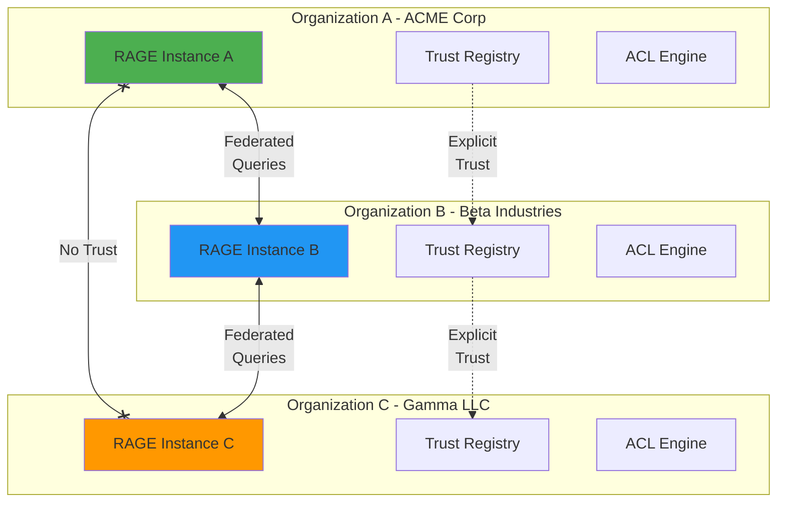
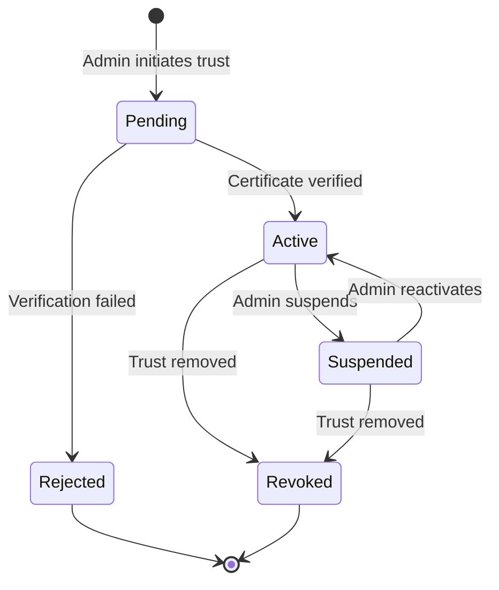
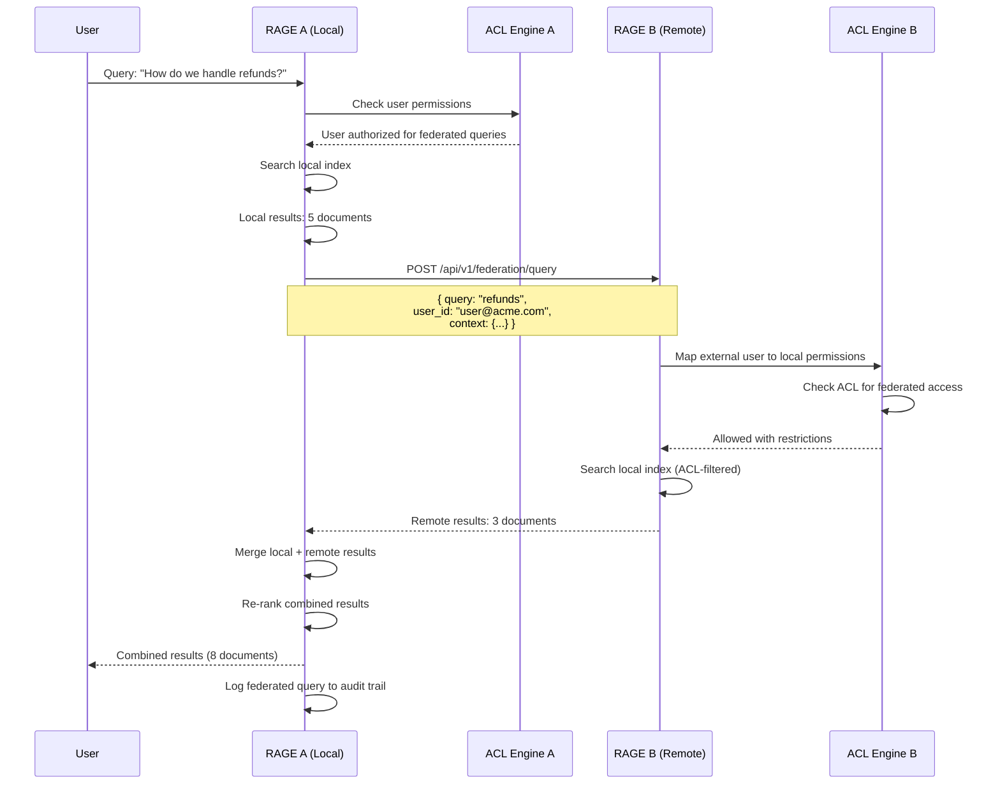
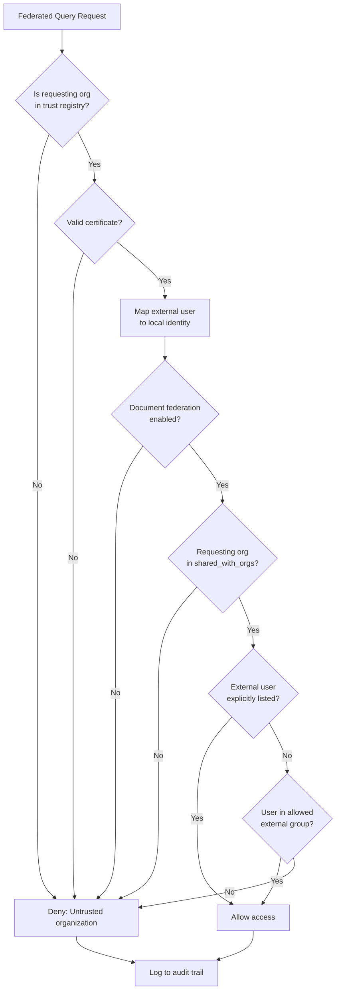

# RAGE Federation Guide

**Version:** 0.2.0  
**Status:** Design Phase  
**Last Updated:** December 3, 2025

---

## Table of Contents

1. [Overview](#overview)
2. [Federation Architecture](#federation-architecture)
3. [Trust Models](#trust-models)
4. [Explicit Trust Lists](#explicit-trust-lists)
5. [Cross-Organization Queries](#cross-organization-queries)
6. [ACL Propagation](#acl-propagation)
7. [Identity Federation](#identity-federation)
8. [Data Sharing Policies](#data-sharing-policies)
9. [Network Security](#network-security)
10. [Configuration Examples](#configuration-examples)
11. [Monitoring Federation](#monitoring-federation)

---

## Overview

**RAGE Federation** enables secure knowledge sharing between multiple RAGE instances across different organizations while maintaining strict access control and data sovereignty.

### Key Capabilities

- **Explicit Trust Management**: Organizations explicitly approve which RAGE instances can participate in federation
- **Selective Data Sharing**: Fine-grained control over what data is shared with federated partners
- **ACL Preservation**: Access controls are maintained across organizational boundaries
- **Federated Queries**: Users can search across federated organizations (with permission)
- **Audit Trail**: Complete logging of all cross-org data access

### Use Cases

1. **Enterprise Subsidiaries**: Parent company + subsidiaries share knowledge selectively
2. **Partner Ecosystems**: Vendors, contractors, partners share relevant documentation
3. **Merger & Acquisition**: Gradual knowledge integration during M&A
4. **Industry Consortiums**: Standards bodies, trade groups share public knowledge
5. **Academic Research**: Universities collaborate on research knowledge bases

---

## Federation Architecture



### Federation Layers

| Layer | Component | Purpose |
|-------|-----------|---------|
| **Trust Layer** | Certificate exchange, trust registry | Establish secure relationships |
| **Query Layer** | Federated search protocol | Execute cross-org queries |
| **Data Layer** | Selective replication | Share permitted content |
| **ACL Layer** | Permission propagation | Enforce access control |
| **Audit Layer** | Cross-org audit logs | Compliance & security |

---

## Trust Models

RAGE supports multiple trust models. For **single-entity multi-instance** deployments (e.g., one organization with RAGE instances in multiple regions), use **Explicit Trust Lists**.

### 1. Explicit Trust Lists (Recommended for Single Organization)

Organizations **manually approve** each federated partner.

```yaml
trust:
  model: "explicit"
  
  trusted_organizations:
    - org_id: "org_beta_industries"
      rage_instance: "https://rage.beta.com"
      certificate_fingerprint: "SHA256:a3f2e9d..."
      capabilities: ["query", "replicate"]
      trusted_since: "2025-01-15T00:00:00Z"
      trusted_by: "admin@acme.com"
      notes: "Strategic partner - full access"
    
    - org_id: "org_gamma_llc"
      rage_instance: "https://rage.gamma.com"
      certificate_fingerprint: "SHA256:b9d1c4a..."
      capabilities: ["query"]  # Read-only
      trusted_since: "2025-02-20T00:00:00Z"
      trusted_by: "admin@acme.com"
      notes: "Limited partner - query only, no replication"
```

**Advantages:**
- ✅ Maximum security - zero trust by default
- ✅ Full administrative control
- ✅ Ideal for regulated industries (finance, healthcare)
- ✅ **Perfect for single organization with multiple instances**

**Disadvantages:**
- ❌ Manual onboarding required
- ❌ Doesn't scale to thousands of partners

---

### 2. Certificate-Based PKI

Organizations trust instances with valid certificates signed by a common Certificate Authority (CA).

```yaml
trust:
  model: "pki"
  
  ca_certificates:
    - name: "RAGE Enterprise CA"
      cert_path: "/etc/rage/certs/ca.crt"
      auto_trust: true
      
  verification:
    require_valid_cert: true
    check_revocation: true
    crl_url: "https://crl.rage.network/revoked.crl"
    ocsp_url: "https://ocsp.rage.network"
```

**Advantages:**
- ✅ Automatic trust for valid certificates
- ✅ Scales to large federations
- ✅ Standard PKI infrastructure

**Disadvantages:**
- ❌ Requires PKI infrastructure
- ❌ Certificate management overhead

---

### 3. Web-of-Trust (Future)

Decentralized trust model where organizations vouch for each other.

```yaml
trust:
  model: "web-of-trust"
  
  trust_score_threshold: 0.7  # 0.0 - 1.0
  max_hops: 3  # Transitive trust up to 3 degrees
  
  direct_trust:
    - org_id: "org_beta"
      score: 1.0
```

**Not recommended for enterprise use** - better for open-source communities.

---

## Explicit Trust Lists

### Trust Registry Schema

```sql
CREATE TABLE federation_trusts (
    id UUID PRIMARY KEY DEFAULT gen_random_uuid(),
    
    -- Identity
    local_org_id VARCHAR(255) NOT NULL,
    remote_org_id VARCHAR(255) NOT NULL,
    remote_rage_url TEXT NOT NULL,
    
    -- Certificate
    certificate_fingerprint VARCHAR(128) NOT NULL,
    certificate_pem TEXT NOT NULL,
    certificate_valid_until TIMESTAMP NOT NULL,
    
    -- Capabilities
    capabilities JSONB NOT NULL DEFAULT '[]'::JSONB,
    -- Examples: ["query", "replicate", "share_users"]
    
    -- Data sharing policy
    sharing_policy_id UUID REFERENCES data_sharing_policies(id),
    
    -- Metadata
    status VARCHAR(50) NOT NULL DEFAULT 'active',
    -- Values: pending, active, suspended, revoked
    
    trusted_since TIMESTAMP NOT NULL DEFAULT NOW(),
    trusted_by VARCHAR(255) NOT NULL,  -- Admin who approved
    trust_notes TEXT,
    
    last_verified_at TIMESTAMP,
    last_connected_at TIMESTAMP,
    
    created_at TIMESTAMP NOT NULL DEFAULT NOW(),
    updated_at TIMESTAMP NOT NULL DEFAULT NOW(),
    
    UNIQUE(local_org_id, remote_org_id)
);

CREATE INDEX idx_federation_trusts_status ON federation_trusts(status);
CREATE INDEX idx_federation_trusts_remote_org ON federation_trusts(remote_org_id);
```

### Trust Lifecycle



### Establishing Trust

```mermaid
sequenceDiagram
    participant Admin_A as Admin (Org A)
    participant RAGE_A as RAGE Instance A
    participant RAGE_B as RAGE Instance B
    participant Admin_B as Admin (Org B)
    
    Admin_A->>RAGE_A: POST /api/v1/federation/trust/initiate
    Note over Admin_A,RAGE_A: { remote_url: "https://rage.b.com",<br/>  capabilities: ["query"] }
    
    RAGE_A->>RAGE_B: GET /.well-known/rage-federation.json
    RAGE_B-->>RAGE_A: { org_id, certificate, public_key }
    
    RAGE_A->>RAGE_A: Verify certificate
    RAGE_A-->>Admin_A: Trust request pending review
    
    RAGE_A->>RAGE_B: POST /api/v1/federation/trust/request
    Note over RAGE_A,RAGE_B: { org_id: "org_a",<br/>  certificate: "...",<br/>  capabilities: ["query"] }
    
    RAGE_B->>Admin_B: Notification: Trust request from Org A
    
    Admin_B->>RAGE_B: POST /api/v1/federation/trust/approve
    RAGE_B-->>RAGE_A: Trust approved
    
    RAGE_A->>Admin_A: Trust established with Org B
    
    RAGE_A<-->RAGE_B: Federated queries enabled
```

### API Endpoints

```yaml
# Initiate trust relationship
POST /api/v1/federation/trust/initiate
Request:
  remote_url: "https://rage.partner.com"
  capabilities: ["query", "replicate"]
  notes: "Strategic partner integration"
Response:
  trust_id: "trust_12345"
  status: "pending"
  next_steps: "Waiting for remote approval"

# Approve incoming trust request
POST /api/v1/federation/trust/approve
Request:
  trust_id: "trust_67890"
  capabilities: ["query"]  # Can restrict capabilities
  sharing_policy_id: "policy_abc"
Response:
  status: "active"
  established_at: "2025-12-03T10:00:00Z"

# Revoke trust
DELETE /api/v1/federation/trust/{trust_id}
Response:
  status: "revoked"
  revoked_at: "2025-12-03T11:00:00Z"

# List trusted organizations
GET /api/v1/federation/trust
Response:
  trusts:
    - trust_id: "trust_12345"
      remote_org_id: "org_partner"
      remote_url: "https://rage.partner.com"
      status: "active"
      capabilities: ["query", "replicate"]
      last_connected_at: "2025-12-03T09:45:00Z"
```

---

## Cross-Organization Queries

### Federated Query Flow



### Query Protocol

```yaml
# Federated query request
POST /api/v1/federation/query
Headers:
  X-Org-ID: "org_acme_corp"
  X-Org-Certificate: "BASE64_CERT..."
  X-Request-Signature: "SHA256_SIGNATURE..."

Request:
  query_id: "uuid_123"
  query: "customer refund policy"
  
  # User context (for ACL)
  user:
    external_id: "user@acme.com"
    email: "alice@acme.com"
    groups: ["sales", "customer_success"]
  
  # Query parameters
  filters:
    source_types: ["confluence", "sharepoint"]
    date_range:
      start: "2024-01-01"
      end: "2025-12-31"
  
  # Response limits
  max_results: 20
  timeout_seconds: 10

Response:
  query_id: "uuid_123"
  results:
    - id: "doc_456"
      title: "Refund Policy 2025"
      snippet: "Customers can request refunds within..."
      score: 0.95
      source: "confluence"
      acl:
        visibility: "org"
        shared_with_external: true
    
    - id: "doc_789"
      title: "Refund Processing Guide"
      snippet: "To process a refund..."
      score: 0.87
      source: "sharepoint"
  
  metadata:
    total_searched: 15000
    total_matched: 45
    acl_filtered: 42  # Excluded due to ACL
    returned: 3
    search_time_ms: 234
```

### Query Routing

```rust
pub struct FederatedQueryRouter {
    trust_registry: Arc<TrustRegistry>,
    local_search: Arc<SearchEngine>,
    remote_clients: HashMap<String, FederationClient>,
}

impl FederatedQueryRouter {
    pub async fn execute_query(
        &self,
        query: &str,
        user: &User,
        options: QueryOptions,
    ) -> Result<FederatedResults, QueryError> {
        
        // 1. Check if user can execute federated queries
        if !user.has_capability("federated_query") {
            return Err(QueryError::Forbidden);
        }
        
        // 2. Execute local search
        let local_future = self.local_search.search(query, user, options.clone());
        
        // 3. Find trusted organizations
        let trusted_orgs = self.trust_registry.get_trusted_with_capability("query").await?;
        
        // 4. Execute remote searches in parallel
        let remote_futures: Vec<_> = trusted_orgs
            .iter()
            .map(|org| self.query_remote_org(org, query, user, options.clone()))
            .collect();
        
        // 5. Wait for all results
        let (local_results, remote_results) = tokio::join!(
            local_future,
            futures::future::join_all(remote_futures)
        );
        
        // 6. Merge and re-rank
        let combined = self.merge_results(local_results?, remote_results);
        
        // 7. Audit log
        self.audit_federated_query(user, query, &trusted_orgs).await?;
        
        Ok(combined)
    }
}
```

---

## ACL Propagation

### Federated ACL Model

```yaml
# Document ACL with federation settings
acl:
  visibility: "org"
  
  # Local access
  owner: "user@acme.com"
  users: ["alice@acme.com", "bob@acme.com"]
  groups: ["engineering"]
  
  # Federation settings
  federation:
    enabled: true
    mode: "selective"  # all, selective, none
    
    # Explicit list of organizations that can access this document
    shared_with_orgs:
      - org_id: "org_beta_industries"
        permissions: ["read"]
        shared_by: "admin@acme.com"
        shared_at: "2025-11-01T00:00:00Z"
      
      - org_id: "org_gamma_llc"
        permissions: ["read"]
        expires_at: "2026-01-01T00:00:00Z"
    
    # External users from federated orgs
    shared_with_external_users:
      - external_email: "contractor@beta.com"
        external_org: "org_beta_industries"
        permissions: ["read"]
```

### ACL Evaluation for Federated Requests



### ACL Sync Protocol

```rust
pub struct AclSyncMessage {
    pub resource_id: String,
    pub resource_type: ResourceType,
    pub acl_payload: AclPayload,
    pub sync_reason: SyncReason,
    pub timestamp: DateTime<Utc>,
}

pub enum SyncReason {
    Created,
    Updated,
    Deleted,
    PermissionGranted,
    PermissionRevoked,
    ExpirationReached,
}

impl FederationManager {
    pub async fn sync_acl_to_federated_orgs(
        &self,
        resource_id: &str,
        acl: &AclPayload,
    ) -> Result<(), SyncError> {
        
        // Find organizations this resource is shared with
        let shared_orgs = acl.federation.shared_with_orgs.clone();
        
        for org in shared_orgs {
            let client = self.get_federation_client(&org.org_id)?;
            
            let sync_msg = AclSyncMessage {
                resource_id: resource_id.to_string(),
                resource_type: ResourceType::Document,
                acl_payload: acl.clone(),
                sync_reason: SyncReason::Updated,
                timestamp: Utc::now(),
            };
            
            // Send ACL update via P2P gossipsub
            client.publish_acl_update(sync_msg).await?;
        }
        
        Ok(())
    }
}
```

---

## Identity Federation

### External User Mapping

```sql
CREATE TABLE federated_user_mappings (
    id UUID PRIMARY KEY DEFAULT gen_random_uuid(),
    
    -- External identity (from federated org)
    external_org_id VARCHAR(255) NOT NULL,
    external_user_id VARCHAR(255) NOT NULL,
    external_email VARCHAR(255) NOT NULL,
    
    -- Local identity (shadow user in our system)
    local_user_id UUID REFERENCES users(id),
    
    -- Mapping metadata
    mapping_type VARCHAR(50) NOT NULL,
    -- Values: automatic, manual, saml, oauth
    
    verified BOOLEAN NOT NULL DEFAULT FALSE,
    verified_at TIMESTAMP,
    verified_by VARCHAR(255),
    
    -- Capabilities
    capabilities JSONB NOT NULL DEFAULT '[]'::JSONB,
    
    created_at TIMESTAMP NOT NULL DEFAULT NOW(),
    updated_at TIMESTAMP NOT NULL DEFAULT NOW(),
    
    UNIQUE(external_org_id, external_user_id)
);
```

### SAML Federation (Future)

```yaml
saml:
  enabled: true
  
  identity_providers:
    - name: "Beta Industries IDP"
      entity_id: "https://idp.beta.com"
      sso_url: "https://idp.beta.com/saml/sso"
      certificate_path: "/etc/rage/saml/beta_idp.crt"
      
      attribute_mapping:
        user_id: "NameID"
        email: "email"
        groups: "memberOf"
```

---

## Data Sharing Policies

### Policy Schema

```sql
CREATE TABLE data_sharing_policies (
    id UUID PRIMARY KEY DEFAULT gen_random_uuid(),
    
    name VARCHAR(255) NOT NULL,
    description TEXT,
    
    -- What can be shared
    rules JSONB NOT NULL,
    /* Example:
    {
      "include": [
        {"source": "confluence", "space": "PUBLIC"},
        {"source": "sharepoint", "site": "external-docs"}
      ],
      "exclude": [
        {"tags": ["confidential", "internal-only"]},
        {"metadata.classification": "secret"}
      ]
    }
    */
    
    -- Automatic vs manual approval
    requires_approval BOOLEAN NOT NULL DEFAULT TRUE,
    
    -- Redaction rules
    redaction_rules JSONB,
    /* Example:
    [
      {"pattern": "\\b\\d{3}-\\d{2}-\\d{4}\\b", "replacement": "[SSN REDACTED]"},
      {"field": "salary", "action": "remove"}
    ]
    */
    
    created_at TIMESTAMP NOT NULL DEFAULT NOW(),
    updated_at TIMESTAMP NOT NULL DEFAULT NOW()
);
```

### Policy Example

```yaml
name: "Partner Tier 1 - Full Access"
description: "Strategic partners with full read access to public docs"

rules:
  include:
    - source_type: "confluence"
      spaces: ["PUBLIC", "PARTNERS"]
    
    - source_type: "sharepoint"
      sites: ["external-docs", "api-documentation"]
    
    - tags: ["public", "partner-shared"]
  
  exclude:
    - tags: ["confidential", "internal-only", "secret"]
    
    - metadata:
        classification: ["secret", "top-secret"]
    
    - owners: ["legal@acme.com"]  # Legal docs never shared

requires_approval: false  # Automatic sharing

redaction:
  - pattern: '\b\d{3}-\d{2}-\d{4}\b'  # SSN
    replacement: "[REDACTED]"
  
  - pattern: '\b[A-Z]{2}\d{6}\b'  # Employee ID
    replacement: "[EMP_ID]"
  
  - fields: ["salary", "bonus", "compensation"]
    action: "remove"
```

---

## Network Security

### Certificate Management

```bash
# Generate organization CA
openssl req -x509 -newkey rsa:4096 -keyout ca_key.pem -out ca_cert.pem -days 3650 \
  -subj "/C=US/ST=CA/O=ACME Corp/CN=ACME RAGE CA"

# Generate node certificate signed by CA
openssl req -newkey rsa:4096 -keyout node_key.pem -out node_csr.pem \
  -subj "/C=US/ST=CA/O=ACME Corp/CN=rage-node-1.acme.com"

openssl x509 -req -in node_csr.pem -CA ca_cert.pem -CAkey ca_key.pem \
  -CAcreateserial -out node_cert.pem -days 365
```

### Mutual TLS

```rust
use rustls::{ServerConfig, ClientConfig};

pub fn configure_mtls(
    ca_cert: &[u8],
    node_cert: &[u8],
    node_key: &[u8],
) -> Result<ServerConfig, TlsError> {
    
    let ca_cert = Certificate(ca_cert.to_vec());
    let node_cert = Certificate(node_cert.to_vec());
    let node_key = PrivateKey(node_key.to_vec());
    
    let mut config = ServerConfig::builder()
        .with_safe_defaults()
        .with_client_cert_verifier(Arc::new(ca_cert))
        .with_single_cert(vec![node_cert], node_key)?;
    
    Ok(config)
}
```

### Request Signing

```rust
use ed25519_dalek::{Keypair, Signer, Signature};

pub struct FederationClient {
    org_id: String,
    keypair: Keypair,
    remote_url: String,
}

impl FederationClient {
    pub async fn send_query(&self, query: FederatedQuery) -> Result<FederatedResults, FedError> {
        let payload = serde_json::to_string(&query)?;
        let signature = self.keypair.sign(payload.as_bytes());
        
        let response = self.http_client
            .post(&format!("{}/api/v1/federation/query", self.remote_url))
            .header("X-Org-ID", &self.org_id)
            .header("X-Request-Signature", base64::encode(signature.to_bytes()))
            .body(payload)
            .send()
            .await?;
        
        Ok(response.json().await?)
    }
}
```

---

## Configuration Examples

### Single Organization - Multi-Region

```yaml
# Organization: ACME Corp
# Scenario: 3 RAGE instances (US West, US East, EU)

# rage-us-west.yaml
federation:
  enabled: true
  
  trust:
    model: "explicit"
    
    # Trust our own instances in other regions
    trusted_organizations:
      - org_id: "org_acme_corp"
        rage_instance: "https://rage-us-east.acme.com"
        certificate_fingerprint: "SHA256:abc123..."
        capabilities: ["query", "replicate", "share_users"]
        notes: "Same organization - full trust"
      
      - org_id: "org_acme_corp"
        rage_instance: "https://rage-eu.acme.com"
        certificate_fingerprint: "SHA256:def456..."
        capabilities: ["query", "replicate", "share_users"]
        notes: "Same organization - full trust"
  
  data_sharing:
    # Share everything within same organization
    default_policy: "full_replication"
```

### Multi-Organization - Partner Ecosystem

```yaml
# Organization: ACME Corp
# Scenario: Share with partners Beta Industries and Gamma LLC

# rage.yaml
federation:
  enabled: true
  
  trust:
    model: "explicit"
    
    trusted_organizations:
      - org_id: "org_beta_industries"
        rage_instance: "https://rage.beta.com"
        certificate_fingerprint: "SHA256:xyz789..."
        capabilities: ["query"]  # Read-only
        notes: "Strategic partner - query access to public docs"
      
      - org_id: "org_gamma_llc"
        rage_instance: "https://rage.gamma.com"
        certificate_fingerprint: "SHA256:ghi012..."
        capabilities: ["query"]
        notes: "Contractor - limited access"
  
  data_sharing:
    default_policy: "selective"
    
    # Only share documents explicitly marked for federation
    policies:
      - name: "Partner Access"
        id: "policy_partner_tier1"
        rules:
          include:
            - tags: ["public", "partner-shared"]
          exclude:
            - tags: ["confidential"]
```

---

## Monitoring Federation

### Metrics

```yaml
federation_metrics:
  - name: rage_federation_trusts_total
    type: gauge
    help: "Total number of active federation trusts"
    labels: [status]
  
  - name: rage_federation_queries_total
    type: counter
    help: "Total federated queries executed"
    labels: [remote_org, status]
  
  - name: rage_federation_query_latency_seconds
    type: histogram
    help: "Federated query round-trip latency"
    buckets: [0.1, 0.5, 1.0, 2.0, 5.0, 10.0]
    labels: [remote_org]
  
  - name: rage_federation_acl_denials_total
    type: counter
    help: "Total ACL denials for federated requests"
    labels: [remote_org, reason]
```

### Audit Logs

```sql
CREATE TABLE federation_audit_logs (
    id UUID PRIMARY KEY DEFAULT gen_random_uuid(),
    
    event_type VARCHAR(100) NOT NULL,
    -- trust_established, trust_revoked, query_executed, 
    -- data_shared, acl_denial, etc.
    
    local_org_id VARCHAR(255) NOT NULL,
    remote_org_id VARCHAR(255) NOT NULL,
    
    user_id VARCHAR(255),
    resource_id VARCHAR(255),
    
    event_data JSONB,
    
    result VARCHAR(50) NOT NULL,  -- success, denied, error
    error_message TEXT,
    
    timestamp TIMESTAMP NOT NULL DEFAULT NOW(),
    
    -- Immutable audit trail
    previous_log_hash VARCHAR(128),
    log_hash VARCHAR(128) NOT NULL
);

CREATE INDEX idx_federation_audit_type ON federation_audit_logs(event_type);
CREATE INDEX idx_federation_audit_org ON federation_audit_logs(remote_org_id);
CREATE INDEX idx_federation_audit_time ON federation_audit_logs(timestamp DESC);
```

---

## Next Steps

1. **Setup**: See `/docs/DISTRIBUTED_DEPLOYMENT.md` for deployment guide
2. **Network**: See `/docs/NETWORK_LAYER.md` for P2P architecture
3. **API**: See `/contracts/network-layer.yaml` for API specs
4. **Security**: See `/docs/SECURITY_ACL.md` for ACL details

---

## References

- [OAuth 2.0 Federation](https://datatracker.ietf.org/doc/html/rfc8414)
- [SAML 2.0](https://docs.oasis-open.org/security/saml/Post2.0/sstc-saml-tech-overview-2.0.html)
- [Zero Trust Architecture (NIST)](https://nvlpubs.nist.gov/nistpubs/SpecialPublications/NIST.SP.800-207.pdf)
- [Certificate Transparency](https://certificate.transparency.dev/)
