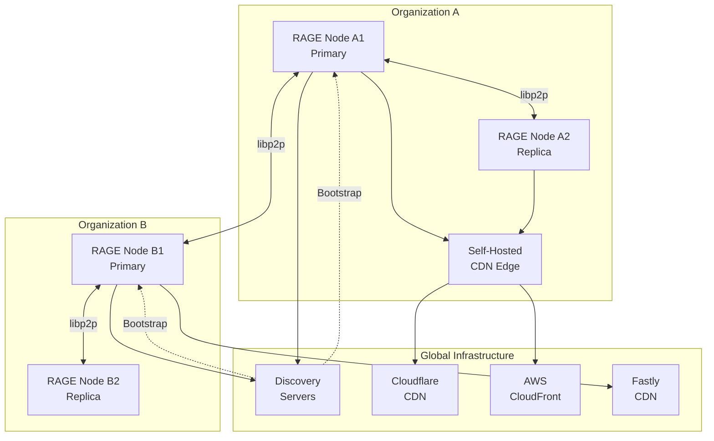
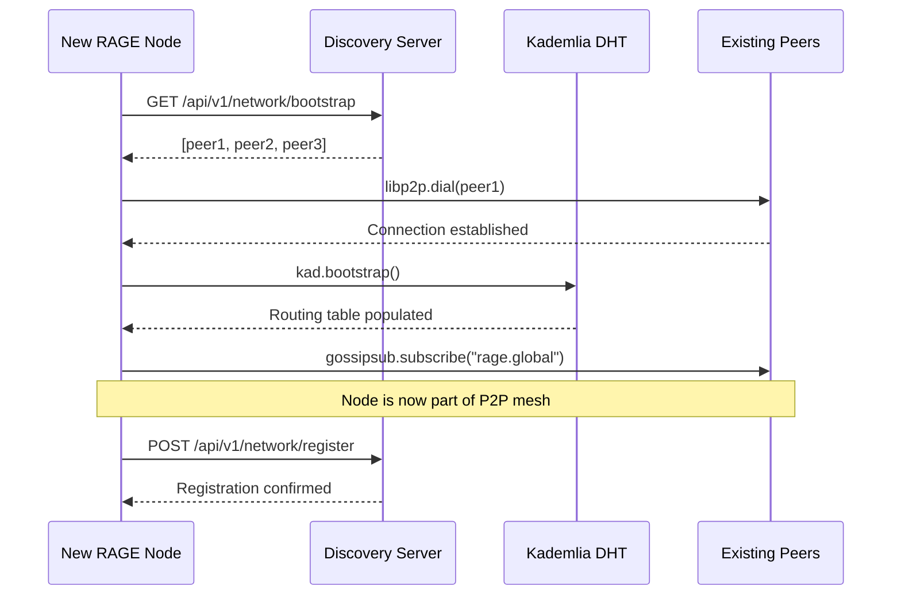
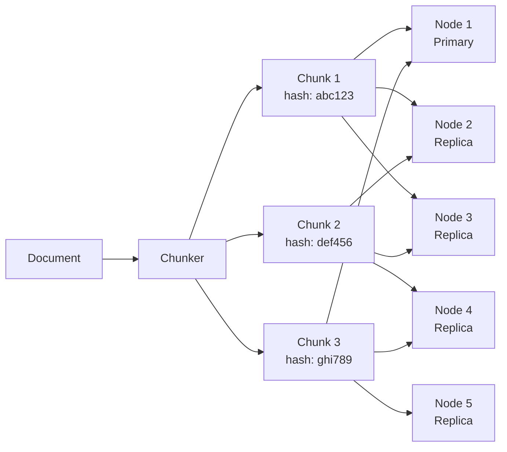
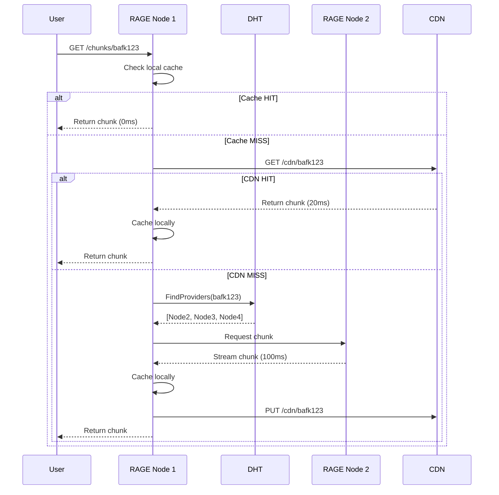
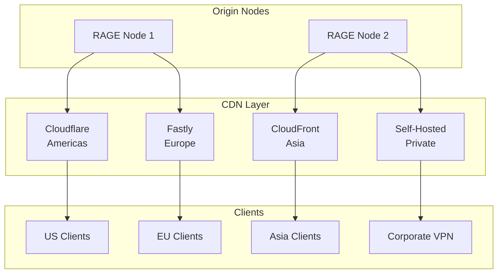
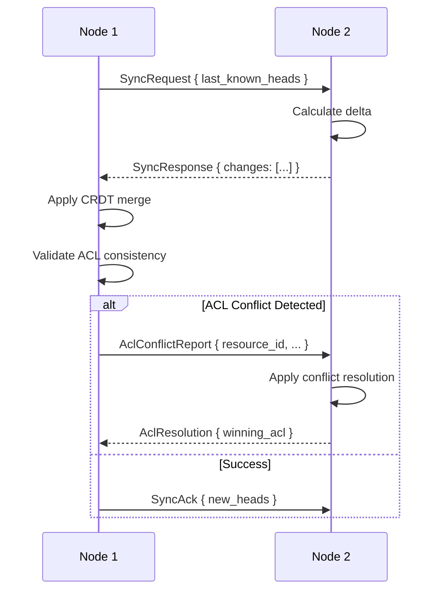
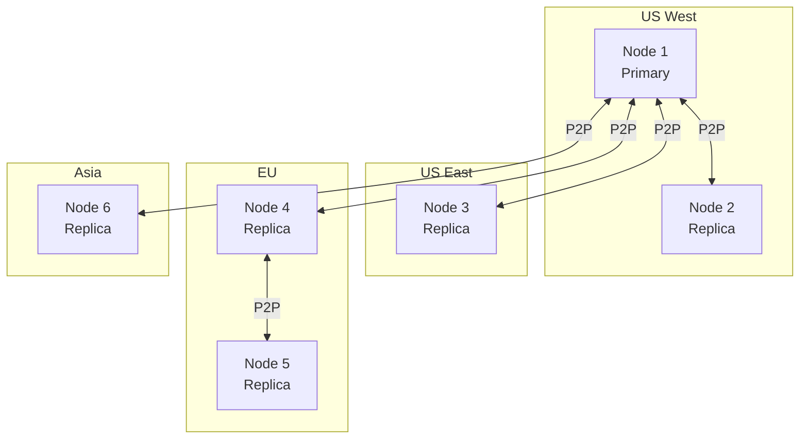
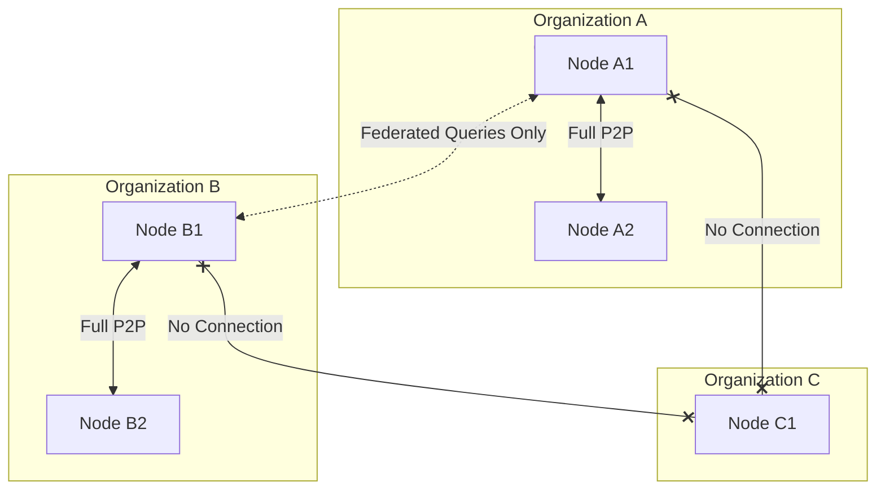
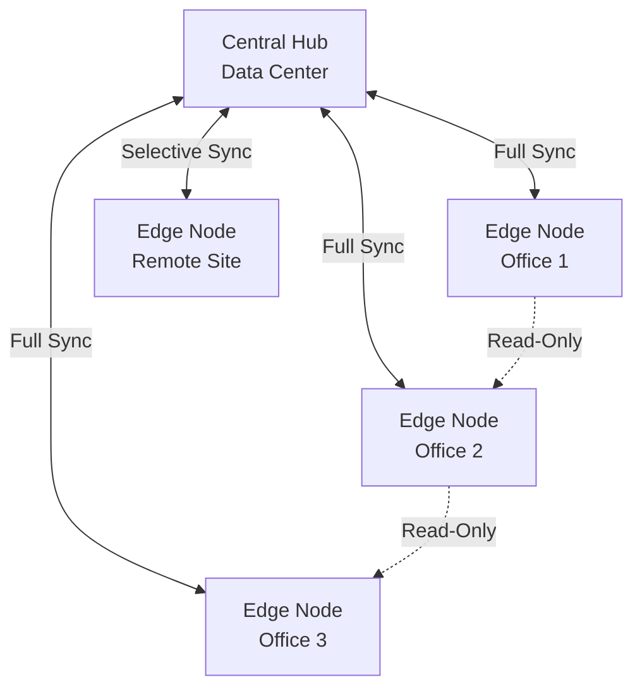
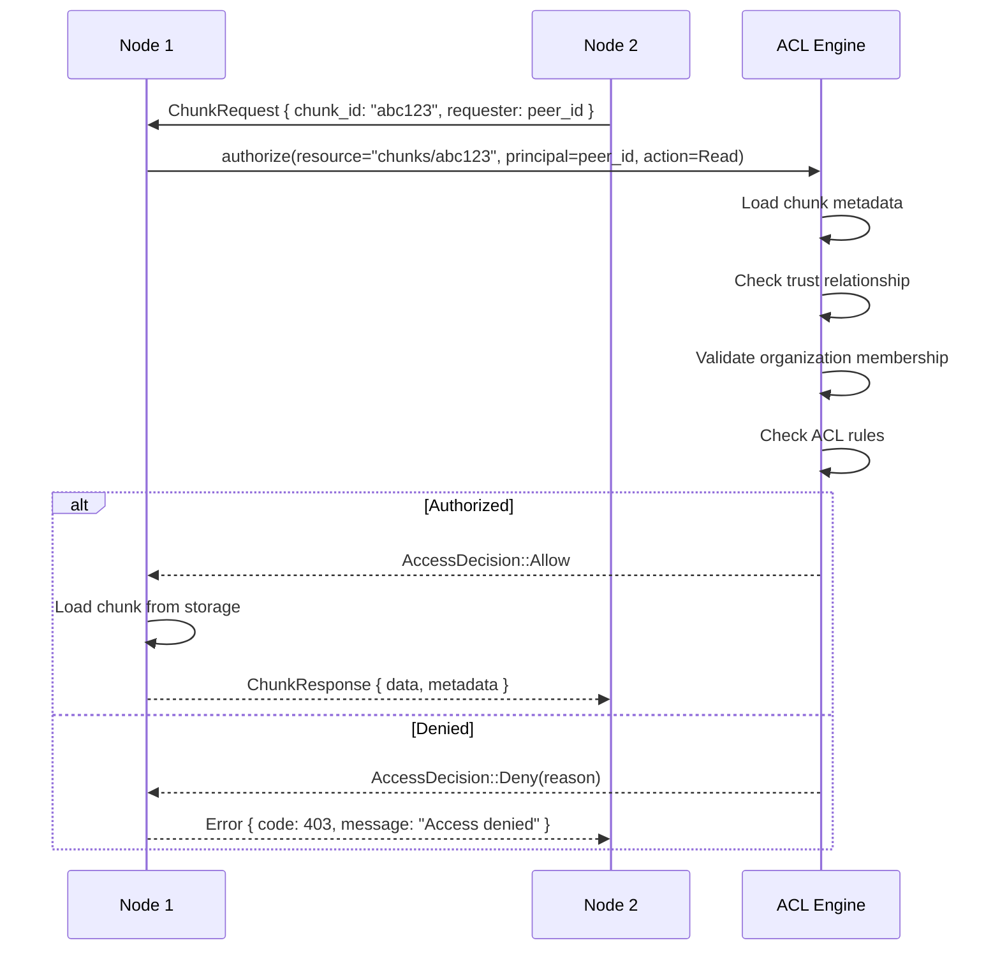

# RAGE Distributed Network Layer

**Version:** 0.2.0 (Network Layer Specification)  
**Status:** Design Phase  
**Last Updated:** December 3, 2025

---

## Table of Contents

1. [Overview](#overview)
2. [Architecture](#architecture)
3. [P2P Protocol (libp2p)](#p2p-protocol-libp2p)
4. [Node Discovery](#node-discovery)
5. [Content Distribution](#content-distribution)
6. [CDN Integration](#cdn-integration)
7. [Replication Strategy](#replication-strategy)
8. [Network Topology](#network-topology)
9. [Security & Encryption](#security--encryption)
10. [Performance Optimization](#performance-optimization)
11. [Configuration](#configuration)
12. [Monitoring & Observability](#monitoring--observability)

---

## Overview

The **RAGE Distributed Network Layer** transforms RAGE from a single-instance RAG platform into a distributed knowledge network. This layer enables:

- **P2P Communication**: Direct node-to-node data sharing using libp2p
- **Hybrid CDN**: Multi-provider CDN support (Cloudflare, Fastly, AWS CloudFront) + self-hosted edge nodes
- **Federated Queries**: Cross-organization knowledge sharing with explicit trust relationships
- **Content Distribution**: Intelligent replication and caching strategies
- **ACL Propagation**: Distributed access control with conflict resolution

### Design Principles

1. **Hybrid Architecture**: Combine P2P resilience with CDN performance
2. **Security First**: End-to-end encryption, ACL enforcement at every node
3. **Gradual Degradation**: System remains functional during network partitions
4. **Privacy Preserving**: Organizations control what data leaves their network
5. **Performance**: Edge caching, smart routing, bandwidth optimization

---

## Architecture



### Layer 10: Distributed Network

This is the **10th layer** in the RAGE architecture stack:

| Layer | Component | Purpose |
|-------|-----------|---------|
| 10 | **Distributed Network** | P2P mesh, CDN, federation, replication |
| 9 | Monitoring | Netdata, Prometheus, Grafana, Jaeger, Loki |
| 8 | LLM Providers | Ollama, OpenAI, Anthropic, AWS Bedrock |
| 7 | Data | PostgreSQL, Neo4j, Valkey |
| 6 | Business Logic | Hybrid search, embeddings, ingestion |
| 5 | Agent Network | Query Analyzer, Retriever, Synthesizer |
| 4 | Orchestration | MCP Coordinator, task scheduling |
| 3 | Application | FastAPI backend, JWT auth |
| 2 | Gateway | Nginx/Traefik, SSL, rate limiting |
| 1 | Presentation | React Admin/User UI |

---

## P2P Protocol (libp2p)

RAGE uses **[libp2p](https://libp2p.io/)** for peer-to-peer networking.

### Why libp2p?

- ✅ **Production-ready**: Used by IPFS, Filecoin, Polkadot, Ethereum 2.0
- ✅ **NAT traversal**: Automatic hole punching (STUN/TURN)
- ✅ **Transport agnostic**: TCP, WebSocket, QUIC, WebRTC
- ✅ **Security**: Noise protocol, TLS 1.3
- ✅ **Modularity**: Gossipsub, DHT, mDNS, Kad-DHT
- ✅ **Multi-language**: Rust, Go, JS implementations

### Core Components

```rust
// Network stack configuration
use libp2p::{
    gossipsub,      // Pub/sub messaging
    kad,            // Kademlia DHT for discovery
    mdns,           // Local network discovery
    noise,          // Encryption
    tcp,            // Transport
    quic,           // QUIC transport
    yamux,          // Multiplexing
    identify,       // Peer identification
    ping,           // Keepalive
    request_response, // RPC protocol
    PeerId,
    Swarm,
};
```

### Network Behavior

```rust
#[derive(NetworkBehaviour)]
pub struct RageBehaviour {
    pub gossipsub: gossipsub::Behaviour,
    pub kad: kad::Behaviour<kad::store::MemoryStore>,
    pub mdns: mdns::tokio::Behaviour,
    pub identify: identify::Behaviour,
    pub ping: ping::Behaviour,
    pub request_response: request_response::Behaviour<RageProtocol>,
}
```

### Message Types

```rust
pub enum NetworkMessage {
    // Chunk distribution
    ChunkRequest { chunk_id: String, requester: PeerId },
    ChunkResponse { chunk_id: String, data: Vec<u8>, metadata: ChunkMetadata },
    
    // ACL synchronization
    AclSync { resource_id: String, acl: AclPayload },
    AclInvalidation { resource_id: String, timestamp: u64 },
    
    // Query federation
    FederatedQuery { query_id: String, query: String, context: QueryContext },
    FederatedResults { query_id: String, results: Vec<SearchResult> },
    
    // Heartbeat & discovery
    Heartbeat { node_info: NodeInfo },
    PeerAnnouncement { capabilities: Vec<Capability> },
    
    // Replication
    SyncRequest { manifest_hash: String },
    SyncResponse { chunks: Vec<ChunkInfo> },
}
```

---

## Node Discovery

RAGE uses a **hybrid discovery** approach:

1. **Central Discovery Servers** (bootstrap reliability)
2. **Kademlia DHT** (decentralized resilience)
3. **mDNS** (local network discovery)



### Discovery Server API

```yaml
# Central discovery service (fallback)
endpoints:
  - GET /api/v1/network/bootstrap
    # Returns: List of bootstrap peers
    response:
      peers:
        - peer_id: "12D3KooWA8..."
          addresses: ["/ip4/10.0.1.5/tcp/4001"]
          region: "us-west-2"
          capabilities: ["storage", "search", "federation"]
  
  - POST /api/v1/network/register
    # Register node with discovery service
    body:
      peer_id: "12D3KooWB9..."
      addresses: ["/ip4/192.168.1.10/tcp/4001"]
      organization_id: "org_123"
      public_key: "ed25519:ABC..."
  
  - GET /api/v1/network/peers?organization=org_123
    # Find peers in same organization
    response:
      peers: [...]
```

### Kademlia DHT

```rust
// DHT configuration
let mut kad_config = kad::Config::default();
kad_config.set_query_timeout(Duration::from_secs(30));
kad_config.set_replication_factor(NonZeroUsize::new(3).unwrap());

let store = kad::store::MemoryStore::new(local_peer_id);
let mut kad = kad::Behaviour::with_config(local_peer_id, store, kad_config);

// Bootstrap with known peers
for peer in bootstrap_peers {
    kad.add_address(&peer.peer_id, peer.address);
}

kad.bootstrap().expect("Failed to bootstrap DHT");
```

### mDNS (Local Discovery)

```rust
// Automatic discovery on LAN
let mdns = mdns::tokio::Behaviour::new(
    mdns::Config::default(),
    local_peer_id
)?;

// Discovered peers are automatically connected
```

---

## Content Distribution

### Chunk Replication Strategy

RAGE uses **content-addressed storage** with configurable replication:



### Replication Policies

```yaml
replication:
  default_factor: 3  # Each chunk stored on 3 nodes
  
  policies:
    - name: "critical"
      factor: 5
      selector:
        tags: ["compliance", "legal"]
    
    - name: "ephemeral"
      factor: 1
      selector:
        retention_days: < 7
    
    - name: "high-traffic"
      factor: 7
      selector:
        query_count: > 1000/day
  
  placement:
    strategy: "geographic_diversity"
    # Prefer nodes in different regions/availability zones
```

### Content Addressing

```rust
use blake3::Hasher;

pub struct ChunkAddress {
    pub hash: [u8; 32],  // BLAKE3 hash
    pub size: u64,
    pub compression: CompressionType,
}

impl ChunkAddress {
    pub fn from_data(data: &[u8]) -> Self {
        let mut hasher = Hasher::new();
        hasher.update(data);
        let hash = hasher.finalize();
        
        Self {
            hash: *hash.as_bytes(),
            size: data.len() as u64,
            compression: CompressionType::Zstd,
        }
    }
    
    pub fn to_cid(&self) -> String {
        // Convert to IPFS-style CID
        format!("bafk{}", bs58::encode(&self.hash).into_string())
    }
}
```

### Retrieval Flow



---

## CDN Integration

RAGE supports **hybrid CDN** deployment:

1. **Commercial CDNs**: Cloudflare, Fastly, AWS CloudFront, Azure CDN
2. **Self-Hosted**: Varnish or Nginx edge nodes

### Multi-CDN Architecture



### CDN Configuration

```yaml
cdn:
  enabled: true
  
  providers:
    - name: "cloudflare"
      type: "commercial"
      config:
        zone_id: "abc123..."
        api_token: "${CLOUDFLARE_TOKEN}"
        purge_on_update: true
      
      routing:
        regions: ["americas"]
        priority: 1
    
    - name: "fastly"
      type: "commercial"
      config:
        service_id: "xyz789..."
        api_key: "${FASTLY_API_KEY}"
        soft_purge: true
      
      routing:
        regions: ["europe"]
        priority: 1
    
    - name: "cloudfront"
      type: "commercial"
      config:
        distribution_id: "E1234..."
        access_key_id: "${AWS_ACCESS_KEY}"
        secret_access_key: "${AWS_SECRET_KEY}"
      
      routing:
        regions: ["asia", "oceania"]
        priority: 2
    
    - name: "varnish-edge"
      type: "self-hosted"
      config:
        endpoints:
          - "https://cdn-edge-1.myorg.com"
          - "https://cdn-edge-2.myorg.com"
        auth_token: "${VARNISH_TOKEN}"
      
      routing:
        regions: ["private"]
        priority: 0  # Highest priority
        
  cache_policy:
    default_ttl: 3600  # 1 hour
    max_ttl: 86400     # 24 hours
    
    rules:
      - pattern: "/chunks/*"
        ttl: 86400
        stale_while_revalidate: 3600
      
      - pattern: "/embeddings/*"
        ttl: 7200
        immutable: true
      
      - pattern: "/api/*"
        ttl: 0
        cache: false
```

### Cache Invalidation

```rust
pub struct CdnManager {
    providers: Vec<Box<dyn CdnProvider>>,
}

#[async_trait]
pub trait CdnProvider: Send + Sync {
    async fn purge(&self, keys: Vec<String>) -> Result<(), CdnError>;
    async fn purge_prefix(&self, prefix: String) -> Result<(), CdnError>;
    async fn set_cache_tags(&self, key: String, tags: Vec<String>) -> Result<(), CdnError>;
}

impl CdnManager {
    pub async fn invalidate_chunk(&self, chunk_id: &str) -> Result<(), CdnError> {
        let key = format!("/chunks/{}", chunk_id);
        
        // Parallel purge across all CDN providers
        let futures: Vec<_> = self.providers.iter()
            .map(|p| p.purge(vec![key.clone()]))
            .collect();
        
        futures::future::try_join_all(futures).await?;
        Ok(())
    }
    
    pub async fn invalidate_document(&self, doc_id: &str) -> Result<(), CdnError> {
        // Purge by tag (if supported)
        let tag = format!("doc:{}", doc_id);
        
        for provider in &self.providers {
            if let Err(e) = provider.purge_prefix(format!("/chunks/{}/", doc_id)).await {
                warn!("CDN purge failed for {}: {}", provider, e);
            }
        }
        
        Ok(())
    }
}
```

### Cloudflare Integration

```rust
use cloudflare::{
    endpoints::{zone::PurgeCache, zone::PurgeCacheRequest},
    framework::{async_api::Client, auth::Credentials, Environment},
};

pub struct CloudflareCdn {
    client: Client,
    zone_id: String,
}

#[async_trait]
impl CdnProvider for CloudflareCdn {
    async fn purge(&self, keys: Vec<String>) -> Result<(), CdnError> {
        let request = PurgeCacheRequest {
            files: Some(keys),
            tags: None,
            hosts: None,
            prefixes: None,
        };
        
        self.client
            .request(&PurgeCache {
                zone_identifier: &self.zone_id,
                params: request,
            })
            .await?;
        
        Ok(())
    }
}
```

---

## Replication Strategy

### Eventual Consistency Model

RAGE uses **CRDTs (Conflict-free Replicated Data Types)** for metadata synchronization:

```rust
use automerge::Automerge;

pub struct ReplicatedMetadata {
    doc: Automerge,
}

impl ReplicatedMetadata {
    pub fn update_acl(&mut self, resource_id: &str, acl: AclPayload) {
        // CRDT ensures convergence across nodes
        self.doc.transact(|tx| {
            tx.put(resource_id, "acl", acl)?;
            tx.put(resource_id, "acl_updated_at", Utc::now().timestamp())?;
            Ok::<_, automerge::AutomergeError>(())
        }).unwrap();
    }
    
    pub fn merge(&mut self, remote_changes: &[u8]) -> Result<(), ReplicationError> {
        // Merge changes from remote node
        self.doc.load_incremental(remote_changes)?;
        Ok(())
    }
    
    pub fn get_changes_since(&self, heads: &[automerge::ChangeHash]) -> Vec<u8> {
        self.doc.get_changes(heads).unwrap()
    }
}
```

### Sync Protocol



### Conflict Resolution

```rust
pub enum ConflictResolution {
    LastWriteWins,
    MostRestrictive,  // For ACLs
    Merge,            // For lists
    Manual,           // Require admin intervention
}

impl AclConflictResolver {
    pub fn resolve(&self, local: &AclPayload, remote: &AclPayload) -> AclPayload {
        match self.strategy {
            ConflictResolution::MostRestrictive => {
                // Take intersection of permissions
                AclPayload {
                    visibility: local.visibility.most_restrictive(&remote.visibility),
                    users: local.users.intersection(&remote.users).cloned().collect(),
                    groups: local.groups.intersection(&remote.groups).cloned().collect(),
                    // ... more fields
                }
            }
            _ => unimplemented!(),
        }
    }
}
```

---

## Network Topology

RAGE supports multiple deployment topologies:

### 1. Single Organization - Multi-Region



### 2. Multi-Organization Federation



### 3. Hub-and-Spoke (Enterprise)



---

## Security & Encryption

### Transport Encryption

```rust
use libp2p::noise;

// Noise Protocol (XX pattern) for transport encryption
let noise_config = noise::Config::new(&local_keypair)?;

// All P2P traffic is encrypted end-to-end
```

### ACL Enforcement in P2P



### Trust Certificates

```rust
use x509_parser::prelude::*;

pub struct NodeCertificate {
    pub organization_id: String,
    pub peer_id: PeerId,
    pub public_key: PublicKey,
    pub valid_until: DateTime<Utc>,
    pub capabilities: Vec<Capability>,
    pub signature: Vec<u8>,
}

impl NodeCertificate {
    pub fn verify(&self, ca_public_key: &PublicKey) -> Result<(), CertError> {
        // Verify signature using organization's CA
        let message = self.signing_payload();
        ca_public_key.verify(&message, &self.signature)?;
        
        // Check expiration
        if Utc::now() > self.valid_until {
            return Err(CertError::Expired);
        }
        
        Ok(())
    }
}
```

---

## Performance Optimization

### Bandwidth Management

```yaml
bandwidth:
  limits:
    upload_mbps: 100
    download_mbps: 500
  
  prioritization:
    - priority: 1
      traffic: "user_queries"
      max_bandwidth: "80%"
    
    - priority: 2
      traffic: "replication"
      max_bandwidth: "40%"
    
    - priority: 3
      traffic: "background_sync"
      max_bandwidth: "20%"
```

### Chunking Strategy

```rust
pub struct ChunkStrategy {
    pub min_size: usize,   // 256 KB
    pub max_size: usize,   // 4 MB
    pub target_size: usize, // 1 MB
}

impl ChunkStrategy {
    pub fn chunk_document(&self, content: &str) -> Vec<Chunk> {
        // Use semantic chunking (sentence boundaries)
        // Target 1MB chunks for optimal network transfer
        semantic_chunker::chunk(content, self.target_size)
    }
}
```

### Prefetching

```rust
pub struct PrefetchEngine {
    cache: LruCache<String, Vec<u8>>,
}

impl PrefetchEngine {
    pub async fn prefetch_related(&self, chunk_id: &str) {
        // Prefetch chunks likely to be accessed next
        let related_chunks = self.predict_next_chunks(chunk_id).await;
        
        for chunk in related_chunks {
            if !self.cache.contains(&chunk) {
                tokio::spawn(self.fetch_chunk(chunk));
            }
        }
    }
    
    async fn predict_next_chunks(&self, chunk_id: &str) -> Vec<String> {
        // Use graph relationships to predict next chunks
        // E.g., chunks from same document, related concepts
        vec![]
    }
}
```

---

## Configuration

### Node Configuration

```yaml
# config/network.yaml
network:
  node_id: "rage-node-1"
  
  # libp2p configuration
  libp2p:
    listen_addresses:
      - "/ip4/0.0.0.0/tcp/4001"
      - "/ip6/::/tcp/4001"
      - "/ip4/0.0.0.0/udp/4001/quic-v1"
    
    bootstrap_peers:
      - "/ip4/10.0.1.5/tcp/4001/p2p/12D3KooWA8..."
      - "/dns4/bootstrap.rage.network/tcp/4001/p2p/12D3KooWB9..."
    
    dht:
      enabled: true
      mode: "server"  # or "client"
    
    mdns:
      enabled: true
      interval: 60s
    
    gossipsub:
      topics:
        - "rage.global"
        - "rage.org.{organization_id}"
        - "rage.acl.updates"
  
  # Discovery
  discovery:
    enabled: true
    servers:
      - "https://discovery1.rage.network"
      - "https://discovery2.rage.network"
    
    registration:
      auto_register: true
      heartbeat_interval: 30s
      retry_interval: 60s
  
  # CDN
  cdn:
    enabled: true
    providers_config_file: "config/cdn.yaml"
  
  # Replication
  replication:
    enabled: true
    default_factor: 3
    policies_file: "config/replication.yaml"
  
  # Security
  security:
    tls_cert: "certs/node.crt"
    tls_key: "certs/node.key"
    ca_cert: "certs/ca.crt"
    
    trust_model: "explicit"  # explicit, web-of-trust
    
    acl_enforcement: "strict"
```

### Environment Variables

```bash
# Network configuration
export RAGE_NODE_ID="rage-node-prod-1"
export RAGE_PEER_KEY_PATH="/etc/rage/peer_key.pem"
export RAGE_LISTEN_ADDRESS="/ip4/0.0.0.0/tcp/4001"

# Discovery
export RAGE_DISCOVERY_SERVERS="https://discovery1.rage.network,https://discovery2.rage.network"
export RAGE_AUTO_REGISTER="true"

# CDN
export RAGE_CDN_ENABLED="true"
export CLOUDFLARE_ZONE_ID="abc123..."
export CLOUDFLARE_API_TOKEN="secret..."

# Replication
export RAGE_REPLICATION_FACTOR="3"
export RAGE_SYNC_INTERVAL="300"  # 5 minutes

# Security
export RAGE_ORG_ID="org_acme_corp"
export RAGE_TLS_CERT="/etc/rage/certs/node.crt"
export RAGE_TLS_KEY="/etc/rage/certs/node.key"
```

---

## Monitoring & Observability

### Network Metrics

```yaml
metrics:
  - name: rage_network_peers_total
    type: gauge
    help: "Total number of connected peers"
    labels: [organization, region]
  
  - name: rage_network_bytes_sent_total
    type: counter
    help: "Total bytes sent to peers"
    labels: [peer_id, message_type]
  
  - name: rage_network_bytes_received_total
    type: counter
    help: "Total bytes received from peers"
    labels: [peer_id, message_type]
  
  - name: rage_network_latency_seconds
    type: histogram
    help: "P2P message round-trip latency"
    buckets: [0.001, 0.005, 0.01, 0.05, 0.1, 0.5, 1.0]
    labels: [peer_id, message_type]
  
  - name: rage_cdn_cache_hit_ratio
    type: gauge
    help: "CDN cache hit ratio (0-1)"
    labels: [provider, region]
  
  - name: rage_replication_lag_seconds
    type: gauge
    help: "Replication lag between nodes"
    labels: [source_peer, target_peer]
  
  - name: rage_chunk_retrieval_duration_seconds
    type: histogram
    help: "Time to retrieve chunk"
    buckets: [0.01, 0.05, 0.1, 0.5, 1.0, 5.0]
    labels: [source_type]  # local, cdn, p2p
```

### Grafana Dashboards

**Network Topology Dashboard:**
- Peer connection graph
- Data flow visualization (Sankey diagram)
- Geographic distribution map

**Performance Dashboard:**
- P2P latency heatmap
- CDN cache hit rates
- Bandwidth utilization
- Chunk retrieval times

**Replication Dashboard:**
- Sync status per node
- Replication lag
- Conflict resolution events
- CRDT merge operations

### Alerts

```yaml
alerts:
  - name: HighP2PLatency
    expr: rage_network_latency_seconds > 1.0
    duration: 5m
    severity: warning
    message: "High P2P latency to {{ $labels.peer_id }}"
  
  - name: PeerDisconnected
    expr: rage_network_peers_total < 2
    duration: 2m
    severity: critical
    message: "Node has fewer than 2 peers connected"
  
  - name: LowCDNCacheHitRate
    expr: rage_cdn_cache_hit_ratio < 0.7
    duration: 10m
    severity: warning
    message: "CDN cache hit rate below 70% on {{ $labels.provider }}"
  
  - name: ReplicationLagHigh
    expr: rage_replication_lag_seconds > 300
    duration: 5m
    severity: warning
    message: "Replication lag > 5 minutes between {{ $labels.source_peer }} and {{ $labels.target_peer }}"
```

---

## Next Steps

1. **Implementation**: See `/docs/DISTRIBUTED_DEPLOYMENT.md` for deployment guide
2. **Federation**: See `/docs/FEDERATION_GUIDE.md` for cross-org setup
3. **API Reference**: See `/contracts/network-layer.yaml` for complete API specs
4. **Security**: See `/docs/SECURITY_ACL.md` for federated ACL details

---

## References

- [libp2p Documentation](https://docs.libp2p.io/)
- [IPFS Specifications](https://github.com/ipfs/specs)
- [Kademlia DHT Paper](https://pdos.csail.mit.edu/~petar/papers/maymounkov-kademlia-lncs.pdf)
- [CRDTs Explained](https://crdt.tech/)
- [Automerge Documentation](https://automerge.org/docs/)
