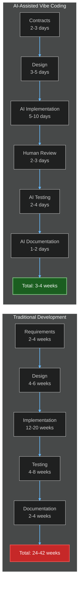
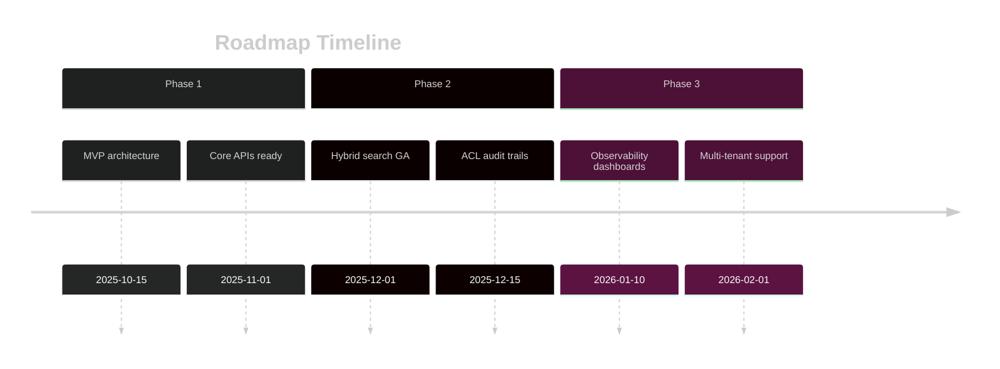
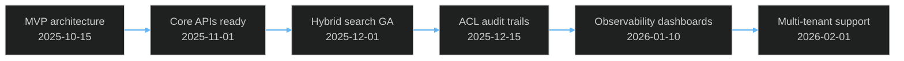

# RAGE Development Roadmap

**Version**: 2.0  
**Last Updated**: December 3, 2025  
**Timeline**: Q1 2026 - Q4 2027

---

## Table of Contents

1. [Executive Summary](#executive-summary)
2. [Effort Estimation Philosophy](#effort-estimation-philosophy)
3. [Phase 1: Foundation (Q1-Q2 2026)](#phase-1-foundation-q1-q2-2026)
4. [Phase 2: Advanced Features (Q3-Q4 2026)](#phase-2-advanced-features-q3-q4-2026)
5. [Phase 3: Enterprise Scale (Q1-Q2 2027)](#phase-3-enterprise-scale-q1-q2-2027)
6. [Phase 4: Ecosystem & Platform (Q3-Q4 2027)](#phase-4-ecosystem--platform-q3-q4-2027)
7. [Budget Estimates](#budget-estimates)
8. [Risks & Contingencies](#risks--contingencies)
9. [Success Metrics](#success-metrics)

---

## Executive Summary

RAGE development follows a **4-phase roadmap** designed for rapid delivery using **AI-assisted vibe coding**:

| Phase | Timeline | Focus | Team Size | Budget Range |
|-------|----------|-------|-----------|--------------|
| **Phase 1** | Q1-Q2 2026 | Core RAG + ACL + Integrations | 2-3 engineers | $50K-$100K |
| **Phase 2** | Q3-Q4 2026 | Advanced UI + Analytics + Agents | 2-4 engineers | $75K-$150K |
| **Phase 3** | Q1-Q2 2027 | Multi-tenancy + Federation | 3-5 engineers | $100K-$200K |
| **Phase 4** | Q3-Q4 2027 | Marketplace + Enterprise SaaS | 4-6 engineers | $150K-$300K |

**Total Estimated Cost (AI-Assisted)**: $375K - $750K over 24 months  
**Traditional Development Cost**: $2M - $5M over 36-48 months

**Time-to-Market Advantage**: **18-24 months faster** with AI-assisted development

---

## Effort Estimation Philosophy

### Human-Only vs AI-Assisted Development



### Release Timeline (Beta + Fallback)

Beta chart (if supported):



> Viewer Notes
> - This section includes Mermaid `timeline` (beta) with a flowchart fallback. If your viewer does not support beta charts, use the fallback block.
> - Flowchart nodes list dates inline to remain readable in plain renderers.

Fallback (standard flow):



### AI Efficiency Multipliers

| Task Type | Human Time | AI-Assisted Time | Efficiency Gain |
|-----------|------------|------------------|-----------------|
| **Boilerplate Code** | 100% | 10% | **10x faster** |
| **CRUD Operations** | 100% | 15% | **6.7x faster** |
| **API Contracts** | 100% | 20% | **5x faster** |
| **Unit Tests** | 100% | 25% | **4x faster** |
| **Documentation** | 100% | 15% | **6.7x faster** |
| **UI Components** | 100% | 30% | **3.3x faster** |
| **Complex Logic** | 100% | 60% | **1.7x faster** |
| **System Design** | 100% | 70% | **1.4x faster** |

**Average Efficiency**: ~4-5x faster across all tasks

### Token Budget Methodology

We estimate AI token consumption for each component:

```yaml
Token Budget Calculation:
  - Small Component (CRUD, simple API): 50K-150K tokens
  - Medium Component (complex logic, multi-file): 200K-500K tokens
  - Large Component (full subsystem): 500K-1M tokens
  - Integration Layer: 100K-300K tokens per integration
  
Token Costs (as of Nov 2025):
  - Claude Sonnet 3.5: $3 per 1M input tokens, $15 per 1M output tokens
  - GPT-4-turbo: $10 per 1M input tokens, $30 per 1M output tokens
  - Llama 3.1 (local): Free (hardware cost amortized)
  
Average Cost per Component:
  - Small: $5-$20
  - Medium: $25-$75
  - Large: $100-$300
```

---

## Phase 1: Foundation (Q1-Q2 2026)

**Goal**: Production-ready RAG platform with Confluence/Jira ingestion, ACL enforcement, Slack bot, and Admin UI.

### 1.1 Core Backend (Weeks 1-6)

#### RAG Core Service
```yaml
Component: RAG Core API
Functionality:
  - Query endpoint with hybrid search
  - Document ingestion pipeline
  - Chunk management
  - Embedding generation (Ollama, OpenAI)
  - Citation extraction
  
Token Budget: 800K tokens
Effort Estimate:
  Human-Only: 8-10 weeks (2 backend engineers)
  AI-Assisted: 3-4 weeks (1 engineer + AI)
  
Key Files:
  - /backend/rag_core/api/query.py (100K tokens)
  - /backend/rag_core/ingest/pipeline.py (150K tokens)
  - /backend/rag_core/search/hybrid.py (200K tokens)
  - /backend/rag_core/embeddings/manager.py (100K tokens)
  - /backend/rag_core/citations/extractor.py (100K tokens)
  - Integration tests (150K tokens)
```

#### ACL Service
```yaml
Component: ACL & Permission Engine
Functionality:
  - Permission check API
  - Batch validation (100 checks/request)
  - ACL registration/updates
  - Identity mapping service
  - Audit logging with hash chains
  
Token Budget: 600K tokens
Effort Estimate:
  Human-Only: 6-8 weeks (2 backend engineers)
  AI-Assisted: 2-3 weeks (1 engineer + AI)
  
Key Files:
  - /backend/acl_service/api/permissions.py (120K tokens)
  - /backend/acl_service/engine/evaluator.py (150K tokens)
  - /backend/acl_service/identity/mapper.py (100K tokens)
  - /backend/acl_service/audit/logger.py (130K tokens)
  - ACL cache layer (100K tokens)
```

#### Search Engine Service
```yaml
Component: Hybrid Search Engine
Functionality:
  - Vector search (Qdrant)
  - Semantic search (Neo4j + embeddings)
  - BM25 full-text search (PostgreSQL)
  - Result re-ranking
  - Search strategy configuration
  
Token Budget: 500K tokens
Effort Estimate:
  Human-Only: 5-7 weeks (1-2 backend engineers)
  AI-Assisted: 2-3 weeks (1 engineer + AI)
  
Key Files:
  - /backend/search_engine/api/search.py (80K tokens)
  - /backend/search_engine/vector/qdrant_client.py (120K tokens)
  - /backend/search_engine/semantic/neo4j_client.py (100K tokens)
  - /backend/search_engine/bm25/postgres_search.py (80K tokens)
  - /backend/search_engine/ranking/reranker.py (120K tokens)
```

#### Database Schema & Migrations
```yaml
Component: PostgreSQL Schema + Alembic
Functionality:
  - Core tables (documents, chunks, queries, users)
  - ACL tables (permissions, identity mappings, audit logs)
  - Indexes for performance
  - Alembic migration scripts
  
Token Budget: 250K tokens
Effort Estimate:
  Human-Only: 2-3 weeks (1 backend engineer)
  AI-Assisted: 3-5 days (1 engineer + AI)
  
Key Files:
  - /backend/alembic/versions/*.py (100K tokens)
  - /backend/database/models/*.py (100K tokens)
  - /backend/database/seed_data.py (50K tokens)
```

### 1.2 Integrations (Weeks 3-8)

#### Confluence Ingestor
```yaml
Component: Confluence Workspace Sync
Functionality:
  - OAuth2 + PAT authentication
  - Workspace/space/page sync
  - Incremental updates (change detection)
  - ACL extraction from page restrictions
  - Attachment handling
  
Token Budget: 450K tokens
Effort Estimate:
  Human-Only: 4-6 weeks (1 backend engineer)
  AI-Assisted: 1.5-2 weeks (1 engineer + AI)
  
Key Files:
  - /backend/integrations/confluence/client.py (150K tokens)
  - /backend/integrations/confluence/sync.py (120K tokens)
  - /backend/integrations/confluence/acl_extractor.py (100K tokens)
  - /backend/integrations/confluence/webhooks.py (80K tokens)
```

#### Jira Agent
```yaml
Component: Jira Issue Ingestion
Functionality:
  - JQL query support
  - Issue, comment, attachment sync
  - Project-level ACL extraction
  - Custom field mapping
  - Webhook listeners for real-time updates
  
Token Budget: 400K tokens
Effort Estimate:
  Human-Only: 4-5 weeks (1 backend engineer)
  AI-Assisted: 1.5-2 weeks (1 engineer + AI)
  
Key Files:
  - /backend/integrations/jira/client.py (140K tokens)
  - /backend/integrations/jira/sync.py (110K tokens)
  - /backend/integrations/jira/acl_extractor.py (80K tokens)
  - /backend/integrations/jira/webhooks.py (70K tokens)
```

#### Slack Bot
```yaml
Component: Slack Integration & Bot
Functionality:
  - Slash commands (/ask, /search)
  - Interactive messages with citations
  - Thread replies
  - User identity mapping (Slack ↔ Confluence/Jira)
  - Channel access for ACL
  
Token Budget: 350K tokens
Effort Estimate:
  Human-Only: 3-4 weeks (1 backend engineer)
  AI-Assisted: 1-1.5 weeks (1 engineer + AI)
  
Key Files:
  - /backend/integrations/slack/bot.py (120K tokens)
  - /backend/integrations/slack/commands.py (100K tokens)
  - /backend/integrations/slack/identity.py (70K tokens)
  - /backend/integrations/slack/interactive.py (60K tokens)
```

#### User Profile Service (NEW)
```yaml
Component: User Profile & Personalization Engine
Functionality:
  - User profile management with preferences JSONB storage
  - Automatic behavioral learning from query patterns
  - Profile-based context injection into every query
  - Preference-driven agent/model routing
  - Interaction tracking and feedback recording
  - Personalized insights and recommendations
  
Token Budget: 450K tokens
Effort Estimate:
  Human-Only: 4-5 weeks (1 backend engineer)
  AI-Assisted: 1.5-2 weeks (1 engineer + AI)
  
Key Files:
  - /backend/profile_service/api/profiles.py (120K tokens)
  - /backend/profile_service/learning/behavioral.py (100K tokens)
  - /backend/profile_service/context/injector.py (90K tokens)
  - /backend/profile_service/insights/analyzer.py (80K tokens)
  - /backend/profile_service/models.py (60K tokens)
  
Contract: /contracts/profile-service.yaml (Port 8007)
```

### 1.3 Frontend (Weeks 4-10)

#### Admin UI (Mantine + React)
```yaml
Component: Admin Dashboard & Management
Functionality:
  - User management (create, edit, deactivate)
  - Identity mapping UI
  - Document ingestion monitoring
  - ACL rule editor
  - Audit log viewer
  - System settings
  - Netdata metrics dashboard (embedded)
  
Token Budget: 700K tokens
Effort Estimate:
  Human-Only: 8-10 weeks (2 frontend engineers)
  AI-Assisted: 3-4 weeks (1 engineer + AI)
  
Key Files:
  - /frontend/admin/src/pages/Users/*.tsx (150K tokens)
  - /frontend/admin/src/pages/Documents/*.tsx (100K tokens)
  - /frontend/admin/src/pages/ACL/*.tsx (120K tokens)
  - /frontend/admin/src/pages/Audit/*.tsx (100K tokens)
  - /frontend/admin/src/pages/Settings/*.tsx (80K tokens)
  - /frontend/admin/src/components/* (150K tokens)
```

#### User UI (Mantine + React)
```yaml
Component: User-Facing RAG Interface
Functionality:
  - Query interface with search
  - Answer display with citations
  - Document viewer (with ACL checks)
  - Query history
  - Saved queries/favorites
  - Cached answer management
  
Token Budget: 600K tokens
Effort Estimate:
  Human-Only: 6-8 weeks (2 frontend engineers)
  AI-Assisted: 2.5-3 weeks (1 engineer + AI)
  
Key Files:
  - /frontend/user/src/pages/Search/*.tsx (150K tokens)
  - /frontend/user/src/pages/History/*.tsx (100K tokens)
  - /frontend/user/src/pages/Documents/*.tsx (120K tokens)
  - /frontend/user/src/components/QueryInterface.tsx (100K tokens)
  - /frontend/user/src/components/AnswerDisplay.tsx (130K tokens)
```

### 1.4 Infrastructure & DevOps (Weeks 1-12)

#### Deployment Automation
```yaml
Component: Podman Compose + Deploy Script
Functionality:
  - Multi-compose organization (core, agents, integrations, data, monitoring)
  - Interactive setup wizard
  - Environment configuration
  - Secrets management
  - Health checks
  - Rollback support
  
Token Budget: 400K tokens
Effort Estimate:
  Human-Only: 4-5 weeks (1 DevOps engineer)
  AI-Assisted: 1-1.5 weeks (1 engineer + AI)
  
Key Files:
  - /scripts/deploy-rage.sh (150K tokens)
  - /compose/*.yml (150K tokens)
  - /scripts/setup-wizard.sh (100K tokens)
```

#### Monitoring (Netdata + Prometheus + Grafana)
```yaml
Component: Observability Stack
Functionality:
  - Netdata parent-child setup
  - Per-container metrics
  - Custom business metrics
  - Grafana dashboards
  - Alert rules
  
Token Budget: 300K tokens
Effort Estimate:
  Human-Only: 3-4 weeks (1 DevOps engineer)
  AI-Assisted: 1 week (1 engineer + AI)
  
Key Files:
  - /monitoring/netdata/parent.conf (50K tokens)
  - /monitoring/grafana/dashboards/*.json (100K tokens)
  - /monitoring/prometheus/alerts.yml (50K tokens)
  - /backend/*/metrics.py (100K tokens)
```

### Phase 1 Summary

**Total Token Budget**: ~6.65M tokens  
**Total AI Cost**: ~$1,700 - $2,800 (depending on model mix)

**Effort Estimates**:
- **Human-Only**: 60-80 weeks total → **14-20 months** with 3-5 engineers → **$500K-$1.7M**
- **AI-Assisted**: 21-28 weeks total → **5-7 months** with 2-3 engineers → **$60K-$250K**

**Deliverables**:
- ✅ Production-ready RAG API
- ✅ Confluence + Jira ingestion
- ✅ Slack bot integration
- ✅ Admin UI + User UI (Mantine)
- ✅ ACL enforcement at all layers
- ✅ Audit logging + identity mapping
- ✅ **User profile & personalization engine (NEW)**
- ✅ Podman deployment automation
- ✅ Netdata monitoring

---

## Phase 2: Advanced Features (Q3-Q4 2026)

**Goal**: Enhanced analytics, agent orchestration, shadcn/ui migration option, advanced search.

### 2.1 Analytics & Insights (Weeks 13-18)

#### Query Analytics
```yaml
Component: Advanced Query Analysis
Functionality:
  - Query performance tracking
  - Citation analysis
  - Answer quality metrics
  - User engagement tracking
  - Cost optimization (LLM token usage)
  
Token Budget: 350K tokens
Effort Estimate:
  Human-Only: 4-5 weeks
  AI-Assisted: 1.5-2 weeks
```

#### Usage Dashboard
```yaml
Component: Platform Usage Analytics
Functionality:
  - User activity heatmaps
  - Document popularity
  - Search trends
  - Integration health
  - Cost dashboard (LLM, compute, storage)
  
Token Budget: 400K tokens
Effort Estimate:
  Human-Only: 4-6 weeks
  AI-Assisted: 1.5-2 weeks
```

### 2.2 Agent Orchestration (Weeks 15-22)

#### Workflow Service (NEW)
```yaml
Component: Scheduled Workflow Automation
Functionality:
  - Workflow CRUD operations
  - Cron-based scheduling with timezone support
  - Event-triggered workflows with condition evaluation
  - Multi-step workflow execution with variable passing
  - Workflow templates for common patterns
  - Execution monitoring and history
  
Token Budget: 550K tokens
Effort Estimate:
  Human-Only: 6-7 weeks
  AI-Assisted: 2-2.5 weeks
  
Contract: /contracts/workflow-service.yaml (Port 8006)
```

#### Agent Framework
```yaml
Component: Agent Creation & Management
Functionality:
  - Manual agent creation (UI)
  - AI-assisted agent generation
  - Agent templates (Confluence expert, Jira bot, Code assistant)
  - MCP protocol implementation
  - Agent-to-agent communication
  
Token Budget: 800K tokens
Effort Estimate:
  Human-Only: 8-10 weeks
  AI-Assisted: 3-4 weeks
```

#### 3D Neural Network Visualization
```yaml
Component: Interactive Agent Topology
Functionality:
  - 3D graph visualization (Three.js or D3.js)
  - Real-time agent communication flow
  - Memory retrieval pathways
  - Agent performance metrics
  
Token Budget: 500K tokens
Effort Estimate:
  Human-Only: 5-7 weeks
  AI-Assisted: 2-2.5 weeks
```

### 2.3 UI Framework Abstraction (Weeks 16-20)

#### Component Abstraction Layer
```yaml
Component: UI Framework Adapter
Functionality:
  - Define component interface contracts
  - Mantine adapter (primary)
  - shadcn/ui adapter (secondary)
  - Runtime framework switching
  - Theme management system
  
Token Budget: 450K tokens
Effort Estimate:
  Human-Only: 5-6 weeks
  AI-Assisted: 2 weeks
```

#### shadcn/ui Migration
```yaml
Component: Alternative UI with shadcn/ui
Functionality:
  - Re-implement Admin UI with shadcn
  - Re-implement User UI with shadcn
  - Side-by-side comparison
  - User preference setting
  
Token Budget: 600K tokens
Effort Estimate:
  Human-Only: 6-8 weeks
  AI-Assisted: 2.5-3 weeks
```

### 2.4 Enhanced Search (Weeks 17-22)

#### Advanced Hybrid Search
```yaml
Component: Configurable Search Engines
Functionality:
  - Additional vector DBs (Pinecone, Weaviate, Milvus)
  - Elasticsearch integration
  - Custom ranking models
  - Search strategy A/B testing
  
Token Budget: 450K tokens
Effort Estimate:
  Human-Only: 5-6 weeks
  AI-Assisted: 2 weeks
```

#### Temporal Service (NEW)
```yaml
Component: Document Versioning & Time Travel
Functionality:
  - Automatic version creation on document updates
  - Complete version history with diffs
  - Time-based queries ("show me this doc from last month")
  - Timeline visualization of document evolution
  - Change attribution and audit trails
  - Rollback to previous versions
  - Temporal search (search docs as they existed at specific time)
  
Token Budget: 500K tokens
Effort Estimate:
  Human-Only: 5-7 weeks
  AI-Assisted: 2-2.5 weeks
  
Contract: /contracts/temporal-service.yaml (Port 8008)
```

### Phase 2 Summary

**Total Token Budget**: ~4.6M tokens  
**Total AI Cost**: ~$1,200 - $2,000

**Effort Estimates**:
- **Human-Only**: 48-61 weeks → **11-15 months** with 3-4 engineers → $450K-$1.2M
- **AI-Assisted**: 17-21 weeks → **4-5 months** with 2-3 engineers → $90K-$300K

**Deliverables**:
- ✅ Advanced analytics dashboard
- ✅ **Scheduled workflow automation (NEW)**
- ✅ Agent orchestration with 3D visualization
- ✅ shadcn/ui alternative UI
- ✅ UI framework abstraction layer
- ✅ Enhanced hybrid search with multiple engines
- ✅ **Document versioning & time travel (NEW)**
- ✅ Query history + favorites + citations

---

## Phase 3: Enterprise Scale (Q1-Q2 2027)

**Goal**: Multi-tenancy, distributed P2P network, knowledge federation, high-availability, enterprise security.

### 3.1 Multi-Tenancy (Weeks 23-30)

#### Tenant Management
```yaml
Component: Multi-Tenant Architecture
Functionality:
  - Tenant isolation (schema-per-tenant or tenant_id column)
  - Tenant provisioning API
  - Cross-tenant ACL (optional federation)
  - Tenant-specific configuration
  - Resource quotas per tenant
  
Token Budget: 700K tokens
Effort Estimate:
  Human-Only: 8-10 weeks
  AI-Assisted: 3-4 weeks
```

### 3.2 Distributed P2P Network - Layer 10 (Weeks 25-32) ⭐ NEW

#### libp2p Integration
```yaml
Component: P2P Networking Layer
Functionality:
  - libp2p node implementation (Rust)
  - Kademlia DHT for peer discovery
  - gossipsub for pub/sub messaging
  - mDNS for local network discovery
  - Noise protocol for encryption
  - QUIC + TCP transport protocols
  - NAT traversal (hole punching)
  
Documentation: /docs/NETWORK_LAYER.md
Token Budget: 950K tokens
Effort Estimate:
  Human-Only: 12-14 weeks
  AI-Assisted: 5-6 weeks
```

#### Hybrid CDN Integration
```yaml
Component: Multi-Provider CDN Management
Functionality:
  - Cloudflare integration (Americas)
  - Fastly integration (Europe)
  - AWS CloudFront integration (Asia)
  - Self-hosted Varnish/Nginx support
  - Geographic routing logic
  - Cache invalidation API
  - CDN analytics dashboard
  
Documentation: /contracts/cdn-service.yaml
Token Budget: 600K tokens
Effort Estimate:
  Human-Only: 8-10 weeks
  AI-Assisted: 3-4 weeks
```

#### Content Replication
```yaml
Component: Distributed Content Storage
Functionality:
  - Content-addressed storage (BLAKE3 hashing)
  - CRDT-based synchronization (Automerge)
  - Configurable replication factor (default: 3)
  - Geographic diversity enforcement
  - Replication status tracking
  - Automatic chunk distribution
  
Documentation: /docs/NETWORK_LAYER.md Section 4
Token Budget: 750K tokens
Effort Estimate:
  Human-Only: 10-12 weeks
  AI-Assisted: 4-5 weeks
```

### 3.3 Knowledge Network Federation (Weeks 26-34) ⭐ UPDATED

#### Federated Search with Trust Model
```yaml
Component: Cross-Organization Knowledge Sharing
Functionality:
  - Federated query protocol (mTLS)
  - ACL-aware federation with redaction
  - Explicit trust lists (single-org deployments)
  - Certificate-based PKI (multi-org)
  - Shared knowledge graph (Neo4j federation)
  - Citation attribution across orgs
  - Federated user identity mapping
  - Data sharing policies
  
Documentation: /docs/FEDERATION_GUIDE.md
Token Budget: 900K tokens
Effort Estimate:
  Human-Only: 12-14 weeks
  AI-Assisted: 5-6 weeks
```

### 3.3 High Availability (Weeks 26-32)

#### HA Architecture
```yaml
Component: Production HA Deployment
Functionality:
  - Database replication (PostgreSQL, Neo4j)
  - Service redundancy (load balancing)
  - Distributed caching (Valkey cluster)
  - Failover automation
  - Disaster recovery
  
Token Budget: 500K tokens
Effort Estimate:
  Human-Only: 6-8 weeks
  AI-Assisted: 2.5-3 weeks
```

### 3.4 Enterprise Security (Weeks 24-30)

#### SSO & Advanced Auth
```yaml
Component: Enterprise Authentication
Functionality:
  - SAML 2.0 support
  - OAuth2/OIDC (Okta, Azure AD, Google)
  - LDAP/Active Directory
  - MFA (TOTP, SMS, hardware keys)
  - IP allowlisting
  
Token Budget: 400K tokens
Effort Estimate:
  Human-Only: 5-6 weeks
  AI-Assisted: 2 weeks
```

### Phase 3 Summary

**Total Token Budget**: ~2.4M tokens  
**Total AI Cost**: ~$600 - $1,000

**Effort Estimates**:
- **Human-Only**: 29-36 weeks → **7-9 months** with 3-5 engineers → $400K-$1.2M
- **AI-Assisted**: 11.5-14 weeks → **3-3.5 months** with 2-4 engineers → $100K-$300K

**Deliverables**:
- ✅ Multi-tenancy support
- ✅ Federated knowledge networks
- ✅ High-availability deployment
- ✅ SSO + MFA + enterprise auth
- ✅ Data residency options

---

## Phase 4: Ecosystem & Platform (Q3-Q4 2027)

**Goal**: Agent marketplace, additional integrations, SaaS offering, community, **global knowledge federation**.

### 4.1 Agent Marketplace (Weeks 33-40)

#### Marketplace Platform
```yaml
Component: Agent Sharing & Discovery
Functionality:
  - Agent publishing (with ACL)
  - Agent templates store
  - Rating & reviews
  - Agent versioning
  - Monetization support (future)
  
Token Budget: 650K tokens
Effort Estimate:
  Human-Only: 7-9 weeks
  AI-Assisted: 3-3.5 weeks
```

### 4.2 Additional Integrations (Weeks 34-42)

#### Gmail Integration
```yaml
Component: Gmail Ingestion
Functionality:
  - OAuth2 authentication
  - Email sync with ACL
  - Attachment handling
  - Thread reconstruction
  
Token Budget: 350K tokens
Effort Estimate:
  Human-Only: 4-5 weeks
  AI-Assisted: 1.5-2 weeks
```

#### Notion Integration
```yaml
Component: Notion Workspace Sync
Functionality:
  - Notion API integration
  - Page/database sync
  - ACL extraction
  - Real-time updates
  
Token Budget: 400K tokens
Effort Estimate:
  Human-Only: 4-6 weeks
  AI-Assisted: 1.5-2 weeks
```

#### Linear Integration
```yaml
Component: Linear Issue Tracking
Functionality:
  - Linear GraphQL API
  - Issue/project sync
  - Team-based ACL
  - Webhook listeners
  
Token Budget: 350K tokens
Effort Estimate:
  Human-Only: 4-5 weeks
  AI-Assisted: 1.5-2 weeks
```

### 4.3 SaaS Platform (Weeks 36-44)

#### Multi-Region Deployment
```yaml
Component: Global SaaS Infrastructure
Functionality:
  - Regional deployments (US, EU, APAC)
  - Data residency compliance
  - CDN integration
  - Auto-scaling
  
Token Budget: 500K tokens
Effort Estimate:
  Human-Only: 6-8 weeks
  AI-Assisted: 2.5-3 weeks
```

#### Billing & Subscription
```yaml
Component: SaaS Billing System
Functionality:
  - Stripe integration
  - Subscription tiers
  - Usage-based pricing
  - Invoice generation
  
Token Budget: 400K tokens
Effort Estimate:
  Human-Only: 5-6 weeks
  AI-Assisted: 2 weeks
```

### 4.4 Community & Ecosystem (Weeks 38-44)

#### Developer Portal
```yaml
Component: Public API & SDK
Functionality:
  - API documentation (OpenAPI)
  - Python SDK
  - JavaScript SDK
  - CLI tool
  - Developer sandbox
  
Token Budget: 450K tokens
Effort Estimate:
  Human-Only: 5-7 weeks
  AI-Assisted: 2-2.5 weeks
```

### 4.5 Global Knowledge Federation (NEW - Weeks 40-48)

#### Federated Network Protocol
```yaml
Component: Decentralized Knowledge Network
Functionality:
  - Blockchain-backed content attribution (SHA-256 + GPG signatures)
  - Distributed ledger for immutable audit trails
  - Cross-organization knowledge sharing with trust levels
  - Author rights management and micropayment infrastructure
  - Federated search across trusted network nodes
  - Content provenance tracking (who created, when, where)
  - Anti-plagiarism and hallucination detection
  
Token Budget: 900K tokens
Effort Estimate:
  Human-Only: 10-12 weeks
  AI-Assisted: 4-5 weeks
  
Features:
  - Trust Levels: private, trusted_partners, open_knowledge, commercial
  - Revenue Sharing: 60% author, 30% node operator, 10% network maintenance
  - Attribution: Cryptographic proof of authorship
  - Privacy: Self-hosted nodes, data sovereignty
  - Truth Preservation: Source verification, no hallucinations
```

#### Author Rights & Micropayments
```yaml
Component: Content Monetization Platform
Functionality:
  - Author identity verification (GPG, blockchain wallet)
  - Content registration and copyright claims
  - Micropayment infrastructure (Lightning Network, Stripe)
  - Usage tracking and royalty distribution
  - Licensing tiers (CC-BY, commercial, restricted)
  - Dispute resolution system
  
Token Budget: 650K tokens
Effort Estimate:
  Human-Only: 7-9 weeks
  AI-Assisted: 3-3.5 weeks
```

#### Global Federation Dashboard
```yaml
Component: Network Visualization & Management
Functionality:
  - Network topology visualization
  - Node health monitoring
  - Trust relationship management
  - Content flow analytics
  - Revenue dashboard (author earnings)
  - Federated search UI
  
Token Budget: 550K tokens
Effort Estimate:
  Human-Only: 6-8 weeks
  AI-Assisted: 2.5-3 weeks
```

### Phase 4 Summary

**Total Token Budget**: ~5.2M tokens  
**Total AI Cost**: ~$1,400 - $2,200

**Effort Estimates**:
- **Human-Only**: 58-73 weeks → **14-18 months** with 4-6 engineers → $800K-$2M
- **AI-Assisted**: 23-28 weeks → **5.5-7 months** with 3-5 engineers → $250K-$600K

**Deliverables**:
- ✅ Agent marketplace
- ✅ Gmail + Notion + Linear integrations
- ✅ Multi-region SaaS deployment
- ✅ Billing & subscription system
- ✅ Public API + SDKs
- ✅ Developer community platform
- ✅ **Global federation protocol (NEW)**
- ✅ **Blockchain-backed attribution (NEW)**
- ✅ **Author rights & micropayments (NEW)**
- ✅ **Federated knowledge network (NEW)**

---

## Budget Estimates

### AI-Assisted Development (Recommended)

| Phase | Duration | Team Size | Cost Range | Deliverables |
|-------|----------|-----------|------------|--------------|
| **Phase 1** | 5-7 months | 2-3 engineers | $60K-$250K | Core platform + integrations + profiles |
| **Phase 2** | 4-5 months | 2-3 engineers | $90K-$300K | Analytics + workflows + agents + temporal |
| **Phase 3** | 3-3.5 months | 2-4 engineers | $100K-$300K | Multi-tenancy + federation + HA |
| **Phase 4** | 5.5-7 months | 3-5 engineers | $250K-$600K | Marketplace + SaaS + global federation |
| **Total** | **17.5-22.5 months** | **2-5 engineers** | **$500K-$1.45M** | **Full platform + global network** |

**Breakdown**:
- **Engineering Salaries**: $400K-$1.2M (depending on location, seniority)
- **AI Token Costs**: $6K-$10K total (Claude Sonnet 3.5 + GPT-4 mix)
- **Infrastructure**: $30K-$70K (AWS/GCP for dev/staging environments)
- **Third-Party Services**: $15K-$40K (Stripe, OAuth, blockchain nodes, monitoring tools)
- **Contingency (20%)**: $50K-$250K

### Human-Only Development (Traditional)

| Phase | Duration | Team Size | Cost Range | Deliverables |
|-------|----------|-----------|------------|--------------|
| **Phase 1** | 12-18 months | 3-5 engineers | $450K-$1.5M | Core platform + integrations |
| **Phase 2** | 9-12 months | 3-4 engineers | $350K-$1M | Analytics + agents + advanced UI |
| **Phase 3** | 7-9 months | 3-5 engineers | $400K-$1.2M | Multi-tenancy + federation + HA |
| **Phase 4** | 9-12 months | 4-6 engineers | $500K-$1.5M | Marketplace + SaaS + ecosystem |
| **Total** | **37-51 months** | **3-6 engineers** | **$1.7M-$5.2M** | **Full platform** |

**Comparison Summary**:

```
╔════════════════════════════════════════════════════════════════╗
║                    Development Comparison                      ║
╠════════════════════════════════════════════════════════════════╣
║                                                                ║
║  AI-Assisted:                                                  ║
║    Timeline: 17.5-22.5 months                                  ║
║    Cost: $500K-$1.45M                                          ║
║    Team: 2-5 engineers                                         ║
║                                                                ║
║  Traditional:                                                  ║
║    Timeline: 41-57 months                                      ║
║    Cost: $2M-$6M                                               ║
║    Team: 3-6 engineers                                         ║
║                                                                ║
║  SAVINGS:                                                      ║
║    ⚡ 23-35 months faster (2-3 years!)                         ║
║    💰 $1.5M-$4.6M cheaper (65-75% cost reduction)             ║
║    👥 1-2 fewer engineers needed                               ║
║                                                                ║
╚════════════════════════════════════════════════════════════════╝
```

---

## Risks & Contingencies

### Technical Risks

| Risk | Probability | Impact | Mitigation |
|------|-------------|--------|------------|
| **AI code quality issues** | Medium | Medium | Mandatory human code review, comprehensive testing |
| **Vector DB performance** | Low | High | Load testing, multiple DB options (Qdrant/Pinecone/Weaviate) |
| **Neo4j scaling challenges** | Medium | Medium | Sharding strategy, consider TigerGraph alternative |
| **LLM API rate limits** | Medium | Medium | Multi-provider support, local Ollama fallback |
| **Podman compatibility** | Low | Medium | Docker fallback option in all scripts |
| **ACL performance bottleneck** | Medium | High | Aggressive caching, batch operations, pre-computed permissions |

### Business Risks

| Risk | Probability | Impact | Mitigation |
|------|-------------|--------|------------|
| **Funding shortfall** | Medium | High | Phased funding approach, early MVP for demo/traction |
| **Slow customer adoption** | Medium | High | Focus on Phase 1 production-ready state, early beta users |
| **Competition (ChatGPT Enterprise)** | High | High | Emphasize self-hosted, ACL-native, multi-source advantages |
| **Team turnover** | Low | High | Comprehensive documentation, AI-rebuildable codebase |
| **Scope creep** | High | Medium | Strict phase boundaries, MVP-first mentality |

### Contingency Plans

```yaml
Phase 1 Delays:
  - If > 2 weeks behind: Cut Slack bot to Phase 2
  - If > 4 weeks behind: Defer Jira integration to Phase 2
  - If > 8 weeks behind: Admin UI minimal features only
  
Phase 2 Delays:
  - If > 2 weeks behind: Defer shadcn/ui to Phase 3
  - If > 4 weeks behind: Cut 3D visualization, use 2D graphs
  
Phase 3 Delays:
  - If > 2 weeks behind: Defer knowledge federation to Phase 4
  - If > 4 weeks behind: Cut multi-tenancy, single-tenant SaaS only
  
Phase 4 Delays:
  - Entire phase is optional for initial product-market fit
  - Can pivot based on market feedback
```

---

## Success Metrics

### Phase 1 Success Criteria

```yaml
Technical:
  - ✅ RAG query latency < 3 seconds (p95)
  - ✅ ACL check latency < 100ms (p99)
  - ✅ 95%+ uptime in production
  - ✅ Support 10K documents
  - ✅ Support 100 concurrent users
  
Business:
  - 🎯 3-5 beta customers
  - 🎯 $10K-$50K ARR
  - 🎯 Positive NPS (> 50)
  - 🎯 < 5% churn
```

### Phase 2 Success Criteria

```yaml
Technical:
  - ✅ Support 100K documents
  - ✅ Support 500 concurrent users
  - ✅ 5+ active agents per customer
  - ✅ Agent creation time < 5 minutes
  
Business:
  - 🎯 10-20 paying customers
  - 🎯 $100K-$300K ARR
  - 🎯 Customer case studies published
  - 🎯 Product-market fit evidence
```

### Phase 3 Success Criteria

```yaml
Technical:
  - ✅ Support 1M+ documents
  - ✅ Support 2K+ concurrent users
  - ✅ Multi-region deployment
  - ✅ 99.9% uptime SLA
  
Business:
  - 🎯 50-100 enterprise customers
  - 🎯 $500K-$1M ARR
  - 🎯 Enterprise contracts (> $50K ACV)
  - 🎯 Positive unit economics
```

### Phase 4 Success Criteria

```yaml
Technical:
  - ✅ 100+ agents in marketplace
  - ✅ 10M+ documents across all tenants
  - ✅ 10K+ concurrent users
  - ✅ 99.95% uptime SLA
  - ✅ 50+ federated network nodes
  - ✅ Blockchain attribution for 100% of content
  
Business:
  - 🎯 200+ customers
  - 🎯 $2M-$5M ARR
  - 🎯 Author revenue sharing operational
  - 🎯 Global federation network established
  - 🎯 Profitability or clear path to profitability
  - 🎯 Series A funding secured
```

---

## Appendix: Component Token Budgets

### Phase 1 Detailed Breakdown

```yaml
Backend:
  RAG Core API: 800K tokens
  ACL Service: 600K tokens
  Search Engine: 500K tokens
  Database Schema: 250K tokens
  Confluence Ingestor: 450K tokens
  Jira Agent: 400K tokens
  Slack Bot: 350K tokens
  Subtotal: 3.35M tokens

Frontend:
  Admin UI: 700K tokens
  User UI: 600K tokens
  Subtotal: 1.3M tokens

Infrastructure:
  Deployment Scripts: 400K tokens
  Monitoring Setup: 300K tokens
  Subtotal: 700K tokens

Testing & Documentation:
  Unit Tests: 300K tokens
  Integration Tests: 200K tokens
  API Documentation: 150K tokens
  User Guides: 100K tokens
  Subtotal: 750K tokens

Phase 1 Total: 6.1M tokens
```

---

**Roadmap Version**: 1.0  
**Last Updated**: November 25, 2025  
**Next Review**: Q4 2025 (before Phase 1 kickoff)

**Contact**: rage-team@company.com  
**Repository**: https://github.com/company/rage
