# RAGE Security & ACL System

## Table of Contents

- [Overview](#overview)
- [ACL Architecture](#acl-architecture)
- [End-to-End Permission Enforcement](#end-to-end-permission-enforcement)
- [Identity Mapping](#identity-mapping)
- [Audit Logging](#audit-logging)
- [GDPR Compliance](#gdpr-compliance)
- [Cached Answer Management](#cached-answer-management)
- [Federated ACL Enforcement (Layer 10)](#federated-acl-enforcement-layer-10)
- [Security Best Practices](#security-best-practices)
- [Threat Model](#threat-model)

---

## Overview

RAGE implements **defense-in-depth security** with fine-grained access control at every layer:

```mermaid
%%{init: {'theme':'dark', 'flowchart': {'nodeSpacing': 30, 'rankSpacing': 40, 'curve': 'basis'}}}%%
flowchart TD
    %% Title: Security Layers - Defense in Depth
    TITLE["🔒 Security Layers"]
    L1["1️⃣ Network Security<br/>TLS, Firewalls, Rate Limiting"]
    L2["2️⃣ Authentication<br/>JWT, OAuth 2.0, API Keys"]
    L3["3️⃣ Authorization<br/>ACL Service, RBAC"]
    L4["4️⃣ Data Protection<br/>PII Detection, Encryption"]
    L5["5️⃣ Audit Trail<br/>Immutable Logs, Hash Chains"]
    L6["6️⃣ Compliance<br/>GDPR, SOC 2, HIPAA-ready"]
    
    TITLE --> L1 --> L2 --> L3 --> L4 --> L5 --> L6
    
    classDef layer fill:#f3e5f5,stroke:#7b1fa2,stroke-width:2px;
    class L1,L2,L3,L4,L5,L6 layer;
    
    linkStyle default stroke:#64b5f6,stroke-width:2px;
```



**Key Principles:**
- ✅ **Zero Trust:** Every request validated, no implicit trust
- ✅ **Least Privilege:** Users see only what they're authorized to access
- ✅ **Defense in Depth:** Multiple security layers, no single point of failure
- ✅ **Audit Everything:** Complete trail for compliance and forensics
- ✅ **Privacy by Design:** GDPR compliance built-in, not bolted-on

---

## ACL Architecture

### ACL Payload Structure

Every document in RAGE has an embedded ACL payload:

```json
{
  "visibility": "org",
  "owner": "confluence:user:catalin",
  "users": [
    "confluence:user:alice",
    "slack:user:U12345ABC",
    "jira:user:bob@example.com"
  ],
  "groups": [
    "confluence:group:engineering",
    "slack:channel:C789XYZ",
    "confluence:space:ENG"
  ],
  "roles": ["reader", "editor", "admin"],
  "inherit": true,
  "source": {
    "type": "confluence",
    "space": "ENG",
    "page_id": "12345678",
    "acl_hash": "b9f2e6d4a1c8...",
    "last_validated_at": "2025-11-25T10:30:00Z"
  }
}
```

### ACL Fields Explained

| Field | Type | Description | Example |
|-------|------|-------------|---------|
| `visibility` | enum | Broadest access level | `public`, `org`, `private` |
| `owner` | string | External identity of resource owner | `confluence:user:catalin` |
| `users` | array | Explicit user access list | `["slack:user:U123"]` |
| `groups` | array | Group-based access | `["confluence:group:engineering"]` |
| `roles` | array | Role-based access | `["reader", "editor", "admin"]` |
| `inherit` | boolean | Inherit parent ACLs | `true` |
| `source` | object | ACL provenance metadata | See example above |

### Visibility Levels

```mermaid
%%{init: {'theme':'dark', 'flowchart': {'nodeSpacing': 30, 'rankSpacing': 40, 'curve': 'basis'}}}%%
graph TB
    Public[Public<br/>Anyone can access] --> Org[Organization<br/>Any org member can access]
    Org --> Private[Private<br/>Only specified users/groups/roles]
    
    Private --> UserCheck{User explicitly<br/>listed?}
    Private --> GroupCheck{In allowed<br/>group?}
    Private --> RoleCheck{Has required<br/>role?}
    
    UserCheck -->|Yes| Allow[✓ Access Granted]
    GroupCheck -->|Yes| Allow
    RoleCheck -->|Yes| Allow
    
    UserCheck -->|No| CheckInherit{Inherit<br/>enabled?}
    GroupCheck -->|No| CheckInherit
    RoleCheck -->|No| CheckInherit
    
    CheckInherit -->|Yes| ParentACL[Check Parent ACL]
    CheckInherit -->|No| Deny[✗ Access Denied]
    
    ParentACL --> UserCheck
    
    style Public fill:#1b5e20,stroke:#81c784,stroke-width:2px,color:#fff
    style Org fill:#f57f17,stroke:#ffd54f,stroke-width:2px,color:#000
    style Private fill:#bf360c,stroke:#ff8a65,stroke-width:2px,color:#fff
    style Allow fill:#2e7d32,stroke:#a5d6a7,stroke-width:3px,color:#fff
    style Deny fill:#b71c1c,stroke:#ef5350,stroke-width:3px,color:#fff
    
    linkStyle default stroke:#64b5f6,stroke-width:2px;
```



**Decision Logic:**

1. **Public:** Anyone can access (even unauthenticated)
2. **Org:** Any authenticated member of the organization
3. **Private:** Check users → groups → roles → inherit

---

## End-to-End Permission Enforcement

### 1. Ingestion-Time ACL Extraction

When documents are ingested, ACLs are extracted from the source system:

```python
# Confluence page ingestion
def extract_confluence_acl(page_id: str, confluence_client):
    """Extract ACL from Confluence page permissions."""
    
    # Get page restrictions
    restrictions = confluence_client.get_page_restrictions(page_id)
    
    # Get space permissions
    space_key = get_space_key(page_id)
    space_perms = confluence_client.get_space_permissions(space_key)
    
    # Build ACL payload
    acl = {
        "visibility": "org",  # Default for Confluence
        "owner": f"confluence:user:{page.creator}",
        "users": [],
        "groups": [],
        "roles": ["reader"],
        "inherit": True,
        "source": {
            "type": "confluence",
            "space": space_key,
            "page_id": page_id,
            "acl_hash": hashlib.sha256(
                json.dumps(restrictions, sort_keys=True).encode()
            ).hexdigest(),
            "last_validated_at": datetime.utcnow().isoformat()
        }
    }
    
    # Extract user permissions
    for restriction in restrictions.get("read", {}).get("restrictions", {}).get("user", {}).get("results", []):
        acl["users"].append(f"confluence:user:{restriction['username']}")
    
    # Extract group permissions
    for restriction in restrictions.get("read", {}).get("restrictions", {}).get("group", {}).get("results", []):
        acl["groups"].append(f"confluence:group:{restriction['name']}")
    
    # Add space-level groups
    for perm in space_perms.get("results", []):
        if perm["type"] == "group":
            acl["groups"].append(f"confluence:group:{perm['subject']['key']}")
    
    # Deduplicate
    acl["users"] = list(set(acl["users"]))
    acl["groups"] = list(set(acl["groups"]))
    
    return acl
```

**ACL Registration:**
```python
# Register ACL with ACL Service
response = acl_service_client.post("/api/acl/register", json={
    "resource_type": "document",
    "resource_id": document_id,
    "acl": acl_payload
})

acl_id = response.json()["acl_id"]
acl_hash = response.json()["acl_hash"]
```

### 2. Query-Time Permission Validation

Every search query filters results by user permissions:

```python
async def execute_rag_query(query: str, user_id: str):
    """Execute RAG query with ACL filtering."""
    
    # Step 1: Identity mapping (Slack → Confluence/Jira)
    external_identities = await identity_service.map_user(user_id)
    # Returns: ["slack:user:U123", "confluence:user:alice", "jira:user:alice@example.com"]
    
    # Step 2: Get group memberships
    groups = await identity_service.get_user_groups(external_identities)
    # Returns: ["confluence:group:engineering", "slack:channel:C789"]
    
    # Step 3: Hybrid search
    search_results = await search_engine.hybrid_search(
        query=query,
        top_k=50,  # Over-fetch for ACL filtering
        filters={"source_types": ["confluence", "jira"]}
    )
    
    # Step 4: ACL filtering (batch check for performance)
    acl_checks = [
        {
            "user_id": user_id,
            "resource_type": "document",
            "resource_id": result["document_id"],
            "action": "read"
        }
        for result in search_results
    ]
    
    acl_results = await acl_service.batch_check_permissions(acl_checks)
    
    # Step 5: Filter allowed results
    allowed_results = [
        result for result, acl_check in zip(search_results, acl_results)
        if acl_check["allowed"]
    ]
    
    # Step 6: Generate answer with LLM
    answer = await llm_provider.generate_answer(
        query=query,
        context=allowed_results[:10]  # Top 10 allowed results
    )
    
    return {
        "answer": answer,
        "citations": allowed_results[:10],
        "total_searched": len(search_results),
        "acl_filtered": len(search_results) - len(allowed_results)
    }
```

### 3. Display-Time Enforcement

Even in the UI, ACLs are enforced when displaying cached answers:

```typescript
// Frontend: User UI
async function displayCachedAnswer(queryId: string) {
  const response = await fetch(`/api/v1/queries/${queryId}`, {
    headers: {
      'Authorization': `Bearer ${accessToken}`
    }
  });
  
  if (response.status === 403) {
    // User no longer has access to this cached answer
    showError("You no longer have permission to view this answer.");
    return;
  }
  
  const data = await response.json();
  
  // Filter citations by current ACL state
  const visibleCitations = data.citations.filter(citation => {
    return citation.accessible;  // Backend re-checks ACL
  });
  
  renderAnswer(data.answer, visibleCitations);
}
```

### ACL Decision Flow (Detailed)


### ACL Caching Strategy

**Cache Key Format:**
```
acl:{user_id}:{resource_type}:{resource_id}:{action}
```

**Example:**
```
acl:usr_abc123:document:doc_xyz789:read
```

**Cache Value:**
```json
{
  "allowed": true,
  "reason": "User in 'engineering' group",
  "evaluated_at": "2025-11-25T10:30:00Z",
  "ttl": 300
}
```

**Cache Invalidation Events:**
1. User group membership changes → Invalidate all `acl:{user_id}:*`
2. ACL rules updated → Invalidate all `acl:*:document:{document_id}:*`
3. User removed from organization → Invalidate all `acl:{user_id}:*`
4. Manual invalidation (admin action)

**Performance Impact:**
- Cache hit: ~5-10ms ACL check
- Cache miss: ~50-100ms ACL check (DB query + evaluation)
- Batch check (100 resources): ~200-500ms with cache

---

## Identity Mapping

### External Identity Resolution

RAGE maps external identities from different systems to internal user IDs:

```mermaid
%%{init: {'theme':'dark', 'flowchart': {'nodeSpacing': 30, 'rankSpacing': 40, 'curve': 'basis'}}}%%
graph LR
    subgraph "External Identities"
        Slack[slack:user:U12345ABC]
        Conf[confluence:user:alice]
        Jira[jira:user:alice@example.com]
        Email[email:alice@example.com]
    end
    
    subgraph "Identity Mapping Service"
        Mapper[Identity Resolver]
    end
    
    subgraph "Internal Identity"
        Internal[usr_abc123<br/>Alice Smith<br/>alice@example.com]
    end
    
    Slack --> Mapper
    Conf --> Mapper
    Jira --> Mapper
    Email --> Mapper
    
    Mapper --> Internal
    
    style Internal fill:#1b5e20,stroke:#81c784,stroke-width:3px,color:#fff
    
    linkStyle default stroke:#64b5f6,stroke-width:2px;
```

### Identity Mapping Table

```sql
CREATE TABLE rage_identity_mappings (
    id UUID PRIMARY KEY,
    user_id UUID REFERENCES rage_identity_users(id),
    external_system VARCHAR(50) NOT NULL,  -- slack, confluence, jira, etc.
    external_id VARCHAR(255) NOT NULL,     -- U12345ABC, alice, alice@example.com
    external_email VARCHAR(255),
    external_display_name VARCHAR(255),
    is_verified BOOLEAN DEFAULT false,
    verification_method VARCHAR(50),        -- admin_verified, oauth_verified, email_verified
    created_at TIMESTAMP DEFAULT NOW(),
    verified_at TIMESTAMP,
    
    UNIQUE (external_system, external_id)
);
```

### Mapping Methods

#### 1. OAuth-Based Mapping (Automatic)
```python
# When user connects Confluence via OAuth
@app.post("/api/v1/auth/oauth/confluence/callback")
async def confluence_oauth_callback(code: str, state: str, user_id: str):
    # Exchange code for tokens
    tokens = await confluence_oauth_client.exchange_code(code)
    
    # Get Confluence user info
    conf_user = await confluence_client.get_current_user(tokens["access_token"])
    
    # Create identity mapping
    await identity_service.create_mapping(
        user_id=user_id,
        external_system="confluence",
        external_id=conf_user["username"],
        external_email=conf_user["email"],
        external_display_name=conf_user["displayName"],
        is_verified=True,
        verification_method="oauth_verified"
    )
```

#### 2. Email-Based Mapping (Semi-Automatic)
```python
# Match by email domain
@app.post("/api/v1/identity/auto-map")
async def auto_map_by_email(user_id: str):
    user = await db.get_user(user_id)
    email = user["email"]
    
    # Find Confluence user with same email
    conf_user = await confluence_client.find_user_by_email(email)
    if conf_user:
        await identity_service.create_mapping(
            user_id=user_id,
            external_system="confluence",
            external_id=conf_user["username"],
            external_email=conf_user["email"],
            is_verified=False,  # Requires admin verification
            verification_method="email_match"
        )
```

#### 3. Admin-Managed Mapping (Manual)
```python
# Admin explicitly maps users
@app.post("/api/v1/admin/identity/map")
async def admin_create_mapping(
    user_id: str,
    external_system: str,
    external_id: str,
    admin_user_id: str  # Requires admin role
):
    # Verify admin role
    if not await acl_service.has_role(admin_user_id, "admin"):
        raise HTTPException(403, "Admin role required")
    
    # Create mapping
    await identity_service.create_mapping(
        user_id=user_id,
        external_system=external_system,
        external_id=external_id,
        is_verified=True,
        verification_method="admin_verified"
    )
```

### Group Membership Resolution

```python
async def get_user_groups(external_identities: List[str]) -> List[str]:
    """Resolve all group memberships for a user."""
    groups = set()
    
    for identity in external_identities:
        system, id_type, id_value = identity.split(":", 2)
        
        if system == "confluence":
            # Fetch Confluence groups
            conf_groups = await confluence_client.get_user_groups(id_value)
            for group in conf_groups:
                groups.add(f"confluence:group:{group['name']}")
        
        elif system == "slack":
            # Fetch Slack channels
            slack_channels = await slack_client.get_user_channels(id_value)
            for channel in slack_channels:
                groups.add(f"slack:channel:{channel['id']}")
        
        elif system == "jira":
            # Fetch Jira groups
            jira_groups = await jira_client.get_user_groups(id_value)
            for group in jira_groups:
                groups.add(f"jira:group:{group['name']}")
    
    # Cache for 5 minutes
    await redis.setex(
        f"user_groups:{user_id}",
        300,
        json.dumps(list(groups))
    )
    
    return list(groups)
```

---

## Audit Logging

### Immutable Audit Trail with Hash Chains

Every permission check is logged with a hash chain linking to the previous entry:

```python
class AuditLog:
    """Immutable audit log with hash chain integrity."""
    
    async def log_permission_check(
        self,
        user_id: str,
        resource_type: str,
        resource_id: str,
        action: str,
        allowed: bool,
        reason: str,
        request_id: str,
        metadata: dict = None
    ):
        # Get last audit entry hash
        last_hash = await self._get_last_hash()
        
        # Create audit entry
        entry = {
            "timestamp": datetime.utcnow().isoformat(),
            "user_id": user_id,
            "resource_type": resource_type,
            "resource_id": resource_id,
            "action": action,
            "allowed": allowed,
            "reason": reason,
            "request_id": request_id,
            "metadata": metadata or {},
            "previous_hash": last_hash
        }
        
        # Compute hash of current entry
        entry_str = json.dumps(entry, sort_keys=True)
        current_hash = hashlib.sha256(entry_str.encode()).hexdigest()
        entry["hash_chain"] = current_hash
        
        # Store in database (immutable - no updates allowed)
        await db.execute("""
            INSERT INTO rage_acl_audit (
                timestamp, user_id, resource_type, resource_id,
                action, allowed, reason, request_id, metadata,
                hash_chain
            ) VALUES ($1, $2, $3, $4, $5, $6, $7, $8, $9, $10)
        """, *entry.values())
        
        # Update last hash cache
        await redis.set("audit:last_hash", current_hash)
        
        return entry
```

### Hash Chain Verification

```python
async def verify_audit_integrity():
    """Verify audit log hasn't been tampered with."""
    entries = await db.fetch("""
        SELECT * FROM rage_acl_audit
        ORDER BY timestamp ASC
    """)
    
    previous_hash = None
    for entry in entries:
        # Recompute hash
        entry_copy = dict(entry)
        stored_hash = entry_copy.pop("hash_chain")
        entry_copy["previous_hash"] = previous_hash
        
        computed_hash = hashlib.sha256(
            json.dumps(entry_copy, sort_keys=True).encode()
        ).hexdigest()
        
        if computed_hash != stored_hash:
            raise IntegrityError(
                f"Audit log tampered! Entry {entry['id']} hash mismatch"
            )
        
        previous_hash = stored_hash
    
    return True  # Integrity verified
```

### Audit Query Examples

```sql
-- Find all denied access attempts in last 24 hours
SELECT user_id, resource_type, resource_id, reason, timestamp
FROM rage_acl_audit
WHERE allowed = false
  AND timestamp > NOW() - INTERVAL '24 hours'
ORDER BY timestamp DESC;

-- Find all access attempts for a specific document
SELECT user_id, action, allowed, reason, timestamp
FROM rage_acl_audit
WHERE resource_type = 'document'
  AND resource_id = 'doc_xyz789'
ORDER BY timestamp DESC;

-- Find unusual access patterns (user accessing many denied resources)
SELECT user_id, COUNT(*) as denied_count
FROM rage_acl_audit
WHERE allowed = false
  AND timestamp > NOW() - INTERVAL '1 hour'
GROUP BY user_id
HAVING COUNT(*) > 10
ORDER BY denied_count DESC;
```

### Audit Dashboard (Admin UI)

```mermaid
%%{init: {'theme':'dark', 'flowchart': {'nodeSpacing': 30, 'rankSpacing': 40, 'curve': 'basis'}}}%%
flowchart TD
    %% Title: Security Audit Dashboard Overview
    DASH["📊 Security Audit Dashboard"]
    
    DENIED["🚫 Recent Denied Access (Last 24h)<br/>────────────────────────────<br/>10:45:23 │ bob@ex.com │ doc_abc123 │ Not in group<br/>10:42:15 │ jane@ex.com │ doc_xyz789 │ Not owner<br/>10:38:07 │ mike@ex.com │ doc_def456 │ No role"]
    
    PATTERNS["⚠️ Access Patterns (Suspicious)<br/>────────────────────────────<br/>contractor@... │ 45 denied, 5 allowed │ 90% │ 🚨<br/>newuser@... │ 12 denied, 88 allowed │ 12% │ ⚠️"]
    
    INTEGRITY["✅ Audit Log Integrity<br/>────────────────────────────<br/>Status: ✓ Verified<br/>Total Entries: 1,234,567<br/>Last Verification: 5 min ago<br/>Hash Chain: Intact"]
    
    DASH --> DENIED
    DASH --> PATTERNS
    DASH --> INTEGRITY
    
    classDef dashboard fill:#0d47a1,stroke:#64b5f6,stroke-width:3px,color:#fff;
    classDef alert fill:#b71c1c,stroke:#ef5350,stroke-width:2px,color:#fff;
    classDef ok fill:#1b5e20,stroke:#81c784,stroke-width:2px,color:#fff;
    
    class DASH dashboard;
    class DENIED,PATTERNS alert;
    class INTEGRITY ok;
    
    linkStyle default stroke:#64b5f6,stroke-width:2px;
```



---

## GDPR Compliance

### Discovery Module

RAGE's discovery module tracks data lineage and enables GDPR compliance:


### PII Detection

```python
from presidio_analyzer import AnalyzerEngine
from presidio_anonymizer import AnonymizerEngine

class PIIDetector:
    """Detect and scrub PII from documents."""
    
    def __init__(self):
        self.analyzer = AnalyzerEngine()
        self.anonymizer = AnonymizerEngine()
    
    async def detect_pii(self, text: str) -> List[dict]:
        """Detect PII entities in text."""
        results = self.analyzer.analyze(
            text=text,
            language="en",
            entities=[
                "PERSON", "EMAIL_ADDRESS", "PHONE_NUMBER",
                "CREDIT_CARD", "IBAN_CODE", "IP_ADDRESS",
                "SSN", "PASSPORT", "DRIVER_LICENSE"
            ]
        )
        
        return [
            {
                "type": result.entity_type,
                "start": result.start,
                "end": result.end,
                "score": result.score,
                "text": text[result.start:result.end]
            }
            for result in results
        ]
    
    async def scrub_pii(self, text: str, entities: List[str] = None) -> str:
        """Remove or redact PII from text."""
        results = self.analyzer.analyze(
            text=text,
            language="en",
            entities=entities or ["ALL"]
        )
        
        anonymized = self.anonymizer.anonymize(
            text=text,
            analyzer_results=results,
            operators={"DEFAULT": OperatorConfig("replace", {"new_value": "[REDACTED]"})}
        )
        
        return anonymized.text
```

### GDPR Data Subject Requests

#### 1. Right to Access (Data Export)

```python
@app.get("/api/v1/gdpr/export")
async def export_user_data(user_id: str, request_id: str):
    """Export all data associated with a user (GDPR Article 15)."""
    
    # Verify request is from user or admin
    if not await verify_data_subject_request(user_id, request_id):
        raise HTTPException(403, "Invalid request")
    
    # Collect all user data
    data_package = {
        "request_date": datetime.utcnow().isoformat(),
        "user_info": await db.get_user(user_id),
        "queries": await db.get_user_queries(user_id),
        "documents": await db.get_user_documents(user_id),
        "audit_logs": await db.get_user_audit_logs(user_id),
        "identity_mappings": await db.get_user_identity_mappings(user_id),
        "group_memberships": await identity_service.get_user_groups(user_id)
    }
    
    # Redact sensitive fields
    data_package["user_info"].pop("password_hash", None)
    
    # Create downloadable package
    zip_path = await create_gdpr_export_package(user_id, data_package)
    
    # Log export in audit trail
    await audit_log.log_gdpr_action(
        user_id=user_id,
        action="data_export",
        request_id=request_id
    )
    
    return FileResponse(zip_path)
```

#### 2. Right to Erasure (Right to be Forgotten)

```python
@app.post("/api/v1/gdpr/erase")
async def erase_user_data(user_id: str, request_id: str):
    """Erase all data associated with a user (GDPR Article 17)."""
    
    # Verify request
    if not await verify_data_subject_request(user_id, request_id):
        raise HTTPException(403, "Invalid request")
    
    # Start erasure process
    async with db.transaction():
        # 1. Soft delete user account
        await db.execute("""
            UPDATE rage_identity_users
            SET is_active = false,
                deleted_at = NOW(),
                email = CONCAT('deleted_', id, '@deleted.local'),
                full_name = 'Deleted User'
            WHERE id = $1
        """, user_id)
        
        # 2. Delete identity mappings
        await db.execute("""
            DELETE FROM rage_identity_mappings
            WHERE user_id = $1
        """, user_id)
        
        # 3. Delete OAuth credentials
        await db.execute("""
            DELETE FROM rage_identity_oauth
            WHERE user_id = $1
        """, user_id)
        
        # 4. Anonymize query history (keep for analytics, remove PII)
        await db.execute("""
            UPDATE rage_core_queries
            SET user_id = '00000000-0000-0000-0000-000000000000'
            WHERE user_id = $1
        """, user_id)
        
        # 5. Delete user-created documents
        await db.execute("""
            UPDATE rage_core_documents
            SET deleted_at = NOW()
            WHERE source_type = 'manual'
              AND metadata->>'created_by' = $1
        """, user_id)
        
        # 6. Audit logs are kept (legal requirement), but user_id is anonymized
        await db.execute("""
            UPDATE rage_acl_audit
            SET user_id = 'deleted_user',
                metadata = jsonb_set(
                    metadata,
                    '{original_user_id}',
                    to_jsonb($1::text)
                )
            WHERE user_id = $1
        """, user_id)
    
    # Log erasure
    await audit_log.log_gdpr_action(
        user_id=user_id,
        action="data_erasure",
        request_id=request_id
    )
    
    return {"status": "completed", "request_id": request_id}
```

### Enterprise Use Case: Knowledge Cutoff After Employee Departure

When an employee leaves, RAGE ensures they lose access immediately:

```python
@app.post("/api/v1/admin/offboard-user")
async def offboard_employee(
    user_id: str,
    admin_user_id: str,
    cutoff_date: datetime = None
):
    """Offboard employee and cut off knowledge access."""
    
    # Verify admin role
    if not await acl_service.has_role(admin_user_id, "admin"):
        raise HTTPException(403, "Admin role required")
    
    cutoff_date = cutoff_date or datetime.utcnow()
    
    async with db.transaction():
        # 1. Deactivate user account
        await db.execute("""
            UPDATE rage_identity_users
            SET is_active = false,
                last_access_cutoff = $2
            WHERE id = $1
        """, user_id, cutoff_date)
        
        # 2. Remove from all groups
        await identity_service.remove_from_all_groups(user_id)
        
        # 3. Invalidate all ACL caches for this user
        await redis.delete(f"acl:{user_id}:*")
        
        # 4. Revoke OAuth tokens
        await db.execute("""
            UPDATE rage_identity_oauth
            SET access_token = NULL,
                refresh_token = NULL
            WHERE user_id = $1
        """, user_id)
        
        # 5. Transfer document ownership (if specified)
        if transfer_to_user_id:
            await db.execute("""
                UPDATE rage_core_documents
                SET metadata = jsonb_set(
                    metadata,
                    '{owner}',
                    to_jsonb($2::text)
                )
                WHERE metadata->>'owner' = $1
                  AND deleted_at IS NULL
            """, user_id, transfer_to_user_id)
    
    # Log offboarding
    await audit_log.log_admin_action(
        admin_user_id=admin_user_id,
        action="user_offboarding",
        target_user_id=user_id,
        metadata={"cutoff_date": cutoff_date.isoformat()}
    )
    
    return {
        "status": "completed",
        "user_id": user_id,
        "cutoff_date": cutoff_date.isoformat(),
        "documents_transferred": transfer_count
    }
```

**Effect:**
- ✅ User immediately loses access to all documents
- ✅ Existing cached answers with this user's queries are inaccessible
- ✅ Audit trail preserved for compliance
- ✅ Document ownership transferred to new owner
- ✅ No lingering permissions or tokens

---

## Cached Answer Management

### Cache Structure

```python
class CachedAnswer:
    """Represents a cached RAG answer."""
    
    query_id: UUID
    query_text: str
    query_hash: str  # MD5 for exact cache
    query_embedding_id: str  # For semantic cache
    user_id: UUID
    answer_text: str
    citations: List[Citation]
    acl_snapshot: dict  # ACL state at time of caching
    created_at: datetime
    expires_at: datetime
    access_count: int
    last_accessed_at: datetime
```

### ACL-Aware Cache Invalidation

```python
async def invalidate_cache_on_acl_change(
    resource_type: str,
    resource_id: str,
    old_acl: dict,
    new_acl: dict
):
    """Invalidate cached answers when ACL changes."""
    
    # Compare ACLs
    acl_changed_fields = compare_acls(old_acl, new_acl)
    
    if not acl_changed_fields:
        return  # No changes
    
    # Find all cached answers that reference this resource
    cached_queries = await db.fetch("""
        SELECT DISTINCT query_id
        FROM rage_core_queries q
        WHERE q.citations @> $1::jsonb
          AND q.cached = true
    """, json.dumps([{"document_id": resource_id}]))
    
    # Invalidate caches
    for query in cached_queries:
        # Remove from exact cache
        await redis.delete(f"query:exact:{query['query_hash']}")
        
        # Remove from semantic cache
        await qdrant_client.delete_points(
            collection_name="query_cache",
            points_selector=[query["query_embedding_id"]]
        )
        
        # Mark as invalidated in DB
        await db.execute("""
            UPDATE rage_core_queries
            SET cached = false,
                metadata = jsonb_set(
                    metadata,
                    '{invalidation_reason}',
                    '"ACL changed"'
                )
            WHERE query_id = $1
        """, query["query_id"])
    
    # Log invalidation
    await audit_log.log_cache_invalidation(
        resource_id=resource_id,
        reason="ACL changed",
        affected_queries=len(cached_queries),
        changed_fields=acl_changed_fields
    )
```

### User Cache Management (User UI)

Users can manage their own cached answers:

```python
@app.get("/api/v1/user/queries")
async def get_user_queries(
    user_id: str,
    page: int = 1,
    page_size: int = 20,
    include_deleted: bool = False
):
    """Get user's query history."""
    
    queries = await db.fetch("""
        SELECT query_id, query_text, answer_text,
               created_at, cached, access_count
        FROM rage_core_queries
        WHERE user_id = $1
          AND (deleted_at IS NULL OR $2 = true)
        ORDER BY created_at DESC
        LIMIT $3 OFFSET $4
    """, user_id, include_deleted, page_size, (page - 1) * page_size)
    
    return {
        "items": queries,
        "page": page,
        "page_size": page_size
    }

@app.delete("/api/v1/user/queries/{query_id}")
async def delete_user_query(user_id: str, query_id: UUID):
    """Delete a cached query (user's own data)."""
    
    # Verify ownership
    query = await db.fetchrow("""
        SELECT user_id FROM rage_core_queries
        WHERE query_id = $1
    """, query_id)
    
    if not query or query["user_id"] != user_id:
        raise HTTPException(404, "Query not found")
    
    # Soft delete
    await db.execute("""
        UPDATE rage_core_queries
        SET deleted_at = NOW(),
            cached = false
        WHERE query_id = $1
    """, query_id)
    
    # Remove from cache
    await invalidate_query_cache(query_id)
    
    return {"status": "deleted"}

@app.put("/api/v1/admin/queries/{query_id}/acl")
async def update_cached_answer_acl(
    query_id: UUID,
    acl: dict,
    admin_user_id: str
):
    """Update ACL for a cached answer (admin only)."""
    
    # Verify admin role
    if not await acl_service.has_role(admin_user_id, "admin"):
        raise HTTPException(403, "Admin role required")
    
    # Update ACL snapshot
    await db.execute("""
        UPDATE rage_core_queries
        SET metadata = jsonb_set(
            metadata,
            '{acl_override}',
            $2::jsonb
        )
        WHERE query_id = $1
    """, query_id, json.dumps(acl))
    
    # Log change
    await audit_log.log_admin_action(
        admin_user_id=admin_user_id,
        action="cached_answer_acl_update",
        target_resource_id=str(query_id),
        metadata={"new_acl": acl}
    )
    
    return {"status": "updated"}
```

### Cache Statistics (Admin UI)

```mermaid
%%{init: {'theme':'dark', 'flowchart': {'nodeSpacing': 30, 'rankSpacing': 40, 'curve': 'basis'}}}%%
flowchart TD
    %% Title: Cached Answer Management Dashboard
    CACHE["💾 Cached Answer Management"]
    
    STATS["📊 Cache Statistics<br/>────────────────────────────<br/>Total Cached: 25,678<br/>Active Answers: 22,134<br/>Invalid Answers: 3,544"]
    
    TOP["🔝 Top Cached Queries<br/>────────────────────────────<br/>How do I deploy RAGE? │ 456 hits │ 2025-11-20<br/>What is RAG? │ 389 hits │ 2025-11-18<br/>Confluence API docs │ 234 hits │ 2025-11-22"]
    
    INVALID["🔄 Cache Invalidation (Last 7 days)<br/>────────────────────────────<br/>2025-11-25 │ ACL changed │ 45 answers, 12 docs<br/>2025-11-24 │ Document update │ 23 answers, 5 docs<br/>2025-11-23 │ Manual (admin) │ 8 answers, 8 docs"]
    
    CACHE --> STATS
    CACHE --> TOP
    CACHE --> INVALID
    
    classDef cache fill:#0d47a1,stroke:#64b5f6,stroke-width:3px,color:#fff;
    classDef info fill:#6a1b9a,stroke:#ce93d8,stroke-width:2px,color:#fff;
    
    class CACHE cache;
    class STATS,TOP,INVALID info;
    
    linkStyle default stroke:#64b5f6,stroke-width:2px;
```



---

## Federated ACL Enforcement (Layer 10)

**Status**: Design Phase (v0.2.0)  
**Documentation**: See `/docs/NETWORK_LAYER.md`, `/docs/FEDERATION_GUIDE.md`

### Overview

When RAGE instances form a federated network, ACL enforcement must span organizational boundaries while preserving security guarantees. This section describes how ACLs propagate and enforce across federated queries.

**Key Principles:**
- ✅ **Zero Trust Federation:** Remote orgs are untrusted by default, must be explicitly trusted
- ✅ **ACL Preservation:** Original ACLs always enforced, never weakened during federation
- ✅ **Explicit Consent:** Data sharing requires explicit trust relationship + matching ACLs
- ✅ **Audit Trail:** All cross-org queries logged in immutable audit trail

### Trust Verification Flow

Before any federated query is processed, the trust relationship must be validated:

```mermaid
sequenceDiagram
    participant LocalUser as Local User
    participant LocalAPI as Local RAGE API
    participant LocalACL as Local ACL Service
    participant TrustRegistry as Trust Registry (PostgreSQL)
    participant RemoteAPI as Remote RAGE API
    participant RemoteACL as Remote ACL Service
    participant RemoteDB as Remote Database

    LocalUser->>LocalAPI: POST /api/v1/query<br/>{query: "ML papers", federate: true}
    
    LocalAPI->>LocalACL: Validate local permissions
    LocalACL-->>LocalAPI: ✅ Authorized
    
    LocalAPI->>TrustRegistry: Check trust for remote orgs
    TrustRegistry-->>LocalAPI: Trust relationships:<br/>org-b (active), org-c (active)
    
    LocalAPI->>RemoteAPI: POST /api/v1/federation/query<br/>+ JWT token + certificate
    
    RemoteAPI->>TrustRegistry: Verify trust<br/>(cert fingerprint + status)
    
    alt Trust Invalid
        TrustRegistry-->>RemoteAPI: ❌ Trust suspended/revoked
        RemoteAPI-->>LocalAPI: 403 Forbidden
        LocalAPI->>AuditLog: Log federation denial
        LocalAPI-->>LocalUser: Error: Trust invalid
    else Trust Valid
        TrustRegistry-->>RemoteAPI: ✅ Trust active
        
        RemoteAPI->>RemoteACL: Map federated user<br/>(external_org_id, external_user_id)
        RemoteACL-->>RemoteAPI: Local shadow user ID
        
        RemoteAPI->>RemoteACL: Check ACLs for query<br/>(shadow user, sharing policy)
        
        alt ACL Denied
            RemoteACL-->>RemoteAPI: ❌ No matching ACLs
            RemoteAPI-->>LocalAPI: 403 Forbidden
            LocalAPI->>AuditLog: Log ACL denial
            LocalAPI-->>LocalUser: Error: Access denied
        else ACL Allowed
            RemoteACL-->>RemoteAPI: ✅ Authorized documents:<br/>doc-123, doc-456
            
            RemoteAPI->>RemoteDB: Query authorized docs
            RemoteDB-->>RemoteAPI: Results (with ACLs)
            
            RemoteAPI->>RemoteAPI: Apply redaction rules<br/>(remove PII, filter fields)
            
            RemoteAPI->>AuditLog: Log federated query success
            RemoteAPI-->>LocalAPI: 200 OK + results
            
            LocalAPI->>AuditLog: Log federated query receipt
            LocalAPI-->>LocalUser: Combined results<br/>(local + remote)
        end
    end
```



### Federated User Identity Mapping

External users must be mapped to local identities for ACL checks:

```mermaid
flowchart TD
    Start([Federated Query Received]) --> ExtractID[Extract external identity:<br/>org_id, user_id, email]
    
    ExtractID --> CheckMapping{User mapping<br/>exists?}
    
    CheckMapping -->|Yes| GetShadow[Load shadow user ID]
    CheckMapping -->|No| CreateMode{Auto-create<br/>enabled?}
    
    CreateMode -->|Yes| CreateShadow[Create shadow user:<br/>federated_user_mappings]
    CreateMode -->|No| DenyNoMapping[❌ Deny:<br/>No user mapping]
    
    CreateShadow --> VerifyTrust[Verify trust relationship<br/>+ capabilities]
    GetShadow --> VerifyTrust
    
    VerifyTrust --> CheckCaps{User has<br/>federated_query<br/>capability?}
    
    CheckCaps -->|No| DenyCaps[❌ Deny:<br/>Missing capability]
    CheckCaps -->|Yes| CheckACL[Check document ACLs<br/>against shadow user]
    
    CheckACL --> CheckSharing{Matches sharing<br/>policy rules?}
    
    CheckSharing -->|No| DenyACL[❌ Deny:<br/>ACL mismatch]
    CheckSharing -->|Yes| AllowQuery[✅ Allow query]
    
    DenyNoMapping --> AuditDeny[Log federation_audit_logs:<br/>event=acl_denial]
    DenyCaps --> AuditDeny
    DenyACL --> AuditDeny
    
    AllowQuery --> AuditAllow[Log federation_audit_logs:<br/>event=query_executed]
    
    AuditDeny --> End([Return 403 Forbidden])
    AuditAllow --> End2([Return Results])
    
    classDef success fill:#c8e6c9,stroke:#388e3c,stroke-width:2px;
    classDef deny fill:#ffcdd2,stroke:#c62828,stroke-width:2px;
    classDef process fill:#e1f5fe,stroke:#0277bd,stroke-width:2px;
    
    class AllowQuery,AuditAllow,End2 success;
    class DenyNoMapping,DenyCaps,DenyACL,AuditDeny,End deny;
    class ExtractID,GetShadow,CreateShadow,VerifyTrust,CheckACL process;
```



### Data Sharing Policy Evaluation

Each trust relationship has an associated sharing policy that filters which documents can be shared:

```mermaid
flowchart TD
    Start([Evaluate Sharing Policy]) --> LoadPolicy[Load data_sharing_policies<br/>for trust relationship]
    
    LoadPolicy --> ParseRules[Parse inclusion/exclusion rules]
    
    ParseRules --> CheckInclude{Document matches<br/>include rules?}
    
    CheckInclude -->|No| Deny1[❌ Exclude:<br/>Not in include list]
    CheckInclude -->|Yes| CheckExclude{Document matches<br/>exclude rules?}
    
    CheckExclude -->|Yes| Deny2[❌ Exclude:<br/>In exclude list]
    CheckExclude -->|No| CheckTags{Tags match<br/>sharing tags?}
    
    CheckTags -->|No| Deny3[❌ Exclude:<br/>Missing required tags]
    CheckTags -->|Yes| CheckApproval{Policy requires<br/>approval?}
    
    CheckApproval -->|Yes| CheckApproved{Document<br/>approved?}
    CheckApproved -->|No| Deny4[❌ Exclude:<br/>Not approved for sharing]
    
    CheckApproval -->|No| ApplyRedaction[Apply redaction rules]
    CheckApproved -->|Yes| ApplyRedaction
    
    ApplyRedaction --> CheckPII[Scan for PII patterns:<br/>SSN, credit cards, etc.]
    
    CheckPII --> Redact[Redact sensitive fields:<br/>Replace with [REDACTED]]
    
    Redact --> Allow[✅ Include in results]
    
    Deny1 --> AuditExclude[Log exclusion reason]
    Deny2 --> AuditExclude
    Deny3 --> AuditExclude
    Deny4 --> AuditExclude
    
    AuditExclude --> End([Document excluded])
    Allow --> End2([Document included<br/>with redactions])
    
    classDef success fill:#c8e6c9,stroke:#388e3c,stroke-width:2px;
    classDef deny fill:#ffcdd2,stroke:#c62828,stroke-width:2px;
    classDef process fill:#e1f5fe,stroke:#0277bd,stroke-width:2px;
    
    class Allow,End2 success;
    class Deny1,Deny2,Deny3,Deny4,AuditExclude,End deny;
    class LoadPolicy,ParseRules,ApplyRedaction,CheckPII,Redact process;
```

### Example: Sharing Policy Configuration

**Scenario**: Engineering org wants to share public documentation with partner org, but exclude internal-only content.

```json
{
  "id": "550e8400-e29b-41d4-a716-446655440000",
  "name": "Partner Documentation Sharing",
  "description": "Share public engineering docs with Partner Corp",
  "organization_id": "11111111-1111-1111-1111-111111111111",
  
  "rules": {
    "include": [
      {
        "source": "confluence",
        "space": "PUBLIC-DOCS",
        "labels": ["partner-visible", "external"]
      },
      {
        "source": "github",
        "repository": "public-api-docs",
        "branch": "main"
      }
    ],
    "exclude": [
      {
        "tags": ["confidential", "internal-only", "trade-secret"]
      },
      {
        "metadata": {
          "classification": "secret"
        }
      },
      {
        "source": "confluence",
        "labels": ["do-not-share"]
      }
    ]
  },
  
  "requires_approval": false,
  "auto_share": true,
  
  "redaction_rules": [
    {
      "pattern": "\\b\\d{3}-\\d{2}-\\d{4}\\b",
      "replacement": "[SSN REDACTED]",
      "description": "Social Security Numbers"
    },
    {
      "pattern": "\\b(?:AKIA|ASIA)[0-9A-Z]{16}\\b",
      "replacement": "[AWS KEY REDACTED]",
      "description": "AWS Access Keys"
    },
    {
      "field": "metadata.salary",
      "action": "remove",
      "description": "Remove salary information"
    },
    {
      "field": "acl.owner",
      "action": "anonymize",
      "replacement": "external-user",
      "description": "Anonymize document owners"
    }
  ]
}
```

### Federated ACL Decision Matrix

| Scenario | Local ACL | Remote Trust | Sharing Policy | Result |
|----------|-----------|--------------|----------------|--------|
| Public doc, trusted org | `visibility: public` | ✅ Active | ✅ Matches include rules | ✅ **Allow** |
| Org doc, trusted org | `visibility: org` | ✅ Active | ✅ Matches include rules | ✅ **Allow** |
| Private doc, trusted org | `visibility: private` | ✅ Active | ❌ Not in sharing policy | ❌ **Deny** |
| Public doc, untrusted org | `visibility: public` | ❌ No trust | N/A | ❌ **Deny** |
| Org doc, suspended trust | `visibility: org` | ⚠️ Suspended | N/A | ❌ **Deny** |
| Internal-tagged doc | `tags: ["internal-only"]` | ✅ Active | ❌ Excluded by policy | ❌ **Deny** |
| Approved doc | `visibility: org` | ✅ Active | ✅ Approved for sharing | ✅ **Allow** |

### Cross-Organization ACL Conflict Resolution

When the same document is replicated across multiple orgs with different ACLs:


**Conflict Resolution Rules:**

1. **Explicit Deny Wins**: If either ACL denies, query is denied
2. **Narrowest Visibility Wins**: `private` overrides `org` overrides `public`
3. **Smallest User Set Wins**: Intersection of allowed users from both ACLs
4. **Tag Union**: Document must match tags from both policies

### Federated Audit Trail

All federated ACL decisions are logged immutably:

```sql
-- Example audit log entries
INSERT INTO federation_audit_logs (
    event_type,
    local_org_id,
    remote_org_id,
    user_id,
    external_user_id,
    resource_type,
    resource_id,
    event_data,
    result,
    denial_reason,
    timestamp,
    log_hash
) VALUES (
    'query_executed',
    '11111111-1111-1111-1111-111111111111',
    'partner-corp',
    NULL,  -- Shadow user
    'partner-corp:user:alice@partner.com',
    'document',
    'doc-123',
    '{
        "query": "machine learning papers",
        "results_count": 15,
        "trust_id": "550e8400-e29b-41d4-a716-446655440000",
        "sharing_policy_id": "660e8400-e29b-41d4-a716-446655440001",
        "redactions_applied": 3
    }',
    'success',
    NULL,
    NOW(),
    'a3b2c1d4e5f6...'
);

-- Example denial
INSERT INTO federation_audit_logs (
    event_type,
    local_org_id,
    remote_org_id,
    external_user_id,
    resource_type,
    resource_id,
    result,
    denial_reason,
    timestamp,
    log_hash
) VALUES (
    'acl_denial',
    '11111111-1111-1111-1111-111111111111',
    'untrusted-org',
    'untrusted-org:user:eve@malicious.com',
    'document',
    'doc-456',
    'denied',
    'No trust relationship with untrusted-org',
    NOW(),
    'b4c3d2e1f0a9...'
);
```

### Security Considerations

**⚠️ Federation Security Risks:**

1. **Trust Misconfiguration**: Accidentally trusting malicious org
   - **Mitigation**: Require manual approval for new trusts, regular trust audits
   
2. **ACL Leakage**: Sharing more data than intended
   - **Mitigation**: Sharing policies default to deny-all, require explicit include rules
   
3. **Identity Spoofing**: Attacker impersonates federated user
   - **Mitigation**: Certificate-based authentication, mTLS for all federation traffic
   
4. **Stale ACLs**: ACLs not updated when source permissions change
   - **Mitigation**: Periodic ACL refresh (every 5 minutes), webhook-based updates
   
5. **Audit Log Tampering**: Attacker modifies federation logs
   - **Mitigation**: Hash chain with previous log hash, immutable append-only storage

**✅ Best Practices:**

- **Explicit Trust Only**: Never auto-trust orgs, require manual verification
- **Minimal Sharing**: Share only what's necessary, default to private
- **Time-Limited Trusts**: Set expiration dates for trust relationships
- **Regular Audits**: Review federation_audit_logs weekly for anomalies
- **Certificate Rotation**: Rotate federation certificates every 90 days
- **Monitoring**: Alert on unusual federation activity (spikes, denials, new orgs)

---

## Security Best Practices

### 1. Least Privilege Access

```yaml
Principle: Users should have minimum permissions needed

Implementation:
  - Default visibility: 'private' (not 'public')
  - Explicit grants only (no implicit trust)
  - Time-limited access tokens (15min TTL)
  - Regular permission audits
```

### 2. Defense in Depth

```yaml
Multiple security layers:
  - Network: TLS, firewalls, rate limiting
  - Application: Input validation, CSRF protection
  - Data: Encryption at rest, PII detection
  - Audit: Complete logging of all actions
```

### 3. Secure Defaults

```yaml
Configuration defaults prioritize security:
  - ACL enforcement: Always on (cannot be disabled)
  - Audit logging: Always on
  - TLS: Required for production
  - PII detection: Enabled by default
  - Session TTL: Short (15 min)
```

### 4. Regular Security Reviews

```yaml
Schedule:
  - Weekly: Review audit logs for anomalies
  - Monthly: Permission audit (remove stale access)
  - Quarterly: Penetration testing
  - Annually: Full security audit
```

---

## Threat Model

### Threats & Mitigations

| Threat | Impact | Likelihood | Mitigation |
|--------|--------|------------|------------|
| **Unauthorized data access** | High | Medium | ACL enforcement at all layers, audit logging |
| **Token theft** | Medium | Medium | Short TTL, token rotation, HTTPS only |
| **SQL injection** | High | Low | ORM (SQLAlchemy), parameterized queries |
| **XSS attacks** | Medium | Low | CSP headers, input sanitization, React escaping |
| **DoS attacks** | Medium | Medium | Rate limiting, caching, circuit breakers |
| **Insider threat** | High | Low | Audit trails, principle of least privilege |
| **Data exfiltration** | High | Low | ACL filtering, download logging, DLP |
| **Session hijacking** | Medium | Low | Secure cookies, HTTPS, SameSite policy |
| **Privilege escalation** | High | Low | Role-based access, admin action logging |
| **Supply chain attacks** | High | Low | Dependency scanning (Dependabot), SCA tools |

### Incident Response Plan

```yaml
Detection:
  - Automated alerts on suspicious patterns
  - Anomaly detection in audit logs
  - User reports

Response:
  1. Identify: Determine scope and impact
  2. Contain: Revoke access, disable accounts
  3. Eradicate: Remove threat, patch vulnerabilities
  4. Recover: Restore services, verify integrity
  5. Post-Mortem: Document lessons learned

Recovery Time Objective (RTO): < 4 hours
Recovery Point Objective (RPO): < 15 minutes
```

---

**Document Version:** 1.0.0  
**Last Updated:** November 25, 2025  
**Maintained By:** RAGE Security Team
