# UI Framework Abstraction Layer Specification

**Version**: 1.0  
**Last Updated**: November 25, 2025  
**Purpose**: Enable runtime switching between UI frameworks (Mantine ↔ shadcn/ui ↔ future)

---

## 1. Executive Summary

### Problem Statement

Modern UI frameworks evolve rapidly. Mantine (current), shadcn/ui (rising), Ant Design, Chakra UI, and others compete for mindshare. Hard-coding to one framework creates:

- **Vendor lock-in**: Migrating takes months of refactoring
- **Technical debt**: Framework-specific code scattered everywhere
- **Migration risk**: Breaking changes force large rewrites

### Solution

An **adapter pattern-based abstraction layer** that:

1. Defines framework-agnostic component interfaces
2. Implements adapters for each framework (Mantine, shadcn/ui, etc.)
3. Allows runtime or compile-time framework selection
4. Centralizes theme management (colors, typography, spacing)
5. Provides seamless migration path between frameworks

### Benefits

```yaml
Developer Experience:
  - Single API to learn (not 3+ different frameworks)
  - Faster feature development (no framework research)
  - Easier onboarding (one abstraction, not N frameworks)

Business Value:
  - Future-proof UI (switch frameworks in days, not months)
  - Reduced technical debt (abstraction contains changes)
  - Lower risk (can test frameworks without full migration)

Migration Path:
  - Phase 1: Add abstraction layer (2 weeks)
  - Phase 2: Migrate components incrementally (1-2 per day)
  - Phase 3: Switch framework (1 day, flip config)
  - Phase 4: Remove old adapter (cleanup)
```

---

## 2. Architecture Overview

### 2.1 Component Layer Model

```mermaid
%%{init: {'theme':'dark'}}%%
graph TB
    %% Title: UI Framework Abstraction Layers
    APP["Application Layer<br/>React components using abstracted components<br/>import { Button, Input, Card } from '@rage/ui'"]
    
    ABS["Abstraction Layer<br/>Framework-agnostic component interfaces<br/>• Button.tsx (interface + default props)<br/>• Input.tsx<br/>• Card.tsx<br/>• ...30+ components"]
    
    ADAPT["Adapter Layer<br/>Framework-specific implementations"]
    
    MANT["Mantine Adapter<br/>Button.tsx<br/>Input.tsx<br/>..."]
    SHAD["shadcn/ui Adapter<br/>Button.tsx<br/>Input.tsx<br/>..."]
    ANT["Ant Design Adapter<br/>Button.tsx<br/>Input.tsx<br/>..."]
    CHAK["Chakra UI Adapter<br/>Button.tsx<br/>Input.tsx<br/>..."]
    
    FW["Framework Layer<br/>Actual UI framework libraries<br/>• @mantine/core, @mantine/hooks<br/>• shadcn/ui components<br/>• antd<br/>• @chakra-ui/react"]
    
    APP --> ABS
    ABS --> ADAPT
    ADAPT --> MANT
    ADAPT --> SHAD
    ADAPT --> ANT
    ADAPT --> CHAK
    MANT --> FW
    SHAD --> FW
    ANT --> FW
    CHAK --> FW
    
    classDef app fill:#0d47a1,stroke:#64b5f6,stroke-width:3px,color:#fff;
    classDef abs fill:#6a1b9a,stroke:#ce93d8,stroke-width:2px,color:#fff;
    classDef adapt fill:#f57f17,stroke:#ffd54f,stroke-width:2px,color:#000;
    classDef fw fill:#1b5e20,stroke:#81c784,stroke-width:2px,color:#fff;
    
    class APP app;
    class ABS abs;
    class ADAPT,MANT,SHAD,ANT,CHAK adapt;
    class FW fw;
    linkStyle default stroke:#64b5f6,stroke-width:2px;
```



---

### 2.2 Configuration-Driven Framework Selection

```typescript
// rage.config.ts
export default {
  ui: {
    framework: 'mantine', // 'mantine' | 'shadcn' | 'ant' | 'chakra'
    theme: {
      mode: 'dark', // 'light' | 'dark' | 'system'
      primaryColor: '#7C3AED',
      accentColor: '#06B6D4',
      fontFamily: 'Inter, sans-serif',
    },
  },
};
```

**Build-time selection** (Vite):
```typescript
// vite.config.ts
import { defineConfig } from 'vite';
import { resolve } from 'path';

export default defineConfig({
  resolve: {
    alias: {
      '@rage/ui': resolve(__dirname, `./src/ui-adapters/${process.env.UI_FRAMEWORK || 'mantine'}`),
    },
  },
});
```

**Runtime selection** (advanced):
```typescript
// App.tsx
import { UIProvider } from '@rage/ui';
import config from './rage.config';

function App() {
  return (
    <UIProvider framework={config.ui.framework}>
      <AppContent />
    </UIProvider>
  );
}
```

---

## 3. Component Interface Specification

### 3.1 Core Components (30 total)

```yaml
Form Components (7):
  - Button
  - Input
  - Textarea
  - Select
  - Checkbox
  - Radio
  - Switch

Data Display (8):
  - Table
  - Card
  - Badge
  - Avatar
  - Tooltip
  - Modal
  - Drawer
  - Tabs

Layout (5):
  - Container
  - Grid
  - Stack
  - Divider
  - Spacer

Feedback (5):
  - Alert
  - Progress
  - Spinner
  - Skeleton
  - Toast

Navigation (5):
  - Menu
  - Breadcrumb
  - Pagination
  - Stepper
  - Link
```

---

### 3.2 Interface Definition Example: Button

```typescript
// src/ui-abstractions/Button/Button.types.ts

export type ButtonVariant = 'primary' | 'secondary' | 'outline' | 'ghost' | 'danger';
export type ButtonSize = 'xs' | 'sm' | 'md' | 'lg' | 'xl';

export interface ButtonProps {
  // Content
  children: React.ReactNode;
  leftIcon?: React.ReactNode;
  rightIcon?: React.ReactNode;
  
  // Styling
  variant?: ButtonVariant;
  size?: ButtonSize;
  fullWidth?: boolean;
  color?: string; // Overrides theme primary color
  
  // States
  disabled?: boolean;
  loading?: boolean;
  active?: boolean;
  
  // Behavior
  onClick?: (event: React.MouseEvent<HTMLButtonElement>) => void;
  type?: 'button' | 'submit' | 'reset';
  
  // Accessibility
  'aria-label'?: string;
  'aria-describedby'?: string;
  
  // Advanced
  className?: string;
  style?: React.CSSProperties;
  testId?: string;
}
```

```typescript
// src/ui-abstractions/Button/Button.tsx

import type { ButtonProps } from './Button.types';

export const ButtonDefaults: Partial<ButtonProps> = {
  variant: 'primary',
  size: 'md',
  type: 'button',
  fullWidth: false,
  disabled: false,
  loading: false,
};

// Re-export adapter implementation
export { Button } from '@rage/ui-adapter';
```

---

### 3.3 Adapter Implementation: Mantine

```typescript
// src/ui-adapters/mantine/Button/Button.tsx

import { Button as MantineButton, Loader } from '@mantine/core';
import type { ButtonProps } from '@rage/ui-abstractions/Button/Button.types';
import { ButtonDefaults } from '@rage/ui-abstractions/Button/Button';

export function Button(props: ButtonProps) {
  const {
    children,
    leftIcon,
    rightIcon,
    variant = ButtonDefaults.variant,
    size = ButtonDefaults.size,
    fullWidth = ButtonDefaults.fullWidth,
    color,
    disabled = ButtonDefaults.disabled,
    loading = ButtonDefaults.loading,
    onClick,
    type = ButtonDefaults.type,
    className,
    style,
    testId,
    ...rest
  } = props;

  // Map abstraction variants to Mantine variants
  const mantineVariant = {
    primary: 'filled',
    secondary: 'light',
    outline: 'outline',
    ghost: 'subtle',
    danger: 'filled',
  }[variant];

  // Map abstraction sizes to Mantine sizes
  const mantineSize = {
    xs: 'xs',
    sm: 'sm',
    md: 'md',
    lg: 'lg',
    xl: 'xl',
  }[size];

  return (
    <MantineButton
      variant={mantineVariant}
      size={mantineSize}
      fullWidth={fullWidth}
      color={variant === 'danger' ? 'red' : color}
      disabled={disabled || loading}
      onClick={onClick}
      type={type}
      className={className}
      style={style}
      data-testid={testId}
      leftSection={loading ? <Loader size="xs" /> : leftIcon}
      rightSection={rightIcon}
      {...rest}
    >
      {children}
    </MantineButton>
  );
}
```

---

### 3.4 Adapter Implementation: shadcn/ui

```typescript
// src/ui-adapters/shadcn/Button/Button.tsx

import { Button as ShadcnButton } from '@/components/ui/button';
import { Loader2 } from 'lucide-react';
import type { ButtonProps } from '@rage/ui-abstractions/Button/Button.types';
import { ButtonDefaults } from '@rage/ui-abstractions/Button/Button';
import { cn } from '@/lib/utils';

export function Button(props: ButtonProps) {
  const {
    children,
    leftIcon,
    rightIcon,
    variant = ButtonDefaults.variant,
    size = ButtonDefaults.size,
    fullWidth = ButtonDefaults.fullWidth,
    disabled = ButtonDefaults.disabled,
    loading = ButtonDefaults.loading,
    onClick,
    type = ButtonDefaults.type,
    className,
    testId,
    ...rest
  } = props;

  // Map abstraction variants to shadcn variants
  const shadcnVariant = {
    primary: 'default',
    secondary: 'secondary',
    outline: 'outline',
    ghost: 'ghost',
    danger: 'destructive',
  }[variant];

  // Map abstraction sizes to shadcn sizes
  const shadcnSize = {
    xs: 'sm',
    sm: 'sm',
    md: 'default',
    lg: 'lg',
    xl: 'lg',
  }[size];

  return (
    <ShadcnButton
      variant={shadcnVariant}
      size={shadcnSize}
      disabled={disabled || loading}
      onClick={onClick}
      type={type}
      className={cn(fullWidth && 'w-full', className)}
      data-testid={testId}
      {...rest}
    >
      {loading && <Loader2 className="mr-2 h-4 w-4 animate-spin" />}
      {!loading && leftIcon && <span className="mr-2">{leftIcon}</span>}
      {children}
      {rightIcon && <span className="ml-2">{rightIcon}</span>}
    </ShadcnButton>
  );
}
```

---

## 4. Theme Management System

### 4.1 Theme Provider Architecture

```typescript
// src/theme/ThemeProvider.tsx

import { createContext, useContext, useEffect, useState } from 'react';
import { MantineProvider } from '@mantine/core';
import type { ThemeConfig } from './theme.types';

interface ThemeContextValue {
  theme: ThemeConfig;
  setTheme: (theme: Partial<ThemeConfig>) => void;
  toggleMode: () => void;
}

const ThemeContext = createContext<ThemeContextValue | undefined>(undefined);

export function ThemeProvider({ children }: { children: React.ReactNode }) {
  const [theme, setThemeState] = useState<ThemeConfig>(() => {
    // Load from localStorage
    const saved = localStorage.getItem('rage-theme');
    if (saved) return JSON.parse(saved);
    
    // Detect system preference
    const prefersDark = window.matchMedia('(prefers-color-scheme: dark)').matches;
    return {
      mode: prefersDark ? 'dark' : 'light',
      primaryColor: '#7C3AED',
      accentColor: '#06B6D4',
      fontFamily: 'Inter, sans-serif',
    };
  });

  const setTheme = (updates: Partial<ThemeConfig>) => {
    setThemeState(prev => {
      const newTheme = { ...prev, ...updates };
      localStorage.setItem('rage-theme', JSON.stringify(newTheme));
      return newTheme;
    });
  };

  const toggleMode = () => {
    setTheme({ mode: theme.mode === 'dark' ? 'light' : 'dark' });
  };

  // Listen for system theme changes
  useEffect(() => {
    const mediaQuery = window.matchMedia('(prefers-color-scheme: dark)');
    const handler = (e: MediaQueryListEvent) => {
      if (theme.mode === 'system') {
        setTheme({ mode: e.matches ? 'dark' : 'light' });
      }
    };
    mediaQuery.addEventListener('change', handler);
    return () => mediaQuery.removeEventListener('change', handler);
  }, [theme.mode]);

  // Apply theme to document
  useEffect(() => {
    document.documentElement.classList.toggle('dark', theme.mode === 'dark');
    document.documentElement.style.setProperty('--primary-color', theme.primaryColor);
    document.documentElement.style.setProperty('--accent-color', theme.accentColor);
  }, [theme]);

  return (
    <ThemeContext.Provider value={{ theme, setTheme, toggleMode }}>
      <MantineProvider theme={{
        colorScheme: theme.mode,
        primaryColor: 'violet',
        fontFamily: theme.fontFamily,
      }}>
        {children}
      </MantineProvider>
    </ThemeContext.Provider>
  );
}

export const useTheme = () => {
  const context = useContext(ThemeContext);
  if (!context) throw new Error('useTheme must be used within ThemeProvider');
  return context;
};
```

---

### 4.2 Theme Configuration

```typescript
// src/theme/theme.types.ts

export interface ThemeConfig {
  mode: 'light' | 'dark' | 'system';
  primaryColor: string;
  accentColor: string;
  fontFamily: string;
  spacing: SpacingConfig;
  radius: RadiusConfig;
}

export interface SpacingConfig {
  xs: string;
  sm: string;
  md: string;
  lg: string;
  xl: string;
}

export interface RadiusConfig {
  sm: string;
  md: string;
  lg: string;
}

export const defaultTheme: ThemeConfig = {
  mode: 'system',
  primaryColor: '#7C3AED', // Purple
  accentColor: '#06B6D4',  // Cyan
  fontFamily: 'Inter, -apple-system, BlinkMacSystemFont, "Segoe UI", sans-serif',
  spacing: {
    xs: '0.25rem', // 4px
    sm: '0.5rem',  // 8px
    md: '1rem',    // 16px
    lg: '1.5rem',  // 24px
    xl: '2rem',    // 32px
  },
  radius: {
    sm: '0.25rem', // 4px
    md: '0.5rem',  // 8px
    lg: '0.75rem', // 12px
  },
};
```

---

## 5. Migration Strategy

### 5.1 Phase 1: Add Abstraction Layer (Week 1-2)

**Tasks**:
1. Create abstraction layer structure:
   ```
   src/
     ui-abstractions/
       Button/
         Button.tsx
         Button.types.ts
         Button.test.tsx
       Input/
       ...
   ```

2. Define interfaces for all 30 components

3. Create Mantine adapter (current framework):
   ```
   src/
     ui-adapters/
       mantine/
         Button/Button.tsx
         Input/Input.tsx
         ...
         index.ts (re-exports)
   ```

4. Update build config (Vite) to alias `@rage/ui` → `mantine` adapter

5. Write tests for abstraction layer

**Success Criteria**: All interfaces defined, Mantine adapter 100% compatible

---

### 5.2 Phase 2: Incremental Migration (Weeks 3-6)

**Strategy**: Migrate 1-2 components per day

```typescript
// Before (direct Mantine usage):
import { Button } from '@mantine/core';

function MyComponent() {
  return <Button variant="filled">Submit</Button>;
}

// After (abstraction layer):
import { Button } from '@rage/ui';

function MyComponent() {
  return <Button variant="primary">Submit</Button>;
}
```

**Migration Checklist** (per component):
- [ ] Find all imports of old component (grep/search)
- [ ] Replace with abstracted component
- [ ] Update props to match abstraction interface
- [ ] Test in Storybook
- [ ] Commit (atomic commit per component)

**Automation** (optional):
```bash
# Codemod with jscodeshift
npx jscodeshift -t scripts/migrate-button.ts src/
```

---

### 5.3 Phase 3: Add shadcn/ui Adapter (Week 7)

**Tasks**:
1. Install shadcn/ui dependencies
2. Create shadcn adapter:
   ```
   src/
     ui-adapters/
       shadcn/
         Button/Button.tsx
         Input/Input.tsx
         ...
   ```

3. Map abstraction props to shadcn props

4. Test side-by-side (Mantine vs shadcn in dev)

**Testing Approach**:
```typescript
// Test both adapters with same props
describe('Button abstraction', () => {
  it('works with Mantine adapter', () => {
    // Test Mantine implementation
  });

  it('works with shadcn adapter', () => {
    // Test shadcn implementation
  });
});
```

---

### 5.4 Phase 4: Switch Framework (Day 1)

**Steps**:
1. Update config:
   ```diff
   // rage.config.ts
   export default {
     ui: {
   -   framework: 'mantine',
   +   framework: 'shadcn',
     },
   };
   ```

2. Rebuild app (Vite alias points to shadcn adapter)

3. QA entire app (visual regression testing)

4. Deploy canary (10% traffic)

5. Monitor metrics (error rate, user feedback)

6. Full rollout (100% traffic)

---

### 5.5 Phase 5: Cleanup (Week 8)

**Tasks**:
1. Remove Mantine dependencies (if fully migrated):
   ```bash
   npm uninstall @mantine/core @mantine/hooks
   ```

2. Delete Mantine adapter (optional, can keep for rollback)

3. Update documentation

4. Celebrate 🎉

---

## 6. Advanced Features

### 6.1 Variant Mapping System

**Problem**: Frameworks use different variant names

```typescript
// Abstraction variants:
type ButtonVariant = 'primary' | 'secondary' | 'outline' | 'ghost' | 'danger';

// Mantine variants:
type MantineVariant = 'filled' | 'light' | 'outline' | 'subtle' | 'default';

// shadcn variants:
type ShadcnVariant = 'default' | 'secondary' | 'outline' | 'ghost' | 'destructive';
```

**Solution**: Centralized mapping:

```typescript
// src/ui-adapters/mapping.ts

export const variantMappings = {
  mantine: {
    primary: 'filled',
    secondary: 'light',
    outline: 'outline',
    ghost: 'subtle',
    danger: 'filled',
  },
  shadcn: {
    primary: 'default',
    secondary: 'secondary',
    outline: 'outline',
    ghost: 'ghost',
    danger: 'destructive',
  },
};

export function mapVariant(
  framework: 'mantine' | 'shadcn',
  variant: ButtonVariant
): string {
  return variantMappings[framework][variant];
}
```

---

### 6.2 CSS-in-JS vs Tailwind Compatibility

**Challenge**: Mantine uses CSS-in-JS, shadcn uses Tailwind

**Solution**: Abstraction supports both

```typescript
// Mantine adapter (CSS-in-JS):
<MantineButton
  sx={{
    backgroundColor: theme.colors.violet[6],
    '&:hover': { backgroundColor: theme.colors.violet[7] },
  }}
>

// shadcn adapter (Tailwind):
<ShadcnButton
  className="bg-violet-600 hover:bg-violet-700"
>
```

**Abstraction API**:
```typescript
<Button
  color="violet" // Abstract color name
  className="custom-styles" // Optional Tailwind override
/>
```

---

### 6.3 Component Composition

**Example**: SearchInput (combines Input + Button)

```typescript
// src/ui-abstractions/SearchInput/SearchInput.tsx

import { Input } from '@rage/ui/Input';
import { Button } from '@rage/ui/Button';

export function SearchInput({ onSearch, placeholder }: SearchInputProps) {
  const [value, setValue] = useState('');

  return (
    <div className="flex gap-2">
      <Input
        value={value}
        onChange={(e) => setValue(e.target.value)}
        placeholder={placeholder}
        onKeyDown={(e) => e.key === 'Enter' && onSearch(value)}
      />
      <Button onClick={() => onSearch(value)}>
        Search
      </Button>
    </div>
  );
}
```

**Benefit**: Composition works regardless of underlying framework

---

## 7. Testing Strategy

### 7.1 Unit Tests (Component Level)

```typescript
// src/ui-abstractions/Button/Button.test.tsx

import { render, screen, fireEvent } from '@testing-library/react';
import { Button } from '@rage/ui';

describe('Button', () => {
  it('renders children', () => {
    render(<Button>Click me</Button>);
    expect(screen.getByText('Click me')).toBeInTheDocument();
  });

  it('calls onClick when clicked', () => {
    const onClick = jest.fn();
    render(<Button onClick={onClick}>Click</Button>);
    fireEvent.click(screen.getByText('Click'));
    expect(onClick).toHaveBeenCalledTimes(1);
  });

  it('shows loading state', () => {
    render(<Button loading>Loading</Button>);
    expect(screen.getByRole('button')).toBeDisabled();
  });

  it('supports all variants', () => {
    const { rerender } = render(<Button variant="primary">Primary</Button>);
    // Test each variant renders without error
    ['secondary', 'outline', 'ghost', 'danger'].forEach(variant => {
      rerender(<Button variant={variant as any}>{variant}</Button>);
    });
  });
});
```

---

### 7.2 Visual Regression Tests (Storybook + Chromatic)

```typescript
// src/ui-abstractions/Button/Button.stories.tsx

import type { Meta, StoryObj } from '@storybook/react';
import { Button } from './Button';

const meta: Meta<typeof Button> = {
  title: 'Components/Button',
  component: Button,
  argTypes: {
    variant: {
      control: 'select',
      options: ['primary', 'secondary', 'outline', 'ghost', 'danger'],
    },
    size: {
      control: 'select',
      options: ['xs', 'sm', 'md', 'lg', 'xl'],
    },
  },
};

export default meta;
type Story = StoryObj<typeof Button>;

export const Primary: Story = {
  args: {
    children: 'Primary Button',
    variant: 'primary',
  },
};

export const AllVariants: Story = {
  render: () => (
    <div className="flex gap-2">
      <Button variant="primary">Primary</Button>
      <Button variant="secondary">Secondary</Button>
      <Button variant="outline">Outline</Button>
      <Button variant="ghost">Ghost</Button>
      <Button variant="danger">Danger</Button>
    </div>
  ),
};

export const AllSizes: Story = {
  render: () => (
    <div className="flex items-center gap-2">
      <Button size="xs">XS</Button>
      <Button size="sm">SM</Button>
      <Button size="md">MD</Button>
      <Button size="lg">LG</Button>
      <Button size="xl">XL</Button>
    </div>
  ),
};
```

**Chromatic Setup** (visual regression):
```bash
npm install --save-dev chromatic
npx chromatic --project-token=<token>
```

---

### 7.3 Integration Tests (Framework Switching)

```typescript
// tests/integration/framework-switch.test.ts

describe('Framework Switching', () => {
  it('renders same UI with Mantine', () => {
    process.env.UI_FRAMEWORK = 'mantine';
    const { container } = render(<App />);
    const snapshot1 = container.innerHTML;
    
    // Compare snapshots (should be functionally identical)
  });

  it('renders same UI with shadcn', () => {
    process.env.UI_FRAMEWORK = 'shadcn';
    const { container } = render(<App />);
    const snapshot2 = container.innerHTML;
    
    // Functional behavior should match
  });
});
```

---

## 8. Performance Considerations

### 8.1 Bundle Size Analysis

```yaml
Mantine (full):
  - @mantine/core: ~350 KB
  - @mantine/hooks: ~50 KB
  - Total: ~400 KB

shadcn/ui (tree-shakeable):
  - Individual components: ~5-20 KB each
  - Total (30 components): ~200 KB

Abstraction Overhead:
  - Interface definitions: ~10 KB
  - Adapter layer: ~50 KB
  - Total overhead: ~60 KB

Recommendation:
  - Use code splitting for large component libraries
  - Lazy load adapters if supporting multiple frameworks
```

---

### 8.2 Runtime Performance

```typescript
// Performance impact: Minimal (one function call overhead)

// Without abstraction:
<MantineButton variant="filled">Click</MantineButton>

// With abstraction:
<Button variant="primary">Click</Button>
  ↓ (function call)
<MantineButton variant="filled">Click</MantineButton>

// Overhead: <1ms per render (negligible)
```

---

## 9. Documentation & Developer Experience

### 9.1 Component Documentation

```typescript
/**
 * Button component with framework-agnostic API.
 * 
 * @example
 * ```tsx
 * <Button variant="primary" onClick={() => alert('Clicked')}>
 *   Click me
 * </Button>
 * ```
 * 
 * @example Loading state
 * ```tsx
 * <Button loading>Processing...</Button>
 * ```
 * 
 * @see https://docs.rage.ai/components/button
 */
export function Button(props: ButtonProps) { ... }
```

---

### 9.2 Migration Guide

```markdown
# Migrating from Mantine to Abstraction Layer

## Button

| Mantine Prop | Abstraction Prop | Notes |
|--------------|------------------|-------|
| `variant="filled"` | `variant="primary"` | Renamed for clarity |
| `variant="light"` | `variant="secondary"` | Renamed |
| `variant="subtle"` | `variant="ghost"` | Renamed |
| `leftSection` | `leftIcon` | Simplified naming |
| `rightSection` | `rightIcon` | Simplified naming |

## Input

| Mantine Prop | Abstraction Prop | Notes |
|--------------|------------------|-------|
| `error` (string) | `errorMessage` | More explicit |
| `description` | `helperText` | Renamed |
```

---

## 10. Future Roadmap

```yaml
Phase 1 (Complete):
  ✅ Define abstraction interfaces
  ✅ Mantine adapter

Phase 2 (In Progress):
  🔄 shadcn/ui adapter
  🔄 Theme management
  🔄 Migration tooling

Phase 3 (Q1 2026):
  ⏳ Ant Design adapter (enterprise option)
  ⏳ Chakra UI adapter (accessibility-first option)
  ⏳ Performance optimization (lazy loading)

Phase 4 (Q2 2026):
  ⏳ Custom framework adapter (for unique needs)
  ⏳ Component marketplace (community adapters)
  ⏳ Visual editor (no-code theme customization)
```

---

**Document Version**: 1.0  
**Last Updated**: November 25, 2025  
**Next Review**: After Phase 2 completion
