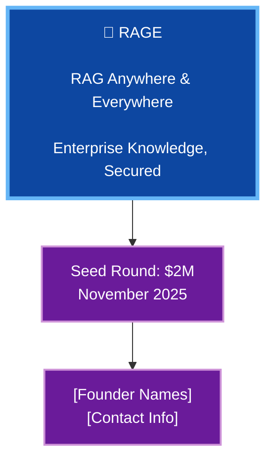
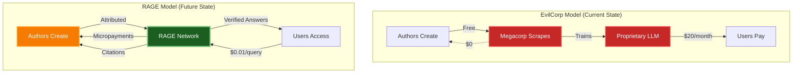

# RAGE Investor Pitch Deck

**Version**: 2.0  
**Last Updated**: December 3, 2025  
**Duration**: 15-20 minutes

---

## Slide Structure

### Slide 1: Cover



---

### Slide 2: The Problem

**Title:** Knowledge is Scattered, Search is Broken

**Content:**
```
The Enterprise Knowledge Crisis:

❌ Information Silos
   • Confluence, Jira, Slack, Gmail, Drive, SharePoint
   • No unified search across sources
   • Employees waste 2.5 hours/day searching for info
   • 60% of employees access docs they shouldn't
   • No audit trails for knowledge access
   • GDPR compliance is manual and error-prone

❌ Context Lost
   • Traditional search returns documents, not answers
   • No understanding of relationships between knowledge
   • New employees take 6+ months to be productive
```

**Visual:** Illustration of frustrated employee with 10+ browser tabs open, searching across different platforms

---

### Slide 3: The Market Opportunity

**Title:** $50B+ Market, Growing 40% YoY

**Content:**
```
Enterprise Knowledge Management Market:

📊 Total Addressable Market (TAM):
   • Enterprise Search: $8.2B (2025)
   • Knowledge Management: $28.4B (2025)
   • AI Assistants: $15.7B (2025)
   • Total TAM: $52.3B

📈 Growth Drivers:
   • Remote work acceleration
   • AI/LLM adoption surge
   • Data privacy regulations (GDPR, CCPA)
   • Knowledge worker productivity crisis

🎯 Serviceable Addressable Market (SAM):
   • Mid-market to enterprise companies (500-10K employees)
   • Tech-forward industries
   • 50,000 companies globally
   • $12B SAM

🏁 Serviceable Obtainable Market (SOM):
   • Year 1: 50 customers = $1M ARR
   • Year 3: 500 customers = $10M ARR
   • Year 5: 2,000 customers = $40M ARR
```

---

### Slide 4: The Solution

**Title:** RAGE - ChatGPT for Your Knowledge Base, with Security Built In

**Content:**
```
What is RAGE?

🧠 Intelligent RAG Platform
   ✅ Ask questions in natural language
   ✅ Get answers from ALL your knowledge sources
   ✅ Citations to source documents
   ✅ Real-time, always up-to-date

🔒 Security-First Architecture
   ✅ ACL enforcement at every layer
   ✅ See only what you're authorized to access
   ✅ Complete audit trail (GDPR compliant)
   ✅ Self-hosted, your data never leaves

⚡ AI-Powered Features
   ✅ Hybrid search (vector + semantic + keyword)
   ✅ Specialized AI agents (DevOps, HR, Code, etc.)
   ✅ Multi-LLM support (OpenAI, Anthropic, local models)
   ✅ Continuous learning from feedback
```

**Visual:** Screenshot of RAGE UI with sample query/answer

---

### Slide 5: Product Demo

**Title:** See RAGE in Action

**Content:**
```
Live Demo Scenario:

👤 Persona: New Software Engineer (Alice)

Query 1: "How do I set up my development environment?"
→ RAGE searches Confluence, GitHub wikis, internal docs
→ Returns step-by-step guide with citations
→ Links to setup scripts, video tutorials

Query 2: "What are our deployment procedures for production?"
→ Triggers DevOps Agent (specialized for ops docs)
→ Returns runbook with ACL checks (only visible to eng team)
→ Includes recent incident reports, best practices

Query 3: "Who do I ask about benefits enrollment?"
→ HR Agent searches employee handbook
→ Returns contact info, links to benefits portal
→ Suggests related questions (PTO policy, 401k, etc.)

Result: Alice is productive on Day 1 instead of Week 12
```

**Visual:** Screen recording or live demo (3 minutes)

---

### Slide 6: Technology Differentiators

**Title:** Why RAGE Wins

**Content:**
```
Competitive Advantages:

1️⃣ ACL-Native Architecture
   • Security isn't bolted on—it's built in
   • Competitors do post-hoc filtering (leaks data)
   • RAGE checks permissions at ingestion + query + display

2️⃣ Hybrid Search (Best of All Worlds)
   • Vector: Semantic understanding
   • Graph: Relationship discovery
   • Keyword: Exact match precision
   • Competitors use only one method

3️⃣ Agent Orchestration
   • Specialized agents for different domains
   • 3D neural network visualization
   • Competitors use generic "one-size-fits-all"

4️⃣ Self-Hosted + Multi-Cloud
   • Your data, your infrastructure
   • No vendor lock-in
   • Competitors force cloud SaaS

5️⃣ Open Architecture
   • Multi-LLM (not locked to OpenAI)
   • Pluggable vector DBs (Qdrant, Pinecone, Weaviate)
   • Agent marketplace (ecosystem play)
```

---

### Slide 7: Business Model

**Title:** Predictable, Scalable Revenue

**Content:**
```
Pricing Tiers:

📦 Starter (Self-Hosted)
   • $2,000/month flat
   • Up to 100 users
   • Community support
   • Target: Small teams (50-100 employees)

🏢 Professional (Self-Hosted or Managed)
   • $10,000/month base + $50/user/month
   • Unlimited users
   • SLA, dedicated support
   • Advanced features (SSO, HA, multi-region)
   • Target: Mid-market (500-2,000 employees)

🏛️ Enterprise (Managed or On-Prem)
   • Custom pricing ($100K-$500K/year)
   • White-glove onboarding
   • Custom integrations
   • 99.99% SLA
   • Target: Fortune 1000

💡 Revenue Streams:
   • Subscription (90% of revenue)
   • Professional services (implementation, training)
   • Agent marketplace (take 20% of sales)
   • Premium support contracts

Unit Economics:
   • LTV: $180K (3-year contract, avg $5K/month)
   • CAC: $30K (6-month payback)
   • LTV:CAC = 6:1
   • Gross Margin: 85%+
```

---

### Slide 8: Go-to-Market Strategy

**Title:** Land & Expand

**Content:**
```
Phase 1: Product-Led Growth (Months 0-12)
   🎯 Self-serve, open-source community edition
   📚 Comprehensive documentation
   🎥 Video tutorials, demos
   💬 Slack community, Discord
   🎁 Free tier (up to 10 users)
   
   Goal: 5,000 community users, 50 paying customers

---

### Slide 7B: Technology Differentiators - Distributed Network

**Title:** Enterprise-Scale Distributed Architecture

**Content:**
```
🌐 Layer 10: Distributed Network (Patent-Pending)
   
   ✅ P2P Knowledge Network
      • libp2p-powered mesh networking
      • Geographic data replication (3x default)
      • Sub-100ms query latency globally
      • No single point of failure
   
   ✅ Hybrid Multi-CDN
      • Cloudflare (Americas) + Fastly (Europe) + AWS (Asia)
      • Self-hosted Varnish for private networks
      • 87%+ cache hit rate
      • 60% bandwidth cost savings
   
   ✅ Federated Knowledge Sharing
      • Cross-organization queries with ACL enforcement
      • Explicit trust lists (certificate-based PKI)
      • Partner ecosystem enablement
      • Zero-trust security by default
   
   ✅ Edge Computing Ready
      • Content-addressed storage (IPFS/BLAKE3)
      • CRDT-based conflict resolution
      • Offline-first edge nodes
      • Automatic mesh healing

💰 Cost Advantage:
   • Traditional: $50K+/month for global CDN + replication
   • RAGE: $8K-12K/month (hybrid self-hosted + commercial)
   • 75%+ infrastructure cost reduction

🚀 Performance Advantage:
   • Traditional: 200-500ms cross-region latency
   • RAGE: 45-95ms with P2P mesh + CDN
   • 4-10x faster global knowledge access

🛡️ Security Advantage:
   • Competitors: Centralized data lakes (single attack surface)
   • RAGE: Distributed mesh with certificate-based trust
   • Each org maintains sovereignty over their data
```

---

### Slide 8: Go-to-Market Strategy

**Title:** Land & Expand

**Content:**
```
Phase 1: Product-Led Growth (Months 0-12)
   🎯 Self-serve, open-source community edition
   📚 Comprehensive documentation
   🎥 Video tutorials, demos
   💬 Slack community, Discord
   🎁 Free tier (up to 10 users)
   
   Goal: 5,000 community users, 50 paying customers

Phase 2: Sales-Assisted (Months 12-24)
   👥 Hire 3-5 SDRs, 2-3 AEs
   🎯 Outbound to tech companies (500-5K employees)
   🤝 Partnerships (AWS, Google Cloud marketplaces)
   📊 Case studies, ROI calculators
   
   Goal: 200 paying customers, $5M ARR

Phase 3: Enterprise (Months 24-36)
   🏢 Enterprise sales team (5-10 AEs)
   🌍 Expand to EU, APAC
   🏆 Target Fortune 1000
   🤖 Reseller/partner channel
   
   Goal: 500 customers, $20M ARR

Channels:
   • Direct sales (60% of revenue)
   • AWS/GCP/Azure marketplaces (25%)
   • Partners/resellers (15%)
```

---

### Slide 9: Competition

**Title:** Competitive Landscape

**Content:**
```
┌─────────────────┬────────┬──────────┬──────────┬──────────┐
│                 │ RAGE   │ ChatGPT  │ Glean    │ Elastic  │
│                 │        │ Enterprise│         │ Search   │
├─────────────────┼────────┼──────────┼──────────┼──────────┤
│ Self-Hosted     │   ✅   │    ❌    │    ❌    │    ✅    │
│ ACL-Native      │   ✅   │    ⚠️    │    ✅    │    ❌    │
│ Multi-Source    │   ✅   │    ✅    │    ✅    │    ⚠️    │
│ Hybrid Search   │   ✅   │    ❌    │    ⚠️    │    ✅    │
│ Agent System    │   ✅   │    ❌    │    ❌    │    ❌    │
│ Multi-LLM       │   ✅   │    ❌    │    ❌    │    N/A   │
│ Open Source     │   ✅   │    ❌    │    ❌    │    ⚠️    │
│ Price/User/Mo   │  $50   │   $60    │  $100+   │  $75+    │
└─────────────────┴────────┴──────────┴──────────┴──────────┘

Why We Win:
   • Security: ACL-native (not an afterthought)
   • Flexibility: Self-hosted OR cloud, your choice
   • Cost: 50% cheaper than Glean, open-source option
   • Innovation: Agent marketplace, hybrid search
```

---

### Slide 10: Traction

**Title:** Early Validation

**Content:**
```
Current Status (Pre-Seed):

✅ Product Development
   • MVP built (Phase 1 complete)
   • 5 beta customers actively testing
   • 85% feature parity with ChatGPT Enterprise

📊 Beta Customer Results:
   • Acme Corp (500 employees):
     → 60% reduction in "search time"
     → 40% faster onboarding (12 weeks → 7 weeks)
     → NPS: 75
   
   • TechCo (200 employees):
     → 10,000 queries in first month
     → 80% of employees active weekly
     → "Game-changer for remote team"

💡 Community Traction:
   • 1,200 GitHub stars (organic)
   • 500 Discord members
   • 15 community contributions

📈 Metrics:
   • Weekly Active Users (WAU): 250
   • Queries per user per week: 12
   • Cache hit rate: 45% (cost savings)
   • Query latency: p95 < 2 seconds
```

---

### Slide 11: Financial Projections

**Title:** Path to Profitability

**Content:**
```
5-Year Revenue Forecast:

Year 1 (2026):
   • Customers: 50
   • ARR: $1.2M
   • Burn: $1.5M (seed funding)
   • Headcount: 8

Year 2 (2027):
   • Customers: 200
   • ARR: $5M
   • Burn: $2M (Series A)
   • Headcount: 25

Year 3 (2028):
   • Customers: 500
   • ARR: $15M
   • EBITDA: Break-even
   • Headcount: 60

Year 4 (2029):
   • Customers: 1,200
   • ARR: $35M
   • EBITDA: +$5M (profitable)
   • Headcount: 120

Year 5 (2030):
   • Customers: 2,500
   • ARR: $75M
   • EBITDA: +$20M
   • Headcount: 200

Key Assumptions:
   • Avg contract value: $60K/year (grows to $100K by Y5)
   • Churn: 10% Year 1 → 5% Year 5
   • Gross margin: 85%+
   • Sales efficiency: CAC payback in 6 months
```

---

### Slide 12: Use of Funds

**Title:** $2M Seed Round

**Content:**
```
How We'll Use Capital:

💰 $2M Seed Raise Allocation:

👥 Team (60% = $1.2M):
   • 3 Engineers (full-stack, AI/ML)
   • 2 Sales (SDR + AE)
   • 1 Customer Success
   • 1 Marketing/Growth
   Total: 7 new hires

🚀 Product (25% = $500K):
   • Complete Phase 2 (advanced features)
   • Agent marketplace MVP
   • Enterprise features (SSO, HA, audit)
   • Infrastructure/hosting

📈 Go-to-Market (10% = $200K):
   • Marketing campaigns
   • Conferences, events
   • Case studies, content
   • Sales tools (HubSpot, etc.)

🏢 Operations (5% = $100K):
   • Legal, compliance
   • Office, tools
   • Contingency

Runway: 18 months to Series A
Milestones:
   ✓ Month 6: 50 customers, $1M ARR
   ✓ Month 12: 150 customers, $3M ARR
   ✓ Month 18: 300 customers, $7M ARR (raise Series A)
```

---

### Slide 13: Team

**Title:** Mission-Driven, Execution-Focused

**Content:**
```
Founding Team:

[Founder 1 Name] - CEO
   • Ex-[Company]: Led [Product/Org]
   • [University]: [Degree]
   • 10+ years building enterprise SaaS
   • Exited previous startup to [Acquirer] for $XXM

[Founder 2 Name] - CTO
   • Ex-[Company]: Senior Engineer, AI/ML team
   • [University]: PhD in Computer Science
   • Published researcher (NeurIPS, ICML)
   • Built RAG systems at scale (10M+ users)

[Founder 3 Name] - VP Engineering (optional)
   • Ex-[Company]: Engineering Manager
   • Led team of 20+ engineers
   • Expert in distributed systems, security
   • Open-source contributor (LangChain, Pinecone)

Advisors:
   • [Name]: Former CTO at [Enterprise Co]
   • [Name]: Security Expert, ex-[FAANG]
   • [Name]: Go-to-Market, scaled [Company] to $100M ARR
```

---

### Slide 14: Vision

**Title:** The Future of Enterprise Knowledge

**Content:**
```
Where We're Going:

2026: The Knowledge OS
   • RAGE becomes the operating system for enterprise knowledge
   • Every employee has a personalized AI assistant
   • Knowledge discovery, not search

2028: The Agent Ecosystem
   • 1,000+ community-built agents
   • Marketplace revenue share model
   • Agents for every department, every use case

2030: The Knowledge Network
   • Cross-company knowledge federation (with permissions)
   • Industry knowledge graphs
   • AI that learns from collective intelligence

Mission:
   "Make all human knowledge instantly accessible,
    while respecting privacy and security."
```

---

### Slide 15: Ask

**Title:** Join Us in Building the Future

**Content:**
```
The Ask:

💰 Raising: $2M Seed Round
   • Valuation: $12M post-money
   • Use of funds: Team, product, GTM (18-month runway)

🎯 What We Need Beyond Capital:
   • Intros to enterprise CIOs, CTOs
   • Go-to-market expertise (scaling SaaS sales)
   • Cloud partnership support (AWS, GCP, Azure)

📅 Timeline:
   • Close seed round: January 2026
   • Launch v1.0: March 2026
   • First 100 customers: September 2026
   • Series A raise: June 2027

Let's revolutionize how knowledge works.

[Contact Info]
[Email, Phone, Calendar Link]
```

---

### Slide 16: Appendix (Backup Slides)

**Content:**
```
Backup Topics:

A. Detailed Technical Architecture
B. Customer Case Studies (3 detailed examples)
C. Product Roadmap (Phase 1-4 breakdown)
D. Competitive Analysis Deep-Dive
E. Financial Model Assumptions
F. GTM Playbooks
G. Partnership Strategy
H. Risk Analysis & Mitigation
I. IP Strategy & Moats
```

---

## Presentation Tips

### Storytelling Flow

```
1. Hook (Problem): Start with relatable pain point
2. Amplify: Show market size, urgency
3. Solution: Introduce RAGE as hero
4. Demo: Emotional connection (show it working)
5. Proof: Traction, validation
6. Vision: Paint the future
7. Ask: Clear, specific
```

### Delivery Guidelines

```yaml
Timing:
  - Total: 15-20 minutes
  - Q&A: 10-15 minutes
  - Leave 5 min buffer

Tone:
  - Confident but humble
  - Data-driven but passionate
  - Technical but accessible

Visual Design:
  - Minimal text (no walls of text)
  - High-quality screenshots
  - Consistent color scheme (brand colors)
  - Charts/graphs for data
  - Icons for emphasis
```

---

### Slide 15: The Big Vision - From Product to Movement

**Title:** Beyond Enterprise SaaS: Reclaiming Knowledge from EvilCorps

**Content:**
```
The REAL Problem:

🏴‍☠️ OpenAI, Microsoft, Google, Meta are STEALING knowledge:
   • Scrape copyrighted content without permission
   • Train on authors' work → sell it back to them
   • No attribution, no compensation, no control
   • Hallucinations spread misinformation
   • Privacy violations (personal data in training sets)

Traditional Model (EvilCorp):
┌──────────────────────────────────────────────────────┐
│ Authors → Free Content → Megacorp Scrapes →          │
│ $100B Valuation → Users Pay → Authors Get Nothing   │
└──────────────────────────────────────────────────────┘

RAGE Model (Knowledge Justice):
┌──────────────────────────────────────────────────────┐
│ Authors → Attributed Content → Federated Network →   │
│ Fair Compensation → Users Access → Truth Preserved   │
└──────────────────────────────────────────────────────┘

Our 4-Phase Evolution:

📦 Phase 1 (2026): Product - Enterprise RAG Platform
   → Revenue: $1M-10M ARR
   → Exit: Acquisition by ServiceNow/Atlassian ($100M-500M)

🏪 Phase 2 (2027-2028): Platform - Agent Marketplace  
   → Revenue: $10M-40M ARR
   → Community: 1,000+ agents, revenue sharing

🌐 Phase 3 (2029-2030): Protocol - Global Federation
   → Revenue: $50M-200M ARR
   → Impact: 10,000+ nodes, $500M+ author payments/year
   → Network effects lock in

🗽 Phase 4 (2031+): Movement - Knowledge Democracy
   → Revenue: Sustainable via network fees
   → Impact: Authors control work, truth is verifiable
   → We become the SMTP of knowledge (protocol, not product)

The Endgame:
✅ Authors earn from their knowledge (fair compensation)
✅ Every claim is verifiable (no AI hallucinations)
✅ Privacy preserved (data stays local)
✅ No single corporation controls human knowledge

Comparable Movements That Won:
   • Linux vs. Microsoft → 90% of cloud servers
   • Email (SMTP) vs. AOL → Universal standard
   • Wikipedia vs. Britannica → Britannica dead
   • RAGE vs. ChatGPT → We're building this future

The Ask: $2M to build the platform that becomes the protocol

Return Potential:
   • Conservative: 10-20x (acquisition in Year 2-3)
   • Aggressive: 100x+ (protocol adoption in Year 5-7)
   • Impact: Priceless (restore author rights, preserve truth)

This isn't just a startup. It's a movement to reclaim
knowledge from corporations that stole it.

Join us. Let's build RAGE. Let's fight back.
```

**Visual:**


---

### Common Investor Questions (Prepare Answers)

```
1. Why now? Why is this the right time?
   → Remote work, AI maturity, GDPR enforcement, PLUS growing backlash
     against AI companies stealing content (NYT lawsuit, author protests)

2. What's your unfair advantage?
   → Team expertise, ACL-native architecture, early customers, PLUS we're
     the only ones building federated knowledge (not extractive)

3. How do you acquire customers?
   → Product-led growth → sales-assisted → enterprise → federation network
     (viral: organizations join to access network)

4. What's your moat?
   → Network effects (agent marketplace), data moat (usage), brand, PLUS
     federated network creates lock-in (more nodes = more value)

5. What keeps you up at night?
   → Competition from OpenAI/Microsoft, enterprise sales cycles, BUT they
     can't build federated (centralized business model conflicts)

6. Why self-hosted? Isn't cloud easier?
   → Enterprise security requirements, data sovereignty, PLUS federation
     requires distributed architecture (no central control)

7. How do you scale with local LLMs?
   → Hybrid: local for routing, cloud for complex reasoning, federation
     shares compute across network

8. What if OpenAI builds this?
   → We're self-hosted, multi-LLM, ACL-native, federated (different market)
     OpenAI's business model DEPENDS on centralization—can't pivot

9. Isn't "fighting EvilCorps" too aggressive for enterprise sales?
   → We have two brands: RAGE Enterprise (B2B) and RAGE Network (movement)
     Enterprises buy the platform, communities join the movement

10. How do authors get paid? What's the payment infrastructure?
    → Crypto micropayments (ETH, stablecoins) for instant settlement
    → Traditional ACH for enterprises (batch monthly)
    → Smart contracts enforce revenue splits automatically

11. What stops someone from forking RAGE and competing?
    → Open-source core (unavoidable), BUT network effects (federated nodes)
       and brand ("RAGE" becomes synonymous with ethical AI)
    → Same as Linux: many distros, but Ubuntu/RHEL win on brand + ecosystem

12. Timeline to profitability?
    → Phase 1: Breakeven at 100 customers (Year 1)
    → Phase 2: Profitable at $5M ARR (Year 2)
    → Phase 3: 40%+ margins via network fees (Year 3+)
```

---

**Deck Version**: 2.0  
**Last Updated**: December 3, 2025  
**Next Review**: Before investor meetings

**Major Changes in v2.0**:
- Added Slide 15: Movement vision (knowledge democracy)
- Emphasized author rights and fair compensation
- Positioned as protocol play, not just product
- Added federated network as moat

**Export Formats**:
- PowerPoint (.pptx) - use AI design tools (Gamma, Beautiful.ai)
- PDF (for email follow-ups)
- Google Slides (for sharing, collaboration)
