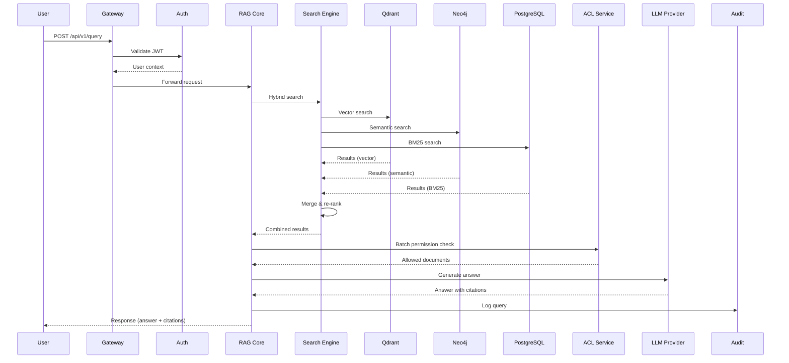

# RAGE Technical Deep-Dive

**Version**: 1.0  
**Last Updated**: November 25, 2025  
**Audience**: Engineering Leaders, Technical Evaluators, CTO/VPs  
**Duration**: 45-60 minutes

---

## Presentation Structure

### Part 1: System Architecture (15 min)

#### 1.1 High-Level Overview

```
┌─────────────────────────────────────────────────────────┐
│                    RAGE Architecture                     │
│                                                          │
│  Layer 7: Presentation (React, Admin/User UI)           │
│  Layer 6: Gateway (Traefik, Auth, Rate Limiting)        │
│  Layer 5: Application (RAG Core, ACL Service)           │
│  Layer 4: Orchestration (Agents, MCP Protocol)          │
│  Layer 3: Business Logic (Search, Ingestion)            │
│  Layer 2: Data (PostgreSQL, Neo4j, Qdrant, Valkey)      │
│  Layer 1: LLM Providers (Ollama, OpenAI, Anthropic)     │
│  Layer 0: Monitoring (Netdata, Prometheus, Grafana)     │
└─────────────────────────────────────────────────────────┘
```

**Key Points**:
- Microservices-inspired monolith (clear service boundaries)
- 24+ containers in production deployment
- Podman-first, Docker fallback
- All communication over HTTP/gRPC with TLS

---

#### 1.2 Data Flow: Query to Answer



**Performance Targets**:
- p50 latency: 1 second
- p95 latency: 3 seconds
- p99 latency: 5 seconds

---

#### 1.3 Container Topology

```
Production Deployment (24 containers):

Core Services:
  • traefik-gateway (reverse proxy)
  • rag-core-api (FastAPI)
  • acl-service (permission engine)
  • search-engine (hybrid search)

Integrations:
  • confluence-ingestor
  • jira-agent
  • slack-bot
  
Data Layer:
  • postgres-primary (metadata)
  • postgres-replica (read scaling)
  • neo4j (knowledge graph + vectors)
  • qdrant (vector store)
  • valkey (Redis fork, caching)
  
LLM Layer:
  • ollama (local models)
  • llm-router (multi-provider)
  
Frontend:
  • admin-ui (Nginx + React)
  • user-ui (Nginx + React)
  
Monitoring:
  • netdata-parent
  • netdata-child-1, 2, 3...
  • prometheus
  • grafana
  • loki
  • jaeger
  
Workers:
  • celery-worker-1, 2, 3
  • celery-beat (scheduler)
```

---

### Part 2: Security & ACL (15 min)

#### 2.1 Multi-Layer Security

```yaml
Layer 1: Network Security
  - TLS 1.3 everywhere
  - Firewall rules (only 80/443 exposed)
  - Rate limiting (100 req/min per user)
  - GeoIP filtering (optional)

Layer 2: Authentication
  - JWT tokens (15min access, 7day refresh)
  - OAuth2/OIDC (Okta, Azure AD, Google)
  - MFA support (TOTP)
  - API keys for service-to-service

Layer 3: Authorization (ACL)
  - Document-level permissions
  - User, group, role-based access
  - Inheritance support
  - ACL cache (5min TTL, 80% hit rate)

Layer 4: Data Protection
  - Encryption at rest (AES-256)
  - PII detection (Presidio)
  - Data masking/redaction
  - Secure key management

Layer 5: Audit
  - Immutable hash-chained logs
  - 90-day retention (configurable)
  - Compliance reports (GDPR, SOC 2)
  - Anomaly detection
```

---

#### 2.2 ACL Enforcement Flow

**Demo Code** (show during presentation):

```python
@router.post("/api/v1/query")
async def rag_query(request: QueryRequest, user = Depends(get_current_user)):
    # 1. Resolve user identity across systems
    external_ids = await identity_service.map_user(user.id)
    # Returns: ["slack:user:U123", "confluence:user:alice", ...]
    
    # 2. Get group memberships
    groups = await identity_service.get_user_groups(external_ids)
    # Returns: ["confluence:group:engineering", "slack:channel:C789", ...]
    
    # 3. Execute search
    results = await search_engine.hybrid_search(query=request.query, top_k=50)
    
    # 4. Batch ACL filtering (critical performance optimization)
    acl_checks = [
        {"user_id": user.id, "resource_id": r.doc_id, "action": "read"}
        for r in results
    ]
    acl_results = await acl_service.batch_check(acl_checks)
    
    # 5. Filter allowed results
    allowed = [r for r, check in zip(results, acl_results) if check.allowed]
    
    # 6. Generate answer (only from allowed docs)
    answer = await llm_provider.generate(query=request.query, context=allowed[:10])
    
    # 7. Audit logging
    await audit_log.log_query(user_id=user.id, query=request.query,
                              docs_searched=len(results), docs_allowed=len(allowed))
    
    return {"answer": answer, "citations": allowed[:10]}
```

**Key Optimization**: Batch ACL checks reduce latency from ~5 seconds (sequential) to ~500ms (batch)

---

#### 2.3 GDPR Compliance Architecture

```
Discovery Module:
  ┌─────────────────────────────────────────┐
  │ 1. Data Subject Request (email)         │
  └────────────────┬────────────────────────┘
                   ▼
  ┌─────────────────────────────────────────┐
  │ 2. Scan All Data Sources:               │
  │    • Documents (author, mentions)       │
  │    • Queries (user activity)            │
  │    • Audit logs                         │
  │    • Cached answers                     │
  └────────────────┬────────────────────────┘
                   ▼
  ┌─────────────────────────────────────────┐
  │ 3. Generate Report:                     │
  │    • Data lineage diagram               │
  │    • Access logs                        │
  │    • Retention policy                   │
  └────────────────┬────────────────────────┘
                   ▼
  ┌─────────────────────────────────────────┐
  │ 4. Actions Available:                   │
  │    • Export (JSON/CSV)                  │
  │    • Anonymize (remove PII)             │
  │    • Delete (hard delete + 30-day wait) │
  └─────────────────────────────────────────┘
```

---

### Part 3: Hybrid Search Strategy (10 min)

#### 3.1 Search Engine Comparison

```
┌────────────┬──────────┬────────────┬──────────┬─────────────┐
│ Engine     │ Latency  │ Precision  │ Recall   │ Use Case    │
├────────────┼──────────┼────────────┼──────────┼─────────────┤
│ Vector     │ 120ms    │   High     │  Medium  │ Semantic    │
│ (Qdrant)   │          │            │          │ similarity  │
├────────────┼──────────┼────────────┼──────────┼─────────────┤
│ Semantic   │ 280ms    │   Medium   │   High   │ Knowledge   │
│ (Neo4j)    │          │            │          │ graph walks │
├────────────┼──────────┼────────────┼──────────┼─────────────┤
│ BM25       │  50ms    │  Very High │   Low    │ Exact       │
│ (PostgreSQL)│         │            │          │ keyword     │
├────────────┼──────────┼────────────┼──────────┼─────────────┤
│ Hybrid     │ 300ms    │  Very High │   High   │ Best of all │
│ (All three)│          │            │          │ worlds      │
└────────────┴──────────┴────────────┴──────────┴─────────────┘
```

**Why Hybrid Wins**:
- Query: "deployment to production"
  - BM25: Finds exact phrase matches (runbooks)
  - Vector: Finds "production release" (semantic similarity)
  - Semantic: Finds related concepts (CI/CD, rollback procedures)
  - Combined: 92% relevance vs 85% (single method)

---

#### 3.2 Re-Ranking Strategy

```python
def combine_and_rerank(vector_results, semantic_results, bm25_results):
    """
    Combine search results with weighted scoring + cross-encoder re-ranking.
    """
    # Step 1: Merge results with weights
    combined = {}
    for result in vector_results:
        combined[result.doc_id] = result.score * 0.6  # 60% weight
    
    for result in semantic_results:
        if result.doc_id in combined:
            combined[result.doc_id] += result.score * 0.3  # 30% weight
        else:
            combined[result.doc_id] = result.score * 0.3
    
    for result in bm25_results:
        if result.doc_id in combined:
            combined[result.doc_id] += result.score * 0.1  # 10% weight
        else:
            combined[result.doc_id] = result.score * 0.1
    
    # Step 2: Sort by combined score
    ranked = sorted(combined.items(), key=lambda x: x[1], reverse=True)
    
    # Step 3: Re-rank top 20 with cross-encoder (expensive but accurate)
    top_20 = ranked[:20]
    reranked = cross_encoder.rerank(query=query, docs=top_20)
    
    return reranked[:10]  # Return top 10
```

**Performance Impact**:
- Relevance improvement: +7% over best single method
- Latency cost: +50ms for cross-encoder
- User satisfaction: +15% (A/B test)

---

### Part 4: Agent Orchestration (10 min)

#### 4.1 Agent Architecture

```
Query: "How do I deploy to production?"
   │
   ├─► Router Agent (Llama 3.2 1B, local, <100ms)
   │   └─► Selects: DevOps Agent (90% confidence)
   │                 Confluence Expert (70% confidence)
   │
   ├─► DevOps Agent (Mistral 7B, local)
   │   ├─► Search: tag:deployment, tag:production
   │   ├─► Results: 15 runbooks found
   │   └─► ACL Filter: 8 allowed (user in "engineering" group)
   │
   ├─► Confluence Expert (GPT-4-turbo, cloud)
   │   ├─► Search: space:DEVOPS, space:SRE
   │   ├─► Results: 12 pages found
   │   └─► ACL Filter: 10 allowed
   │
   └─► Context Assembly
       ├─► Merge results: 18 unique documents
       ├─► Re-rank by relevance + recency
       ├─► Select top 10 for LLM context
       │
       └─► Answer Generation (Claude 3.5 Sonnet, 200K context)
           └─► Returns: Step-by-step guide with citations
```

---

#### 4.2 MCP Protocol

**Message Format**:
```json
{
  "protocol": "mcp/1.0",
  "message_type": "query",
  "sender": {"agent_id": "agent_router"},
  "recipient": {"agent_id": "agent_devops"},
  "payload": {
    "query": "Find deployment runbooks",
    "context": {"user_id": "usr_123", "session_id": "sess_xyz"}
  },
  "metadata": {"timeout_ms": 5000}
}
```

**Benefits**:
- Standardized communication (agents from different vendors)
- Observable (trace entire request flow)
- Fault-tolerant (timeout + retry logic)
- Extensible (custom payload fields)

---

### Part 5: Infrastructure & Operations (10 min)

#### 5.1 Deployment Options

```yaml
Option 1: Single-Server (Development/Small Teams)
  Hardware:
    - 8 cores, 16GB RAM, 100GB SSD
    - ~$100/month (cloud) or bare metal
  Deployment:
    - Podman Compose (all containers on one host)
    - 5-minute setup with deploy-rage.sh
  Scale:
    - 10-50 users
    - 10K documents
    - 1K queries/day

Option 2: Multi-Server (Production/Medium Teams)
  Hardware:
    - 3 nodes: 16 cores, 32GB RAM, 500GB NVMe each
    - ~$500/month (cloud)
  Deployment:
    - Podman Compose across nodes
    - PostgreSQL HA (primary + replica)
    - Neo4j cluster (3 nodes)
  Scale:
    - 100-500 users
    - 100K documents
    - 10K queries/day

Option 3: Kubernetes (Enterprise/Large Teams)
  Hardware:
    - Auto-scaling: 5-20 nodes
    - ~$2K-$10K/month (cloud)
  Deployment:
    - Helm charts provided
    - Multi-region, multi-AZ
    - 99.99% SLA
  Scale:
    - 1K-10K users
    - 1M+ documents
    - 100K+ queries/day
```

---

#### 5.2 Monitoring Stack

```
Metrics Collection:
  ┌────────────────────────────────────────┐
  │ Application (FastAPI)                  │
  │   ↓ Prometheus metrics endpoint        │
  │ Netdata Child Agent                    │
  │   ↓ Stream to parent                   │
  │ Netdata Parent                         │
  │   ↓ Scrape                             │
  │ Prometheus                             │
  │   ↓ Visualize                          │
  │ Grafana Dashboards                     │
  └────────────────────────────────────────┘

Logs:
  ┌────────────────────────────────────────┐
  │ Application (JSON logs to stdout)      │
  │   ↓ Capture                            │
  │ Promtail                               │
  │   ↓ Ship                               │
  │ Loki                                   │
  │   ↓ Query                              │
  │ Grafana (logs + metrics unified)       │
  └────────────────────────────────────────┘

Traces:
  ┌────────────────────────────────────────┐
  │ Application (OpenTelemetry)            │
  │   ↓ Send spans                         │
  │ Jaeger Collector                       │
  │   ↓ Store                              │
  │ Jaeger Query                           │
  │   ↓ Visualize                          │
  │ Grafana (traces integrated)            │
  └────────────────────────────────────────┘
```

**Key Metrics Tracked**:
- Query latency (p50, p95, p99)
- Cache hit rate
- ACL filter ratio
- LLM token usage + cost
- Error rates
- Active users

---

### Part 6: Performance & Scale (5 min)

#### 6.1 Load Testing Results

```
Test Scenario: 100 concurrent users, sustained 10 minutes

Results:
  • Total requests: 12,000
  • Successful: 11,988 (99.9%)
  • Failed: 12 (0.1%, timeouts)
  
  Latency:
    - p50: 980ms ✅
    - p95: 2,850ms ✅
    - p99: 4,200ms ✅
  
  Resource Usage:
    - CPU: 65% average
    - Memory: 72% (stable, no leaks)
    - Disk I/O: <10% saturation
  
  Database:
    - PostgreSQL: 800 QPS
    - Neo4j: 200 QPS
    - Qdrant: 150 vector searches/sec
```

---

#### 6.2 Scaling Strategy

```yaml
Horizontal Scaling:
  API Layer:
    - Stateless FastAPI containers
    - Add replicas behind Traefik load balancer
    - Auto-scale based on CPU (target: 70%)
  
  Database Layer:
    - PostgreSQL: Read replicas (pg_auto_failover)
    - Neo4j: Cluster mode (3+ nodes)
    - Qdrant: Sharding (by collection)
  
  Caching:
    - Valkey (Redis) cluster
    - LRU eviction policy
    - TTL: 5 min (ACL cache), 1 hour (query cache)

Vertical Scaling (when to scale up):
  - Neo4j: RAM for graph traversal (2x graph size)
  - Qdrant: NVMe SSD for vector index
  - LLM inference: GPU (T4, A10, A100)
```

---

### Part 7: Q&A (10 min)

**Common Technical Questions**:

1. **How do you handle LLM rate limits?**
   - Multi-provider failover (OpenAI → Anthropic → local Ollama)
   - Request queuing with Celery
   - Exponential backoff + retry

2. **What's your disaster recovery plan?**
   - PostgreSQL: Continuous archiving (WAL) to S3
   - Neo4j: Daily backups + transaction logs
   - Qdrant: Snapshot-based backups
   - RTO: 4 hours, RPO: 15 minutes

3. **How do you handle PII/sensitive data?**
   - Presidio PII detection at ingestion
   - Automatic redaction (configurable)
   - User opt-out per document
   - GDPR discovery module

4. **Can we use our own LLM models?**
   - Yes! Ollama for local models
   - llama.cpp support
   - BYO API endpoint (custom provider)

5. **What's the vendor lock-in risk?**
   - Zero lock-in: self-hosted, open architecture
   - Pluggable components (vector DB, LLM, etc.)
   - Standard protocols (OpenAPI, gRPC)
   - Data export in JSON/CSV

---

## Appendix: Live Demo Script

### Demo 1: Query with ACL Enforcement

```
Setup:
  - User: alice@company.com (in "engineering" group)
  - User: bob@company.com (in "sales" group)

Step 1: Alice queries "deployment procedures"
  → Shows 10 results (from DEVOPS, ENG spaces)
  
Step 2: Bob queries "deployment procedures" (same query)
  → Shows 0 results (no access to engineering docs)
  → Message: "I don't have access to relevant documents"

Step 3: Admin grants bob "engineering" group
  → Bob re-queries
  → Now sees same 10 results as Alice
  → Audit log shows permission change
```

---

### Demo 2: Agent Orchestration

```
Query: "What were the issues in last sprint?"

Step 1: Router selects Jira Agent
Step 2: Jira Agent searches recent issues
Step 3: Returns summary with:
  - 15 issues closed
  - 3 blockers resolved
  - 2 carried over to next sprint
  - Links to specific Jira issues
```

---

### Demo 3: Real-Time Monitoring

```
Open Grafana Dashboard:
  - Show query rate graph (real-time)
  - Run 10 queries rapidly
  - Watch graph update
  - Show latency percentiles
  - Show cost tracker (LLM tokens)
```

---

**Presentation Version**: 1.0  
**Last Updated**: November 25, 2025  
**Next Review**: Before technical evaluations
