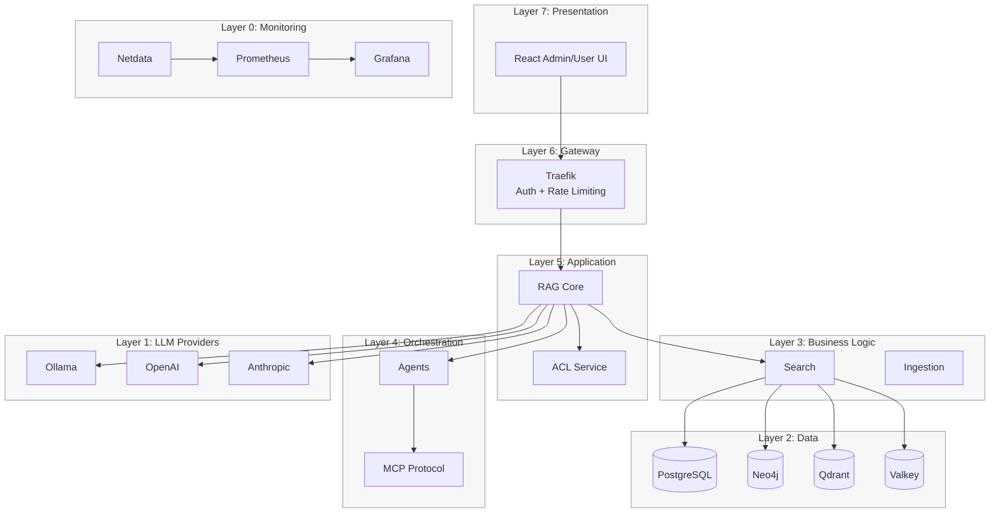
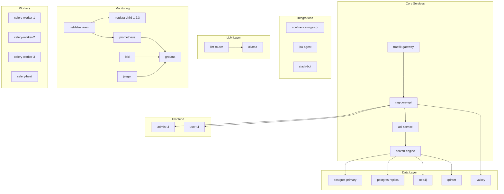
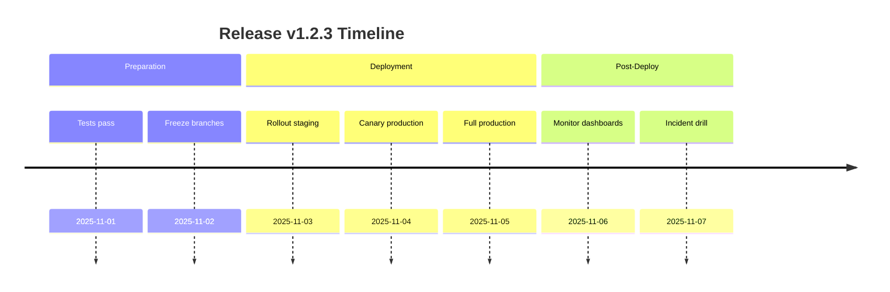
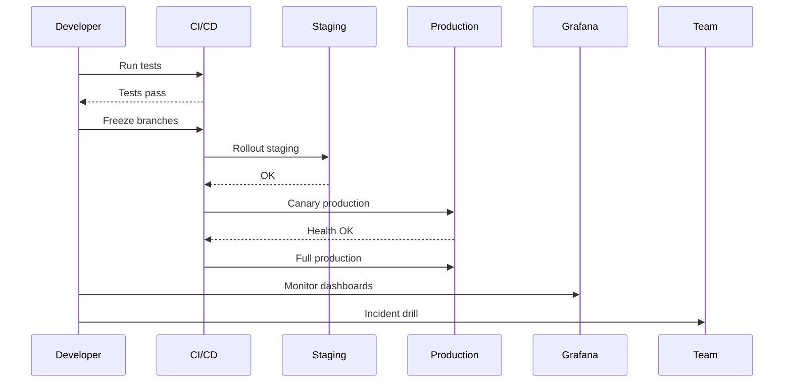

# TECHNICAL_DEEP_DIVE (Mermaid version)

Mermaid equivalents for ASCII diagrams in `TECHNICAL_DEEP_DIVE.md`. Original ASCII retained; this file provides parallel diagrams for slide decks.

## 1.1 High-Level Overview (Mermaid)

## 1.3 Container Topology (Mermaid)

## Deployment Timeline (Beta + Fallback)

Beta chart (if supported):

> Viewer Notes
> - Presentation includes a Mermaid `timeline` (beta) for deployment, with a `sequenceDiagram` fallback.
> - If your slide renderer does not support beta charts, present the fallback sequence.

Fallback (standard sequence):

