# VIDEO_PROMPTS (Mermaid version)

This file provides Mermaid equivalents of ASCII screens from `VIDEO_PROMPTS.md`. Keep both formats for presentation flexibility.

## Screen Content (Mermaid)

```mermaid
flowchart TB
    subgraph Screen[App Screen]
        Header["🧠 RAGE    [Alice Carter]"]
        Query["How do I deploy to production?"]
        SearchBtn[[Search]]
        AnswerTitle["✨ Answer:"]
        AnswerText["To deploy to production, follow these\nsteps:"]
        Step1["1. Run tests: make test"]
        Step2["2. Create release branch: git checkout -b\nrelease/v1.2.3"]
        Step3["3. Deploy via CI/CD: Push to main branch"]
        Step4["4. Monitor in Grafana dashboard"]
        Sources["📄 Sources:"]
        Src1["• Deployment Runbook (Confluence)"]
        Src2["• CI/CD Setup Guide (GitHub Wiki)"]
        Src3["• Production Checklist (Jira)"]
        Header --> Query --> SearchBtn --> AnswerTitle --> AnswerText --> Step1 --> Step2 --> Step3 --> Step4 --> Sources --> Src1 --> Src2 --> Src3
    end

    classDef panel fill:#f9f9f9,stroke:#bbb,stroke-width:1px;
    class Screen panel;
```

## Notes
- The Mermaid version uses a flow to organize content vertically.
- For slide-like layout, your renderer can style subgraph titles to mimic headers.
 - If your viewer does not support Mermaid, use the original ASCII in `VIDEO_PROMPTS.md`.
 - For beta charts elsewhere, we include labeled fallbacks under each beta block.
